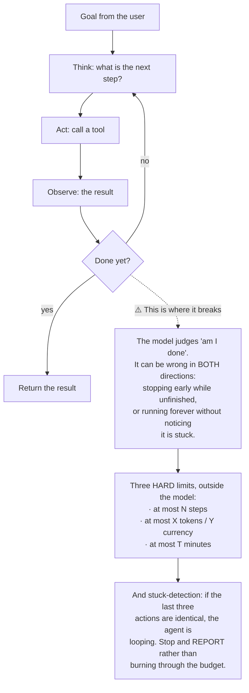
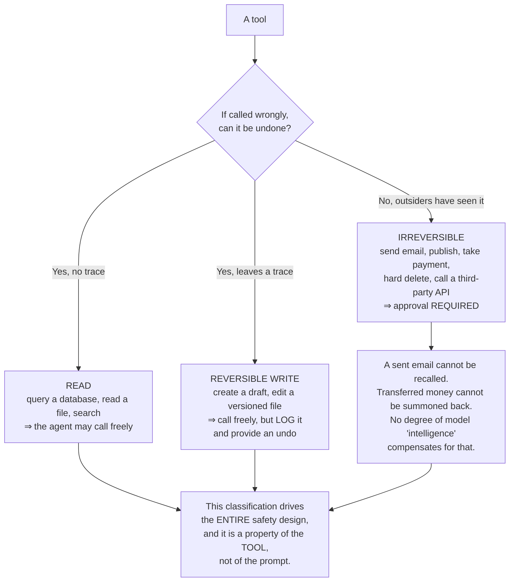
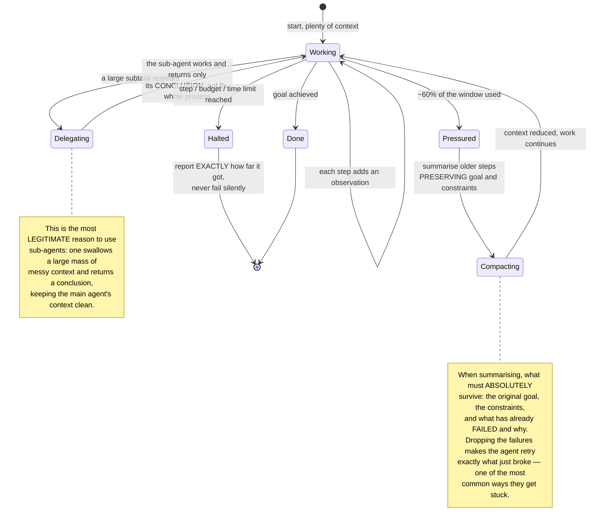
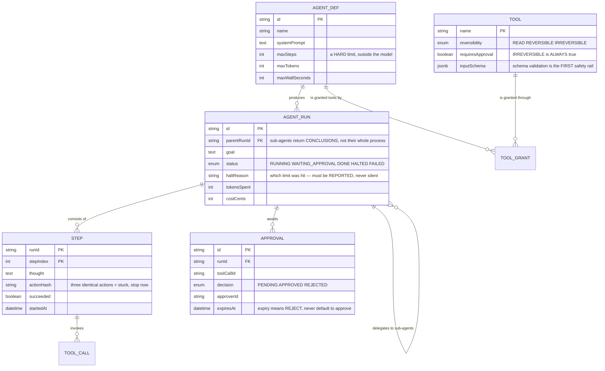

# AI Operating System (Multi-Agent)

In [AI Chatbot Platform](/projects/ai-chatbot-platform-multi-tenant), the model only **read** documents and answered. Get it wrong and the answer is wrong, and the user reads it.

This project lets the model **act**: call APIs, run commands, send mail, edit files. And the moment you do that, the nature of the problem changes:

**A wrong answer gets ignored. A wrong action has already happened.**

This is not a project about making agents smarter. It is about making them **stop at the right time, fail visibly, and be incapable of doing things that cannot be undone**.

---

## What you will build

- An agent loop with hard limits and stuck-detection
- A tool registry classified by reversibility
- Specialist agents coordinated by an orchestrator
- Approval checkpoints before irreversible actions
- Full trajectory recording for replay and debugging
- Per-run budget enforcement
- Evaluation based on **trajectories**, not just final answers

---

## The loop: simple, and it does not stop by itself

An agent's structure is surprisingly compact:



The point: **do not ask the model to limit itself.** Limits belong in orchestration code, where they cannot be argued out of. This is the same principle as [AI Chatbot Platform](/projects/ai-chatbot-platform-multi-tenant): limit **capability**, not intent.

---

## The axis that matters: reversible or not

The classification many people reach for — "safe" and "dangerous" — does not work, because "dangerous" is a feeling. The correct axis is **can this be undone**:



The design consequence is concrete: **redesign tools to move them into a lighter category.** Instead of a `send_email` tool, give the agent `draft_email` — it moves from irreversible to reversible, and a human presses send. Most of the value remains while the risk nearly disappears.

---

## Multiple agents: when it helps, when it hurts

The image of "a team of agents collaborating" is appealing. In practice, adding agents usually makes systems **worse**, because every handoff loses context and creates an opportunity to misunderstand.

| Situation | Do multiple agents help? | Why |
|---|---|---|
| **Independent** subtasks (read 10 documents, summarise) | ✅ Yes | Genuine parallelism with no need to communicate |
| Needing **multiple perspectives** (write code, then review it) | ✅ Yes | The reviewer is not anchored to the writer's choices |
| **Separable** domains (SQL versus interface) | ✅ Yes | The prompts and tools differ entirely |
| A chain of **dependent** steps | ❌ No | Each handoff loses context; one agent does better |
| Wanting **consensus** among agents | ❌ No | They readily agree on the same mistake, at several times the cost |

The pragmatic rule: **add an agent only when you can state what it sees that the other one does not.** If the answer is "it has a different prompt", that is usually a prompt rather than an agent.

---

## Context: the genuinely scarce resource

An agent running 40 steps accumulates 40 observations. The context window fills, and two things happen at once: cost rises with length, and **quality falls** as important information gets buried among thousands of lines of tool output.



---

## Failure must be visible

This is the most counter-intuitive part of the project.

A developer's instinct is to catch exceptions and return a friendly message. With agents, that **removes exactly what they need in order to recover**:

```python
# WRONG — the agent learns nothing and will retry identically.
try:
    result = db.query(sql)
except Exception:
    return "The query failed."

# RIGHT — return the REAL error, specific enough to act on.
try:
    result = db.query(sql)
except DatabaseError as e:
    return {
        "ok": False,
        "error": str(e),          # 'column "usr_id" does not exist'
        "hint": "Call list_columns to see the actual column names.",
        "retryable": True,
    }
```

The message `column "usr_id" does not exist` tells the agent precisely what to do. "The query failed" does not, and it will retry the same query until the budget runs out.

But there is a limit: **errors must not carry sensitive data.** Stack traces can contain connection strings, keys, internal paths. Return the error message, not the raw trace.

---

## The data model



`APPROVAL.expiresAt` defaulting to **rejection** deserves stating: an approval request forgotten in an inbox must never turn itself into consent after 24 hours. In the absence of information, the default must be inaction.

`STEP.actionHash` is the cheapest possible stuck-detector: hash the tool name plus arguments, and stop when three consecutive hashes match. No model is needed to notice that.

---

## Evaluation: score trajectories, not just outcomes

With a chatbot you compare answers to a reference. With agents, comparing only final results discards most of the information — two runs reaching the same result can differ enormously in cost, step count, and the risk they touched.

Four metrics to track together:

1. **Completion rate** — what fraction achieve the goal.
2. **Average step count** — rising means the agent is wandering, even while still completing.
3. **Cost per completion** — the single metric that decides whether the product is viable.
4. **Rejection rate on irreversible actions** — the **safety** metric, and the most important one. If it is high, the agent keeps wanting to do things it should not, and you are being saved by a human.

The fourth is the easiest to overlook and the easiest to explain when something goes wrong.

---

## Traps worth recording

| Symptom | Actual cause | Fix |
|---|---|---|
| The agent never stops | Asking the model to judge completion | Hard limits outside it: steps, tokens, time |
| One action repeated until the budget dies | No stuck-detection | Hash actions; stop after three identical |
| The agent emails a customer by mistake | An irreversible tool with no approval step | Classify by reversibility, require approval |
| A forgotten approval becomes consent | Expiry defaulting to approve | Expiry defaults to **reject** |
| The agent retries exactly what just broke | Exceptions swallowed into generic messages | Return the real error with an actionable hint |
| Errors leaking credentials | Returning raw stack traces | Return filtered error messages |
| Run cost far exceeding projections | Context growing with step count | Compact context, delegate large work to sub-agents |
| The agent forgets its original constraints | Compaction dropped the goal | Always preserve goal, constraints and failures |
| Adding agents made results worse | Dependent chain, handoffs losing context | One agent for sequential work |
| Several agents agreeing on one mistake | Using consensus instead of distinct perspectives | Give each agent a different lens |
| No idea why the agent did that | Not recording thoughts and observations per step | Record the full trajectory, replayable |
| The agent doing out-of-scope work | Granting too many tools | Grant per agent definition, minimally |

---

## When it is genuinely done

- [ ] Give it an impossible goal: it stops within the step limit and **states** why
- [ ] Engineer a stuck situation: it stops after 3 repeated actions, **not** at budget exhaustion
- [ ] Every irreversible tool: **does not execute** without approval
- [ ] Let an approval request expire: the result is **rejection**, not consent
- [ ] Deliberately make a tool fail: the agent **changes approach** rather than repeating
- [ ] Read the errors returned to the agent: **no** connection strings, keys or internal paths
- [ ] A 50-step run: cost stays inside the configured cap, cut off when exceeded
- [ ] Reopen a completed run: **every** thought, action and result is visible
- [ ] After a sub-agent finishes: the parent receives only a conclusion and its context does **not** bloat
- [ ] Run a 50-goal evaluation suite: all four metrics present, including the approval rejection rate

---

## Where to go next

1. **Learn from past trajectories.** Store successful runs as examples for later ones. Carefully: it also learns the detours.
2. **Run inside a sandbox.** Agents writing and running code need exactly the isolation layers of [Code Collaboration Platform](/projects/code-collaboration-platform) — and here the code is machine-generated, so the risk is no smaller.
3. **Long-running agents.** Work spanning days needs durable state, recovery after restarts, and progress reporting.
4. **Verified code generation.** An agent writing code and running its own tests is the problem of [LLM Code Generation Platform](/projects/llm-code-generation-platform).
