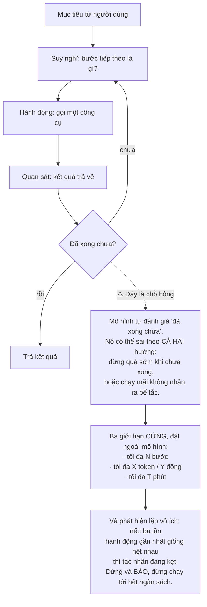
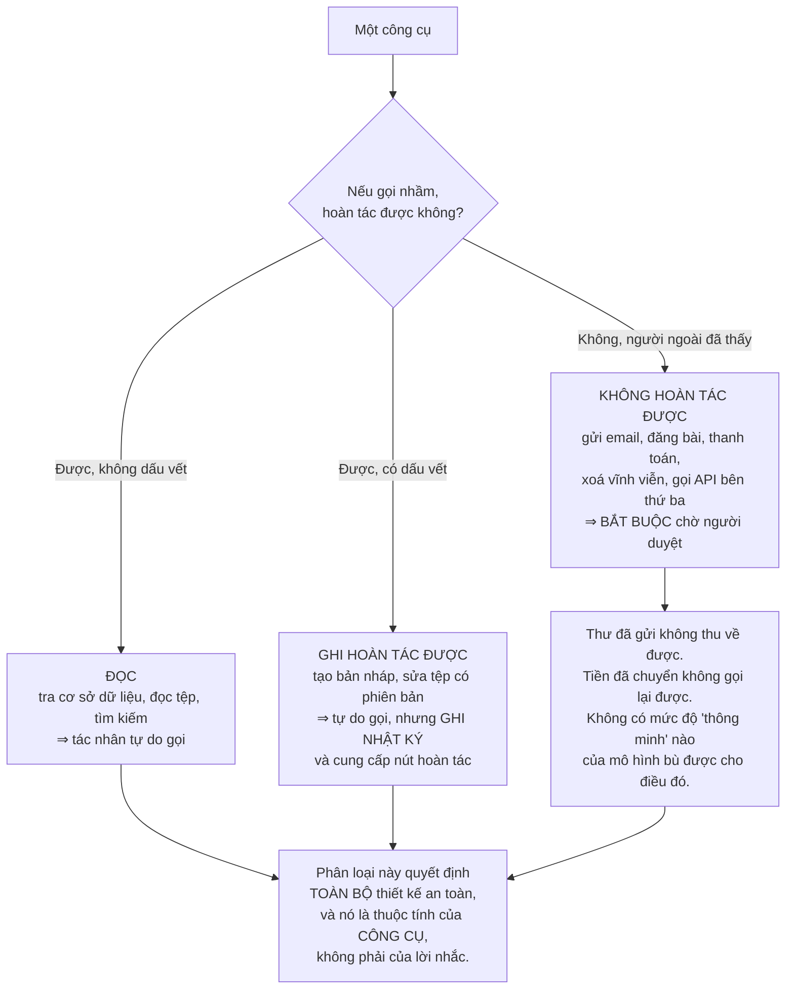
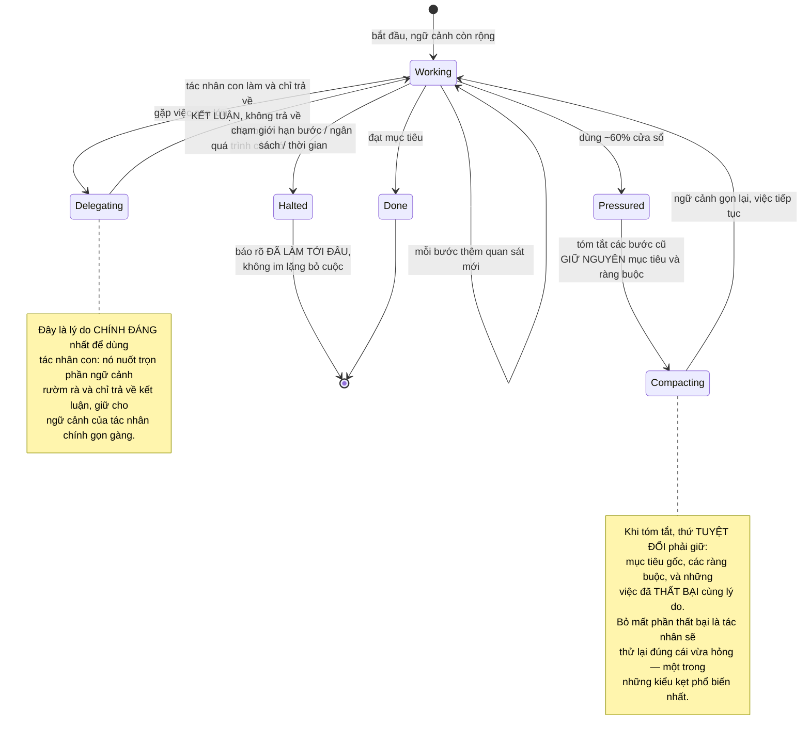
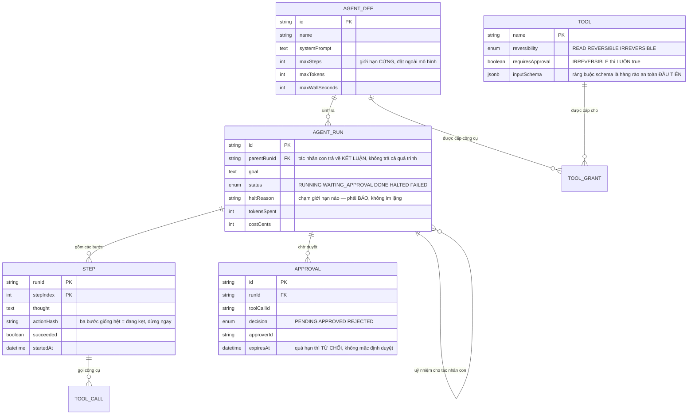

# AI Operating System (Multi-Agent)

Ở [AI Chatbot Platform](/projects/ai-chatbot-platform-multi-tenant), mô hình chỉ **đọc** tài liệu rồi trả lời. Sai thì câu trả lời sai, và người dùng đọc thấy.

Dự án này cho mô hình **hành động**: gọi API, chạy lệnh, gửi thư, sửa tệp. Và khoảnh khắc bạn làm điều đó, mọi thứ đổi bản chất:

**Một câu trả lời sai thì người dùng bỏ qua. Một hành động sai thì đã xảy ra rồi.**

Đây không phải bài về việc làm cho tác nhân thông minh hơn. Nó là bài về việc làm cho tác nhân **dừng lại đúng lúc, hỏng một cách nhìn thấy được, và không làm được những việc không thể hoàn tác**.

---

## Bạn sẽ dựng ra cái gì

- Vòng lặp tác nhân có giới hạn cứng và phát hiện lặp vô ích
- Kho công cụ có phân loại theo mức đảo ngược được
- Nhiều tác nhân chuyên môn với một tác nhân điều phối
- Điểm dừng chờ người duyệt cho hành động không hoàn tác được
- Ghi lại toàn bộ hành trình để xem lại và gỡ lỗi
- Kiểm soát ngân sách theo từng lượt chạy
- Bộ đo chất lượng dựa trên **hành trình**, không chỉ kết quả cuối

---

## Vòng lặp: đơn giản, và không tự dừng

Cấu trúc của một tác nhân gọn đến bất ngờ:



Điểm cần nắm: **đừng nhờ mô hình tự giới hạn mình.** Giới hạn phải nằm ở mã điều phối, nơi nó không thể bị thuyết phục bỏ qua. Đây cũng là nguyên tắc đã gặp ở [AI Chatbot Platform](/projects/ai-chatbot-platform-multi-tenant): giới hạn **khả năng**, không giới hạn ý định.

---

## Trục quan trọng nhất: đảo ngược được hay không

Cách phân loại công cụ mà nhiều người dùng — "an toàn" và "nguy hiểm" — không dùng được, vì "nguy hiểm" là một cảm nhận. Trục đúng là **có hoàn tác được không**:



Hệ quả thiết kế rất cụ thể: **thiết kế lại công cụ để chuyển nó sang nhóm nhẹ hơn.** Thay vì công cụ `gửi_email`, cho tác nhân công cụ `soạn_nháp_email` — nó chuyển từ nhóm không hoàn tác được sang nhóm hoàn tác được, và con người bấm gửi. Phần lớn giá trị vẫn còn, còn rủi ro thì gần như biến mất.

---

## Nhiều tác nhân: khi nào giúp, khi nào hại

Hình dung "một đội tác nhân phối hợp" rất hấp dẫn. Trong thực tế, thêm tác nhân thường làm hệ thống **tệ đi**, vì mỗi lần chuyển giao là một lần mất ngữ cảnh và một cơ hội hiểu sai.

| Tình huống | Nhiều tác nhân giúp? | Vì sao |
|---|---|---|
| Các việc con **độc lập** (đọc 10 tài liệu rồi tóm tắt) | ✅ Có | Chạy song song thật, không cần nói chuyện với nhau |
| Cần **nhiều góc nhìn** (viết mã rồi có người soi lỗi) | ✅ Có | Tác nhân soi lỗi không bị neo vào lựa chọn của tác nhân viết |
| Miền chuyên môn **tách bạch** (SQL và giao diện) | ✅ Có | Lời nhắc và công cụ khác hẳn nhau |
| Chuỗi việc **phụ thuộc nhau** | ❌ Không | Mỗi lần chuyển giao mất ngữ cảnh; một tác nhân làm tốt hơn |
| Cần **đồng thuận** giữa các tác nhân | ❌ Không | Chúng dễ cùng đồng ý một sai lầm, và tốn gấp nhiều lần |

Nguyên tắc thực dụng: **thêm một tác nhân chỉ khi bạn nói được nó thấy gì mà tác nhân kia không thấy.** Nếu câu trả lời là "nó có lời nhắc khác", đó thường là một lời nhắc chứ không phải một tác nhân.

---

## Ngữ cảnh: tài nguyên khan hiếm thật sự

Tác nhân chạy 40 bước tích luỹ 40 lần quan sát. Cửa sổ ngữ cảnh đầy, và khi đó hai chuyện xảy ra cùng lúc: chi phí tăng tuyến tính theo độ dài, và **chất lượng giảm** vì thông tin quan trọng bị chôn giữa hàng nghìn dòng nhật ký công cụ.



---

## Hỏng phải nhìn thấy được

Đây là điều phản trực giác nhất trong toàn bộ dự án.

Bản năng của người viết mã là bắt lỗi và trả về thông báo thân thiện. Với tác nhân, làm vậy là **lấy đi thứ nó cần để tự sửa**:

```python
# SAI — tác nhân không học được gì và sẽ thử lại y hệt.
try:
    result = db.query(sql)
except Exception:
    return "Truy vấn thất bại."

# ĐÚNG — trả về lỗi THẬT, đủ cụ thể để hành động dựa trên nó.
try:
    result = db.query(sql)
except DatabaseError as e:
    return {
        "ok": False,
        "error": str(e),          # 'column "usr_id" does not exist'
        "hint": "Gọi list_columns để xem tên cột thật.",
        "retryable": True,
    }
```

Thông báo `column "usr_id" does not exist` cho tác nhân biết chính xác phải làm gì. Câu "Truy vấn thất bại" thì không, và nó sẽ thử lại cùng một truy vấn cho tới khi hết ngân sách.

Nhưng có một giới hạn: **lỗi không được mang dữ liệu nhạy cảm.** Vết ngăn xếp có thể chứa chuỗi kết nối, khoá, đường dẫn nội bộ. Trả về thông điệp lỗi, không trả về nguyên vết.

---

## Dữ liệu



`APPROVAL.expiresAt` với hành vi mặc định là **từ chối** đáng được nói rõ: một yêu cầu duyệt bị quên trong hộp thư không được phép tự trở thành "đồng ý" sau 24 giờ. Mặc định khi không có thông tin phải là không hành động.

`STEP.actionHash` là cách phát hiện kẹt rẻ nhất: băm tên công cụ cộng tham số, thấy ba lần liên tiếp giống nhau thì dừng. Không cần mô hình nào để nhận ra điều đó.

---

## Đánh giá: chấm hành trình, không chỉ chấm kết quả

Ở chatbot, bạn so câu trả lời với đáp án. Với tác nhân, chỉ so kết quả cuối là bỏ sót phần lớn thông tin — hai lượt chạy cùng ra một kết quả có thể rất khác nhau về chi phí, số bước, và mức rủi ro đã chạm tới.

Bốn chỉ số cần theo dõi cùng lúc:

1. **Tỉ lệ hoàn thành** — bao nhiêu phần trăm đạt mục tiêu.
2. **Số bước trung bình** — tăng lên nghĩa là tác nhân đang lạc, kể cả khi vẫn hoàn thành.
3. **Chi phí mỗi lần hoàn thành** — chỉ số duy nhất quyết định sản phẩm có sống được không.
4. **Tỉ lệ hành động không hoàn tác được bị người duyệt từ chối** — chỉ số **an toàn**, và là chỉ số quan trọng nhất. Nếu nó cao, tác nhân đang muốn làm những việc nó không nên làm, và bạn đang gặp may vì có người chặn.

Chỉ số thứ tư là thứ dễ bị bỏ qua nhất và cũng dễ giải thích nhất khi có sự cố.

---

## Những cái bẫy đã được ghi lại

| Triệu chứng | Nguyên nhân thật | Cách sửa |
|---|---|---|
| Tác nhân chạy mãi không dừng | Nhờ mô hình tự đánh giá đã xong chưa | Giới hạn cứng ngoài mô hình: bước, token, thời gian |
| Lặp lại một hành động tới hết ngân sách | Không phát hiện kẹt | Băm hành động, ba lần giống nhau thì dừng |
| Tác nhân gửi nhầm email cho khách hàng | Công cụ không hoàn tác được, không có bước duyệt | Phân loại theo mức đảo ngược, bắt buộc duyệt |
| Duyệt bị quên rồi tự thành đồng ý | Quá hạn mặc định là duyệt | Quá hạn mặc định là **từ chối** |
| Tác nhân thử lại đúng cái vừa hỏng | Bắt lỗi rồi trả thông báo chung chung | Trả lỗi thật, kèm gợi ý hành động |
| Lỗi trả về làm lộ thông tin xác thực | Trả nguyên vết ngăn xếp | Trả thông điệp lỗi đã lọc |
| Chi phí một lượt chạy vượt xa dự tính | Ngữ cảnh phình theo số bước | Nén ngữ cảnh, uỷ nhiệm việc lớn cho tác nhân con |
| Tác nhân quên ràng buộc ban đầu | Nén ngữ cảnh làm mất mục tiêu | Luôn giữ nguyên mục tiêu, ràng buộc, và các thất bại |
| Thêm tác nhân mà kết quả tệ đi | Chuỗi việc phụ thuộc, chuyển giao mất ngữ cảnh | Một tác nhân cho việc tuần tự |
| Nhiều tác nhân cùng đồng ý một sai lầm | Dùng đồng thuận thay vì góc nhìn khác biệt | Cho mỗi tác nhân một lăng kính khác nhau |
| Không hiểu vì sao tác nhân làm vậy | Không lưu suy nghĩ và quan sát từng bước | Ghi toàn bộ hành trình, xem lại được |
| Tác nhân làm được việc ngoài phạm vi | Cấp quá nhiều công cụ | Cấp theo từng định nghĩa tác nhân, tối thiểu |

---

## Khi nào coi như xong

- [ ] Giao một mục tiêu bất khả thi: tác nhân dừng trong giới hạn bước và **nói rõ** vì sao dừng
- [ ] Tạo tình huống kẹt: dừng sau 3 hành động lặp, **không** chạy tới hết ngân sách
- [ ] Mọi công cụ không hoàn tác được: **không** thực thi nếu chưa có người duyệt
- [ ] Để một yêu cầu duyệt quá hạn: kết quả là **từ chối**, không phải đồng ý
- [ ] Cố tình làm một công cụ trả lỗi: tác nhân **đổi cách làm**, không lặp lại y hệt
- [ ] Đọc lỗi trả về cho tác nhân: **không** có chuỗi kết nối, khoá, hay đường dẫn nội bộ
- [ ] Lượt chạy 50 bước: chi phí nằm trong hạn mức đã đặt, cắt ngang khi vượt
- [ ] Mở lại một lượt chạy đã xong: xem được **từng bước** suy nghĩ, hành động, kết quả
- [ ] Tác nhân con chạy xong: tác nhân cha chỉ nhận kết luận, ngữ cảnh **không** phình
- [ ] Chạy bộ đo 50 mục tiêu: có đủ bốn chỉ số, kể cả tỉ lệ bị người duyệt từ chối

---

## Bước tiếp theo

1. **Học từ hành trình cũ.** Lưu các lượt chạy thành công làm ví dụ cho lượt sau. Cẩn thận: nó cũng học lại cả những đường vòng.
2. **Chạy trong môi trường cách ly.** Tác nhân viết và chạy mã cần đúng lớp cách ly của [Code Collaboration Platform](/projects/code-collaboration-platform) — và ở đây mã do máy sinh, nên rủi ro không nhỏ hơn.
3. **Tác nhân chạy dài ngày.** Việc kéo dài nhiều ngày cần trạng thái bền, khôi phục sau khi khởi động lại, và cơ chế báo cáo tiến độ.
4. **Sinh mã có kiểm chứng.** Tác nhân viết mã rồi tự chạy kiểm thử là bài toán của [LLM Code Generation Platform](/projects/llm-code-generation-platform).
