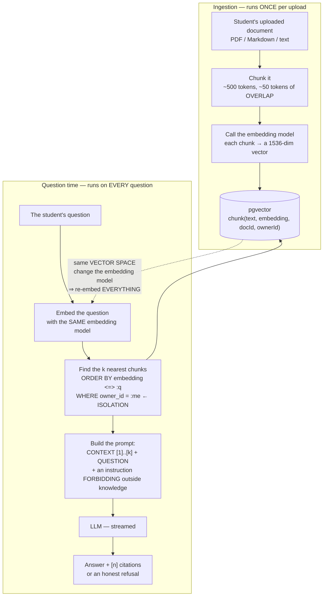
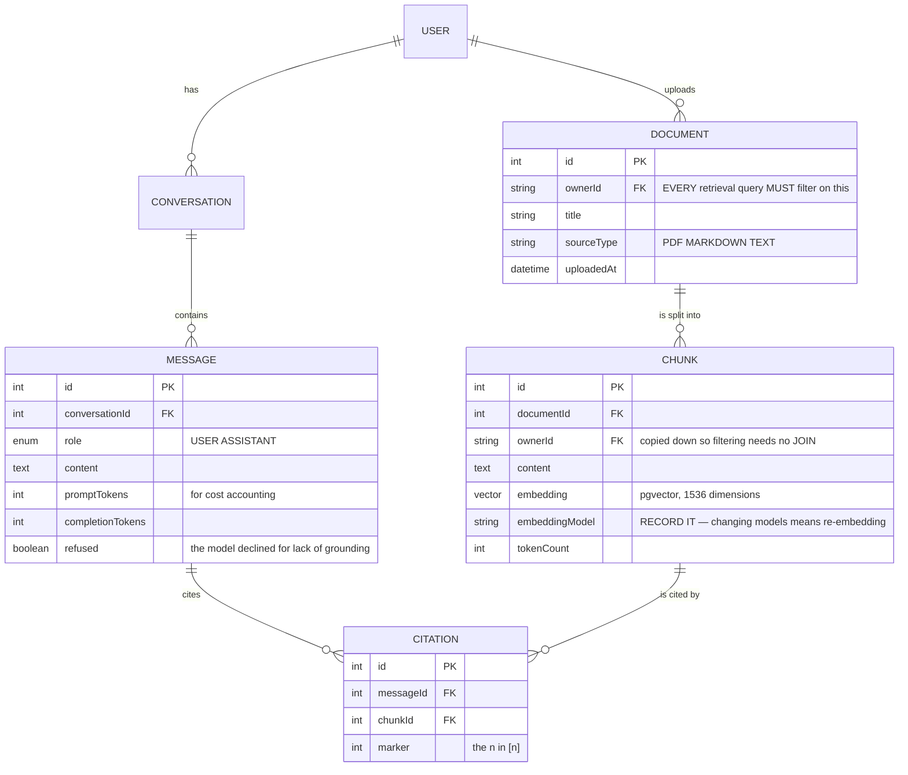

# AI Study Assistant

The first eight **Semester 6** projects shared a property that makes testing pleasant: **the right answer is unique and checkable**. A slot is booked or it is not. A seat sells once or twice. You write an `assert` and the machine tells you.

This project does not have that.

You ask the study assistant *"when were mitochondria discovered?"* and it replies *"In 1857, by Albert von Kölliker."* Plausible. Fluent. Your notes **never mention it** — the model just invented a fact, and no `assert` will catch it.

This is the project about **making a non-deterministic system trustworthy**. The answer is not "use a better model"; it is **ground the model in real documents, force it to cite, and let it say it does not know**.

---

## What you will build

- A full-stack **Next.js 14 (App Router)** app, with the LLM called through a **server-side Route Handler** — the API key never reaches the browser
- **Prisma + PostgreSQL + pgvector** for embeddings and semantic search
- Students upload notes and documents; the system **chunks, embeds and indexes** them
- **Grounded** Q&A: retrieve relevant chunks → build the prompt → answer **with `[n]` citations**
- A **hallucination guard**: when the answer is not in the documents, reply *"I couldn't find that in your notes."*
- Token-by-token streaming, and **strict data isolation** between students

> 📚 The step-by-step course: [**INT609 — AI Study Assistant**](/courses/ai-study-assistant) on the Academy (9 sections, 20 lessons).

---

## Hallucination is the default behaviour, not a rare bug

Say this plainly before writing any code: a language model **does not look things up**. It predicts likely token sequences. When it does not know, it still produces a likely sequence — and that sequence looks exactly like a correct answer.

```js
// ❌ No context — the model answers from its training memory
const answer = await llm(`Answer this question: ${question}`);
// "According to your notes, mitochondria were discovered in 1650 by..."  ← invented
```

Notice the phrase *"according to your notes"*. The model read no notes at all; it is imitating the register of a study assistant. For a student revising for an exam, that is more dangerous than no answer.

For a learning system, **an answer you cannot check is worthless** — the student has no way to separate fact from fabrication. So the design must make every claim **traceable to a source**.

---

## RAG: three steps, and what breaks if you skip one



Three decisions in that diagram routinely go wrong:

- **Chunks must overlap.** Cut cleanly at 500 tokens and a sentence gets split across two chunks, leaving neither one able to answer. Around 10% overlap is the common setting.
- **The question and the documents must use the **same** embedding model.** Vectors from two models live in two different spaces; the distance between them is a meaningless number. Changing the embedding model means **re-embedding the entire corpus**, so record the model name on every row from day one.
- **`WHERE owner_id = :me` belongs *inside* the retrieval query**, not in a post-filter. This is the `userId`-in-the-`where` lesson from [Todo List App](/projects/todo-list-app-full-stack), and here the stakes are higher: a leak does not appear as a stray record — it **dissolves into prose**, where nobody sees it.

---

## The prompt is code, not a suggestion

```ts
// 1) retrieve — ONLY this student's own documents
const chunks = await retrieveTopK(question, { ownerId: session.user.id, k: 6 });

// 2) number them so the model has something to cite
const context = chunks.map((c, i) => `[${i + 1}] ${c.content}`).join('\n\n');

// 3) the instruction must be absolute, not "please prefer"
const system = `You are a study assistant. Answer ONLY using the CONTEXT below.
Cite the source of each fact as [n]. If the answer is not in the context,
reply exactly: "I couldn't find that in your notes."
Do not use outside knowledge.`;

const answer = await llm({ system, user: `CONTEXT:\n${context}\n\nQUESTION: ${question}` });
```

The subtlest trap in the whole project lives at step 3: **retrieving context without constraining the model to it is nearly useless.** If the prompt merely *offers* ("here are some notes that may help"), the model blends in its training knowledge and keeps inventing — only now more convincingly, because a few real passages sit beside the fabrication.

Compare two answers to the same questions:

| Question | Ungrounded | Grounded |
|---|---|---|
| *"When were mitochondria discovered?"* (notes do **not** cover it) | "In 1857, by Albert von Kölliker." — plausible, possibly wrong, **not** from the notes | "I couldn't find that in your notes." |
| *"Why do leaves turn yellow?"* (notes **do** cover it) | A generically correct paragraph | "Because chlorophyll breaks down in autumn, revealing carotenoid pigments already present in the leaf. **[1]**" |

That last cell is the entire value of the system: `[1]` points at a real passage the student **can open and re-read**.

---

## The API key: a lesson already paid for once

This page runs on the very system you are reading, and that system once **lost a feature** to exactly the bug below: a third-party key was named `NEXT_PUBLIC_*`, which means **baked into the JavaScript bundle** shipped to browsers.

With an LLM the consequence is not just a leaked key but **a bill**. Whoever grabs it calls the model on your money, without limit.

```mermaid
sequenceDiagram
    autonumber
    participant B as Browser
    participant RH as Route Handler<br/>(server)
    participant DB as pgvector
    participant LLM as Model API

    rect rgb(60, 20, 20)
    Note over B,LLM: ❌ WRONG — the client calls directly
    B->>LLM: fetch with Authorization: Bearer sk-...
    Note over B: The key is in the JS bundle.<br/>Open DevTools and read it.<br/>Nothing can be rate-limited.
    end

    rect rgb(20, 50, 30)
    Note over B,LLM: ✓ RIGHT — the server brokers it
    B->>RH: POST /api/chat { question }
    RH->>RH: check the session + per-user rate limit
    RH->>DB: retrieve WHERE owner_id = the current session
    DB-->>RH: 6 relevant chunks
    RH->>LLM: call with the key from a RUNTIME env var
    LLM-->>RH: stream tokens
    RH-->>B: relay the stream, WITH the citation list
    Note over RH: The key never leaves the server.<br/>Rotating it = restart the container,<br/>NOT a rebuild.
    end
```



Three things you only get by going through the server, each worth having:

1. **Per-user rate limiting** — without it, one account burns the whole budget in ten minutes.
2. **Token and cost logging per question** — you cannot optimise what you do not measure.
3. **Swapping providers without touching the client** — OpenAI today, a self-hosted model tomorrow, and the UI never notices.

---

## The data model



Two columns deserve explanation:

- **`CHUNK.ownerId` is copied down** even though it could be reached by `JOIN`ing `DOCUMENT`. That is deliberate denormalisation, the same class as `seats_left` in [Gym Membership App](/projects/gym-membership-app): the vector search runs on `CHUNK`, and the ownership filter must live **inside** that query rather than behind a join.
- **`MESSAGE.refused`** turns a refusal into a **metric**. A sudden rise in the refusal rate means retrieval is broken — perhaps new documents chunked badly, perhaps the embedding model changed. Without recording it you find out when students complain.

---

## Testing something non-deterministic

You cannot `assert` that an answer is "correct". But you can check three things that **are** deterministic, and that is what separates a demo from a system:

| Check | How | Passes when |
|---|---|---|
| **No fabrication** | Load a document that **deliberately omits** a fact, then ask for that fact | The answer contains the refusal and **no** invented number |
| **Citations are real** | Every `[n]` in the answer must map to a retrieved chunk | No orphan `[n]`, no `[7]` when only 6 chunks were retrieved |
| **Data isolation** | Student B asks about content only in student A's document | Refusal; **no** fragment of A's text appears |

The first is an **automated eval** — it runs in CI and catches what no unit test can. The system you are reading has an eval of exactly this shape for its CV-critique feature: feed a CV containing **no numbers**, and fail the check **if the AI asserts one**.

One detail that matters when writing LLM evals: **set temperature to 0 and pin the model version**, otherwise the check goes red at random and the team learns to ignore it — at which point it is worse than having none.

---

## Traps worth writing down

| Symptom | Actual cause | Fix |
|---|---|---|
| Confident answers about things not in the documents | No grounding, or a prompt that merely "suggests" the context | An absolute instruction plus a mandatory refusal string |
| Retrieval returns irrelevant chunks | Chunks too large, one chunk spanning several topics | Smaller chunks, with overlap |
| The answer misses a point that straddles two chunks | No overlap when chunking | ~10% overlap |
| Semantic search returns nonsense | Question and documents embedded with different models | One model; record its name on every row |
| Quality collapses after changing embedding models | Old vectors live in a different space | Re-embed the corpus, with versioning |
| Student B sees A's content | Ownership filtered after retrieval | `WHERE owner_id` **inside** the vector query |
| The LLM key appears in the JS bundle | Named `NEXT_PUBLIC_*` | Call the LLM only from a Route Handler, key as runtime env |
| The LLM bill explodes overnight | No per-user rate limit | Server-side limiting plus token logging |
| Answers cut off midway | The stream is not closed when the client disconnects | Pass an `AbortSignal` down into the LLM call |
| `[7]` in an answer that retrieved 6 chunks | Citations never validated after generation | Verify every `[n]` maps to a chunk; drop the orphans |
| The eval goes red at random and gets ignored | Temperature above 0, unpinned model | Temperature 0, pinned version, property-based assertions |
| A large PDF upload hangs the request | Chunking and embedding inside the upload request | Move it to a background queue with a status |

---

## Done means

- [ ] Load a document that **omits** a fact and ask for it: you get **the refusal**, with no invented number
- [ ] Every `[n]` across 20 consecutive answers **maps** to a retrieved chunk
- [ ] Clicking `[1]` opens the exact source passage inside your own document
- [ ] Student B asking about A's private content: refused, with **no** text fragment leaked
- [ ] Grep the built JS bundle for `NEXT_PUBLIC` and the key name: **no** matches
- [ ] Disconnect mid-stream: the server-side LLM call **also stops** (no tokens burned for nothing)
- [ ] One account firing 100 questions in a row: blocked by the rate limiter
- [ ] The `MESSAGE` table has token counts for **every** turn, summing to a real cost figure
- [ ] The anti-fabrication eval runs in CI at temperature 0 with a pinned model
- [ ] A 200-page PDF upload: the request returns immediately and processing runs in the background with status

---

## Where to go next

1. **When model output must become structured data.** [AI Recruitment Screening](/projects/ai-recruitment-screening) forces the LLM into a validated JSON schema and leaves the decision to a human.
2. **When you must serve many organisations.** [AI Chatbot Platform multi-tenant](/projects/ai-chatbot-platform-multi-tenant) scales this to many customers, with isolation and quotas.
3. **When the questions should attach to existing lessons.** [E-learning Mini Platform](/projects/e-learning-mini-platform) is where the content and the quizzes already live.
4. **When retrieval needs to be more serious than pure vector search.** [Distributed Search Engine](/projects/distributed-search-engine) builds an inverted index and hybrid ranking.
