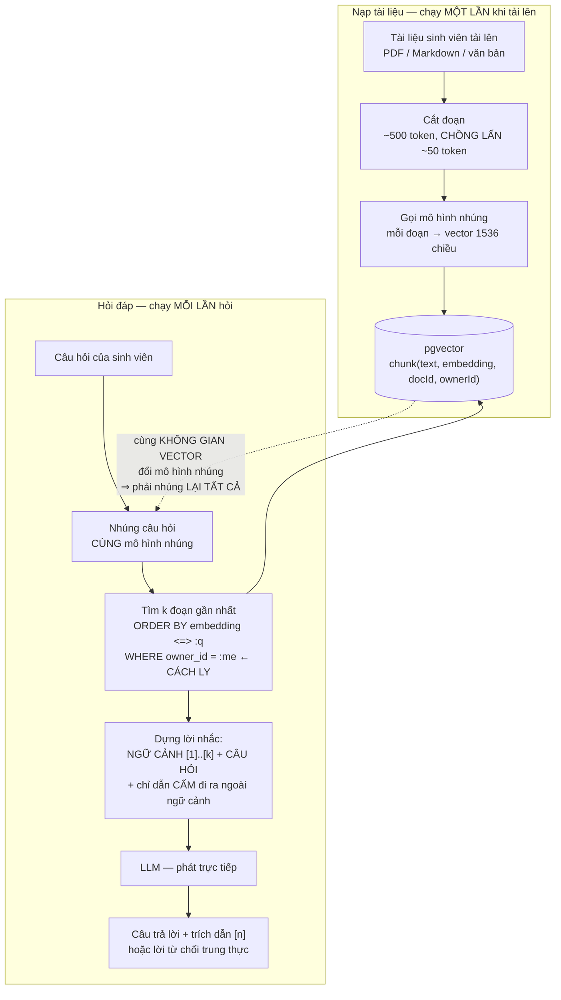
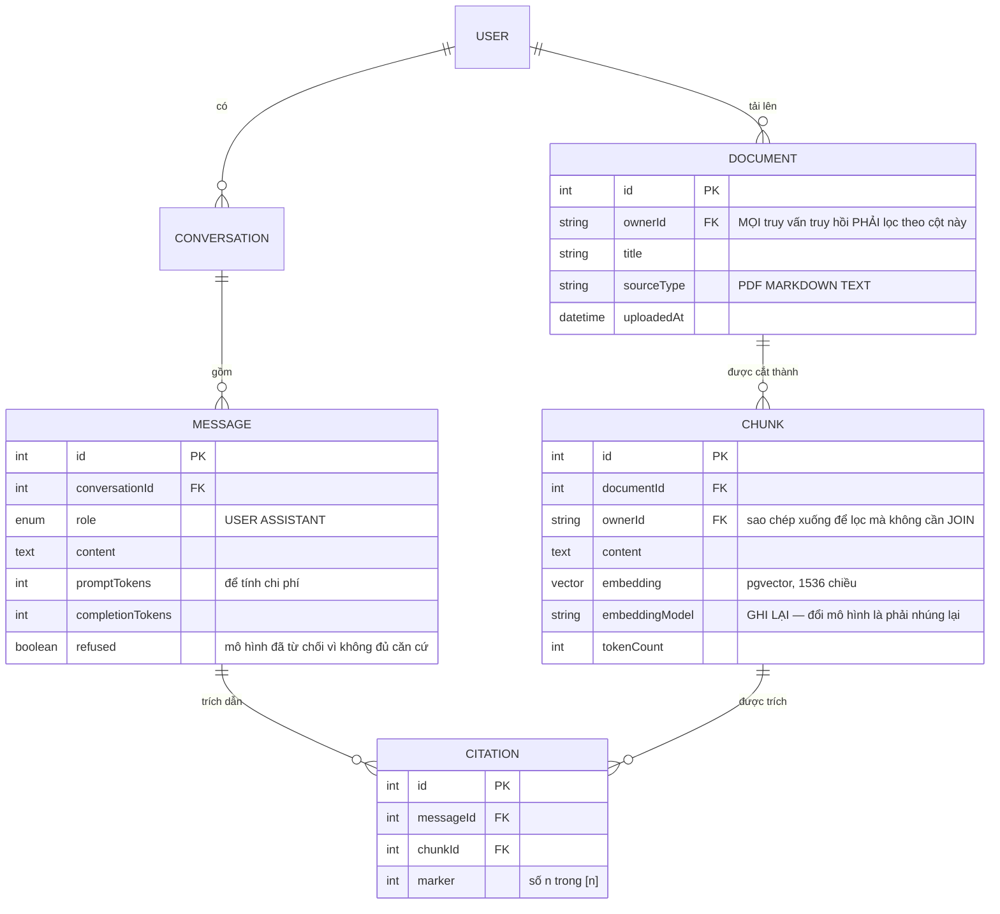

# AI Study Assistant

Tám đồ án đầu của **Kỳ 6** đều có chung một tính chất khiến việc kiểm thử dễ chịu: **câu trả lời đúng là duy nhất và kiểm được**. Một khung giờ được đặt hay không. Một ghế bán một lần hay hai lần. Bạn viết `assert` và máy nói cho bạn biết đúng hay sai.

Đồ án này thì không.

Bạn hỏi trợ lý học tập *"ti thể được phát hiện năm nào?"* và nó trả lời *"Năm 1857, bởi Albert von Kölliker."* Nghe hợp lý. Câu văn trôi chảy. Ghi chú của bạn **không hề nhắc tới điều đó** — mô hình vừa bịa ra một sự thật, và không có `assert` nào bắt được.

Đây là đồ án về **làm cho một hệ thống không tất định trở nên đáng tin**. Câu trả lời không phải là "dùng mô hình xịn hơn", mà là **neo mô hình vào tài liệu có thật, buộc nó trích dẫn, và cho phép nó nói không biết**.

---

## Bạn sẽ dựng ra cái gì

- Full-stack **Next.js 14 (App Router)**, LLM gọi qua **Route Handler phía máy chủ** — khoá API không bao giờ tới trình duyệt
- **Prisma + PostgreSQL + pgvector** để lưu vector nhúng và tìm kiếm ngữ nghĩa
- Sinh viên tải lên ghi chú/tài liệu, hệ thống **cắt đoạn, nhúng, đánh chỉ mục**
- Hỏi đáp **có căn cứ**: truy hồi đoạn liên quan → nhồi vào lời nhắc → trả lời **kèm trích dẫn `[n]`**
- **Chốt chặn ảo giác**: không tìm thấy trong tài liệu thì trả lời *"Tôi không tìm thấy điều đó trong ghi chú của bạn."*
- Phát trực tiếp câu trả lời theo từng token, và **cách ly dữ liệu tuyệt đối** giữa các sinh viên

> 📚 Bản dạy từng bước: [**INT609 — AI Study Assistant**](/courses/ai-study-assistant) trên Academy (9 mục, 20 bài).

---

## Ảo giác là hành vi mặc định, không phải lỗi hiếm

Cần nói rõ điều này trước khi viết dòng mã nào: một mô hình ngôn ngữ **không tra cứu**. Nó dự đoán chuỗi ký tự có khả năng cao. Khi không biết, nó vẫn sinh ra chuỗi có khả năng cao — và chuỗi đó trông y hệt một câu trả lời đúng.

```js
// ❌ Không có ngữ cảnh — mô hình trả lời từ trí nhớ huấn luyện
const answer = await llm(`Trả lời câu hỏi này: ${question}`);
// "Theo ghi chú của bạn, ti thể được phát hiện năm 1650 bởi..."  ← bịa
```

Chú ý cụm *"theo ghi chú của bạn"*. Mô hình không hề đọc ghi chú nào; nó chỉ đang bắt chước giọng văn của một trợ lý học tập. Với một sinh viên đang ôn thi, đó là thứ nguy hiểm hơn cả việc không trả lời.

Với một hệ thống học tập, **một câu trả lời không kiểm được thì vô giá trị** — sinh viên không có cách nào phân biệt sự thật với thứ bịa ra. Nên thiết kế phải làm cho mọi khẳng định **truy ngược được về nguồn**.

---

## RAG: ba bước, và bước nào bỏ đi thì hỏng



Ba quyết định trong sơ đồ hay bị làm sai:

- **Đoạn phải chồng lấn nhau.** Cắt đúng 500 token không chồng lấn thì một câu bị chẻ đôi giữa hai đoạn, và không đoạn nào chứa đủ ý để trả lời. Chồng lấn ~10% là mức thường dùng.
- **Câu hỏi và tài liệu phải dùng **cùng** mô hình nhúng.** Vector từ hai mô hình khác nhau nằm trong hai không gian khác nhau; khoảng cách giữa chúng là con số vô nghĩa. Đổi mô hình nhúng nghĩa là **nhúng lại toàn bộ kho**, nên hãy ghi tên mô hình vào từng hàng ngay từ đầu.
- **`WHERE owner_id = :me` nằm trong truy vấn truy hồi**, không phải lọc sau. Đây chính là bài học `userId` trong mệnh đề `where` của [Todo List App](/projects/todo-list-app-full-stack), và ở đây hậu quả nặng hơn: rò rỉ không hiện ra dưới dạng một bản ghi lạ mà **tan vào trong câu trả lời**, nơi không ai nhìn thấy.

---

## Lời nhắc là mã nguồn, không phải lời gợi ý

```ts
// 1) truy hồi — CHỈ tài liệu của chính sinh viên này
const chunks = await retrieveTopK(question, { ownerId: session.user.id, k: 6 });

// 2) đánh số để mô hình có thứ mà trích dẫn
const context = chunks.map((c, i) => `[${i + 1}] ${c.content}`).join('\n\n');

// 3) chỉ dẫn PHẢI dứt khoát, không phải "hãy ưu tiên dùng"
const system = `Bạn là trợ lý học tập. CHỈ trả lời dựa vào NGỮ CẢNH bên dưới.
Trích nguồn cho mỗi ý bằng [n]. Nếu câu trả lời KHÔNG có trong ngữ cảnh,
hãy trả lời đúng câu: "Tôi không tìm thấy điều đó trong ghi chú của bạn."
Không dùng kiến thức bên ngoài.`;

const answer = await llm({ system, user: `NGỮ CẢNH:\n${context}\n\nCÂU HỎI: ${question}` });
```

Cái bẫy tinh vi nhất của cả đồ án nằm ở bước 3: **truy hồi ngữ cảnh mà không ràng buộc mô hình vào nó thì gần như vô ích.** Nếu lời nhắc chỉ *mời* ("đây là một số ghi chú, có thể hữu ích"), mô hình vẫn trộn kiến thức huấn luyện của nó vào và tiếp tục bịa — chỉ là bịa một cách thuyết phục hơn vì giờ có vài đoạn thật đứng cạnh.

Đối chiếu hai kết quả cho cùng một câu hỏi:

| Câu hỏi | Không neo | Có neo |
|---|---|---|
| *"Ti thể được phát hiện năm nào?"* (ghi chú **không** có) | "Năm 1857, bởi Albert von Kölliker." — hợp lý, có thể sai, **không** từ ghi chú | "Tôi không tìm thấy điều đó trong ghi chú của bạn." |
| *"Vì sao lá cây chuyển vàng?"* (ghi chú **có**) | Một đoạn văn chung chung đúng | "Vì diệp lục phân huỷ vào mùa thu, để lộ sắc tố carotenoid vốn đã có trong lá. **[1]**" |

Ô cuối cùng là toàn bộ giá trị của hệ thống: `[1]` trỏ tới một đoạn có thật mà sinh viên **mở ra đọc lại được**.

---

## Khoá API: bài học đã trả giá một lần rồi

Trang này chạy trên chính hệ thống mà bạn đang đọc, và hệ thống đó từng **mất một tính năng** vì đúng lỗi dưới đây: một khoá của dịch vụ bên thứ ba bị đặt tên `NEXT_PUBLIC_*`, tức là **nướng thẳng vào gói JavaScript** gửi cho trình duyệt.

Với LLM, hậu quả không chỉ là lộ khoá mà là **hoá đơn**. Ai lấy được khoá thì gọi mô hình bằng tiền của bạn, không giới hạn.

```mermaid
sequenceDiagram
    autonumber
    participant B as Trình duyệt
    participant RH as Route Handler<br/>(máy chủ)
    participant DB as pgvector
    participant LLM as API mô hình

    rect rgb(60, 20, 20)
    Note over B,LLM: ❌ SAI — client gọi thẳng
    B->>LLM: fetch có Authorization: Bearer sk-...
    Note over B: Khoá nằm trong gói JS.<br/>Mở DevTools là thấy.<br/>Không giới hạn được gì.
    end

    rect rgb(20, 50, 30)
    Note over B,LLM: ✓ ĐÚNG — máy chủ làm trung gian
    B->>RH: POST /api/chat { question }
    RH->>RH: kiểm phiên đăng nhập + giới hạn tần suất theo người dùng
    RH->>DB: truy hồi WHERE owner_id = phiên hiện tại
    DB-->>RH: 6 đoạn liên quan
    RH->>LLM: gọi kèm khoá đọc từ biến môi trường RUNTIME
    LLM-->>RH: phát trực tiếp từng token
    RH-->>B: phát tiếp về client, KÈM danh sách trích dẫn
    Note over RH: Khoá không bao giờ rời máy chủ.<br/>Xoay khoá = khởi động lại container,<br/>KHÔNG cần build lại.
    end
```



Ba thứ chỉ có được khi đi qua máy chủ, và mỗi thứ đều đáng giá:

1. **Giới hạn tần suất theo người dùng** — nếu không, một tài khoản đốt sạch ngân sách trong mười phút.
2. **Ghi log số token và chi phí theo từng câu hỏi** — bạn không tối ưu được thứ mình không đo.
3. **Đổi nhà cung cấp mà không đụng client** — hôm nay OpenAI, mai một mô hình chạy nội bộ, giao diện không biết gì cả.

---

## Mô hình dữ liệu



Hai cột đáng giải thích:

- **`CHUNK.ownerId` được sao chép xuống** dù có thể `JOIN` qua `DOCUMENT`. Đây là phi chuẩn hoá có chủ ý, cùng loại với `seats_left` ở [Gym Membership App](/projects/gym-membership-app): truy vấn vector chạy trên bảng `CHUNK`, và bộ lọc chủ sở hữu phải nằm **ngay trong** truy vấn đó, không phải sau một phép nối.
- **`MESSAGE.refused`** biến lời từ chối thành **số đo**. Tỉ lệ từ chối tăng đột ngột nghĩa là việc truy hồi đang hỏng — có thể tài liệu mới cắt sai, có thể mô hình nhúng bị đổi. Không ghi lại thì bạn chỉ biết khi sinh viên phàn nàn.

---

## Kiểm thử thứ không tất định

Bạn không thể `assert` rằng câu trả lời "đúng". Nhưng bạn kiểm được ba thứ **có tính chất quyết định**, và đó là điều làm nên khác biệt giữa một demo và một hệ thống:

| Phép kiểm | Cách làm | Đạt khi |
|---|---|---|
| **Không bịa** | Nạp một tài liệu **cố tình không chứa** một sự thật, rồi hỏi đúng sự thật đó | Trả lời chứa câu từ chối, **không** chứa con số nào |
| **Trích dẫn có thật** | Mọi `[n]` trong câu trả lời phải khớp một đoạn đã truy hồi | Không có `[n]` mồ côi, không có `[7]` khi chỉ truy hồi 6 đoạn |
| **Cách ly dữ liệu** | Sinh viên B hỏi về nội dung chỉ có trong tài liệu của A | Từ chối; **không** có mảnh văn bản nào của A xuất hiện |

Phép kiểm đầu tiên là loại **đánh giá tự động** (eval) — chạy được trong CI, và nó bắt được điều mà không unit test nào bắt được. Chính hệ thống bạn đang đọc có một bộ eval cùng dạng cho tính năng nhận xét CV: nạp một CV **không có con số nào**, và bài kiểm **thất bại nếu AI khẳng định một con số**.

Chi tiết quan trọng khi viết eval cho LLM: **đặt nhiệt độ về 0 và ghim phiên bản mô hình**, nếu không bài kiểm sẽ đỏ ngẫu nhiên và cả đội sẽ tập thói quen bỏ qua nó — lúc đó nó còn tệ hơn không có.

---

## Những cái bẫy đã được ghi lại

| Triệu chứng | Nguyên nhân thật | Cách sửa |
|---|---|---|
| Trả lời tự tin về thứ không có trong tài liệu | Không neo, hoặc lời nhắc chỉ "gợi ý" ngữ cảnh | Chỉ dẫn dứt khoát + câu từ chối bắt buộc |
| Truy hồi ra đoạn không liên quan | Đoạn cắt quá to, một đoạn chứa nhiều chủ đề | Cắt nhỏ hơn, có chồng lấn |
| Câu trả lời thiếu mất ý nằm giữa hai đoạn | Cắt không chồng lấn | Chồng lấn ~10% |
| Tìm kiếm ngữ nghĩa ra kết quả vô nghĩa | Câu hỏi và tài liệu nhúng bằng hai mô hình khác nhau | Cùng một mô hình; ghi tên mô hình vào từng hàng |
| Đổi mô hình nhúng xong chất lượng sập | Vector cũ nằm ở không gian khác | Nhúng lại toàn bộ kho, có phiên bản hoá |
| Sinh viên B thấy nội dung của A | Lọc chủ sở hữu sau khi truy hồi | `WHERE owner_id` **trong** truy vấn vector |
| Khoá LLM lộ trong gói JS | Đặt tên biến `NEXT_PUBLIC_*` | Chỉ gọi LLM từ Route Handler, khoá là env runtime |
| Hoá đơn LLM tăng vọt sau một đêm | Không giới hạn tần suất theo người dùng | Giới hạn ở máy chủ + ghi log token |
| Trả lời cắt ngang giữa chừng | Không xử lý đóng luồng khi client ngắt kết nối | Truyền `AbortSignal` xuống lời gọi LLM |
| `[7]` trong câu trả lời mà chỉ có 6 đoạn | Không kiểm trích dẫn sau khi sinh | Kiểm mọi `[n]` khớp đoạn đã truy hồi, bỏ cái mồ côi |
| Eval đỏ ngẫu nhiên rồi cả đội bỏ qua | Nhiệt độ > 0, mô hình không ghim phiên bản | Nhiệt độ 0, ghim phiên bản, khẳng định theo tính chất |
| Tải PDF lớn làm treo request | Cắt và nhúng ngay trong request tải lên | Đưa vào hàng đợi nền, hiện trạng thái xử lý |

---

## Khi nào coi như xong

- [ ] Nạp tài liệu **không chứa** một sự thật rồi hỏi đúng sự thật đó: nhận **câu từ chối**, không có con số bịa
- [ ] Mọi `[n]` trong 20 câu trả lời liên tiếp đều **khớp** một đoạn đã truy hồi
- [ ] Bấm vào `[1]`: mở đúng đoạn văn bản gốc trong tài liệu của chính mình
- [ ] Sinh viên B hỏi nội dung riêng của A: từ chối, **không** lộ mảnh văn bản nào
- [ ] Tìm `NEXT_PUBLIC` và tên khoá trong gói JS đã build: **không** kết quả
- [ ] Ngắt kết nối giữa lúc phát trực tiếp: lời gọi LLM phía máy chủ **cũng dừng** (không đốt token vô ích)
- [ ] Một tài khoản gửi 100 câu hỏi liên tiếp: bị giới hạn tần suất chặn
- [ ] Bảng `MESSAGE` có số token của **mọi** lượt hỏi, cộng ra được chi phí thật
- [ ] Eval chống bịa chạy trong CI với nhiệt độ 0 và mô hình ghim phiên bản
- [ ] Tải PDF 200 trang: request trả về ngay, xử lý chạy nền có trạng thái

---

## Bước tiếp theo

1. **Khi đầu ra của mô hình phải thành dữ liệu có cấu trúc.** [AI Recruitment Screening](/projects/ai-recruitment-screening) ép LLM trả JSON đúng schema và để con người quyết định.
2. **Khi phải phục vụ nhiều tổ chức.** [AI Chatbot Platform multi-tenant](/projects/ai-chatbot-platform-multi-tenant) mở rộng bài này lên nhiều khách hàng, kèm cách ly và hạn mức.
3. **Khi câu hỏi cần bám vào bài giảng có sẵn.** [E-learning Mini Platform](/projects/e-learning-mini-platform) là nơi nội dung và bài kiểm tra đã sống sẵn.
4. **Khi truy hồi cần nghiêm túc hơn tìm kiếm vector thuần.** [Distributed Search Engine](/projects/distributed-search-engine) dựng chỉ mục ngược và xếp hạng lai.
