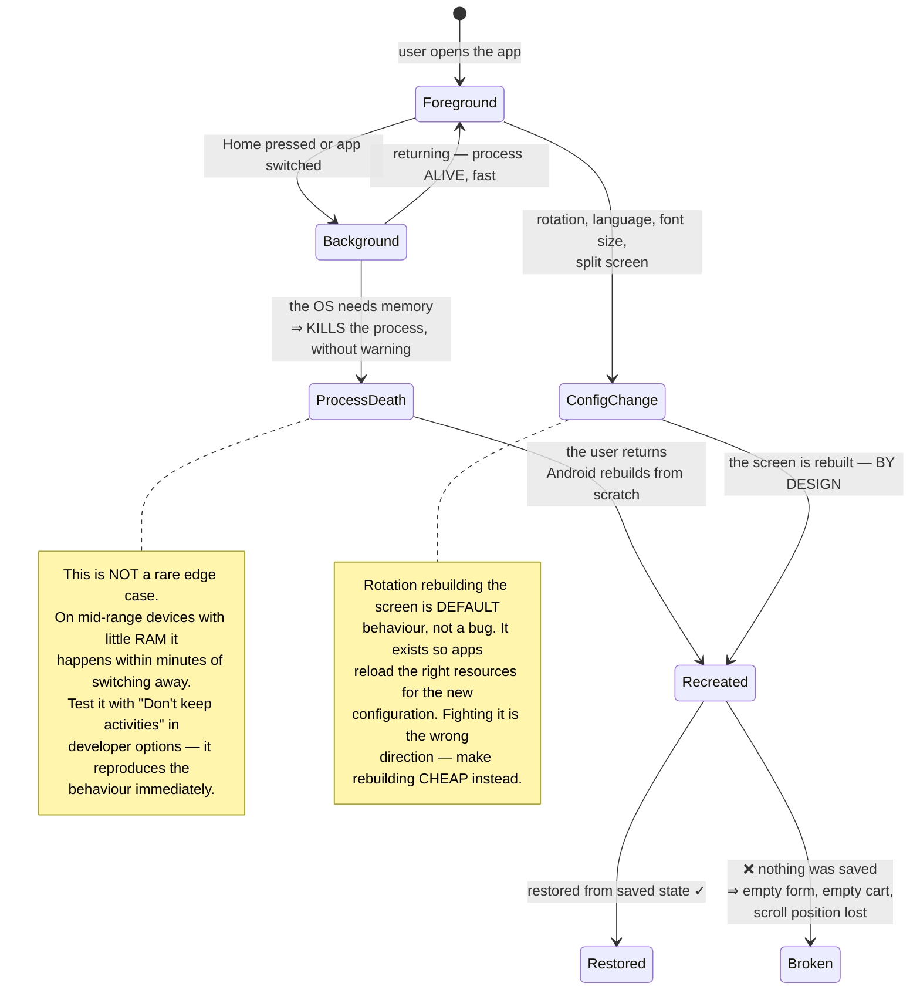
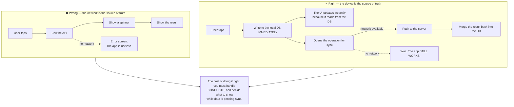
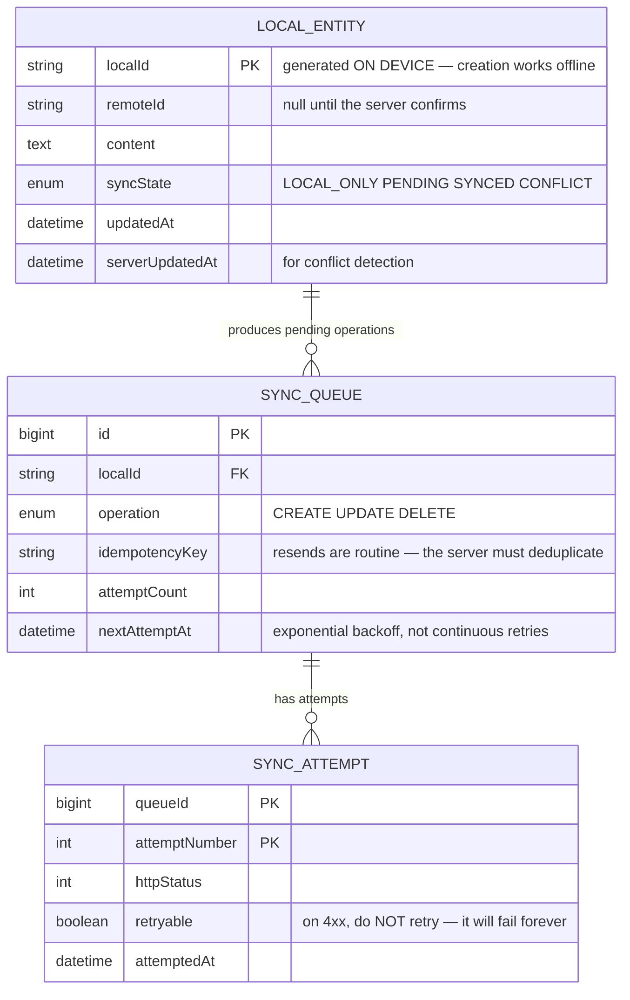

# Android Native App (Kotlin)

Every web project in this roadmap shares an assumption you never had to question: **your process stays alive while the user is using it.**

On Android, that assumption is false.

A user opens your app, switches to check a message, comes back — and in between the operating system **killed your process** to reclaim memory for something else. When they return, Android rebuilds the screen from scratch and **pretends nothing happened**. If you were not prepared, the user sees an empty form after ten minutes of typing.

This project is about writing for an environment where **the operating system is not your ally** — it prioritises battery and memory over your app, and it is right to.

---

## What you will build

- An offline-first app that fully works without a network
- Survival across process death and configuration changes
- Background sync respecting the platform's battery limits
- Push notifications, camera capture and file upload
- Permissions requested at the right moment, with graceful denial
- Automated tests across screen sizes and OS versions

---

## Process death: the thing the web never teaches you



There are three places to keep state, and choosing the wrong one causes most of the bugs:

| Storage location | Survives rotation | Survives process death | Use for |
|---|---|---|---|
| A field in the screen | ❌ | ❌ | Nothing you need to keep |
| A lifecycle-scoped state holder | ✅ | ❌ | Network-loaded data that can be refetched |
| The saved state bundle | ✅ | ✅ | What the user typed, filters, positions |
| The on-device database | ✅ | ✅ | Everything the user created |

The short rule: **anything the user typed or chose belongs in the last two rows.** Network data can be refetched; their ten minutes of typing cannot.

---

## Offline-first: on mobile this is not an add-on

On the web, losing connectivity is an exception. On mobile it is the **normal state**: underground trains, lifts, poor coverage, handing off between Wi-Fi and cellular.

So the architecture inverts: **the on-device database is the source of truth for the UI, and the network merely synchronises with it.**



Two details that decide perceived quality:

- **Show sync state explicitly.** Users need to know whether their comment reached the server or is still queued. Pretending everything succeeded and then failing silently is the fastest way to lose trust.
- **Queued operations must be idempotent.** The lesson from [Event-Driven Microservices](/projects/event-driven-microservices-uber-like): flaky networks make resends routine, so the server must deduplicate.

---

## Background execution: the OS will fight you, and it is right to

This is where people arriving from the web get most frustrated. You want to sync every 15 minutes. Android says no.

Since Android 6 there is Doze: an idle device makes the system **batch all background work** into short windows spaced increasingly far apart. Since Android 8, backgrounded apps **may not** run arbitrary services.

That sounds like an unreasonable restriction until you remember: the user has 80 apps, and if each granted itself the right to wake every 15 minutes, the battery would be dead before lunch.

The correct approach:

```kotlin
// Do NOT schedule your own timer. Declare CONSTRAINTS and let the system
// choose the moment — it knows the battery level, charging state, network type.
val syncWork = PeriodicWorkRequestBuilder<SyncWorker>(6, TimeUnit.HOURS)
    .setConstraints(
        Constraints.Builder()
            .setRequiredNetworkType(NetworkType.UNMETERED)   // wait for Wi-Fi
            .setRequiresBatteryNotLow(true)
            .build()
    )
    .setBackoffCriteria(BackoffPolicy.EXPONENTIAL, 30, TimeUnit.SECONDS)
    .build()

WorkManager.getInstance(context).enqueueUniquePeriodicWork(
    "sync",
    ExistingPeriodicWorkPolicy.KEEP,   // do NOT create duplicates on every launch
    syncWork,
)
```

And for things that **genuinely** need immediacy — new messages, orders — do not poll. Use push: the server announces, and the app wakes exactly when needed. That is simultaneously the most battery-efficient and the fastest option.

---

## Permissions: ask in context, and expect refusal

Requesting every permission at first launch reliably produces refusals. The user does not yet know what the app does and is already being asked for location, contacts and camera.

The right approach: **ask when the feature needs it, and explain before asking.** A user who taps the camera button and then sees the permission dialog understands immediately.

But the more important part is preparing for "no":

- **Denied once** — show the explanation and allow retrying later.
- **Denied permanently** — the system will stop showing the dialog. You must detect this and direct the user into settings, not ask again pointlessly.
- **Features must degrade gracefully.** Without location permission, let them type an address. An app that traps users on a "please grant permission" screen is an app that gets uninstalled.

---

## The on-device data model



Generating `localId` on the device is what makes offline creation possible — you cannot wait for the server to assign one. On successful sync, `remoteId` is filled in, and internal references keep using `localId` so nothing needs mass rewriting.

Separating `retryable` for 4xx versus 5xx is easily missed: a 400 means the request is wrong, and retrying a thousand times keeps it wrong — it merely drains battery and clogs the queue. Only 5xx and network errors deserve retries.

---

## Traps worth recording

| Symptom | Actual cause | Fix |
|---|---|---|
| Typed data lost on returning to the app | Nothing saved, process was killed | The saved state bundle, or the local DB |
| Rotation loses everything | State held in screen fields | A lifecycle-scoped state holder |
| The app is useless without a network | The network is the source of truth | Local DB as source of truth, network syncs |
| Background sync never runs | A self-scheduled timer blocked by Doze | Declare constraints, let the system decide |
| Duplicate periodic work created each launch | No keep-existing policy | `ExistingPeriodicWorkPolicy.KEEP` |
| Battery drain leading to uninstalls | Polling the server instead of awaiting push | Push notifications for immediate needs |
| The sync queue never drains | Retrying 4xx responses too | Retry only 5xx and network errors |
| The server receives duplicate data | Resends without an idempotency key | Device-generated idempotency keys |
| Users deny every permission | Asking for all of them at launch | Ask in context, with an explanation first |
| Users trapped on a "grant permission" screen | No alternative path | Graceful degradation, manual entry |
| Janky scrolling | Heavy work on the UI thread | Move it to a background thread; measure with the profiler |
| Memory leaks after several rotations | Holding references to destroyed screens | Scope to lifecycle, never hold contexts |

---

## When it is genuinely done

- [ ] Enable "Don't keep activities", half-fill a form, switch away and back: **data intact**
- [ ] Rotate ten times consecutively: no memory leak, no lost state
- [ ] Enable airplane mode: **every** read and create feature still works
- [ ] Create 20 items offline then reconnect: all 20 sync, **none duplicated**
- [ ] Break the network mid-sync: the queue resumes exactly where it stopped, nothing lost
- [ ] The server returns 400 for one item: that item **stops** retrying, others are not blocked
- [ ] Permanently deny camera permission: the app directs the user to settings and does **not** ask again pointlessly
- [ ] Deny location: the app remains usable through manual address entry
- [ ] Scroll a 1,000-item list: stays above 55 frames per second
- [ ] Run on the lowest and highest supported Android versions: identical behaviour
- [ ] Measure battery over 24 background hours: sync ran the expected number of times, no more

---

## Where to go next

1. **Two-way sync with conflict resolution.** Two devices editing one item offline — precisely the problem of [Real-Time Collaboration Tool](/projects/realtime-collaboration-figma-like), and CRDTs apply here too.
2. **Tablets and foldables.** Adaptive layout is its own design axis, not a scaled-up phone interface.
3. **Sharing code with iOS.** Kotlin Multiplatform shares the business layer while keeping native interfaces — compare with the approach in [Flutter Cross-platform App](/projects/flutter-cross-platform-app).
4. **A backend that understands this.** The sync layer here needs a server designed for it — [Event-Driven Microservices](/projects/event-driven-microservices-uber-like) is the other half.
