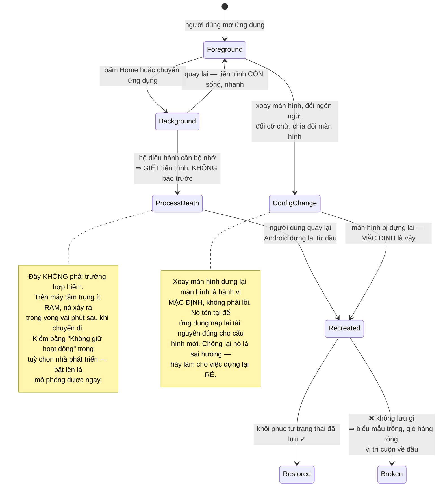
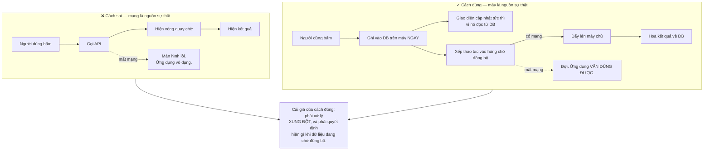
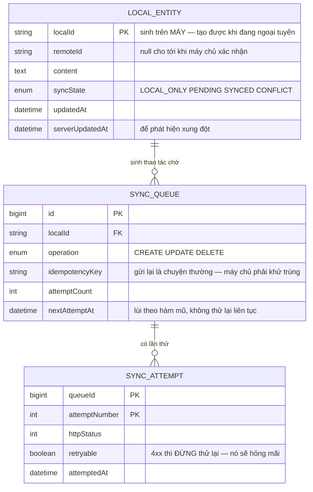

# Android Native App (Kotlin)

Mọi dự án web trong lộ trình này có chung một giả định mà bạn chưa từng phải đặt câu hỏi: **tiến trình của bạn còn sống trong lúc người dùng đang dùng.**

Trên Android, giả định đó sai.

Người dùng mở ứng dụng của bạn, chuyển sang xem tin nhắn, quay lại — và trong khoảng đó hệ điều hành đã **giết tiến trình** để lấy bộ nhớ cho ứng dụng khác. Khi họ quay lại, Android dựng lại màn hình từ đầu và **giả vờ như không có gì xảy ra**. Nếu bạn không chuẩn bị, người dùng thấy một biểu mẫu trống sau khi đã điền mười phút.

Đây là bài về việc viết ứng dụng cho một môi trường mà **hệ điều hành không phải bạn của bạn** — nó ưu tiên pin và bộ nhớ hơn là ứng dụng của bạn, và nó đúng khi làm vậy.

---

## Bạn sẽ dựng ra cái gì

- Ứng dụng ưu tiên ngoại tuyến: dùng được đầy đủ khi không có mạng
- Sống sót qua việc bị giết tiến trình và xoay màn hình
- Đồng bộ nền tuân thủ giới hạn pin của hệ thống
- Thông báo đẩy, ảnh chụp và tải lên tệp
- Quyền truy cập xin đúng lúc, và xử lý được khi bị từ chối
- Kiểm thử tự động trên nhiều kích thước màn hình và phiên bản hệ điều hành

---

## Cái chết của tiến trình: điều web không bao giờ dạy bạn



Có ba nơi để giữ trạng thái, và chọn sai nơi là nguồn của phần lớn lỗi:

| Nơi lưu | Sống qua xoay màn hình | Sống qua giết tiến trình | Dùng cho |
|---|---|---|---|
| Biến trong màn hình | ❌ | ❌ | Không dùng cho gì cần giữ |
| Đối tượng giữ trạng thái theo vòng đời | ✅ | ❌ | Dữ liệu tải từ mạng, tải lại được |
| Túi trạng thái được lưu | ✅ | ✅ | Chữ người dùng đã gõ, bộ lọc, vị trí |
| Cơ sở dữ liệu trên máy | ✅ | ✅ | Mọi thứ người dùng tạo ra |

Quy tắc gọn: **bất cứ thứ gì người dùng đã gõ hoặc chọn đều phải nằm ở hai hàng cuối.** Dữ liệu tải từ mạng thì tải lại được, nhưng mười phút gõ của họ thì không.

---

## Ưu tiên ngoại tuyến: trên di động đây không phải tính năng thêm

Trên web, mất mạng là trường hợp ngoại lệ. Trên di động, nó là **trạng thái bình thường**: tàu điện ngầm, thang máy, vùng phủ sóng kém, đang chuyển giữa Wi-Fi và di động.

Nên kiến trúc phải đảo lại: **cơ sở dữ liệu trên máy là nguồn sự thật của giao diện, mạng chỉ là thứ đồng bộ với nó.**



Hai chi tiết quyết định chất lượng cảm nhận:

- **Hiện rõ trạng thái đồng bộ.** Người dùng cần biết bình luận của họ đã lên máy chủ hay còn đang chờ. Giả vờ mọi thứ đã xong rồi lặng lẽ thất bại là cách nhanh nhất để mất niềm tin.
- **Thao tác trong hàng chờ phải lặp lại được.** Đúng bài học từ [Event-Driven Microservices](/projects/event-driven-microservices-uber-like): mạng chập chờn thì gửi lại là chuyện thường, nên máy chủ phải khử được trùng.

---

## Chạy nền: hệ điều hành sẽ chống lại bạn, và nó đúng

Đây là chỗ người từ web sang hay bực nhất. Bạn muốn đồng bộ mỗi 15 phút. Android nói không.

Từ Android 6 trở đi có chế độ ngủ đông: máy nằm yên một lúc thì hệ thống **gom mọi tác vụ nền lại** và chỉ cho chạy trong những khoảng ngắn cách nhau ngày càng xa. Từ Android 8, ứng dụng ở nền **không được** chạy dịch vụ tuỳ ý.

Điều này nghe như hạn chế vô lý cho tới khi bạn nhớ ra: người dùng có 80 ứng dụng, và nếu mỗi cái tự cho mình quyền thức dậy mỗi 15 phút thì máy hết pin trước bữa trưa.

Cách làm đúng:

```kotlin
// KHÔNG tự hẹn giờ. Khai báo ĐIỀU KIỆN và để hệ thống chọn thời điểm —
// nó biết pin còn bao nhiêu, đang sạc không, mạng loại gì.
val syncWork = PeriodicWorkRequestBuilder<SyncWorker>(6, TimeUnit.HOURS)
    .setConstraints(
        Constraints.Builder()
            .setRequiredNetworkType(NetworkType.UNMETERED)   // đợi Wi-Fi
            .setRequiresBatteryNotLow(true)
            .build()
    )
    .setBackoffCriteria(BackoffPolicy.EXPONENTIAL, 30, TimeUnit.SECONDS)
    .build()

WorkManager.getInstance(context).enqueueUniquePeriodicWork(
    "sync",
    ExistingPeriodicWorkPolicy.KEEP,   // KHÔNG tạo trùng mỗi lần mở ứng dụng
    syncWork,
)
```

Và với thứ **thật sự** cần tức thời — tin nhắn mới, đơn hàng — đừng hỏi liên tục. Dùng thông báo đẩy: máy chủ chủ động báo, ứng dụng thức dậy đúng lúc cần. Đó vừa là cách tiết kiệm pin nhất vừa là cách nhanh nhất.

---

## Quyền truy cập: xin lúc dùng, và chấp nhận bị từ chối

Xin toàn bộ quyền ngay khi mở ứng dụng lần đầu là cách chắc chắn để bị từ chối. Người dùng chưa biết ứng dụng làm gì mà đã thấy hỏi vị trí, danh bạ, camera.

Cách đúng: **xin đúng lúc tính năng cần đến, và giải thích trước khi hỏi.** Người dùng bấm nút chụp ảnh rồi mới thấy hộp thoại xin quyền camera thì họ hiểu ngay vì sao.

Nhưng phần quan trọng hơn là chuẩn bị cho câu trả lời "không":

- **Từ chối một lần** — hiện lời giải thích, cho phép thử lại sau.
- **Từ chối vĩnh viễn** — hệ thống sẽ không hiện hộp thoại nữa. Phải phát hiện được điều này và hướng dẫn người dùng vào phần cài đặt, không phải hỏi lại vô ích.
- **Tính năng phải suy giảm êm.** Không có quyền vị trí thì cho nhập địa chỉ bằng tay. Ứng dụng chặn người dùng ở màn hình "hãy cấp quyền" là ứng dụng bị gỡ.

---

## Dữ liệu trên máy



`localId` sinh trên máy là điều kiện để tạo dữ liệu khi ngoại tuyến — không thể chờ máy chủ cấp id. Khi đồng bộ thành công, `remoteId` được điền vào, và mọi tham chiếu nội bộ vẫn dùng `localId` để không phải sửa lại hàng loạt.

`retryable` tách 4xx khỏi 5xx là chi tiết dễ bỏ: lỗi 400 nghĩa là yêu cầu sai, thử lại một nghìn lần vẫn sai — nó chỉ tốn pin và làm đầy hàng chờ. Chỉ 5xx và lỗi mạng mới đáng thử lại.

---

## Những cái bẫy đã được ghi lại

| Triệu chứng | Nguyên nhân thật | Cách sửa |
|---|---|---|
| Người dùng mất dữ liệu đã gõ khi quay lại | Không lưu trạng thái, tiến trình bị giết | Túi trạng thái được lưu, hoặc DB trên máy |
| Xoay màn hình là mất hết | Giữ trạng thái trong biến của màn hình | Đối tượng giữ trạng thái theo vòng đời |
| Ứng dụng vô dụng khi mất mạng | Mạng là nguồn sự thật | DB trên máy là nguồn sự thật, mạng để đồng bộ |
| Đồng bộ nền không bao giờ chạy | Tự hẹn giờ, bị chế độ ngủ đông chặn | Khai báo điều kiện, để hệ thống chọn thời điểm |
| Tạo trùng công việc định kỳ mỗi lần mở app | Không dùng chính sách giữ nguyên | `ExistingPeriodicWorkPolicy.KEEP` |
| Pin tụt nhanh, người dùng gỡ ứng dụng | Hỏi máy chủ liên tục thay vì chờ đẩy | Thông báo đẩy cho việc cần tức thời |
| Hàng chờ đồng bộ đầy mãi không hết | Thử lại cả lỗi 4xx | Chỉ thử lại 5xx và lỗi mạng |
| Máy chủ nhận dữ liệu trùng | Gửi lại không có khoá lặp lại | Khoá lặp lại sinh trên máy |
| Người dùng từ chối hết quyền | Xin tất cả ngay lúc mở app | Xin đúng lúc dùng, có giải thích trước |
| Kẹt ở màn hình "hãy cấp quyền" | Không có đường đi khác | Suy giảm êm, cho nhập tay |
| Ứng dụng chậm giật khi cuộn | Làm việc nặng trên luồng giao diện | Đưa xuống luồng nền, đo bằng công cụ hồ sơ |
| Rò rỉ bộ nhớ sau vài lần xoay | Giữ tham chiếu tới màn hình đã huỷ | Giới hạn theo vòng đời, không giữ ngữ cảnh |

---

## Khi nào coi như xong

- [ ] Bật "Không giữ hoạt động", điền nửa biểu mẫu, chuyển app rồi quay lại: **dữ liệu còn nguyên**
- [ ] Xoay màn hình 10 lần liên tục: không rò rỉ bộ nhớ, không mất trạng thái
- [ ] Bật chế độ máy bay: **mọi** tính năng đọc và tạo đều dùng được
- [ ] Tạo 20 mục khi ngoại tuyến rồi bật mạng: cả 20 đồng bộ, **không cái nào trùng**
- [ ] Ngắt mạng giữa lúc đang đồng bộ: hàng chờ tiếp tục đúng chỗ, không mất mục nào
- [ ] Máy chủ trả 400 cho một mục: mục đó **ngừng** thử lại, các mục khác không bị kẹt
- [ ] Từ chối vĩnh viễn quyền camera: ứng dụng hướng dẫn vào cài đặt, **không** hỏi lại vô ích
- [ ] Không cấp quyền vị trí: vẫn dùng được bằng cách nhập địa chỉ tay
- [ ] Cuộn danh sách 1.000 mục: giữ trên 55 khung hình mỗi giây
- [ ] Chạy trên Android phiên bản thấp nhất hỗ trợ và cao nhất: hành vi như nhau
- [ ] Đo pin sau 24 giờ nền: đồng bộ chạy đúng số lần dự kiến, không nhiều hơn

---

## Bước tiếp theo

1. **Đồng bộ hai chiều có giải quyết xung đột.** Hai thiết bị sửa cùng một mục khi ngoại tuyến — đây chính là bài toán của [Real-Time Collaboration Tool](/projects/realtime-collaboration-figma-like), và CRDT dùng được ở đây.
2. **Máy tính bảng và màn hình gập.** Bố cục thích ứng là một trục thiết kế riêng, không phải phóng to giao diện điện thoại.
3. **Chia sẻ mã với iOS.** Kotlin Multiplatform cho phép dùng chung tầng nghiệp vụ mà vẫn giữ giao diện gốc — so sánh với cách tiếp cận của [Flutter Cross-platform App](/projects/flutter-cross-platform-app).
4. **Máy chủ cho ứng dụng.** Phần đồng bộ ở đây cần một máy chủ hiểu được nó — [Event-Driven Microservices](/projects/event-driven-microservices-uber-like) là nửa còn lại.
