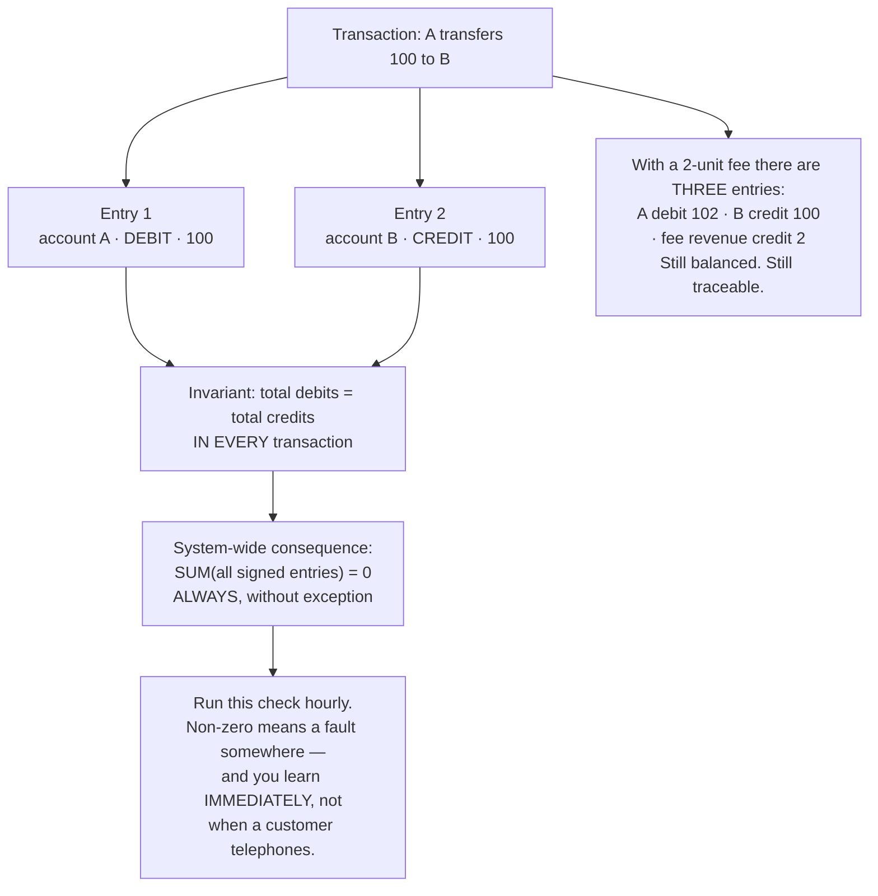
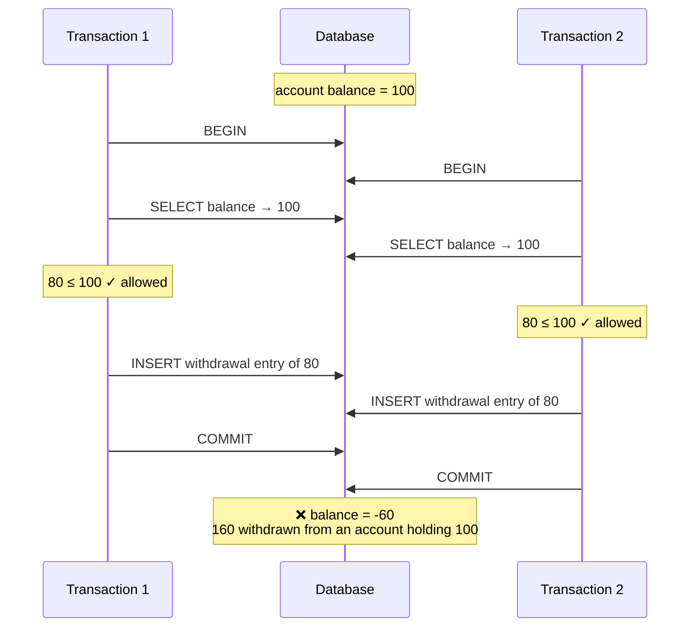
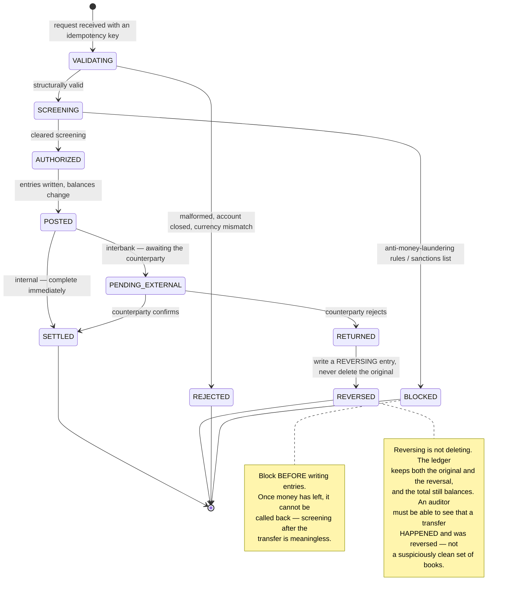
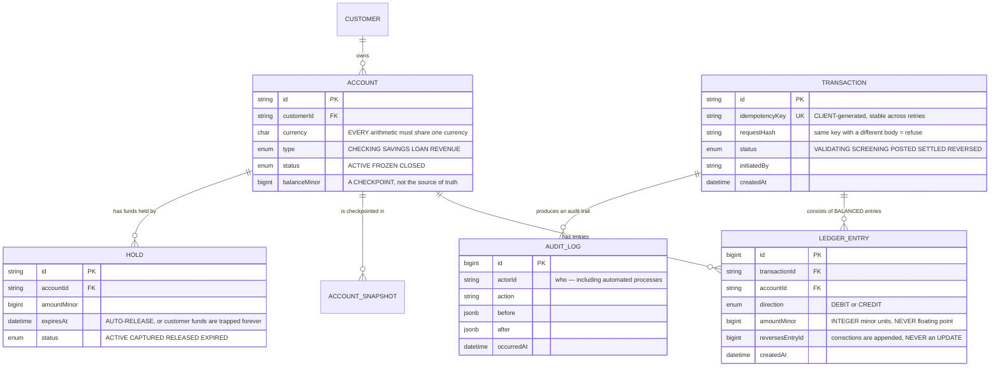

# Banking System (Core Banking)

Every earlier project shares a property you may not have noticed: **if they are wrong, you can fix them.** A post renders incorrectly, you fix it. A video fails to play, it plays next time. Search results rank badly, you adjust the weights.

Not here. One mis-added row means **a real person's money disappears**, and it does not come back by editing source code.

The interesting part is that banking solved this problem **before computers existed** — in the 15th century, specifically. And that solution is still the best we have. This project is mostly about learning it properly, then adding what computers break that paper did not.

---

## What you will build

- An immutable, self-checking double-entry ledger
- Internal and interbank transfers with compensation on failure
- Authorisation holds for card transactions, auto-released on expiry
- Interest, fees, and end-of-day reconciliation
- A complete, unalterable audit trail
- Rule-based fraud screening that blocks before money moves

---

## Rule one: never use floating point for money

Before anything else. This is the most common mistake and the easiest to avoid:

```python
>>> 0.1 + 0.2
0.30000000000000004

>>> 0.1 + 0.2 == 0.3
False
```

This is not a Python defect. Floating point represents numbers in base 2, and `0.1` in base 10 is an **infinitely repeating** fraction in base 2 — exactly as `1/3` is 0.333… in base 10. It must be truncated, and the truncation accumulates.

On one transaction the error is a thousandth of a cent and nobody notices. Across ten million transactions a day it becomes a figure you must explain to a regulator.

Two correct approaches:

```sql
-- Option 1: integers in the SMALLEST UNIT. With no decimal part there is
-- nothing to round incorrectly. £150.00 is stored as 15000 (pence).
amount_minor  BIGINT NOT NULL,
currency      CHAR(3) NOT NULL,

-- Option 2: NUMERIC — Postgres's exact decimal type, not a float.
-- Slower than integers but easier to read and still EXACTLY precise.
amount        NUMERIC(19, 4) NOT NULL,
```

And a companion rule that is always forgotten: **currency must travel with the amount, always.** Adding 100 USD to 100 JPY is not 200 of anything. Your types should make that **fail to compile**, rather than relying on a developer remembering.

---

## Double-entry: a 500-year-old data structure

The naive way to move money:

```sql
UPDATE accounts SET balance = balance - 100 WHERE id = 'A';
UPDATE accounts SET balance = balance + 100 WHERE id = 'B';
```

It *works*, and it is wrong by design in three ways:

1. **No history.** If a balance is wrong, nothing tells you where it went wrong.
2. **No self-checking invariant.** If the second statement never ran, the system has no way to detect it.
3. **It cannot answer "where did this money come from".** A regulator will ask exactly that.

Double-entry inverts the thinking: **a balance is not something stored, it is something computed.** What gets stored are **entries**, and every transaction must balance:



What makes double-entry powerful is not that it prevents errors — it **makes errors detectable**. A total that must always be zero is the cheapest, strongest check you can install in a financial system.

### An immutable ledger

A posted entry must **never be `UPDATE`d or `DELETE`d**. Mistakes are corrected by writing an opposing entry:

```sql
-- WRONG — destroys history, and auditors will ask why data vanished.
UPDATE ledger_entries SET amount_minor = 5000 WHERE id = 'e-123';

-- RIGHT — write a reversing entry; both remain visible.
INSERT INTO ledger_entries (transaction_id, account_id, direction, amount_minor, reverses_entry_id)
VALUES ('t-999', 'acc-A', 'CREDIT', 10000, 'e-123');   -- reverse the old entry
INSERT INTO ledger_entries (transaction_id, account_id, direction, amount_minor)
VALUES ('t-999', 'acc-A', 'DEBIT', 5000);              -- post the correct one
```

This is the fourth appearance of the **append-only** principle in this roadmap — after [Figma-like](/projects/realtime-collaboration-figma-like) (CRDT tombstones), [Distributed Search Engine](/projects/distributed-search-engine) (immutable segments) and [Message Broker](/projects/distributed-message-broker-kafka-like) (the append-only log). The reason here differs from all three: not performance, not convergence, but **accountability**. The same structure, three different motives.

### Balances: computed or stored?

Recomputing from the beginning on every read is correct but degrades with transaction count. The practical answer is **checkpoints**:

```sql
-- Snapshot balances daily, then add whatever has happened since.
SELECT s.balance_minor + COALESCE(SUM(
           CASE e.direction WHEN 'CREDIT' THEN e.amount_minor ELSE -e.amount_minor END
       ), 0) AS current_balance
  FROM account_snapshots s
  LEFT JOIN ledger_entries e
         ON e.account_id = s.account_id AND e.created_at > s.snapshot_at
 WHERE s.account_id = $1
 ORDER BY s.snapshot_at DESC
 LIMIT 1;
```

And a nightly job **recomputes from scratch** and compares against the checkpoint. Any divergence raises an alarm immediately — do not wait for a customer to find it for you.

---

## Write skew: where `READ COMMITTED` does not save you

This is the hardest part and the most commonly missed, because the code looks entirely correct.

An account holds 100. Two withdrawals of 80 run concurrently. Each reads the balance, sees 100, concludes 80 ≤ 100, and proceeds. The result: 160 withdrawn from an account holding 100.



What makes it dangerous: **neither transaction modified the same row.** They inserted two different new rows. So there is no write conflict for the database to detect, and **even Postgres's `REPEATABLE READ` permits it** — because each transaction works on its own snapshot and they never touch.

The phenomenon has a name: **write skew**. It is among the hardest concurrency bugs to see, because it never appears in manual testing and only surfaces under load.

Three remedies, in order of recommendation:

| Approach | Mechanism | Trade-off |
|---|---|---|
| **`SERIALIZABLE`** | Postgres detects the dependency and aborts one transaction | Most correct, but **the application must handle aborts and retry** — many people enable it and skip that part |
| **Explicit locking** | `SELECT ... FROM accounts WHERE id = $1 FOR UPDATE` before checking | Simple and legible, but serialises all activity on that account |
| **Database constraints** | A balance column with `CHECK (balance_minor >= 0)`, conditional updates | The last safety net — have it **alongside** one of the above, not instead |

The second is the `SELECT ... FOR UPDATE` you met in [Trello Clone](/projects/saas-project-management-trello) when enforcing plan limits. The same tool — except there, failure created an extra board; here, failure loses money.

---

## Idempotency: when a retry can move money twice

A client sends a transfer of one million. The network stutters and no response arrives. The client retries. The server already processed the first one.

In [Event-Driven Microservices](/projects/event-driven-microservices-uber-like) you solved this for events. Here it is mandatory, and **the client must participate**: the client generates the key and **keeps it identical across retries**.

```sql
CREATE TABLE idempotency_keys (
    key            TEXT        PRIMARY KEY,   -- CLIENT-generated, stable across retries
    request_hash   VARCHAR(64) NOT NULL,      -- hash of the request body
    transaction_id TEXT,                      -- result of the first attempt
    status         VARCHAR(16) NOT NULL,      -- IN_PROGRESS | COMPLETED | FAILED
    created_at     TIMESTAMPTZ NOT NULL DEFAULT now(),
    expires_at     TIMESTAMPTZ NOT NULL
);
```

```python
def transfer(key: str, req: TransferRequest):
    with db.transaction():
        row = db.query("""
            INSERT INTO idempotency_keys (key, request_hash, status, expires_at)
            VALUES (%s, %s, 'IN_PROGRESS', now() + interval '24 hours')
            ON CONFLICT (key) DO NOTHING
            RETURNING key
        """, key, hash_request(req))

        if row is None:                       # the key already exists
            existing = db.query("SELECT * FROM idempotency_keys WHERE key = %s", key)

            # Same key, DIFFERENT body: this is a client bug, not a retry.
            # Return 422 — never process it, because it may well be two
            # entirely different transfers.
            if existing.request_hash != hash_request(req):
                raise IdempotencyKeyReused()

            if existing.status == 'IN_PROGRESS':
                raise RequestInFlight()        # 409, client waits and asks again
            return load_result(existing.transaction_id)   # REPLAY the old result

        result = perform_transfer(req)         # same database transaction
        db.execute("""UPDATE idempotency_keys
                         SET status = 'COMPLETED', transaction_id = %s
                       WHERE key = %s""", result.id, key)
        return result
```

The `request_hash` mismatch branch is the most valuable detail above. Without it, a careless client reusing an old key for a **different** transfer receives the old result — and believes the new transfer succeeded. No money moved, but both sides think it did.

---

## The lifecycle of a transfer



The `PENDING_EXTERNAL` state is where banking differs from every system you have built: **part of the transaction sits outside your control**, sometimes for days. No `COMMIT` spans it. This is the saga from [Event-Driven Microservices](/projects/event-driven-microservices-uber-like), except the compensating step is a reversing entry with legal weight.

---

## The data model



`balanceMinor` on `ACCOUNT` is explicitly labelled **a checkpoint, not the source of truth**. The source of truth is always the sum of entries. If the two diverge, the ledger is right and the checkpoint is wrong — never the other way around. Write that in the documentation and in the column name, because in six months somebody will write code trusting that balance column.

`HOLD` with `expiresAt` handles a very real situation: a customer taps their card at a fuel pump, the system holds an amount, and the real transaction never arrives. Without expiry, the customer's money is trapped indefinitely — the kind of failure that loses customers and attracts regulatory letters.

---

## Traps worth recording

| Symptom | Actual cause | Fix |
|---|---|---|
| Books off by a few pence daily | Floating point used for money | Integer minor units, or `NUMERIC` |
| Two currencies accidentally added | Amounts travelling without currency | Types that require currency |
| Negative balances despite checking first | Write skew — both transactions on one snapshot | `SERIALIZABLE` with retries, or `FOR UPDATE` |
| Odd errors after enabling `SERIALIZABLE` | Aborted transactions not handled | Catch serialisation failures and retry |
| A wrong balance with no way to trace it | Updating a balance column instead of writing entries | Double entry, with balance as a computation |
| The ledger silently out of balance | No invariant check | Verify `SUM(signed entries) = 0` hourly |
| Auditors cannot reconstruct history | `UPDATE`/`DELETE` on entries | Immutable ledger, corrections by reversal |
| A client retry moves money twice | No idempotency key | Client-generated key, enforced by a unique constraint |
| A reused key returns the wrong old result | Request body never compared | Compare the request hash; refuse on mismatch |
| Customer funds trapped after a card tap | Holds with no expiry | `expiresAt` plus a background release job |
| Balance reads slowing year over year | Recomputing from the first entry | Periodic checkpoints with nightly reconciliation |
| Fraud screening blocks nothing | Screening after entries were written | Screen **before** money leaves the account |
| Interbank transfers hanging indefinitely | No external-pending state | A dedicated state, a deadline, and a reversal path |

---

## When it is genuinely done

- [ ] Run `SUM(CASE direction WHEN 'CREDIT' THEN amount ELSE -amount END)` across the whole ledger: it is **exactly zero**
- [ ] Fire 100 concurrent withdrawals of 80 against an account holding 100: exactly **one** succeeds, leaving 20
- [ ] Balances are **never** negative, verified by scanning every account after a load scenario
- [ ] Send the same idempotency key 50 times: exactly **one** transaction is created
- [ ] Send the same key with a different amount: an error is returned, **not** the old result
- [ ] Reverse a transaction: the ledger holds **both** entries and the total is still zero
- [ ] Attempt to `UPDATE` a ledger row: the database refuses (rule or permission)
- [ ] Nightly reconciliation over 10 million entries: matches the checkpoints exactly
- [ ] An expired hold: released within one background-job cycle
- [ ] Every balance change traces back to **who** did it and **which request** caused it
- [ ] Load 1 million transactions with awkward amounts (0.01 and 0.02): totals match **exactly**, not a penny out

---

## Where to go next

1. **Multi-currency accounting.** Exchange rates at transaction time, with FX gain and loss as their own ledger accounts. Considerably harder than it looks.
2. **Behavioural fraud detection.** Hard rules catch the known; patterns catch the new. But wrongly blocking a genuine transaction is also a loss — measure both sides.
3. **Disaster resilience.** A bank must keep running through the loss of an entire data centre. Synchronous cross-region replication, and the trade-offs of [Distributed Database](/projects/distributed-database-postgres-like).
4. **Stream processing.** Real-time fraud detection means reading a transaction stream rather than scanning tables — [Real-Time Analytics Platform](/projects/realtime-analytics-platform) and [Event-Driven Microservices](/projects/event-driven-microservices-uber-like) are the two halves of that.
