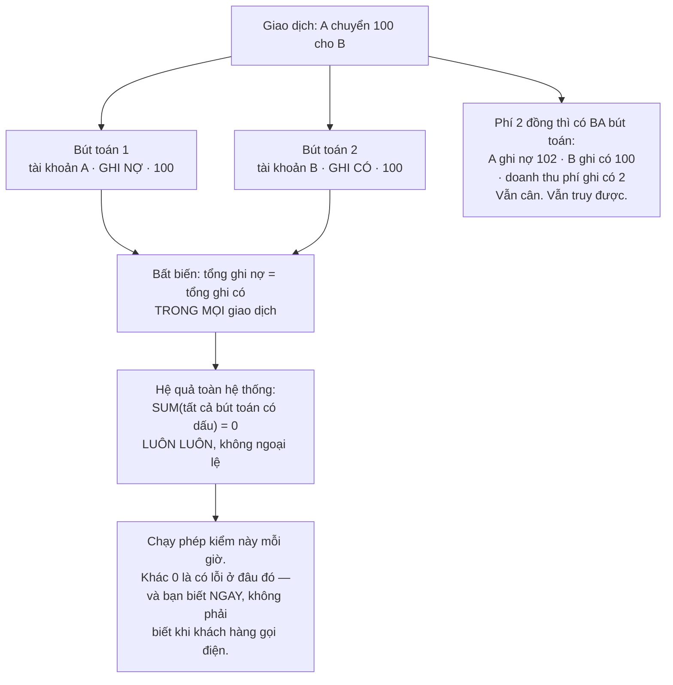
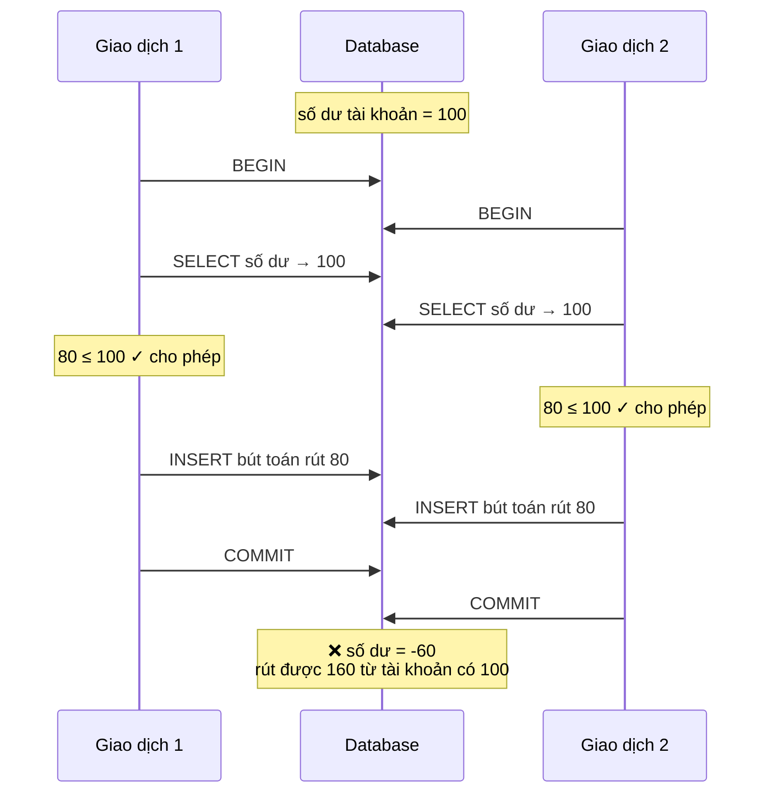
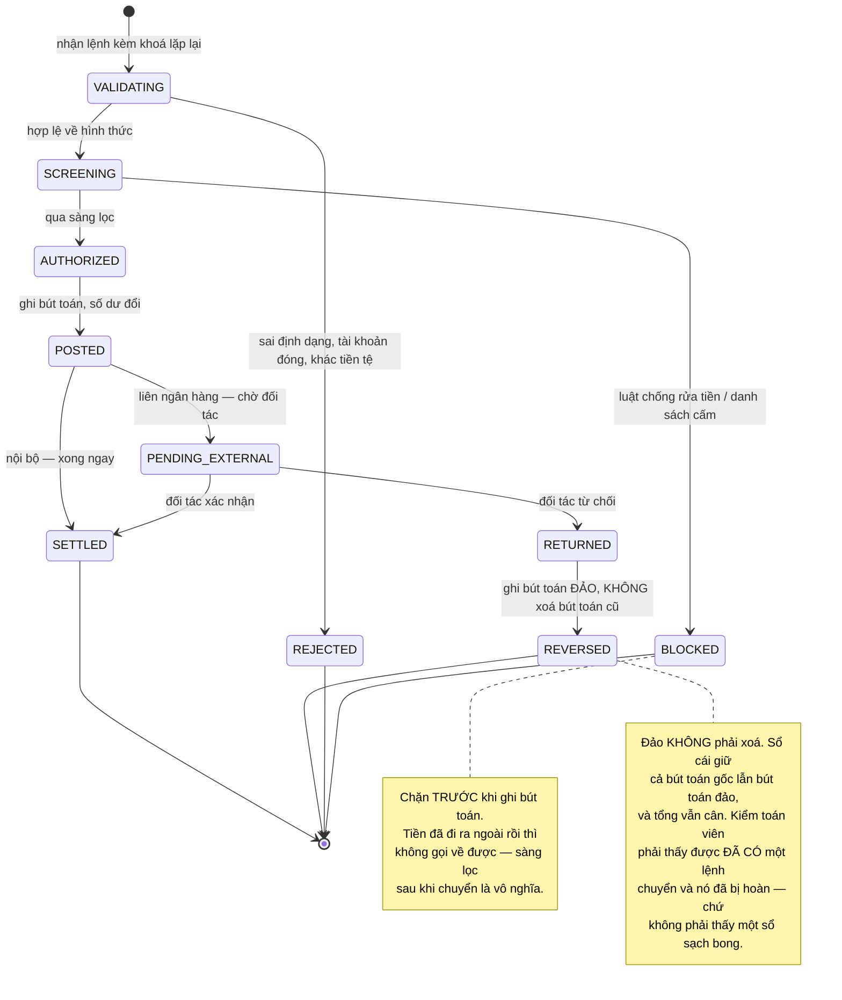
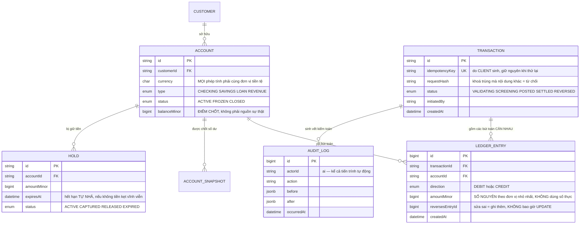

# Banking System (Core Banking)

Mọi dự án trước có một đặc điểm chung mà bạn chưa để ý: **nếu chúng sai, bạn sửa lại được.** Bài viết hiển thị nhầm thì sửa. Video phát lỗi thì phát lại. Kết quả tìm kiếm xếp sai thứ tự thì chỉnh trọng số.

Ở đây thì không. Cộng nhầm một dòng là **tiền của một người thật biến mất**, và nó không quay lại bằng cách sửa mã nguồn.

Điều thú vị là ngành ngân hàng đã giải bài toán này **từ trước khi có máy tính** — cụ thể là từ thế kỷ 15. Và lời giải đó vẫn là thứ tốt nhất chúng ta có. Bài này chủ yếu là học lại nó cho đúng, rồi thêm vào những gì máy tính làm hỏng mà giấy tờ không hỏng.

---

## Bạn sẽ dựng ra cái gì

- Sổ cái ghi kép, bất biến, tự kiểm tra được
- Chuyển khoản nội bộ và liên ngân hàng, có bù trừ khi hỏng
- Giữ tiền tạm cho giao dịch thẻ, hết hạn tự nhả
- Lãi suất, phí, đối soát cuối ngày
- Nhật ký kiểm toán đầy đủ, không sửa được
- Phát hiện gian lận theo quy tắc, chặn trước khi tiền đi

---

## Quy tắc số một: đừng bao giờ dùng số thực cho tiền

Trước mọi thứ khác. Đây là lỗi phổ biến nhất và cũng dễ tránh nhất:

```python
>>> 0.1 + 0.2
0.30000000000000004

>>> 0.1 + 0.2 == 0.3
False
```

Đây không phải lỗi của Python. Số thực dấu phẩy động biểu diễn số theo cơ số 2, và `0,1` trong hệ 10 là số **tuần hoàn vô hạn** trong hệ 2 — hệt như `1/3` là 0,333… trong hệ 10. Nó phải bị cắt bớt, và phần bị cắt tích luỹ dần.

Trên một giao dịch, sai số là phần nghìn xu, không ai thấy. Trên mười triệu giao dịch một ngày, nó thành một con số phải giải trình với cơ quan quản lý.

Hai cách đúng:

```sql
-- Cách 1: số nguyên theo ĐƠN VỊ NHỎ NHẤT. Không có phần thập phân
-- thì không có gì để làm tròn sai. 15.000 VNĐ lưu là 1500000 (xu).
amount_minor  BIGINT NOT NULL,
currency      CHAR(3) NOT NULL,

-- Cách 2: NUMERIC — số thập phân chính xác của Postgres, không phải số thực.
-- Chậm hơn số nguyên nhưng đọc dễ hơn và vẫn CHÍNH XÁC TUYỆT ĐỐI.
amount        NUMERIC(19, 4) NOT NULL,
```

Và một điều đi kèm luôn bị quên: **đơn vị tiền tệ phải nằm cạnh số tiền, luôn luôn.** Cộng 100 USD với 100 JPY không phải là 200 của bất cứ thứ gì. Kiểu dữ liệu nên khiến việc đó **không biên dịch được**, chứ không phải trông chờ vào việc lập trình viên nhớ.

---

## Ghi kép: cấu trúc dữ liệu 500 tuổi

Cách ngây thơ để chuyển tiền:

```sql
UPDATE accounts SET balance = balance - 100 WHERE id = 'A';
UPDATE accounts SET balance = balance + 100 WHERE id = 'B';
```

Nó *chạy được*, và nó sai về mặt thiết kế theo ba cách:

1. **Không có lịch sử.** Số dư sai thì không có cách nào biết sai từ đâu.
2. **Không có bất biến tự kiểm.** Nếu lệnh thứ hai không chạy, hệ thống không có cách nào tự phát hiện.
3. **Không trả lời được câu "tiền này từ đâu tới".** Cơ quan quản lý sẽ hỏi câu đó.

Ghi kép đảo ngược cách nghĩ: **số dư không phải thứ được lưu, nó là thứ được tính ra.** Cái được lưu là các **bút toán**, và mọi giao dịch phải cân:



Điều làm ghi kép mạnh không phải là nó ngăn lỗi — nó **làm cho lỗi trở nên phát hiện được**. Một tổng luôn phải bằng 0 là phép kiểm rẻ nhất, mạnh nhất mà bạn có thể cài vào một hệ thống tài chính.

### Sổ cái bất biến

Bút toán đã ghi thì **không bao giờ được `UPDATE` hay `DELETE`**. Ghi nhầm thì sửa bằng cách ghi thêm một bút toán ngược chiều:

```sql
-- SAI — xoá lịch sử, và cơ quan kiểm toán sẽ hỏi vì sao dữ liệu biến mất.
UPDATE ledger_entries SET amount_minor = 5000 WHERE id = 'e-123';

-- ĐÚNG — ghi thêm bút toán đảo, giữ nguyên vết cả hai.
INSERT INTO ledger_entries (transaction_id, account_id, direction, amount_minor, reverses_entry_id)
VALUES ('t-999', 'acc-A', 'CREDIT', 10000, 'e-123');   -- đảo bút toán cũ
INSERT INTO ledger_entries (transaction_id, account_id, direction, amount_minor)
VALUES ('t-999', 'acc-A', 'DEBIT', 5000);              -- ghi lại đúng
```

Đây là lần thứ tư trong lộ trình nguyên tắc **chỉ ghi thêm** xuất hiện — sau [Figma-like](/projects/realtime-collaboration-figma-like) (bia mộ CRDT), [Distributed Search Engine](/projects/distributed-search-engine) (phân đoạn bất biến) và [Message Broker](/projects/distributed-message-broker-kafka-like) (nhật ký chỉ ghi thêm). Ở đây lý do khác hẳn ba lần trước: không phải vì hiệu năng hay vì đồng bộ, mà vì **trách nhiệm giải trình**. Cùng một cấu trúc, ba động cơ khác nhau.

### Số dư: tính hay lưu?

Tính từ đầu mỗi lần đọc là đúng nhưng chậm dần theo số giao dịch. Cách thực tế là **điểm chốt**:

```sql
-- Chốt số dư mỗi ngày, rồi cộng thêm phần phát sinh sau đó.
SELECT s.balance_minor + COALESCE(SUM(
           CASE e.direction WHEN 'CREDIT' THEN e.amount_minor ELSE -e.amount_minor END
       ), 0) AS current_balance
  FROM account_snapshots s
  LEFT JOIN ledger_entries e
         ON e.account_id = s.account_id AND e.created_at > s.snapshot_at
 WHERE s.account_id = $1
 ORDER BY s.snapshot_at DESC
 LIMIT 1;
```

Và một công việc nền chạy hằng đêm **tính lại từ đầu** rồi so với điểm chốt. Lệch nhau là báo động ngay — đừng đợi khách hàng phát hiện hộ.

---

## Sai lệch ghi: chỗ mà `READ COMMITTED` không cứu bạn

Đây là phần khó nhất và cũng là phần dễ bị bỏ qua nhất, vì mã trông hoàn toàn đúng.

Tài khoản có 100. Hai lệnh rút 80 chạy cùng lúc. Mỗi lệnh đọc số dư, thấy 100, kết luận 80 ≤ 100, và cho phép. Kết quả: rút được 160 từ tài khoản có 100.



Điều khiến nó nguy hiểm: **cả hai giao dịch đều không sửa cùng một dòng.** Chúng chèn hai dòng mới khác nhau. Nên không có xung đột ghi nào để database phát hiện, và **kể cả mức cách ly `REPEATABLE READ` của Postgres cũng cho qua** — vì mỗi giao dịch làm việc trên ảnh chụp riêng và không hề đụng nhau.

Hiện tượng này có tên: **sai lệch ghi**. Nó là một trong những lỗi đồng thời khó thấy nhất, vì nó không xuất hiện khi thử tay và chỉ xuất hiện dưới tải.

Ba cách chữa, xếp theo mức khuyến nghị:

| Cách | Cơ chế | Đánh đổi |
|---|---|---|
| **`SERIALIZABLE`** | Postgres phát hiện phụ thuộc và huỷ một giao dịch | Đúng nhất, nhưng **ứng dụng phải xử lý huỷ và thử lại** — nhiều người bật rồi quên phần này |
| **Khoá tường minh** | `SELECT ... FROM accounts WHERE id = $1 FOR UPDATE` trước khi kiểm | Đơn giản, dễ hiểu, nhưng nối tiếp hoá mọi thao tác trên cùng tài khoản |
| **Ràng buộc ở database** | Cột số dư có `CHECK (balance_minor >= 0)`, cập nhật có điều kiện | Mạng lưới an toàn cuối cùng — nên có **cùng với** một trong hai cách trên |

Cách thứ hai chính là `SELECT ... FOR UPDATE` bạn đã gặp ở [Trello Clone](/projects/saas-project-management-trello) khi kiểm giới hạn gói. Cùng một công cụ, nhưng ở đó sai thì tạo thừa một bảng, ở đây sai thì mất tiền.

---

## Tính lặp lại được: khi thử lại có thể chuyển tiền hai lần

Client gửi lệnh chuyển 1 triệu. Mạng chập chờn, không nhận được phản hồi. Client thử lại. Server đã xử lý lần đầu rồi.

Ở [Event-Driven Microservices](/projects/event-driven-microservices-uber-like) bạn đã giải bài này cho sự kiện. Ở đây nó bắt buộc, và **client phải tham gia**: chính client sinh ra khoá và **giữ nguyên khoá đó khi thử lại**.

```sql
CREATE TABLE idempotency_keys (
    key            TEXT        PRIMARY KEY,   -- do CLIENT sinh, giữ nguyên khi thử lại
    request_hash   VARCHAR(64) NOT NULL,      -- băm nội dung yêu cầu
    transaction_id TEXT,                      -- kết quả lần đầu
    status         VARCHAR(16) NOT NULL,      -- IN_PROGRESS | COMPLETED | FAILED
    created_at     TIMESTAMPTZ NOT NULL DEFAULT now(),
    expires_at     TIMESTAMPTZ NOT NULL
);
```

```python
def transfer(key: str, req: TransferRequest):
    with db.transaction():
        row = db.query("""
            INSERT INTO idempotency_keys (key, request_hash, status, expires_at)
            VALUES (%s, %s, 'IN_PROGRESS', now() + interval '24 hours')
            ON CONFLICT (key) DO NOTHING
            RETURNING key
        """, key, hash_request(req))

        if row is None:                       # khoá đã tồn tại
            existing = db.query("SELECT * FROM idempotency_keys WHERE key = %s", key)

            # Cùng khoá nhưng nội dung KHÁC: đây là lỗi phía client, không
            # phải lần thử lại. Trả về 422 — tuyệt đối không xử lý,
            # vì nó có thể là hai lệnh chuyển tiền khác nhau.
            if existing.request_hash != hash_request(req):
                raise IdempotencyKeyReused()

            if existing.status == 'IN_PROGRESS':
                raise RequestInFlight()        # 409, client chờ rồi hỏi lại
            return load_result(existing.transaction_id)   # trả LẠI kết quả cũ

        result = perform_transfer(req)         # cùng giao dịch database
        db.execute("""UPDATE idempotency_keys
                         SET status = 'COMPLETED', transaction_id = %s
                       WHERE key = %s""", result.id, key)
        return result
```

Nhánh `request_hash` khác nhau là chi tiết đáng giá nhất trong đoạn trên. Không có nó, một client viết cẩu thả dùng lại khoá cũ cho một lệnh chuyển tiền **khác** sẽ nhận về kết quả của lệnh cũ — và tin rằng lệnh mới đã thành công. Tiền không đi đâu cả, nhưng cả hai bên đều tưởng nó đã đi.

---

## Vòng đời một lệnh chuyển tiền



Trạng thái `PENDING_EXTERNAL` là chỗ ngân hàng khác mọi hệ thống bạn đã dựng: **một phần của giao dịch nằm ngoài tầm kiểm soát của bạn**, có khi hàng ngày. Không có `COMMIT` nào bao được nó. Đây chính là saga từ [Event-Driven Microservices](/projects/event-driven-microservices-uber-like), nhưng bước bù trừ là một bút toán đảo có hiệu lực pháp lý.

---

## Cơ sở dữ liệu



Cột `balanceMinor` trên `ACCOUNT` được ghi rõ là **điểm chốt, không phải nguồn sự thật**. Nguồn sự thật luôn là tổng các bút toán. Nếu hai cái lệch nhau, sổ cái đúng và điểm chốt sai — không bao giờ ngược lại. Ghi điều đó vào tài liệu và vào tên cột, vì sáu tháng sau sẽ có người viết mã tin vào cột số dư.

`HOLD` với `expiresAt` xử lý một tình huống rất thực: khách quẹt thẻ ở cây xăng, hệ thống giữ tạm một khoản, rồi giao dịch thật không bao giờ tới. Không có cơ chế hết hạn thì tiền của khách bị kẹt vô thời hạn — và đó là loại lỗi khiến khách hàng rời đi và cơ quan quản lý gửi thư.

---

## Những cái bẫy đã được ghi lại

| Triệu chứng | Nguyên nhân thật | Cách sửa |
|---|---|---|
| Tổng sổ sách lệch vài xu mỗi ngày | Dùng số thực cho tiền | Số nguyên đơn vị nhỏ nhất, hoặc `NUMERIC` |
| Cộng nhầm hai đơn vị tiền tệ | Số tiền không đi kèm đơn vị | Kiểu dữ liệu bắt buộc có đơn vị tiền tệ |
| Số dư âm dù đã kiểm tra trước khi rút | Sai lệch ghi — hai giao dịch đọc cùng ảnh chụp | `SERIALIZABLE` có thử lại, hoặc `FOR UPDATE` |
| Bật `SERIALIZABLE` rồi thỉnh thoảng lỗi lạ | Không xử lý giao dịch bị huỷ | Bắt lỗi tuần tự hoá và thử lại |
| Số dư sai mà không biết sai từ đâu | Cập nhật cột số dư thay vì ghi bút toán | Ghi kép, số dư là kết quả tính |
| Sổ cái không cân mà không ai biết | Không có phép kiểm bất biến | Kiểm `SUM(bút toán có dấu) = 0` mỗi giờ |
| Kiểm toán không truy được lịch sử | `UPDATE`/`DELETE` trên bút toán | Sổ cái bất biến, sửa bằng bút toán đảo |
| Client thử lại làm chuyển tiền hai lần | Không có khoá lặp lại | Khoá do client sinh, kiểm bằng ràng buộc unique |
| Khoá lặp lại dùng lại cho lệnh khác, trả kết quả cũ | Không so nội dung yêu cầu | So mã băm yêu cầu, khác thì từ chối |
| Tiền khách kẹt vĩnh viễn sau khi quẹt thẻ | Giữ tiền không có hạn | `expiresAt` và công việc nền tự nhả |
| Đọc số dư chậm dần theo năm | Tính lại từ bút toán đầu tiên | Điểm chốt định kỳ, có đối soát hằng đêm |
| Sàng lọc gian lận không chặn được gì | Sàng lọc sau khi đã ghi bút toán | Sàng lọc **trước** khi tiền rời tài khoản |
| Chuyển liên ngân hàng treo mãi | Không có trạng thái chờ bên ngoài | Trạng thái riêng, thời hạn, và bước đảo |

---

## Khi nào coi như xong

- [ ] Chạy `SUM(CASE direction WHEN 'CREDIT' THEN amount ELSE -amount END)` trên toàn sổ cái: kết quả **đúng bằng 0**
- [ ] Bắn 100 lệnh rút 80 đồng thời trên tài khoản có 100: **đúng một** lệnh thành công, số dư còn 20
- [ ] Số dư **không bao giờ** âm, kiểm bằng cách quét toàn bộ tài khoản sau kịch bản tải
- [ ] Gửi cùng một khoá lặp lại 50 lần: đúng **một** giao dịch được tạo
- [ ] Gửi cùng khoá nhưng số tiền khác: nhận lỗi, **không** trả về kết quả cũ
- [ ] Hoàn một giao dịch: sổ cái có **cả hai** bút toán, và tổng vẫn bằng 0
- [ ] Thử `UPDATE` một dòng bút toán: bị database từ chối (quy tắc hoặc quyền)
- [ ] Đối soát hằng đêm trên 10 triệu bút toán: khớp tuyệt đối với điểm chốt
- [ ] Giữ tiền quá hạn: tự nhả trong vòng một chu kỳ công việc nền
- [ ] Mọi thay đổi số dư đều truy ngược được tới **ai** đã làm và **lệnh nào** gây ra
- [ ] Nạp 1 triệu giao dịch với số lẻ (0,01 và 0,02): tổng khớp **tuyệt đối**, không lệch một xu

---

## Bước tiếp theo

1. **Kế toán đa tiền tệ.** Tỉ giá tại thời điểm giao dịch, chênh lệch tỉ giá là một tài khoản riêng trong sổ cái. Phức tạp hơn nhiều so với vẻ ngoài.
2. **Phát hiện gian lận theo hành vi.** Quy tắc cứng bắt được cái đã biết; mẫu hình bắt được cái mới. Nhưng chặn nhầm một giao dịch thật cũng là một loại thiệt hại — cần đo cả hai phía.
3. **Chống chịu thảm hoạ.** Ngân hàng phải chạy được khi mất cả một trung tâm dữ liệu. Nhân bản đồng bộ giữa các vùng, và bài toán đánh đổi của [Distributed Database](/projects/distributed-database-postgres-like).
4. **Xử lý sự kiện theo dòng.** Phát hiện gian lận thời gian thực cần đọc dòng giao dịch chứ không phải quét bảng — [Real-Time Analytics Platform](/projects/realtime-analytics-platform) và [Event-Driven Microservices](/projects/event-driven-microservices-uber-like) là hai nửa của việc đó.
