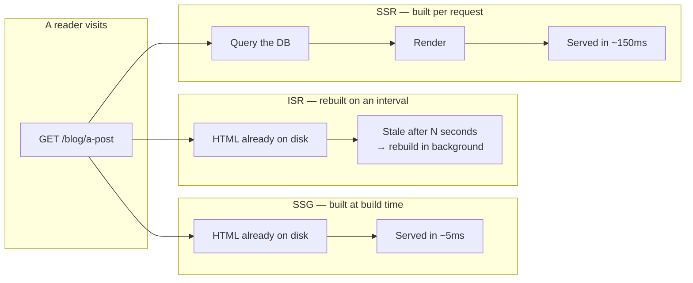
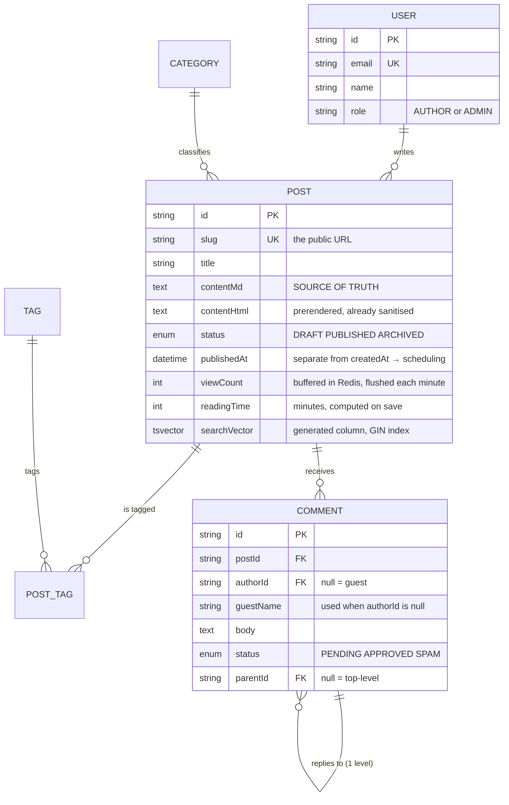
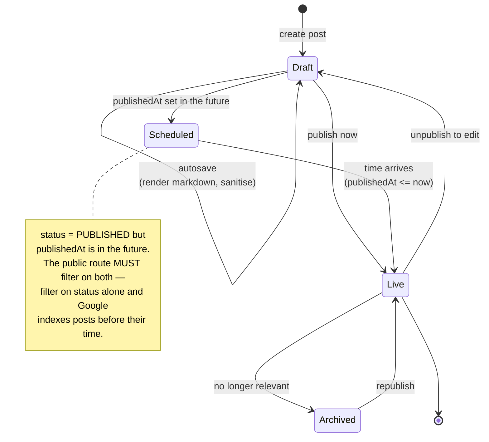

# Blog Platform (Markdown-based)

This project looks like the Todo App but solves the opposite problem. Todo App: one user, many writes, few reads. Blog: **very many reads, very few writes, and most readers are not signed in at all**.

That inversion changes every priority. What matters now is not "who may edit what" but: how fast the page loads, whether Google can read it, and how to avoid rebuilding a published article from the database on every single visit.

It is also the first project where you must take **user-authored content** seriously. Markdown allows embedded HTML, and HTML allows `<script>`. Render what the author typed and you have just built an XSS gateway.

---

## What you are going to build

- Write in Markdown with live side-by-side preview
- Draft / published / scheduled states
- Categories and tags, monthly archive pages
- Moderated comments
- Full-text search
- SEO: sitemap, RSS, Open Graph tags, structured data
- Lighthouse above 95 across all four categories

---

## Three rendering strategies, and how to choose

This is the biggest architectural decision in the project, and Next.js gives you all three in one codebase.



| Strategy | Use for | Why |
|---|---|---|
| **SSG** | About page, fixed category pages | Fastest possible, but needs a rebuild when content changes |
| **ISR** | Articles, article lists | As fast as SSG, refreshes itself after N seconds — exactly what a blog needs |
| **SSR** | Admin pages, search results | Data must be absolutely current, and caching would be wrong |

For a blog, **ISR is the default answer**. Articles change rarely; readers do not need to see a change within one second; and a read should not cost a database query.

```tsx
// src/app/blog/[slug]/page.tsx
export const revalidate = 60;   // rebuild at most once every 60 seconds

// generateStaticParams tells Next.js which slugs to prebuild. Articles that
// appear later still work — Next.js builds them on first visit and caches
// the result.
export async function generateStaticParams() {
  const posts = await prisma.post.findMany({
    where: { status: 'PUBLISHED' },
    select: { slug: true },
    take: 100,          // prebuild only the 100 newest
    orderBy: { publishedAt: 'desc' },
  });
  return posts.map((p) => ({ slug: p.slug }));
}
```

The `take: 100` is a deliberate trade-off: prebuilding all 5,000 articles makes every build take 20 minutes, while 95% of traffic lands on a few dozen recent ones. Older articles still work, they are just slower on the first read.

---

## Markdown and the XSS back door

This is the most important part of the project. Plenty of hand-rolled blogs have this hole.

```ts
// src/lib/markdown.ts
import { unified } from 'unified';
import remarkParse from 'remark-parse';
import remarkGfm from 'remark-gfm';
import remarkRehype from 'remark-rehype';
import rehypeRaw from 'rehype-raw';
import rehypeSanitize, { defaultSchema } from 'rehype-sanitize';
import rehypeSlug from 'rehype-slug';
import rehypeHighlight from 'rehype-highlight';
import rehypeStringify from 'rehype-stringify';

// An ALLOW list, not a BLOCK list.
//
// Block lists are always incomplete: you block <script>, the attacker uses
// . You block onerror, they use <svg onload>. You will
// never enumerate them all. An allow list inverts it — anything not on the
// list is removed.
const schema = {
  ...defaultSchema,
  tagNames: [
    ...(defaultSchema.tagNames ?? []),
    'figure', 'figcaption', 'mark', 'kbd',
  ],
  attributes: {
    ...defaultSchema.attributes,
    // target="_blank" must come with rel="noopener": without it the
    // destination page can read window.opener and redirect the original tab
    // to a phishing page (tabnabbing).
    a: [...(defaultSchema.attributes?.a ?? []), 'target', 'rel'],
    code: [['className', /^language-./]],
    img: [...(defaultSchema.attributes?.img ?? []), 'loading', 'width', 'height'],
  },
};

export async function renderMarkdown(md: string): Promise<string> {
  const file = await unified()
    .use(remarkParse)
    .use(remarkGfm)                       // tables, checkboxes, strikethrough
    .use(remarkRehype, { allowDangerousHtml: true })
    .use(rehypeRaw)                       // allow raw HTML in markdown...
    .use(rehypeSanitize, schema)          // ...then SANITISE straight after
    .use(rehypeSlug)                      // heading ids → TOC, anchor links
    .use(rehypeHighlight)
    .use(rehypeStringify)
    .process(md);
  return String(file);
}
```

The order — `rehypeRaw` then `rehypeSanitize` — is the crux, and easy to reverse by accident. Reversed, you sanitise before the raw HTML is parsed, and everything dangerous walks straight through.

Another rule: **render Markdown on the server and store the sanitised HTML.** Not for speed — but because if you find a hole in the sanitiser six months later, you re-run it once across every article. Sanitise on the client and every reader's browser is a separate place to patch.

---

## The data model



A post's lifecycle — note that `PUBLISHED` does not mean "visible":



```prisma
model Post {
  id          String     @id @default(cuid())
  slug        String     @unique
  title       String
  excerpt     String?    @db.Text
  // Markdown is the source of truth; HTML is a build artefact that can be
  // regenerated at any time. Keep both: edits touch the markdown, reads
  // touch the html.
  contentMd   String     @db.Text
  contentHtml String     @db.Text

  status      PostStatus @default(DRAFT)
  // publishedAt is separate from createdAt so scheduling works: a post with
  // status PUBLISHED but a future publishedAt is not visible yet.
  publishedAt DateTime?

  // Denormalised counter, updated asynchronously. Reading an article must
  // not wait for an UPDATE.
  viewCount   Int        @default(0)
  readingTime Int        @default(1)   // minutes, computed on save

  authorId    String
  author      User       @relation(fields: [authorId], references: [id])
  categoryId  String?
  category    Category?  @relation(fields: [categoryId], references: [id])
  tags        PostTag[]
  comments    Comment[]

  createdAt   DateTime   @default(now())
  updatedAt   DateTime   @updatedAt

  // Index for the most common query: "published posts, newest first".
  @@index([status, publishedAt])
  @@map("posts")
}

enum PostStatus { DRAFT PUBLISHED ARCHIVED }

model Comment {
  id        String        @id @default(cuid())
  postId    String
  post      Post          @relation(fields: [postId], references: [id], onDelete: Cascade)

  // Guest comments are allowed: authorId null means guestName is used.
  // Allowing guests raises engagement and also opens the door to spam —
  // hence PENDING by default.
  authorId  String?
  guestName String?       @db.VarChar(80)
  body      String        @db.Text
  status    CommentStatus @default(PENDING)

  // One level of nesting. Infinite nesting sounds nice and renders as a
  // disaster on a phone screen.
  parentId  String?
  parent    Comment?      @relation("Replies", fields: [parentId], references: [id], onDelete: Cascade)
  replies   Comment[]     @relation("Replies")

  createdAt DateTime      @default(now())

  @@index([postId, status, createdAt])
  @@map("comments")
}

enum CommentStatus { PENDING APPROVED SPAM }
```

---

## Full-text search without Elasticsearch

The reflex is to install Elasticsearch. For a blog under 10,000 posts, Postgres does it natively and you avoid operating another service.

```sql
-- A generated tsvector column, kept in sync with the row automatically.
-- Weight A for the title, B for the excerpt, C for the body: a title match
-- ranks above a body-only match.
ALTER TABLE posts ADD COLUMN search_vector tsvector
  GENERATED ALWAYS AS (
    setweight(to_tsvector('simple', coalesce(title, '')), 'A') ||
    setweight(to_tsvector('simple', coalesce(excerpt, '')), 'B') ||
    setweight(to_tsvector('simple', coalesce(content_md, '')), 'C')
  ) STORED;

-- GIN is the index type for full-text search. Without it, every search is a
-- full table scan.
CREATE INDEX posts_search_idx ON posts USING GIN (search_vector);
```

Note the `'simple'` configuration rather than `'english'`. The `english` config applies English stemming — it turns "running" into "run", which is great for English and meaningless for Vietnamese, and worse, it strips words it considers English stop words. `simple` only tokenises and lowercases, which works correctly for Vietnamese content.

---

## View counting must not block the page

```ts
// Wrong: the reader waits for an UPDATE before seeing the article.
await prisma.post.update({ where: { id }, data: { viewCount: { increment: 1 } } });
return post;

// Right: accumulate in Redis, flush to the database once a minute.
// The reader waits for nothing.
redis.hincrby('post:views', postId, 1).catch(() => {});
return post;
```

This is exactly the pattern from [URL Shortener](/projects/url-shortener-voi-analytics): separate the metrics write path from the user-facing read path. Meeting it again in a different context is the signal that it is a real pattern, not one project's trick.

---

## SEO: four non-negotiables

```tsx
// 1. Dynamic metadata per article
export async function generateMetadata({ params }): Promise<Metadata> {
  const { slug } = await params;
  const post = await getPost(slug);
  if (!post) return { title: 'Not found' };

  return {
    title: post.title,
    description: post.excerpt ?? undefined,
    openGraph: {
      title: post.title,
      description: post.excerpt ?? undefined,
      type: 'article',
      publishedTime: post.publishedAt?.toISOString(),
      images: [{ url: post.coverUrl ?? '/og-default.png', width: 1200, height: 630 }],
    },
    // Canonical URL: prevents duplicate-content penalties when the article is
    // reachable through several paths (trailing slash, UTM parameters).
    alternates: { canonical: `https://blog.example.com/blog/${post.slug}` },
  };
}
```

The other three: a `sitemap.xml` generated from the database, a `robots.txt` that blocks the admin paths, and **JSON-LD** structured data of type `Article` — the thing that makes a search result show a publish date and author name instead of just a blue line of text.

---

## Traps, written down

| Symptom | Actual cause | Fix |
|---|---|---|
| Edited post still shows the old version | ISR is inside its revalidate window | Call `revalidatePath()` after saving |
| A JavaScript alert fires inside an article | Sanitise runs before rehypeRaw instead of after | Fix the plugin order |
| Vietnamese search returns nothing | Using the `english` config with stemming | Switch to `simple` |
| Builds take 20 minutes | generateStaticParams prebuilds every post | Cap the prebuild count |
| Images tank the Lighthouse score | No width/height, so the layout shifts | Require dimensions in the sanitiser |
| Google indexes drafts | Public route does not check status | Filter `status: PUBLISHED` and `publishedAt <= now` |
| Comment spam floods in | Default status is APPROVED | Default to PENDING, add a honeypot field |

---

## When it counts as finished

- [ ] Lighthouse ≥ 95 across all four categories on a real article
- [ ] Paste `` into a post, publish, and nothing executes
- [ ] Searching a mid-sentence word finds the right articles
- [ ] A scheduled post is unreachable before its time, even with the exact URL
- [ ] `curl -s /sitemap.xml | grep -c "<url>"` matches the published post count
- [ ] Edit a post, reload two seconds later, and see the new content

---

## Where to go next

1. **Email newsletter.** Readers subscribe, each new post sends an email. New problems: a sending queue, bounce handling, and anti-spam legislation.
2. **Multiple authors.** Who may edit whose posts, who may approve publishing — the first step into role-based authorisation, which [Learning Management System](/projects/learning-management-system) does at much larger scale.
3. **Git-based publishing.** Posts are Markdown files in a repo; pushing publishes. You lose the editor and get complete version history for free.
