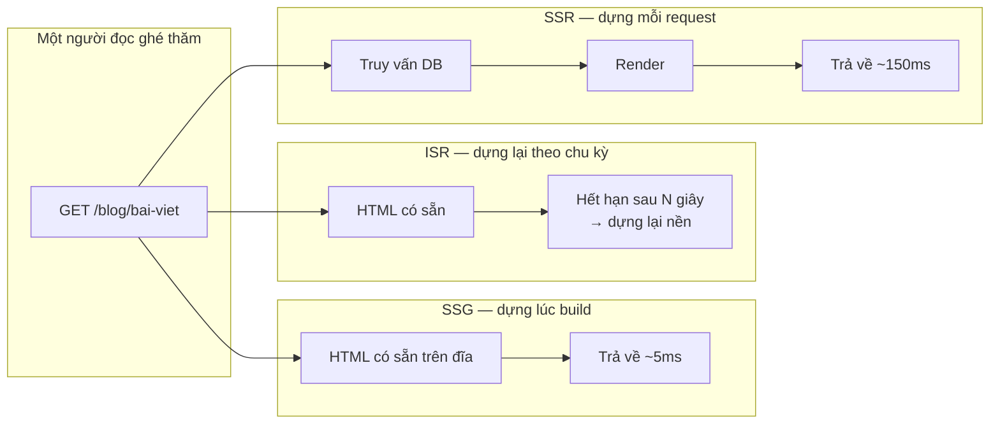
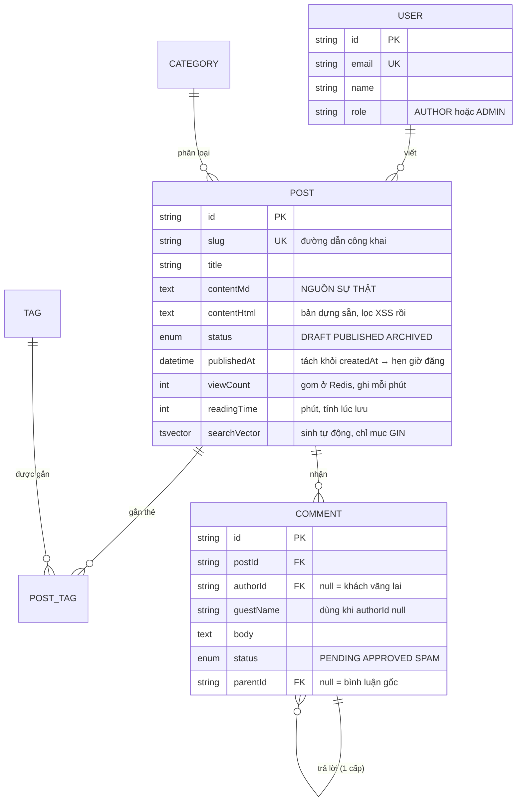
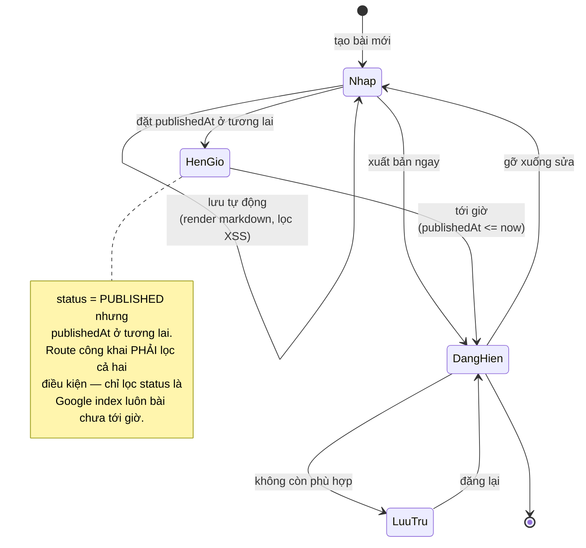

# Blog Platform (Markdown-based)

Dự án này trông giống Todo App nhưng giải một bài toán ngược hẳn. Todo App: một người dùng, nhiều lượt ghi, ít lượt đọc. Blog: **rất nhiều lượt đọc, rất ít lượt ghi, và người đọc phần lớn không đăng nhập**.

Sự đảo ngược đó đổi mọi ưu tiên. Chuyện quan trọng bây giờ không còn là "ai được sửa cái gì" mà là: trang tải nhanh cỡ nào, Google có đọc được không, và làm sao để một bài viết đã xuất bản không phải dựng lại từ database mỗi lần có người ghé thăm.

Đây cũng là dự án đầu tiên bạn phải xử lý **nội dung do người dùng nhập** một cách nghiêm túc. Markdown cho phép nhúng HTML, và HTML cho phép nhúng `<script>`. Nếu bạn render thẳng những gì người viết gõ vào, bạn vừa xây một cổng XSS.

---

## Bạn sẽ dựng ra cái gì

- Soạn bài bằng Markdown, xem trước ngay bên cạnh
- Bản nháp / đã xuất bản / hẹn giờ đăng
- Danh mục và thẻ, trang lưu trữ theo tháng
- Bình luận có kiểm duyệt
- Tìm kiếm toàn văn
- SEO: sitemap, RSS, thẻ Open Graph, dữ liệu có cấu trúc
- Điểm Lighthouse trên 95 ở cả bốn hạng mục

---

## Ba chiến lược render, và cách chọn

Đây là quyết định kiến trúc lớn nhất của dự án, và Next.js cho bạn cả ba trong cùng một codebase.



| Chiến lược | Dùng cho | Vì sao |
|---|---|---|
| **SSG** | Trang giới thiệu, trang danh mục cố định | Nhanh nhất có thể, nhưng phải build lại khi nội dung đổi |
| **ISR** | Bài viết, danh sách bài | Nhanh như SSG, tự làm mới sau N giây — đúng nhu cầu của blog |
| **SSR** | Trang quản trị, kết quả tìm kiếm | Dữ liệu phải mới tuyệt đối, và không cần cache |

Với blog, **ISR là câu trả lời mặc định**. Bài viết thay đổi hiếm; người đọc không cần thấy thay đổi trong vòng một giây; và mỗi lượt đọc không nên tốn một truy vấn database.

```tsx
// src/app/blog/[slug]/page.tsx
export const revalidate = 60;   // dựng lại tối đa mỗi 60 giây

// generateStaticParams cho Next.js biết những slug nào cần dựng sẵn
// lúc build. Bài viết mới xuất hiện sau đó vẫn hoạt động — Next.js
// dựng nó ở lần truy cập đầu tiên rồi cache lại.
export async function generateStaticParams() {
  const posts = await prisma.post.findMany({
    where: { status: 'PUBLISHED' },
    select: { slug: true },
    take: 100,          // chỉ dựng sẵn 100 bài mới nhất
    orderBy: { publishedAt: 'desc' },
  });
  return posts.map((p) => ({ slug: p.slug }));
}
```

Con số `take: 100` là một đánh đổi có chủ ý: dựng sẵn toàn bộ 5.000 bài khiến mỗi lần build mất 20 phút, trong khi 95% lượt truy cập rơi vào vài chục bài mới nhất. Những bài cũ vẫn hoạt động, chỉ trả chậm hơn ở lượt đọc đầu tiên.

---

## Markdown và cửa sau XSS

Đây là phần quan trọng nhất của dự án. Rất nhiều blog tự viết có lỗ hổng này.

```ts
// src/lib/markdown.ts
import { unified } from 'unified';
import remarkParse from 'remark-parse';
import remarkGfm from 'remark-gfm';
import remarkRehype from 'remark-rehype';
import rehypeRaw from 'rehype-raw';
import rehypeSanitize, { defaultSchema } from 'rehype-sanitize';
import rehypeSlug from 'rehype-slug';
import rehypeHighlight from 'rehype-highlight';
import rehypeStringify from 'rehype-stringify';

// Danh sách CHO PHÉP, không phải danh sách CẤM.
//
// Danh sách cấm luôn thiếu: bạn cấm <script>, kẻ tấn công dùng
// . Bạn cấm onerror, họ dùng <svg onload>.
// Bạn không bao giờ liệt kê hết được. Danh sách cho phép thì
// ngược lại — thứ gì không có trong danh sách đều bị loại.
const schema = {
  ...defaultSchema,
  tagNames: [
    ...(defaultSchema.tagNames ?? []),
    'figure', 'figcaption', 'mark', 'kbd',
  ],
  attributes: {
    ...defaultSchema.attributes,
    // target="_blank" phải đi kèm rel="noopener": thiếu nó, trang
    // đích đọc được window.opener và có thể chuyển hướng tab gốc
    // sang trang lừa đảo (tabnabbing).
    a: [...(defaultSchema.attributes?.a ?? []), 'target', 'rel'],
    code: [['className', /^language-./]],
    img: [...(defaultSchema.attributes?.img ?? []), 'loading', 'width', 'height'],
  },
};

export async function renderMarkdown(md: string): Promise<string> {
  const file = await unified()
    .use(remarkParse)
    .use(remarkGfm)                       // bảng, checkbox, gạch ngang
    .use(remarkRehype, { allowDangerousHtml: true })
    .use(rehypeRaw)                       // cho phép HTML thô trong markdown...
    .use(rehypeSanitize, schema)          // ...rồi LỌC NGAY sau đó
    .use(rehypeSlug)                      // id cho heading → mục lục, neo link
    .use(rehypeHighlight)
    .use(rehypeStringify)
    .process(md);
  return String(file);
}
```

Thứ tự `rehypeRaw` rồi `rehypeSanitize` là điểm mấu chốt và rất dễ đảo ngược nhầm. Đảo lại thì bạn lọc trước khi phân tích HTML thô, và mọi thứ nguy hiểm đi thẳng vào trang.

Một quy tắc nữa: **render Markdown ở server, lưu HTML đã lọc vào database.** Không phải để nhanh — mà vì nếu sáu tháng sau bạn phát hiện lỗ hổng trong bộ lọc, bạn chỉ cần chạy lại một lần trên toàn bộ bài viết. Nếu lọc ở client, mỗi trình duyệt của mỗi người đọc là một chỗ phải vá.

---

## Lược đồ dữ liệu



Vòng đời một bài viết — chú ý `PUBLISHED` không đồng nghĩa với "đang hiện":



```prisma
model Post {
  id          String     @id @default(cuid())
  slug        String     @unique
  title       String
  excerpt     String?    @db.Text
  // Nguồn sự thật là Markdown; HTML là bản dựng sẵn có thể tạo lại
  // bất cứ lúc nào. Giữ cả hai: sửa bài thì sửa markdown, còn
  // đọc bài thì đọc html.
  contentMd   String     @db.Text
  contentHtml String     @db.Text

  status      PostStatus @default(DRAFT)
  // publishedAt tách khỏi createdAt để làm được hẹn giờ đăng: bài
  // có status PUBLISHED nhưng publishedAt ở tương lai thì chưa hiện.
  publishedAt DateTime?

  // Bộ đếm phi chuẩn hoá, cập nhật bất đồng bộ. Đọc bài không được
  // chờ một lệnh UPDATE.
  viewCount   Int        @default(0)
  readingTime Int        @default(1)   // phút, tính lúc lưu

  authorId    String
  author      User       @relation(fields: [authorId], references: [id])
  categoryId  String?
  category    Category?  @relation(fields: [categoryId], references: [id])
  tags        PostTag[]
  comments    Comment[]

  createdAt   DateTime   @default(now())
  updatedAt   DateTime   @updatedAt

  // Chỉ mục cho truy vấn phổ biến nhất: "bài đã đăng, mới nhất trước".
  @@index([status, publishedAt])
  @@map("posts")
}

enum PostStatus { DRAFT PUBLISHED ARCHIVED }

model Comment {
  id        String        @id @default(cuid())
  postId    String
  post      Post          @relation(fields: [postId], references: [id], onDelete: Cascade)

  // Bình luận cho phép khách vãng lai: authorId null thì dùng
  // guestName. Cho phép khách bình luận tăng tương tác, nhưng
  // cũng mở cửa cho spam — nên mặc định là PENDING.
  authorId  String?
  guestName String?       @db.VarChar(80)
  body      String        @db.Text
  status    CommentStatus @default(PENDING)

  // Bình luận lồng nhau một cấp. Lồng vô hạn nghe hay nhưng
  // hiển thị thành thảm hoạ trên màn hình điện thoại.
  parentId  String?
  parent    Comment?      @relation("Replies", fields: [parentId], references: [id], onDelete: Cascade)
  replies   Comment[]     @relation("Replies")

  createdAt DateTime      @default(now())

  @@index([postId, status, createdAt])
  @@map("comments")
}

enum CommentStatus { PENDING APPROVED SPAM }
```

---

## Tìm kiếm toàn văn không cần Elasticsearch

Phản xạ thường gặp là cài Elasticsearch. Với một blog dưới 10.000 bài, Postgres tự làm được, và bạn tiết kiệm được một dịch vụ phải vận hành.

```sql
-- Cột tsvector sinh tự động, cập nhật cùng lúc với dòng dữ liệu.
-- Trọng số A cho tiêu đề, B cho tóm tắt, C cho nội dung: kết quả
-- khớp tiêu đề xếp trên kết quả chỉ khớp trong thân bài.
ALTER TABLE posts ADD COLUMN search_vector tsvector
  GENERATED ALWAYS AS (
    setweight(to_tsvector('simple', coalesce(title, '')), 'A') ||
    setweight(to_tsvector('simple', coalesce(excerpt, '')), 'B') ||
    setweight(to_tsvector('simple', coalesce(content_md, '')), 'C')
  ) STORED;

-- GIN là loại chỉ mục cho tìm kiếm toàn văn. Không có nó, mỗi lần
-- tìm là một lần quét toàn bảng.
CREATE INDEX posts_search_idx ON posts USING GIN (search_vector);
```

Chú ý cấu hình `'simple'` chứ không phải `'english'`. Bộ `english` thực hiện stemming theo tiếng Anh — nó biến "running" thành "run", rất tốt cho tiếng Anh nhưng vô nghĩa với tiếng Việt, và tệ hơn, nó loại bỏ các từ mà nó cho là "stop word" tiếng Anh. `simple` chỉ tách từ và chuyển chữ thường, hoạt động đúng với nội dung tiếng Việt.

---

## Bộ đếm lượt xem không được chặn trang

```ts
// Cách sai: người đọc chờ một lệnh UPDATE mới thấy bài.
await prisma.post.update({ where: { id }, data: { viewCount: { increment: 1 } } });
return post;

// Cách đúng: gom vào Redis, ghi xuống database mỗi phút.
// Người đọc không chờ gì cả.
redis.hincrby('post:views', postId, 1).catch(() => {});
return post;
```

Đây chính là mẫu hình đã gặp ở [URL Shortener](/projects/url-shortener-voi-analytics): tách đường ghi số liệu khỏi đường phục vụ người dùng. Lần này bạn gặp lại nó trong ngữ cảnh khác, và đó là dấu hiệu nó là một mẫu hình thật chứ không phải mẹo riêng của một dự án.

---

## SEO: bốn thứ bắt buộc

```tsx
// 1. Metadata động cho mỗi bài
export async function generateMetadata({ params }): Promise<Metadata> {
  const { slug } = await params;
  const post = await getPost(slug);
  if (!post) return { title: 'Không tìm thấy' };

  return {
    title: post.title,
    description: post.excerpt ?? undefined,
    openGraph: {
      title: post.title,
      description: post.excerpt ?? undefined,
      type: 'article',
      publishedTime: post.publishedAt?.toISOString(),
      images: [{ url: post.coverUrl ?? '/og-default.png', width: 1200, height: 630 }],
    },
    // Canonical URL: chống nội dung trùng lặp khi bài viết truy cập
    // được qua nhiều đường dẫn (có/không có dấu /, có tham số UTM).
    alternates: { canonical: `https://blog.example.com/blog/${post.slug}` },
  };
}
```

Ba thứ còn lại: `sitemap.xml` sinh động từ database, `robots.txt` chặn thư mục quản trị, và **JSON-LD** khai báo dữ liệu có cấu trúc kiểu `Article` — thứ khiến kết quả tìm kiếm hiện kèm ngày đăng và tên tác giả thay vì chỉ một dòng chữ xanh.

---

## Những cái bẫy đã được ghi lại

| Triệu chứng | Nguyên nhân thật | Cách sửa |
|---|---|---|
| Sửa bài xong trang vẫn cũ | ISR còn trong thời gian revalidate | Gọi `revalidatePath()` sau khi lưu |
| Alert JavaScript chạy trong bài viết | Sanitize trước rehypeRaw thay vì sau | Đảo đúng thứ tự plugin |
| Tìm tiếng Việt không ra kết quả | Dùng cấu hình `english` có stemming | Đổi sang `simple` |
| Build mất 20 phút | generateStaticParams dựng hết mọi bài | Giới hạn số bài dựng sẵn |
| Ảnh làm điểm Lighthouse tụt | Thiếu width/height nên trang nhảy layout | Bắt buộc kích thước trong bộ lọc |
| Google index cả trang nháp | Thiếu kiểm tra status ở route công khai | Lọc `status: PUBLISHED` và `publishedAt <= now` |
| Bình luận spam tràn ngập | Mặc định APPROVED | Mặc định PENDING, thêm honeypot |

---

## Khi nào coi như xong

- [ ] Lighthouse ≥ 95 ở cả bốn hạng mục trên bài viết thật
- [ ] Dán `` vào bài, xuất bản, không có gì chạy
- [ ] Tìm "lập trình" ra đúng bài có chữ đó, kể cả khi chữ nằm giữa câu
- [ ] Bài hẹn giờ đăng không truy cập được trước giờ, kể cả khi biết URL
- [ ] `curl -s /sitemap.xml | grep -c "<url>"` khớp số bài đã xuất bản
- [ ] Sửa bài rồi tải lại sau 2 giây, thấy nội dung mới

---

## Bước tiếp theo

1. **Bản tin email.** Người đọc đăng ký, mỗi bài mới gửi một email. Bài toán mới: hàng đợi gửi thư, xử lý bounce, và luật chống thư rác.
2. **Nhiều tác giả.** Ai được sửa bài của ai, ai được duyệt xuất bản — đây là bước đầu vào phân quyền theo vai trò, thứ mà [Learning Management System](/projects/learning-management-system) làm ở quy mô lớn hơn nhiều.
3. **Xuất bản theo Git.** Bài viết là file Markdown trong repo, push là xuất bản. Bạn mất giao diện soạn thảo nhưng được toàn bộ lịch sử phiên bản miễn phí.
