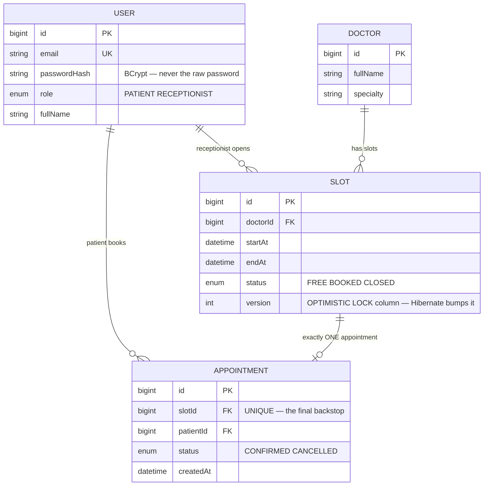
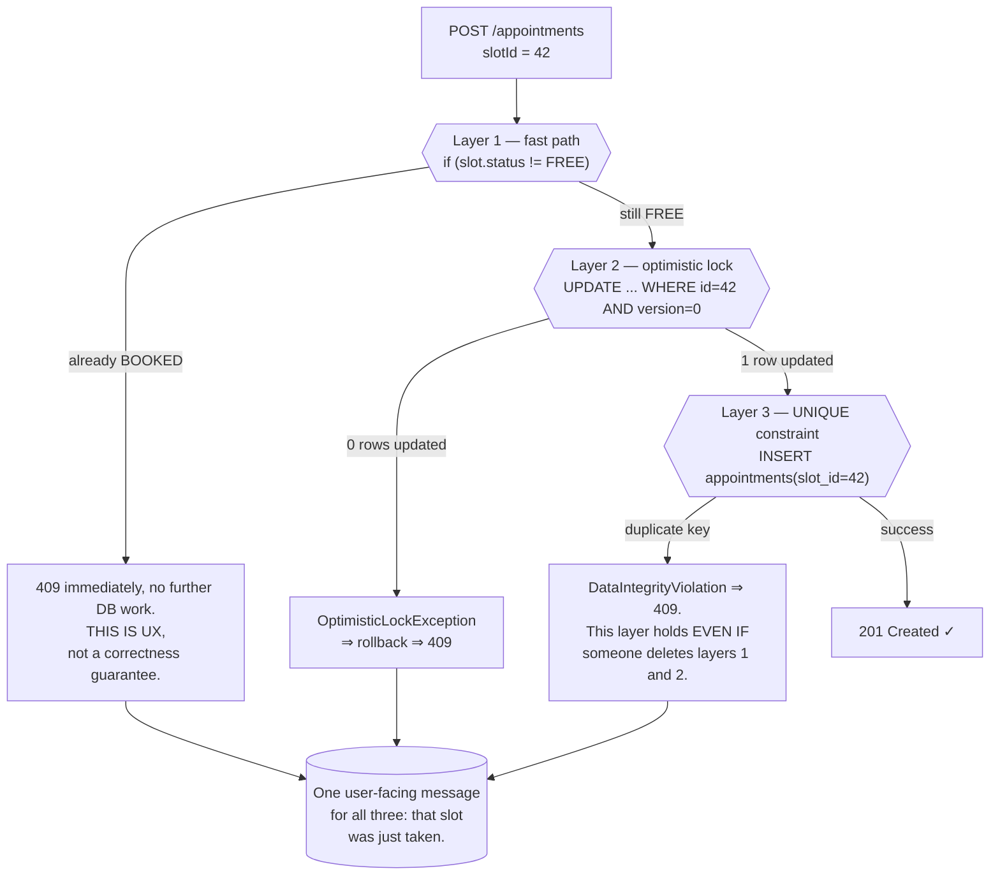
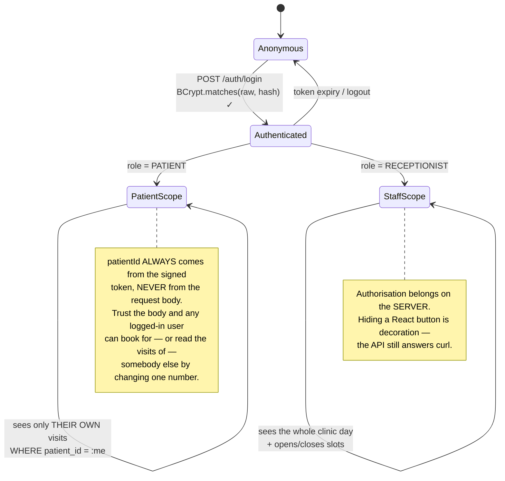

# Clinic Appointment Booking System

This is the opening project of **Semester 6 — Internship**, and it exists to teach one question that every internship interview asks in some disguise:

> *"Two patients tap Book in the same second. What happens?"*

The wrong answer — and it is almost everyone's first answer — is *"it's inside a transaction"*. A transaction gives you **all-or-nothing**; it does **not** make a read-then-write uninterruptible. Under the default `READ COMMITTED` isolation level, both threads happily read the slot as free before either one writes.

All ten Semester 6 projects circle that question, and each answers it with a **different mechanism**. This one is the first: **optimistic locking on a version column, with a `UNIQUE` constraint as the last line of defence.**

---

## What you will build

- A REST API in **Spring Boot 3 + Java 17**, persisted to **PostgreSQL** through Spring Data JPA
- A **React (Vite)** single-page app talking to it over axios
- Two roles: **Patient** (books and cancels their own visits) and **Receptionist** (opens slots, sees the whole clinic's day)
- **JWT** authentication with role checks enforced at the route layer
- A booking core that is **race-safe**: two simultaneous taps produce exactly one appointment and one clean `409`
- A **Docker Compose** deployment and a demo script you can record

> 📚 The step-by-step course version lives in the Academy: [**INT601 — Clinic Appointment Booking System**](/courses/clinic-appointment-booking-system) (10 sections, 22 lessons). This page is the *why*; the course is the *how*.

---

## Modelling: the slot is the thing being booked, not the doctor

The most common modelling mistake here is to hang the appointment straight off the doctor with a timestamp:

```
appointment(doctor_id, start_time, patient_id)   ❌
```

It works right up until you have to answer "is Dr. A free at 9:30 tomorrow?" — and you discover there is nothing to put a constraint on. You have to scan every appointment for that doctor and compare intervals in application code, and that comparison **is not atomic**.

The right move: **materialise the slot as a row**. The receptionist opens slots, a slot carries its own status, and an appointment points at exactly one slot.



Three decisions in that diagram are worth spelling out:

- **`SLOT` carries its own `status` instead of deriving it from "does an appointment exist".** A receptionist needs to close a slot because the doctor got called away, with nobody booked into it. `CLOSED` can express that; "no appointment row" cannot.
- **`APPOINTMENT.slotId` is `UNIQUE`.** That single line states the system's invariant once, in the schema: *at most one appointment per slot*. Not an `if` statement someone can forget.
- **`SLOT.version`** is an integer column Hibernate maintains for you. It is the main tool of this project.

---

## The race, at the SQL level

The naive read-then-write:

```java
@Transactional
public Appointment book(Long slotId, Long patientId) {
  Slot slot = slots.findById(slotId).orElseThrow(NotFoundException::new);
  if (slot.getStatus() != SlotStatus.FREE)     // (A) READ
    throw new ConflictException("Slot already booked");
  slot.setStatus(SlotStatus.BOOKED);           // (B) WRITE
  Appointment a = new Appointment();
  a.setSlot(slot);
  a.setPatient(users.getReference(patientId));
  return appts.save(a);
}
```

Reading that code, nothing looks wrong. The problem lives in the **gap between (A) and (B)**:

```mermaid
sequenceDiagram
    autonumber
    participant An as Patient An
    participant API as Spring Boot
    participant DB as PostgreSQL
    participant Binh as Patient Binh

    rect rgb(60, 20, 20)
    Note over An,Binh: No guard — slot 42 gets booked twice
    An->>API: POST /appointments {slotId: 42}
    API->>DB: SELECT * FROM slots WHERE id=42
    DB-->>API: status = FREE ✅
    Binh->>API: POST /appointments {slotId: 42}
    API->>DB: SELECT * FROM slots WHERE id=42
    DB-->>API: status = FREE ✅ (An has not committed!)
    API->>DB: UPDATE slots SET status='BOOKED' WHERE id=42
    API->>DB: INSERT INTO appointments (slot_id=42, patient=An)
    API->>DB: UPDATE slots SET status='BOOKED' WHERE id=42
    API->>DB: INSERT INTO appointments (slot_id=42, patient=Binh)
    Note over DB: TWO appointments for ONE slot ✗
    end
```



The point to hold on to: `@Transactional` **is present in that code** and the race still happens. A transaction guarantees that if step 2 fails, step 1 is rolled back. It does nothing to stop two transactions reading the same stale value.

---

## Three layers of defence, and why all three earn their place



The clean way to remember the division of labour:

| Layer | Protects against | On its own it is… |
|---|---|---|
| The `if` fast path | The common case: booked yesterday | **Unsafe** — it loses the race |
| `@Version` | Two threads overwriting slot status | Safe, but only for writes that go through JPA |
| `UNIQUE(slot_id)` | **Every** write path — import scripts, future maintainers | Absolutely safe, but ugly errors if unhandled |

The three are not redundant. They defend at **three different scopes**: layer 1 sees a session, layer 2 sees a transaction, layer 3 sees the entire lifetime of the database.

### How `@Version` wins the race

Hibernate appends a version predicate to the `UPDATE`. This is the SQL that actually runs:

```sql
-- An commits first
UPDATE slots SET status='BOOKED', version=1
 WHERE id=42 AND version=0;        -- → 1 row ✅

-- Binh is still holding the version=0 he read earlier
UPDATE slots SET status='BOOKED', version=1
 WHERE id=42 AND version=0;        -- → 0 rows!
-- Hibernate sees 0 rows affected → throws OptimisticLockException
-- → @Transactional rolls back → the web layer maps it to 409 Conflict
```

That is **compare-and-set**, the CPU primitive, written in SQL. The same idea returns in [Helpdesk Ticketing API](/projects/helpdesk-ticketing-api) as `UPDATE ... WHERE status='OPEN'`, and in [Gym Membership App](/projects/gym-membership-app) as `WHERE seats_left > 0`.

### The corrected service

```java
@Transactional
public Appointment book(Long slotId, Long patientId) {
  Slot slot = slots.findById(slotId).orElseThrow(NotFoundException::new);

  // Layer 1 — cheap, friendly, NOT a guarantee
  if (slot.getStatus() != SlotStatus.FREE)
    throw new ConflictException("Slot already booked");

  slot.setStatus(SlotStatus.BOOKED);   // Layer 2 — @Version guards this UPDATE

  Appointment a = new Appointment();
  a.setSlot(slot);
  a.setPatient(users.getReference(patientId));

  try {
    // saveAndFlush, NOT save: this forces the INSERT to run right here,
    // inside the try. save() may defer it until commit — at which point
    // the exception escapes the try block and you return 500, not 409.
    return appts.saveAndFlush(a);      // Layer 3 — UNIQUE(slot_id)
  } catch (DataIntegrityViolationException | OptimisticLockException e) {
    throw new ConflictException("Slot already booked");   // → 409
  }
}
```

The `saveAndFlush`-versus-`save` detail is the kind of bug that only surfaces once you **actually run a concurrency test**. Read side by side, the two calls look interchangeable.

---

## Proving it: the test that clicking around cannot replace

You cannot tap twice in the same millisecond by hand. A concurrency test is the **only** evidence that the booking core does its job:

```java
@Test
void twoPatientsAtOnce_exactlyOneWins() throws Exception {
  Long slotId = seedFreeSlot();
  int N = 20;
  var pool = Executors.newFixedThreadPool(N);
  var start = new CountDownLatch(1);          // a shared starting gun
  var ok = new AtomicInteger();
  var conflict = new AtomicInteger();

  for (int i = 0; i < N; i++) {
    long patientId = seedPatient(i);
    pool.submit(() -> {
      start.await();                          // 20 threads released together
      try { service.book(slotId, patientId); ok.incrementAndGet(); }
      catch (ConflictException e)            { conflict.incrementAndGet(); }
      return null;
    });
  }
  start.countDown();
  pool.shutdown();
  pool.awaitTermination(10, TimeUnit.SECONDS);

  assertThat(ok.get()).isEqualTo(1);           // EXACTLY one winner
  assertThat(conflict.get()).isEqualTo(N - 1); // everyone else gets a clean 409
  assertThat(appts.countBySlotId(slotId)).isEqualTo(1);
}
```

The `CountDownLatch` is the part that matters: spawn 20 threads and let them run as they are created, and the first usually finishes before the second starts — the test goes **green while proving nothing**. A shared starting gun forces all twenty into the contended window.

---

## Auth: where the silent bugs live

The JWT flow here is unremarkable, but two spots reliably cost students an afternoon:



- **Read `patientId` from the token, not the body.** This is IDOR, the same family as the lesson in [Todo List App](/projects/todo-list-app-full-stack). In a clinic it is far worse, because the data is medical.
- **A hidden button is not authorisation.** If `/slots` is only gated in React, a `curl` with a patient token still opens slots.

---

## Traps worth writing down

| Symptom | Actual cause | Fix |
|---|---|---|
| Two appointments on one slot | Read-then-write with only `@Transactional` | `@Version` + `UNIQUE(slot_id)` |
| Concurrency test green, production still double-books | The threads never actually overlapped | `CountDownLatch` as a shared starting gun |
| `500` instead of `409` on a duplicate | `save()` deferred the INSERT to commit, outside the `try` | `saveAndFlush()` |
| A patient can read someone else's appointment | `patientId` taken from the body | Take it from the signed JWT |
| A patient can call receptionist endpoints | Only the React button was hidden | Enforce the role at the route layer |
| Cannot close a slot when the doctor is away | Status derived from "does an appointment exist" | A real `status` column with `CLOSED` |
| Cancelling leaves the slot `BOOKED` | Forgot to release the slot in the same transaction | Cancel + reopen is **one** operation |
| Times off by hours between API and UI | Stored `LocalDateTime`; the browser reads it as local | Store `Instant`/`timestamptz`, convert at render time |
| Passwords in the logs | Logging the raw body of `/auth/login` | Redact sensitive fields before logging |
| Compose comes up but the API cannot reach the DB | Used `localhost` instead of the service name | The host is the compose service name, e.g. `db` |

---

## Done means

- [ ] A **20-thread** concurrency test on one slot: exactly **1** success, **19** clean `409`s
- [ ] Temporarily delete `@Version` and re-run: still exactly one appointment (proving the `UNIQUE` layer is really carrying weight)
- [ ] Patient A requests `GET /appointments/{id}` belonging to patient B: gets `404`, **not** `403`
- [ ] A patient token calling `POST /slots` via `curl`: gets `403`
- [ ] Cancelling an appointment returns the slot to `FREE` and it is immediately bookable again
- [ ] A receptionist closing a free slot makes it unbookable
- [ ] `docker compose up` on a clean machine: API + DB + web come up and a booking succeeds with **no** manual fixes
- [ ] Switch the host clock to UTC and reload: displayed times do **not** shift
- [ ] Grep the logs of one sign-in: **no** plaintext password anywhere

---

## Where to go next

1. **Same problem, constraint at a different level.** [Library Management System](/projects/library-management-system) swaps `UNIQUE` for a **partial unique index**, because one physical copy is borrowed and returned many times.
2. **When the booked thing is a range, not a point.** [Homestay Booking API](/projects/homestay-booking-api) replaces the constraint with `EXCLUDE USING gist` — overlapping dates cannot be expressed with `UNIQUE`.
3. **When contention stops being rare.** In [Event Ticketing System](/projects/event-ticketing-system), 10,000 people fight over one seat; optimistic locking loses and you need a lock outside Postgres.
4. **The same principle at scale.** [E-Commerce Platform](/projects/e-commerce-platform-multi-vendor) applies exactly this idea to inventory with `UPDATE ... WHERE stock >= qty`.
