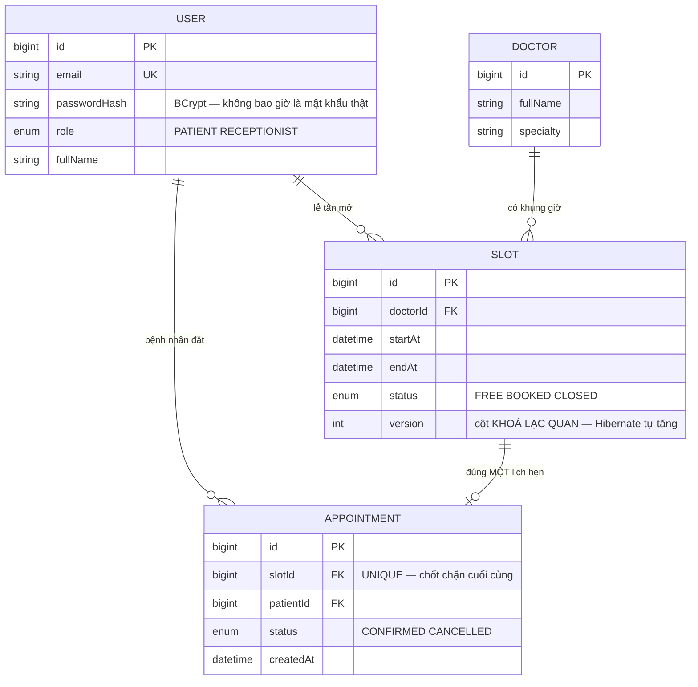
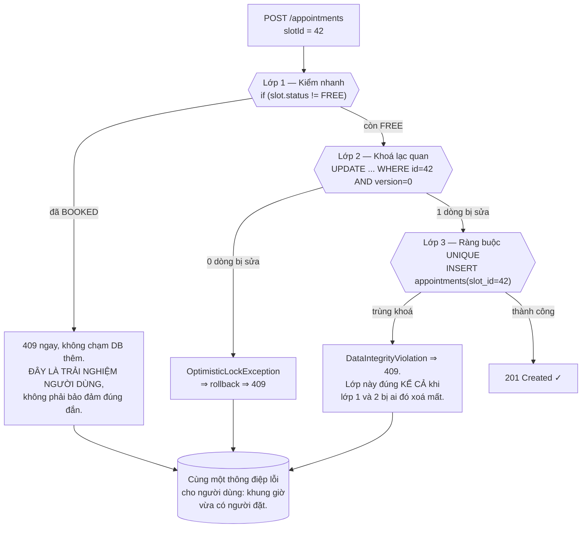
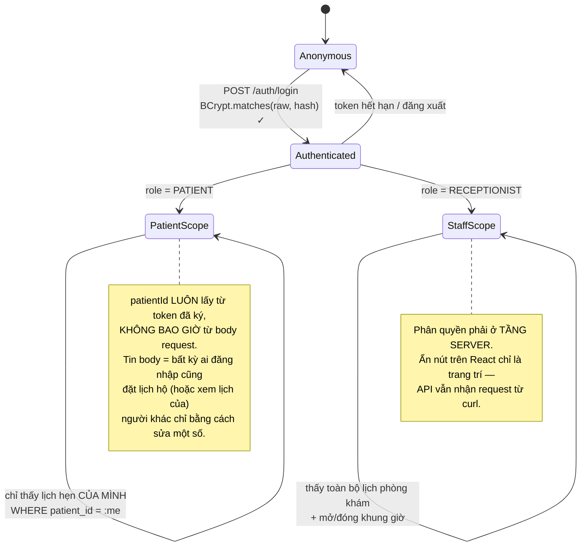

# Clinic Appointment Booking System

Đây là dự án mở màn của **Kỳ 6 — Thực tập**, và nó tồn tại để dạy đúng một câu hỏi mà mọi vòng phỏng vấn thực tập đều hỏi dưới một hình thức nào đó:

> *"Hai người bấm Đặt lịch cùng một giây. Chuyện gì xảy ra?"*

Câu trả lời sai — và là câu trả lời gần như ai cũng đưa ra lần đầu — là *"em bọc trong transaction rồi"*. Transaction cho bạn **tất-cả-hoặc-không-gì**, nó **không** khiến việc đọc rồi ghi trở thành một bước không thể chen ngang. Dưới mức cô lập mặc định `READ COMMITTED`, cả hai luồng đều đọc thấy khung giờ còn trống trước khi bất kỳ ai kịp ghi.

Cả mười đồ án Kỳ 6 đều xoay quanh câu hỏi đó, mỗi đồ án trả lời bằng **một cơ chế khác nhau**. Bài này là cơ chế đầu tiên: **khoá lạc quan bằng cột phiên bản, có ràng buộc `UNIQUE` làm chốt chặn cuối**.

---

## Bạn sẽ dựng ra cái gì

- REST API bằng **Spring Boot 3 + Java 17**, dữ liệu trong **PostgreSQL** qua Spring Data JPA
- Giao diện **React (Vite)** dạng SPA, gọi API bằng axios
- Hai vai trò: **Bệnh nhân** (đặt/huỷ lịch của mình) và **Lễ tân** (mở khung giờ, xem lịch cả phòng khám)
- Xác thực **JWT**, phân quyền theo vai trò ở tầng route
- Lõi đặt lịch **an toàn khi tranh chấp**: hai người bấm cùng lúc thì đúng một người thắng, người kia nhận `409`
- Đóng gói bằng **Docker Compose** và một kịch bản quay video demo

> 📚 Bản dạy từng bước của đồ án này nằm ở Academy: [**INT601 — Clinic Appointment Booking System**](/courses/clinic-appointment-booking-system) (10 mục, 22 bài). Bài dưới đây là phần *vì sao*, khoá học là phần *làm thế nào*.

---

## Mô hình nghiệp vụ: khung giờ là thứ được đặt, không phải bác sĩ

Sai lầm mô hình hoá phổ biến nhất ở đồ án này là gắn lịch hẹn thẳng vào bác sĩ kèm một mốc thời gian:

```
appointment(doctor_id, start_time, patient_id)   ❌
```

Nó chạy được cho tới lúc bạn phải trả lời "9:30 sáng mai bác sĩ A còn trống không?" — và bạn phát hiện mình không có thứ gì để đặt ràng buộc lên. Bạn phải quét toàn bộ lịch hẹn của bác sĩ đó và tự so khoảng thời gian trong mã ứng dụng, mà việc đó **không nguyên tử**.

Cách đúng: **hiện thực hoá khung giờ thành một hàng trong bảng**. Lễ tân mở khung giờ, khung giờ có trạng thái, và lịch hẹn trỏ tới đúng một khung giờ.



Ba quyết định trong sơ đồ trên đáng nói rõ:

- **`SLOT` có `status` riêng, không suy ra từ việc có lịch hẹn hay không.** Lễ tân cần đóng một khung giờ (bác sĩ bận đột xuất) mà không có ai đặt — trạng thái `CLOSED` biểu diễn được việc đó, còn "không có lịch hẹn" thì không.
- **`APPOINTMENT.slotId` là `UNIQUE`.** Đây là câu phát biểu bất biến của cả hệ thống, viết một lần vào schema: *một khung giờ có tối đa một lịch hẹn*. Không phải một câu `if` bạn có thể quên.
- **`SLOT.version`** là cột số nguyên Hibernate tự quản lý. Nó là công cụ chính của bài này.

---

## Cuộc đua: chuyện thật sự xảy ra ở tầng SQL

Phiên bản ngây thơ đọc rồi ghi:

```java
@Transactional
public Appointment book(Long slotId, Long patientId) {
  Slot slot = slots.findById(slotId).orElseThrow(NotFoundException::new);
  if (slot.getStatus() != SlotStatus.FREE)     // (A) ĐỌC
    throw new ConflictException("Khung giờ đã có người đặt");
  slot.setStatus(SlotStatus.BOOKED);           // (B) GHI
  Appointment a = new Appointment();
  a.setSlot(slot);
  a.setPatient(users.getReference(patientId));
  return appts.save(a);
}
```

Đọc mã này ai cũng thấy hợp lý. Vấn đề nằm ở **khoảng trống giữa (A) và (B)**:

```mermaid
sequenceDiagram
    autonumber
    participant An as Bệnh nhân An
    participant API as Spring Boot
    participant DB as PostgreSQL
    participant Binh as Bệnh nhân Bình

    rect rgb(60, 20, 20)
    Note over An,Binh: Không có bảo vệ — khung giờ 42 bị đặt hai lần
    An->>API: POST /appointments {slotId: 42}
    API->>DB: SELECT * FROM slots WHERE id=42
    DB-->>API: status = FREE ✅
    Binh->>API: POST /appointments {slotId: 42}
    API->>DB: SELECT * FROM slots WHERE id=42
    DB-->>API: status = FREE ✅ (An chưa commit!)
    API->>DB: UPDATE slots SET status='BOOKED' WHERE id=42
    API->>DB: INSERT INTO appointments (slot_id=42, patient=An)
    API->>DB: UPDATE slots SET status='BOOKED' WHERE id=42
    API->>DB: INSERT INTO appointments (slot_id=42, patient=Bình)
    Note over DB: HAI lịch hẹn cho MỘT khung giờ ✗
    end
```



Điểm mấu chốt: `@Transactional` **có mặt trong đoạn mã trên** và cuộc đua vẫn xảy ra. Transaction đảm bảo nếu bước 2 hỏng thì bước 1 được hoàn tác; nó không hề ngăn hai transaction cùng đọc một giá trị cũ.

---

## Ba lớp phòng thủ, và vì sao cần cả ba



Cách phân vai chuẩn để nhớ:

| Lớp | Bảo vệ khỏi | Nếu chỉ có một mình lớp này |
|---|---|---|
| Kiểm nhanh `if` | Trường hợp thường: khung giờ đã đặt từ hôm qua | **Không an toàn** — thua cuộc đua |
| `@Version` | Hai luồng ghi đè trạng thái khung giờ | An toàn, nhưng chỉ với các ghi đi qua JPA |
| `UNIQUE(slot_id)` | **Mọi** đường ghi, kể cả script nhập liệu, kể cả người sửa mã sau này | An toàn tuyệt đối, nhưng thông báo lỗi xấu nếu không bắt |

Ba lớp không phải là thừa. Chúng bảo vệ ở **ba tầm nhìn khác nhau**: lớp 1 nhìn thấy phiên làm việc, lớp 2 nhìn thấy transaction, lớp 3 nhìn thấy toàn bộ vòng đời của cơ sở dữ liệu.

### `@Version` thắng cuộc đua ra sao

Hibernate thêm điều kiện phiên bản vào câu `UPDATE`. Đây là SQL thật sự chạy:

```sql
-- An commit trước
UPDATE slots SET status='BOOKED', version=1
 WHERE id=42 AND version=0;        -- → 1 dòng ✅

-- Bình vẫn đang cầm version=0 đọc từ trước
UPDATE slots SET status='BOOKED', version=1
 WHERE id=42 AND version=0;        -- → 0 dòng!
-- Hibernate thấy 0 dòng bị sửa → ném OptimisticLockException
-- → @Transactional rollback → tầng web ánh xạ thành 409 Conflict
```

Đây chính là **so-sánh-rồi-hoán-đổi** (compare-and-set) mà bạn từng gặp ở CPU, chỉ khác là viết bằng SQL. Cùng một ý tưởng sẽ quay lại ở [Helpdesk Ticketing API](/projects/helpdesk-ticketing-api) dưới dạng `UPDATE ... WHERE status='OPEN'`, và ở [Gym Membership App](/projects/gym-membership-app) dưới dạng `WHERE seats_left > 0`.

### Bản sửa hoàn chỉnh

```java
@Transactional
public Appointment book(Long slotId, Long patientId) {
  Slot slot = slots.findById(slotId).orElseThrow(NotFoundException::new);

  // Lớp 1 — rẻ, thân thiện, KHÔNG phải bảo đảm
  if (slot.getStatus() != SlotStatus.FREE)
    throw new ConflictException("Khung giờ đã có người đặt");

  slot.setStatus(SlotStatus.BOOKED);   // Lớp 2 — @Version canh câu UPDATE này

  Appointment a = new Appointment();
  a.setSlot(slot);
  a.setPatient(users.getReference(patientId));

  try {
    // saveAndFlush, KHÔNG phải save: ép câu INSERT chạy NGAY trong
    // khối try này. save() có thể hoãn tới lúc commit — lúc đó
    // ngoại lệ bay ra ngoài khối try và bạn trả 500 thay vì 409.
    return appts.saveAndFlush(a);      // Lớp 3 — UNIQUE(slot_id)
  } catch (DataIntegrityViolationException | OptimisticLockException e) {
    throw new ConflictException("Khung giờ đã có người đặt");   // → 409
  }
}
```

Chi tiết `saveAndFlush` thay vì `save` là loại lỗi chỉ lộ ra khi bạn **thật sự chạy test đồng thời**. Đọc mã thì hai hàm trông như nhau.

---

## Chứng minh nó đúng: bài test mà việc bấm tay không thay được

Bạn không thể tự tay bấm hai lần trong cùng một mili giây. Bài test đồng thời là **bằng chứng duy nhất** rằng lõi đặt lịch làm đúng việc của nó:

```java
@Test
void haiNguoiDatCungLuc_ChiMotNguoiThang() throws Exception {
  Long slotId = seedFreeSlot();
  int N = 20;
  var pool = Executors.newFixedThreadPool(N);
  var start = new CountDownLatch(1);          // vạch xuất phát chung
  var ok = new AtomicInteger();
  var conflict = new AtomicInteger();

  for (int i = 0; i < N; i++) {
    long patientId = seedPatient(i);
    pool.submit(() -> {
      start.await();                          // 20 luồng cùng bung ra một lúc
      try { service.book(slotId, patientId); ok.incrementAndGet(); }
      catch (ConflictException e)            { conflict.incrementAndGet(); }
      return null;
    });
  }
  start.countDown();
  pool.shutdown();
  pool.awaitTermination(10, TimeUnit.SECONDS);

  assertThat(ok.get()).isEqualTo(1);          // ĐÚNG một người thắng
  assertThat(conflict.get()).isEqualTo(N - 1); // phần còn lại nhận 409 sạch sẽ
  assertThat(appts.countBySlotId(slotId)).isEqualTo(1);
}
```

`CountDownLatch` là chi tiết quyết định: nếu bạn chỉ mở 20 luồng rồi để chúng tự chạy, luồng đầu tiên thường xong trước khi luồng thứ hai kịp bắt đầu, và bài test **xanh mà không chứng minh được gì**. Vạch xuất phát chung ép cả 20 cùng vào vùng tranh chấp.

---

## Xác thực: nơi bug im lặng thường nằm

Luồng JWT của đồ án này không có gì lạ, nhưng có hai chỗ sinh viên hay mất buổi để tìm ra:



- **Lấy `patientId` từ token, không từ body.** Đây là lỗ hổng IDOR, cùng họ với bài học ở [Todo List App](/projects/todo-list-app-full-stack). Ở phòng khám nó nghiêm trọng hơn nhiều vì dữ liệu là hồ sơ y tế.
- **Ẩn nút không phải là phân quyền.** Nếu `/slots` chỉ chặn ở React, một lệnh `curl` với token bệnh nhân vẫn mở được khung giờ.

---

## Những cái bẫy đã được ghi lại

| Triệu chứng | Nguyên nhân thật | Cách sửa |
|---|---|---|
| Hai lịch hẹn cùng một khung giờ | Đọc-rồi-ghi, chỉ có `@Transactional` | `@Version` + `UNIQUE(slot_id)` |
| Test đồng thời luôn xanh nhưng bug vẫn có trên prod | Các luồng không thật sự chạy cùng lúc | `CountDownLatch` làm vạch xuất phát chung |
| Trả `500` thay vì `409` khi trùng | `save()` hoãn INSERT tới lúc commit, ngoại lệ bay ra ngoài `try` | `saveAndFlush()` |
| Bệnh nhân xem được lịch hẹn của người khác | `patientId` đọc từ body | Lấy từ JWT đã ký |
| Bệnh nhân gọi được API của lễ tân | Chỉ ẩn nút ở React | Chặn theo vai trò ở tầng route |
| Không đóng được khung giờ bác sĩ bận | Suy ra trạng thái từ "có lịch hẹn hay không" | Cột `status` riêng, có `CLOSED` |
| Huỷ lịch xong khung giờ vẫn `BOOKED` | Quên trả trạng thái về `FREE` trong cùng transaction | Huỷ và mở lại khung giờ là **một** thao tác |
| Múi giờ lệch 7 tiếng giữa API và giao diện | Lưu `LocalDateTime`, trình duyệt hiểu là giờ địa phương | Lưu `Instant`/`timestamptz`, đổi múi giờ ở tầng hiển thị |
| Mật khẩu lộ trong log | Ghi log cả body của `/auth/login` | Lọc trường nhạy cảm trước khi log |
| Docker Compose lên nhưng API không nối được DB | Dùng `localhost` thay tên service | Host là tên service trong compose, ví dụ `db` |

---

## Khi nào coi như xong

- [ ] Test đồng thời **20 luồng** vào cùng một khung giờ: đúng **1** thành công, **19** nhận `409`
- [ ] Xoá tạm `@Version` khỏi entity, chạy lại test: vẫn đúng 1 lịch hẹn (chứng minh lớp `UNIQUE` thật sự đang gánh)
- [ ] Bệnh nhân A gọi `GET /appointments/{id}` của bệnh nhân B: nhận `404`, **không** phải `403`
- [ ] Token bệnh nhân gọi `POST /slots` bằng `curl`: nhận `403`
- [ ] Huỷ lịch hẹn: khung giờ quay lại `FREE` và đặt lại được ngay
- [ ] Lễ tân đóng khung giờ đang trống: bệnh nhân không đặt được nữa
- [ ] `docker compose up` từ máy trắng: API + DB + web lên và đặt được lịch, **không** phải sửa gì bằng tay
- [ ] Đổi múi giờ máy sang UTC rồi mở lại giao diện: giờ hiển thị **không** lệch
- [ ] Grep toàn bộ log của một lần đăng nhập: **không** thấy mật khẩu thô

---

## Bước tiếp theo

1. **Cùng bài toán, ràng buộc ở tầng khác.** [Library Management System](/projects/library-management-system) đổi `UNIQUE` thành **chỉ mục UNIQUE bộ phận**, vì một cuốn sách được mượn và trả nhiều lần trong đời.
2. **Khi thứ được đặt là một khoảng, không phải một điểm.** [Homestay Booking API](/projects/homestay-booking-api) thay ràng buộc bằng `EXCLUDE USING gist` — bài toán chồng ngày không giải được bằng `UNIQUE`.
3. **Khi tranh chấp không còn hiếm.** Ở [Event Ticketing System](/projects/event-ticketing-system), 10.000 người tranh một ghế; khoá lạc quan sẽ thua và bạn cần khoá ngoài Postgres.
4. **Cùng nguyên tắc ở quy mô lớn.** [E-Commerce Platform](/projects/e-commerce-platform-multi-vendor) áp đúng ý tưởng này lên tồn kho bằng `UPDATE ... WHERE stock >= qty`.
