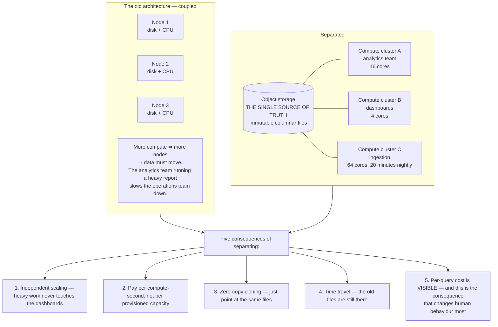
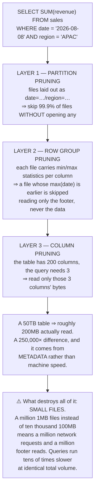
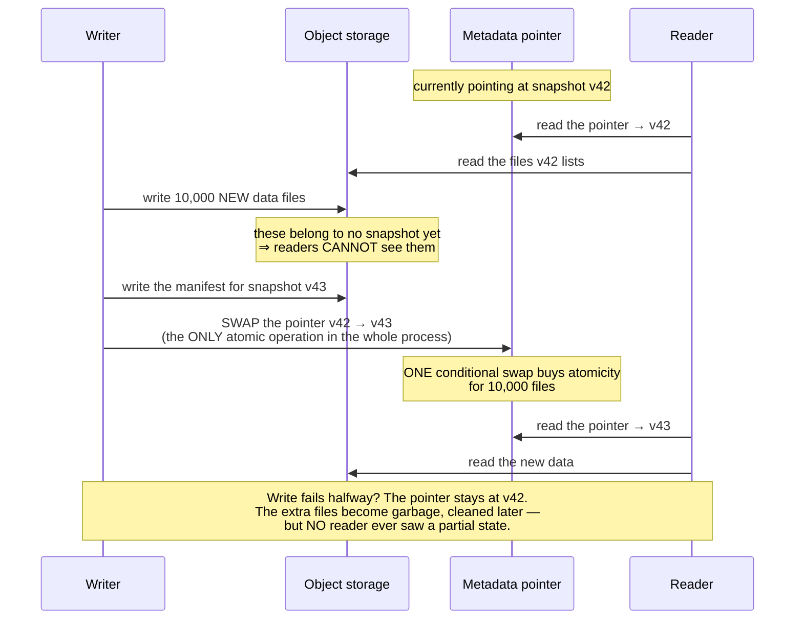
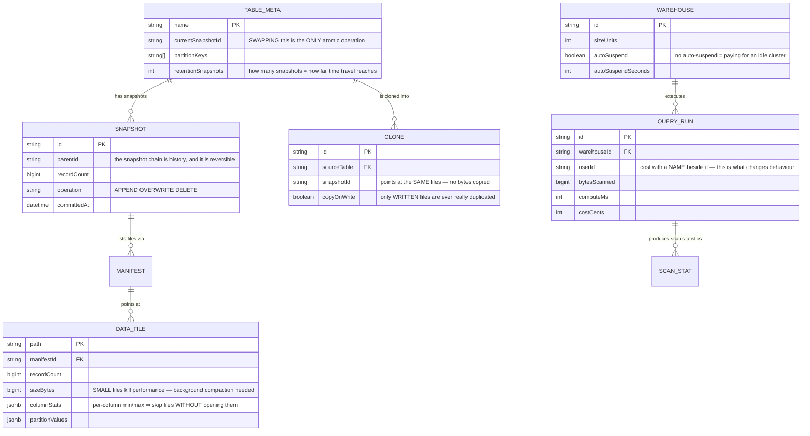

# Cloud-native Data Platform (Snowflake-like)

In [Real-Time Analytics Platform](/projects/realtime-analytics-platform) you built a system answering aggregate queries in under 100ms — but data and compute were **welded together**: more processing power meant more nodes, and more nodes meant moving data.

This project separates them, and one idea carries everything else:

**Data lives in object storage. Compute is stateless clusters, started when needed and stopped when finished.**

The consequences run further than you might expect. Including one that is uncomfortable: **the cost of a bad query becomes visible, with somebody's name next to it.**

---

## What you will build

- Storage on object storage in an open columnar format
- Multiple independent compute clusters over **the same** data
- Predicate pushdown, column pruning and partition pruning
- Zero-copy cloning and time travel
- Atomic transactions on object storage
- Per-query cost accounting with attribution

---

## Separating storage and compute: one decision, five consequences

The third deserves a pause because it is counter-intuitive: cloning a 50TB table takes **milliseconds**, because no data bytes are copied — a new metadata set simply points at the same immutable files. Developers get a full copy of production data to experiment with, and it costs almost nothing until they start **writing** to it.

This works entirely because the files are immutable — the append-only principle again, its seventh appearance in this roadmap, in yet another guise.

---

## Columnar formats and three layers of pruning

Data on object storage must be columnar — you know why from [Real-Time Analytics Platform](/projects/realtime-analytics-platform). What is new here is that **files must carry metadata about themselves**, so the compute layer knows which files it can avoid reading.

The small-file problem is the most common operational failure of this architecture, and it **creates itself**: streaming ingestion writing one file per minute leaves 43,200 small files per table after a month. A background compaction process is mandatory — and you met exactly this compaction step in [Distributed Search Engine](/projects/distributed-search-engine) and [Message Broker](/projects/distributed-message-broker-kafka-like).

---

## Transactions on object storage

Object storage has no transactions. No locks, no `BEGIN`. So how does a write of 10,000 files either fully succeed or leave no trace?

The answer is a **metadata pointer**, and it is an elegant trick:

The entire atomicity of this system rests on **one** conditional pointer swap. Everything else is ordinary file writing.

And because old snapshots persist, you get **time travel** almost free: reading the data as of 9am is just pointing at that snapshot. Recovering from somebody's mistaken `DELETE` is a pointer swap, not a restore from backup.

---

## The data model

`QUERY_RUN.userId` next to `costCents` is the column with the strongest influence on human behaviour in this whole schema. When every query carries a monetary figure and a name, `SELECT *` on a 50TB table stops happening — not because anyone forbade it, but because it is visible.

`WAREHOUSE.autoSuspend` prevents a classic billing incident: a 64-core cluster started for one query and **never stopped**, idling through a weekend.

---

## Cost is a feature, not a report

This is what makes the architecture organisationally different, not merely technically.

In a coupled system, cost is a monthly infrastructure bill nobody can attribute to a query. Here, every query records bytes scanned and compute seconds, so **cost attributes to a statement, a person, a dashboard**.

Four things worth doing with that information:

1. **Show query authors an estimated cost before running**, rather than after the invoice.
2. **Set per-team budgets**, and make them **actually block** — as in [AI Chatbot Platform](/projects/ai-chatbot-platform-multi-tenant), checking after execution is far too late.
3. **Alert when a query scans past a threshold**, because it is almost always a missing partition predicate.
4. **Rank the most expensive queries weekly** and review them — usually a handful account for most of the bill.

---

## Traps worth recording

| Symptom | Actual cause | Fix |
|---|---|---|
| Queries slowing while data barely grows | The self-creating small-file problem | A background compaction process |
| Full-table scans despite a date predicate | The predicate does not match the partition column | Partition by columns people actually filter on |
| Predicate pushdown achieving nothing | Files carry no min/max statistics | Write column statistics into the footer |
| Bills spiking over weekends | A cluster started and never stopped | Auto-suspend after idle time |
| One query costing a month of operations | No pre-execution budget check | Estimate before running, budgets that block |
| The analytics team slowing the dashboards | Sharing one compute cluster | A separate cluster per workload |
| Readers seeing partial data | Writing directly over files being read | Write new files, swap the pointer last |
| A failed write leaving an inconsistent table | No snapshots or manifests | A metadata pointer with conditional swap |
| A mistaken `DELETE` losing data | Old snapshots not retained | Time travel, swap the pointer back |
| Storage bloating from old snapshots | Snapshots retained indefinitely | A retention window, then delete unreferenced files |
| Cloning for testing taking all day | Copying real bytes | Zero-copy cloning, duplicating only metadata |
| Two writers, one losing data | An unconditional pointer swap | Conditional swap on version, retry on loss |

---

## When it is genuinely done

- [ ] A partition-filtered query on a 10TB table: scans under **1%** of total volume
- [ ] `EXPLAIN` reports exactly how many files each pruning layer eliminated
- [ ] A 3-column query on a 200-column table: bytes read approximate the 3/200 ratio
- [ ] Clone a 1TB table: completes in under **1 second** with storage usage **unchanged**
- [ ] Write to the clone: the source table is **unaffected**, and only written files duplicate
- [ ] Kill a writer mid-commit: readers **never** observe partial data
- [ ] Two writers on one table: one succeeds, the other **retries**, nothing is lost
- [ ] Delete by mistake then recover via time travel: data matches **row for row**
- [ ] Two compute clusters running concurrently: the heavy one does **not** affect the light one's latency
- [ ] An idle cluster: auto-suspends within its configured window and cost drops to zero
- [ ] Every query reports bytes scanned, compute seconds, cost, and **who ran it**
- [ ] Stream-ingest for 24 hours then query: performance has **not** degraded (compaction works)

---

## Where to go next

1. **Federated queries.** One statement spanning data here and hot data in [Real-Time Analytics Platform](/projects/realtime-analytics-platform).
2. **Open table formats.** Adopt a standard so other engines read the same data — turning the warehouse from a product into a layer.
3. **Cross-organisation data sharing.** Grant read access to files directly rather than exporting and sending. But the permission model must live in the query, exactly as [Job Board Platform](/projects/job-board-platform-linkedin-like) showed.
4. **The storage layer underneath.** The bottom tier is the [Cloud Storage System](/projects/cloud-storage-system-s3-like) you already built — and its durability is this warehouse's durability.
