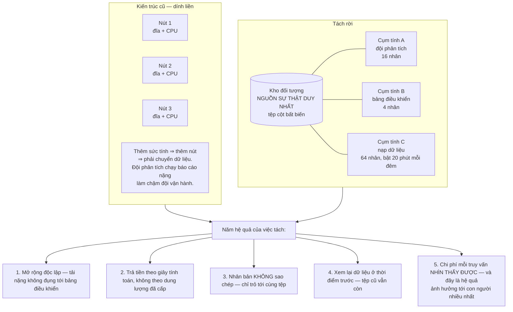
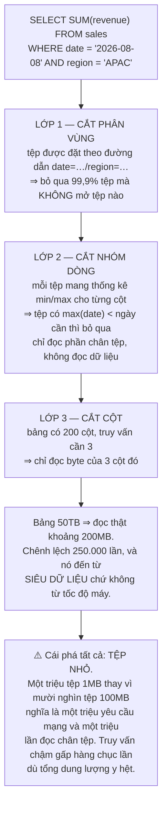
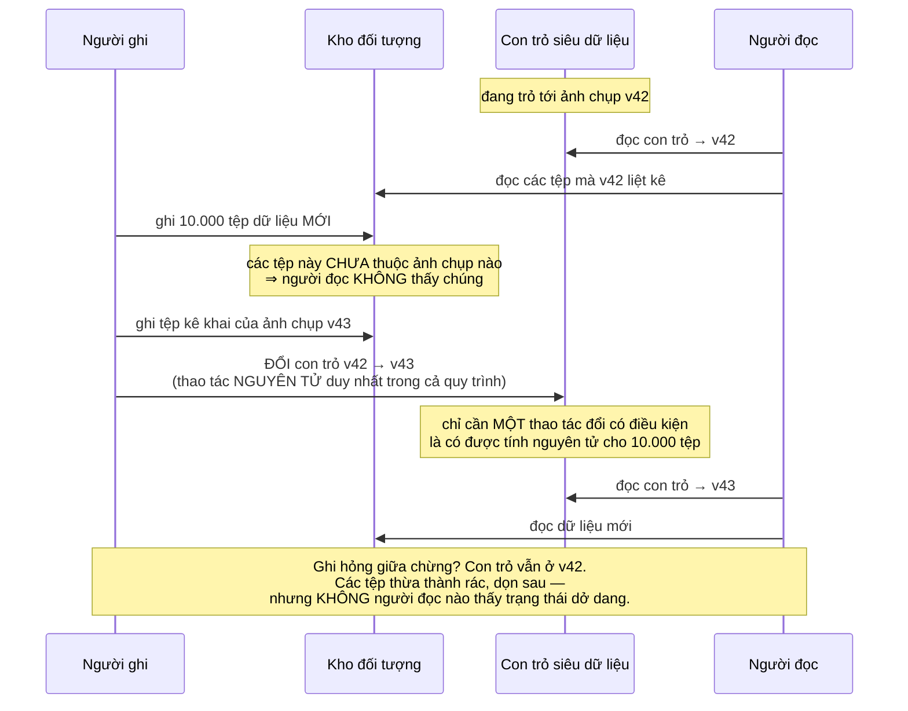
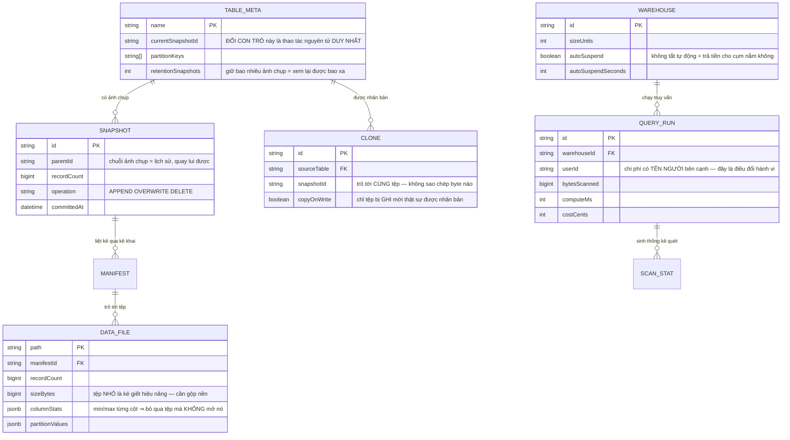

# Cloud-native Data Platform (Snowflake-like)

Ở [Real-Time Analytics Platform](/projects/realtime-analytics-platform), bạn đã dựng một hệ thống trả lời truy vấn tổng hợp trong dưới 100ms — nhưng dữ liệu và khả năng tính toán **dính chặt vào nhau**: muốn thêm sức tính thì phải thêm nút, mà thêm nút thì phải chuyển dữ liệu.

Dự án này tách hai thứ đó ra, và một ý tưởng duy nhất kéo theo mọi thứ còn lại:

**Dữ liệu nằm ở kho đối tượng. Tính toán là các cụm không giữ trạng thái, dựng lên khi cần và tắt đi khi xong.**

Hệ quả thì nhiều hơn bạn nghĩ. Bao gồm cả một hệ quả gây khó chịu: **chi phí của một truy vấn tồi bỗng nhìn thấy được, và có tên người viết bên cạnh.**

---

## Bạn sẽ dựng ra cái gì

- Lưu trữ trên kho đối tượng theo định dạng cột mở
- Nhiều cụm tính toán độc lập trên **cùng một** dữ liệu
- Đẩy phép lọc xuống tầng lưu trữ, cắt cột và cắt phân vùng
- Nhân bản không sao chép, và xem lại dữ liệu ở thời điểm trước
- Giao dịch có tính nguyên tử trên kho đối tượng
- Tính chi phí theo từng truy vấn, có quy trách nhiệm

---

## Tách lưu trữ khỏi tính toán: một quyết định, năm hệ quả

Hệ quả thứ ba đáng dừng lại vì nó phản trực giác: nhân bản một bảng 50TB tốn **vài mili giây**, vì không có byte dữ liệu nào được sao chép — chỉ tạo một tập siêu dữ liệu mới trỏ tới cùng những tệp bất biến. Đội phát triển có bản sao đầy đủ của dữ liệu thật để thử nghiệm, và nó gần như không tốn gì cho tới khi họ bắt đầu **ghi** vào đó.

Việc này khả thi hoàn toàn nhờ tính bất biến của tệp — lại là nguyên tắc chỉ-ghi-thêm, lần thứ bảy trong lộ trình, ở một hình thức nữa.

---

## Định dạng cột và ba lớp cắt bỏ

Dữ liệu trên kho đối tượng phải ở định dạng cột — bạn đã biết vì sao từ [Real-Time Analytics Platform](/projects/realtime-analytics-platform). Cái mới ở đây là **tệp phải mang theo siêu dữ liệu về chính nó**, để tầng tính toán biết tệp nào **không cần đọc**.

Bài toán tệp nhỏ là sự cố vận hành phổ biến nhất của kiến trúc này, và nó **tự sinh ra**: nạp dữ liệu theo dòng thời gian thực mỗi phút một tệp thì sau một tháng bạn có 43.200 tệp nhỏ cho một bảng. Phải có tiến trình nền gộp chúng lại — và bạn đã gặp đúng bước gộp này ở [Distributed Search Engine](/projects/distributed-search-engine) và [Message Broker](/projects/distributed-message-broker-kafka-like).

---

## Giao dịch trên kho đối tượng

Kho đối tượng không có giao dịch. Không có khoá, không có `BEGIN`. Vậy làm sao để một lệnh ghi 10.000 tệp hoặc thành công trọn vẹn, hoặc không có gì xảy ra?

Lời giải là **con trỏ siêu dữ liệu**, và nó là một mẹo đẹp:

Toàn bộ tính nguyên tử của hệ thống nằm ở **một** thao tác đổi con trỏ có điều kiện. Mọi thứ khác chỉ là ghi tệp bình thường.

Và vì các ảnh chụp cũ vẫn còn, bạn có **xem lại thời điểm trước** gần như miễn phí: đọc dữ liệu như lúc 9 giờ sáng chỉ là trỏ vào ảnh chụp lúc đó. Khôi phục sau khi có người chạy nhầm `DELETE` là đổi con trỏ về, không phải phục hồi từ bản sao lưu.

---

## Dữ liệu

`QUERY_RUN.userId` cạnh `costCents` là cột có ảnh hưởng tới hành vi con người mạnh nhất trong toàn bộ lược đồ. Khi mỗi truy vấn có một con số tiền và một cái tên, `SELECT *` trên bảng 50TB thôi xảy ra — không phải vì có ai cấm, mà vì nó nhìn thấy được.

`WAREHOUSE.autoSuspend` chống một sự cố hoá đơn kinh điển: một cụm 64 nhân bật lên cho một truy vấn rồi **không ai tắt**, chạy không suốt cuối tuần.

---

## Chi phí là một tính năng, không phải một báo cáo

Đây là điều làm kiến trúc này khác về mặt tổ chức chứ không chỉ về mặt kỹ thuật.

Ở hệ thống dính liền, chi phí là một hoá đơn hạ tầng hằng tháng — không ai quy được cho truy vấn nào. Ở đây, mỗi truy vấn có số byte đã quét và số giây tính toán, nên **chi phí quy được về từng câu lệnh, từng người, từng bảng điều khiển**.

Bốn thứ nên làm với thông tin đó:

1. **Cho người viết truy vấn thấy chi phí ước tính trước khi chạy**, không phải sau khi nhận hoá đơn.
2. **Đặt hạn mức theo nhóm**, và hạn mức phải **chặn thật** — như ở [AI Chatbot Platform](/projects/ai-chatbot-platform-multi-tenant), kiểm sau khi chạy là quá muộn.
3. **Cảnh báo khi một truy vấn quét vượt ngưỡng**, vì đó gần như luôn là thiếu điều kiện lọc phân vùng.
4. **Xếp hạng truy vấn tốn nhất mỗi tuần** và xem lại — thường vài truy vấn chiếm phần lớn hoá đơn.

---

## Những cái bẫy đã được ghi lại

| Triệu chứng | Nguyên nhân thật | Cách sửa |
|---|---|---|
| Truy vấn chậm dần dù dữ liệu không tăng nhiều | Bài toán tệp nhỏ tự sinh từ nạp theo dòng | Tiến trình gộp tệp nền |
| Truy vấn quét cả bảng dù có điều kiện ngày | Điều kiện không khớp cột phân vùng | Đặt phân vùng theo cột thật sự hay lọc |
| Đẩy phép lọc xuống không hiệu quả | Tệp không mang thống kê min/max | Ghi thống kê cột vào chân tệp |
| Hoá đơn tăng vọt cuối tuần | Cụm bật lên không ai tắt | Tự tắt sau thời gian nhàn rỗi |
| Một truy vấn tốn bằng cả tháng vận hành | Không có hạn mức chặn trước | Ước tính trước khi chạy, hạn mức chặn thật |
| Đội phân tích làm chậm bảng điều khiển | Dùng chung cụm tính toán | Cụm riêng cho từng loại tải |
| Người đọc thấy dữ liệu dở dang | Ghi trực tiếp lên tệp đang được đọc | Ghi tệp mới, đổi con trỏ ở bước cuối |
| Ghi hỏng để lại bảng không nhất quán | Không có ảnh chụp và kê khai | Con trỏ siêu dữ liệu, đổi có điều kiện |
| Chạy nhầm `DELETE` mất dữ liệu | Không giữ ảnh chụp cũ | Xem lại thời điểm trước, đổi con trỏ về |
| Kho phình vì ảnh chụp cũ | Giữ ảnh chụp vô hạn | Thời hạn giữ, dọn tệp không còn ai trỏ tới |
| Nhân bản để thử nghiệm tốn cả ngày | Sao chép byte thật | Nhân bản không sao chép, chỉ nhân đôi siêu dữ liệu |
| Hai người cùng ghi, một người mất dữ liệu | Đổi con trỏ không có điều kiện | Đổi có điều kiện theo phiên bản, thua thì thử lại |

---

## Khi nào coi như xong

- [ ] Truy vấn có điều kiện phân vùng trên bảng 10TB: quét dưới **1%** tổng dung lượng
- [ ] `EXPLAIN` chỉ ra đúng số tệp bị bỏ qua ở từng lớp cắt
- [ ] Truy vấn 3 cột trên bảng 200 cột: byte đọc gần đúng tỉ lệ 3/200
- [ ] Nhân bản bảng 1TB: xong dưới **1 giây**, dung lượng kho **không** tăng
- [ ] Ghi vào bản nhân bản: bảng gốc **không** đổi, và chỉ tệp bị ghi mới được sao chép
- [ ] Giết tiến trình ghi giữa chừng: người đọc **không** thấy dữ liệu dở dang
- [ ] Hai tiến trình cùng ghi một bảng: một thành công, một **thử lại**, không mất dữ liệu
- [ ] Xoá nhầm rồi khôi phục bằng xem lại thời điểm trước: dữ liệu khớp **từng dòng**
- [ ] Hai cụm tính chạy đồng thời: cụm nặng **không** ảnh hưởng độ trễ cụm nhẹ
- [ ] Cụm nhàn rỗi: tự tắt trong thời gian đã đặt, chi phí về 0
- [ ] Mỗi truy vấn hiện đủ byte quét, giây tính toán, tiền, và **tên người chạy**
- [ ] Nạp dòng liên tục 24 giờ rồi truy vấn: hiệu năng **không** tệ đi (gộp tệp hoạt động)

---

## Bước tiếp theo

1. **Truy vấn liên nguồn.** Một câu lệnh chạy trên dữ liệu ở đây và dữ liệu nóng ở [Real-Time Analytics Platform](/projects/realtime-analytics-platform).
2. **Định dạng bảng mở.** Dùng chuẩn mở để công cụ khác đọc được cùng dữ liệu — điều này biến kho dữ liệu từ một sản phẩm thành một tầng.
3. **Chia sẻ dữ liệu giữa các tổ chức.** Cấp quyền đọc trực tiếp trên tệp thay vì xuất ra rồi gửi đi. Nhưng mô hình quyền phải nằm trong truy vấn, đúng như [Job Board Platform](/projects/job-board-platform-linkedin-like) đã chỉ ra.
4. **Kho lưu trữ bên dưới.** Tầng dưới cùng chính là [Cloud Storage System](/projects/cloud-storage-system-s3-like) bạn đã dựng — và độ bền của nó là độ bền của toàn bộ kho dữ liệu này.
