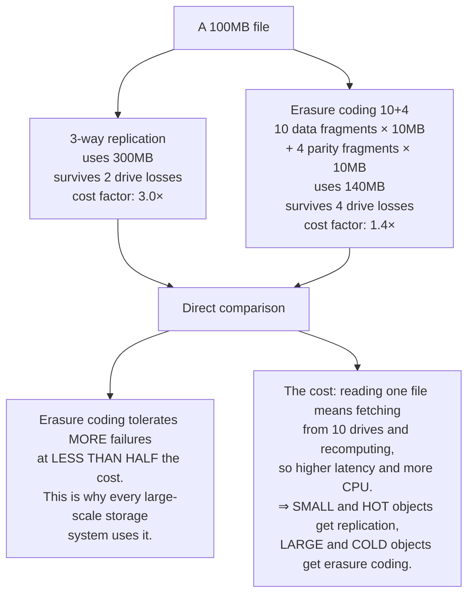
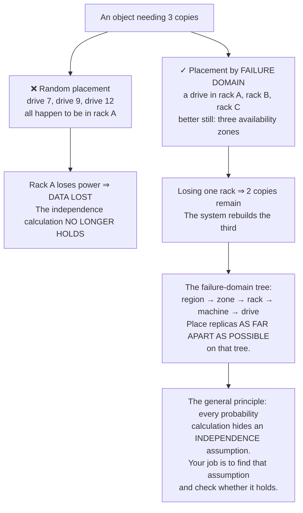
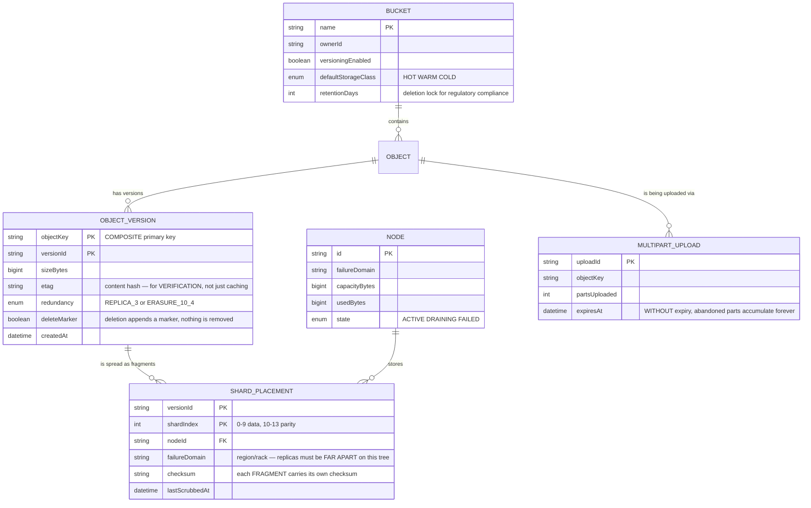
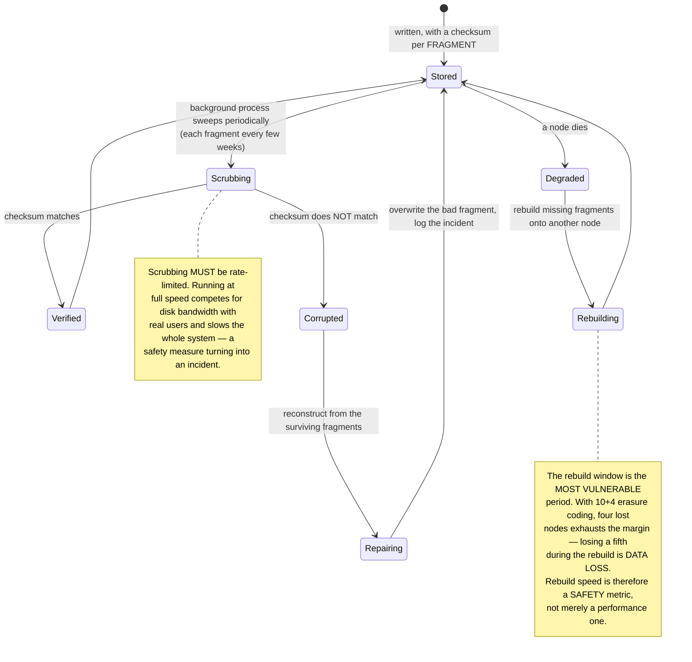

# Cloud Storage System (S3-like)

Cloud storage providers advertise **99.999999999% durability** — eleven nines. It means that if you store ten million objects, statistically you lose one after roughly ten thousand years.

The question that makes this a project: **where does that number come from?**

It does not come from being more careful or from better drives. It comes from **arithmetic**. And when you do that arithmetic, you discover the obvious approach — keep three copies — both costs twice what is necessary and has a blind spot that stops it reaching the advertised figure.

---

## What you will build

- An object store with buckets, keys and metadata
- Erasure coding instead of replication: the same durability at half the cost
- Replica placement by failure domain rather than at random
- Multipart uploads that resume after a network break
- Object versioning and retention locks
- Background scrubbing that detects and repairs corruption
- Storage tiering by access pattern

---

## Durability is arithmetic, not effort

Start from a real number: a hard drive has roughly a **2% annual failure probability**. With a single copy, annual durability is 98% — at scale, data loss is a near certainty.

Three independent copies mean losing data requires **all three** to fail: 0.02³ = 0.000008, so 99.9992% durability. Much better, but that is **five** nines, not eleven. And you are paying **three times** the capacity.

### Erasure coding: the same durability at half the cost

The idea is borrowed from error-correcting codes. Split a file into 10 data fragments, compute 4 parity fragments, and spread all 14 across 14 different drives. The crucial property: **any 10 of the 14 reconstruct the original file.**

That last line is the real architectural decision: **do not pick one scheme for all data.** Splitting a 4KB file into ten 400-byte fragments is absurd — the metadata outweighs the data. The threshold usually sits around 1MB.

This is the same pattern as the celebrity threshold in [Social Media Platform](/projects/social-media-platform-twitter-like): **there is no strategy right for all data, only one right for each segment.**

### The blind spot: correlated failure

The 0.02³ calculation above carries a hidden assumption: **the three drives fail independently.** In reality they do not.

Three copies on three drives in **the same rack** all die when that rack loses power. The real probability is not 0.000008 — it is the probability of a rack failing, which is in the **percent** range. You have just advertised eleven nines and delivered two.

---

## Metadata: the real problem in a small-object store

A surprise: for a system holding billions of objects, **metadata is harder than data**.

Data is just bytes — spread them out, copy them, done. But "where does this object live, who owns it, which version is current" is a database absorbing hundreds of thousands of operations per second, and it **does not fit on one machine**.

`deleteMarker` is worth noticing: deleting a versioned object **removes nothing** — it appends a delete marker. This is the **fifth** appearance of append-only in this roadmap, after CRDTs, the search engine, the message broker and the banking ledger. The motive differs again here: **recovery from human error** — statistically a more common cause of data loss than drive failure.

`MULTIPART_UPLOAD.expiresAt` prevents a very real incident: a user starts uploading a 50GB file, the network drops at 40GB, and they never return. Without cleanup, those 40GB occupy space permanently, never appear in an object listing, and nobody understands why used capacity does not reconcile.

---

## Scrubbing: corruption with nobody touching anything

A file sitting untouched on disk for three years can still corrupt — a cosmic ray flips a bit, the drive degrades, firmware misbehaves. The phenomenon is called **bit rot**, and what makes it dangerous is that it is **silent**: no error is reported until somebody reads the file and receives garbage.

Worse: if you do not detect it early, the good copy may be reclaimed first, and then all three copies are corrupt.

That second note is what many people miss: **rebuild time sits directly inside the durability calculation.** A cluster that rebuilds in an hour is far safer than one taking a week, at identical redundancy settings. This is why real systems spread one object's fragments across a great many nodes: when one node dies, hundreds contribute to the rebuild rather than one node copying everything.

---

## Consistency: read-after-write versus listing

A distributed object store has two operation classes with very different properties, and confusing them causes irritating bugs:

| Operation | Actual guarantee | Why |
|---|---|---|
| `PUT` then `GET` the same key | Read-after-write, visible immediately | The key determines placement; you read exactly where you wrote |
| `PUT` then `LIST` the bucket | May not appear yet | Listing is a separate index, updated asynchronously |
| `DELETE` then `GET` | May still return for a while | Caches and replicas have not converged |
| Two concurrent `PUT`s on one key | One wins, unpredictably | There is no distributed lock on writes |

The most important consequence is **never use `LIST` to coordinate work**. The common wrong pattern: one process writes files, another calls `LIST` to discover new ones. It works throughout testing and then occasionally misses files in production, and that failure is extremely hard to reproduce.

The correct approach is to **emit an event** on write, and have the consumer read directly by key. You built that mechanism in [Event-Driven Microservices](/projects/event-driven-microservices-uber-like) — and the outbox there is exactly what guarantees the event is not lost.

---

## Tiering: cold data occupies most of the capacity

Most data is read during its first few days and then almost never touched again. Keeping it all on one class of hardware means paying the highest price for the least valuable data.

Three tiers and **the trap that comes with them**:

- **Hot** — SSD, millisecond latency, most expensive.
- **Warm** — spinning disk, tens of milliseconds, considerably cheaper.
- **Cold** — tape or powered-down drives, retrieval in **hours**, an order of magnitude cheaper.

The trap: transitions cost money, and retrieving from cold usually bills by volume. A "move to cold after 30 days" policy applied to data still read every few months can cost **more** than leaving it alone. Tiering decisions must rest on **measured access patterns**, not on file age.

---

## Traps worth recording

| Symptom | Actual cause | Fix |
|---|---|---|
| Data lost despite three copies | All three in one failure domain | Placement by failure-domain tree, not at random |
| Storage cost triple the real data | Replication for everything | Erasure coding for large, cold objects |
| Small files consuming absurd space | Fragmenting 4KB files | A size threshold; replicate below it |
| Files read back as garbage with no error | Bit rot with no scrubbing | Per-fragment checksums and periodic sweeps |
| Scrubbing slowing the whole system | Running at full speed | Rate-limit the scrubber |
| Data lost during a rebuild | Rebuilds too slow, margin exhausted | Spread fragments widely, rebuild in parallel |
| Used capacity not reconciling | Abandoned upload parts never cleaned | `expiresAt` on multipart uploads |
| Accidental deletions unrecoverable | Real deletion instead of a delete marker | Enable versioning; deletion appends a marker |
| Background jobs occasionally missing files | Using `LIST` to discover new objects | Emit an event on write, read by key |
| Two writers producing mixed content | No conditional write check | Conditional writes on `etag` |
| Bills rising after enabling tiering | Cold data being read frequently | Tier on measured access patterns |
| Large uploads restarting from scratch | Single-shot uploads | Multipart uploads with resume |

---

## When it is genuinely done

- [ ] Kill any 4 nodes in a 10+4 erasure configuration: **every** object still reads
- [ ] Kill a 5th before the rebuild finishes: the system **reports** data loss clearly rather than returning wrong bytes
- [ ] Inspect fragment placement for 1,000 objects: no object has two fragments in one rack
- [ ] Corrupt a single byte on disk in one fragment: the next scrub **detects and repairs** it
- [ ] Measure real storage cost: a 1.4× factor with erasure coding, not 3×
- [ ] Break the network mid-upload of a 10GB file: reconnect and **resume**, not restart
- [ ] Abandon a multipart upload: after the deadline, the capacity is reclaimed automatically
- [ ] Delete a versioned object and restore it: content matches **byte for byte**
- [ ] `PUT` then immediately `GET` the same key: **always** returns the new content
- [ ] Conditional write on `etag` from two writers concurrently: exactly one succeeds
- [ ] Run scrubbing at full speed: real user latency rises by less than 10%

---

## Where to go next

1. **Cross-region replication.** Synchronous is slow; asynchronous has a data-loss window. There is no third option — only a choice of how long that window is.
2. **Compute next to storage.** Run queries where the data lives rather than pulling it out — the central idea of [Cloud-native Data Platform](/projects/cloud-native-data-platform).
3. **Backing store for broker tiered storage.** [Distributed Message Broker](/projects/distributed-message-broker-kafka-like) wants to push old segments to object storage — you have just built exactly what it needs.
4. **A distributed metadata index.** The metadata table is the harder half, and scaling it leads straight into [Distributed Database](/projects/distributed-database-postgres-like).
