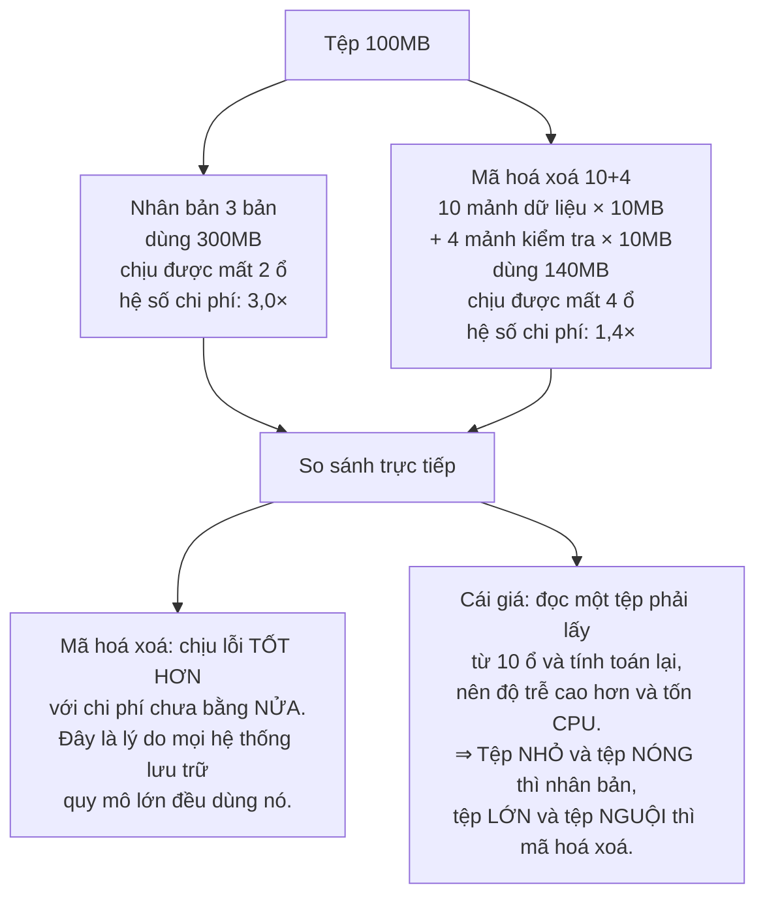
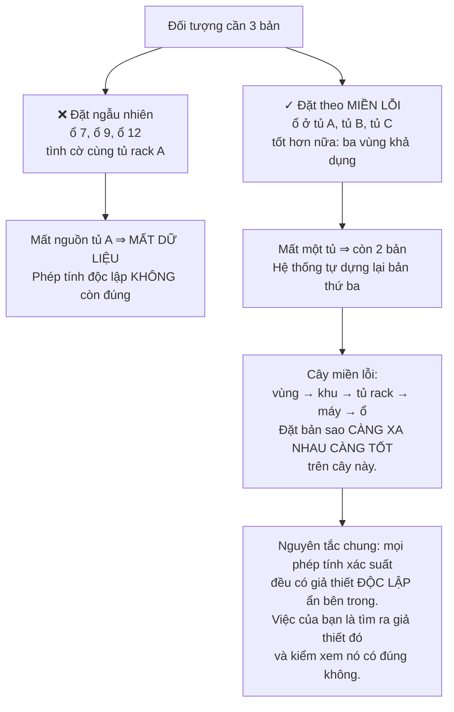
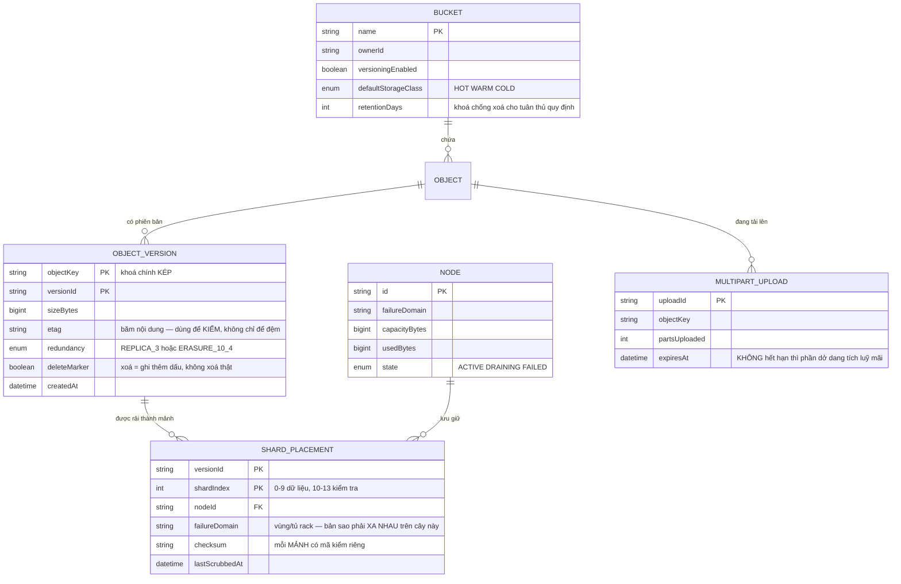
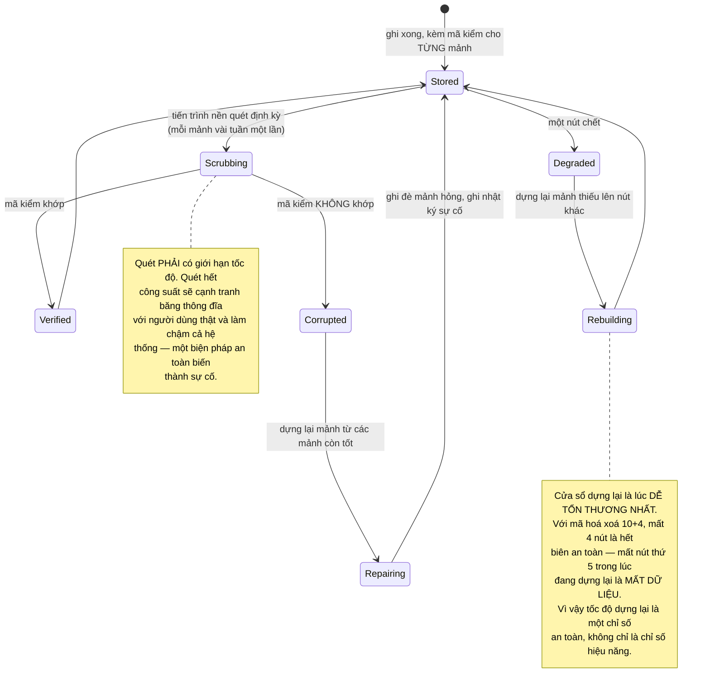

# Cloud Storage System (S3-like)

Các nhà cung cấp lưu trữ đám mây quảng cáo **độ bền 99,999999999%** — mười một số chín. Nghĩa là nếu bạn gửi mười triệu tệp, thống kê nói bạn sẽ mất một tệp sau khoảng mười nghìn năm.

Câu hỏi làm nên dự án này: **con số đó đến từ đâu?**

Nó không đến từ việc cẩn thận hơn hay từ ổ đĩa tốt hơn. Nó đến từ **phép tính**. Và khi bạn làm phép tính đó, bạn phát hiện ra rằng cách hiển nhiên — lưu ba bản sao — vừa tốn gấp đôi mức cần thiết, vừa có một điểm mù khiến nó không đạt được con số đã hứa.

---

## Bạn sẽ dựng ra cái gì

- Kho lưu trữ đối tượng có nhóm chứa, khoá, và siêu dữ liệu
- Mã hoá xoá thay cho nhân bản, cùng độ bền với nửa chi phí
- Đặt bản sao theo miền lỗi, không đặt ngẫu nhiên
- Tải lên nhiều phần, tiếp tục được sau khi đứt mạng
- Phiên bản đối tượng và khoá chống xoá
- Kiểm tra âm thầm, tự sửa dữ liệu hỏng
- Phân tầng lưu trữ theo tần suất truy cập

---

## Độ bền là một phép tính, không phải một nỗ lực

Bắt đầu từ một con số thật: một ổ cứng có xác suất hỏng khoảng **2% mỗi năm**. Với một bản duy nhất, độ bền hằng năm là 98% — mất dữ liệu gần như chắc chắn xảy ra ở quy mô lớn.

Lưu ba bản độc lập thì mất dữ liệu đòi hỏi **cả ba** cùng hỏng: 0,02³ = 0,000008, tức độ bền 99,9992%. Tốt hơn nhiều, nhưng mới **năm** số chín, không phải mười một. Và bạn đang trả **gấp ba** dung lượng.

### Mã hoá xoá: cùng độ bền, nửa chi phí

Ý tưởng mượn từ lý thuyết mã sửa lỗi. Chia tệp thành 10 mảnh dữ liệu, tính thêm 4 mảnh kiểm tra, rải 14 mảnh lên 14 ổ khác nhau. Tính chất quan trọng: **bất kỳ 10 mảnh nào trong 14 cũng dựng lại được tệp gốc.**

Dòng cuối là quyết định kiến trúc thật: **không chọn một cách cho mọi dữ liệu.** Tệp 4KB chia thành 10 mảnh 400 byte là vô lý — chi phí siêu dữ liệu vượt cả dữ liệu. Ngưỡng thường quanh 1MB.

Đây lại là mẫu hình đã gặp ở [Social Media Platform](/projects/social-media-platform-twitter-like) với ngưỡng người nổi tiếng: **không có chiến lược đúng cho mọi dữ liệu, chỉ có chiến lược đúng cho từng phân khúc.**

### Điểm mù: hỏng có tương quan

Phép tính 0,02³ ở trên có một giả thiết ngầm: **ba ổ hỏng độc lập với nhau.** Trong thực tế thì không.

Ba bản sao nằm trên ba ổ trong **cùng một tủ rack** thì mất nguồn tủ đó là mất cả ba. Xác suất thật không phải 0,000008 — nó là xác suất tủ rack hỏng, cỡ **phần trăm**. Bạn vừa quảng cáo mười một số chín và cung cấp hai.

---

## Siêu dữ liệu: bài toán thật của kho lưu trữ nhỏ

Một điều gây bất ngờ: với hệ thống lưu trữ hàng tỉ đối tượng, **siêu dữ liệu khó hơn dữ liệu**.

Dữ liệu chỉ là byte — rải ra, sao chép, xong. Nhưng "tệp này ở đâu, ai sở hữu, phiên bản nào mới nhất" là một database phải chịu hàng trăm nghìn thao tác mỗi giây, và nó **không vừa một máy**.

`deleteMarker` đáng chú ý: xoá một đối tượng có bật phiên bản **không xoá gì cả** — nó ghi thêm một dấu xoá. Đây là **lần thứ năm** nguyên tắc chỉ-ghi-thêm xuất hiện trong lộ trình, sau CRDT, công cụ tìm kiếm, message broker và sổ cái ngân hàng. Ở đây động cơ lại khác: **phục hồi sau thao tác nhầm của con người** — thống kê cho thấy đó là nguyên nhân mất dữ liệu phổ biến hơn hẳn ổ đĩa hỏng.

`MULTIPART_UPLOAD.expiresAt` chống một sự cố rất thực: người dùng bắt đầu tải một tệp 50GB, đứt mạng ở 40GB, không bao giờ quay lại. Không có cơ chế dọn thì 40GB đó chiếm chỗ vĩnh viễn, không xuất hiện trong danh sách đối tượng, và không ai biết vì sao dung lượng đã dùng không khớp.

---

## Kiểm tra âm thầm: dữ liệu hỏng mà không ai đụng vào

Một tệp nằm yên trên đĩa ba năm vẫn có thể hỏng — tia vũ trụ lật một bit, ổ đĩa xuống cấp, lỗi phần sụn. Hiện tượng này gọi là **thối bit**, và điều làm nó nguy hiểm là **im lặng**: không có lỗi nào được báo cho tới khi có người đọc tệp và nhận về rác.

Tệ hơn: nếu bạn không phát hiện sớm, bản sao tốt có thể bị dọn đi trước, và rồi bạn còn ba bản đều hỏng.

Ghi chú thứ hai là điều nhiều người bỏ qua: **thời gian dựng lại nằm trực tiếp trong phép tính độ bền.** Cụm dựng lại xong trong một giờ an toàn hơn nhiều so với cụm mất một tuần, dù cùng cấu hình dư thừa. Đó là lý do các hệ thống thật rải mảnh của một đối tượng ra **rất nhiều** nút: khi một nút chết, hàng trăm nút cùng góp phần dựng lại thay vì một nút phải chép toàn bộ.

---

## Nhất quán: đọc-sau-ghi và danh sách

Kho đối tượng phân tán có hai loại thao tác với hai đặc tính rất khác nhau, và nhầm lẫn giữa chúng gây ra những lỗi khó chịu:

| Thao tác | Đảm bảo thực tế | Vì sao |
|---|---|---|
| `PUT` rồi `GET` cùng khoá | Đọc-sau-ghi, thấy ngay | Khoá xác định được vị trí, đọc thẳng chỗ vừa ghi |
| `PUT` rồi `LIST` nhóm chứa | Có thể chưa thấy | Danh sách là chỉ mục riêng, cập nhật không đồng bộ |
| `DELETE` rồi `GET` | Có thể vẫn thấy một lúc | Bộ đệm và bản sao chưa đồng bộ xong |
| Hai `PUT` cùng khoá đồng thời | Một cái thắng, không xác định trước cái nào | Không có khoá phân tán cho ghi |

Điều quan trọng nhất là **đừng dựa vào `LIST` để điều phối công việc**. Mẫu hình sai rất phổ biến: một tiến trình ghi tệp, tiến trình khác gọi `LIST` để phát hiện tệp mới. Nó chạy đúng trong lúc thử nghiệm rồi thỉnh thoảng bỏ sót trên môi trường thật, và lỗi đó cực khó tái hiện.

Cách đúng là **bắn một sự kiện** khi ghi xong, rồi bên nhận đọc thẳng theo khoá. Cơ chế đó bạn đã dựng ở [Event-Driven Microservices](/projects/event-driven-microservices-uber-like) — và outbox ở đó chính là thứ đảm bảo sự kiện không bị mất.

---

## Phân tầng: dữ liệu nguội chiếm phần lớn dung lượng

Phần lớn dữ liệu được đọc trong vài ngày đầu rồi gần như không bao giờ đụng tới nữa. Giữ tất cả trên cùng một loại phần cứng là trả giá cao nhất cho phần dữ liệu ít giá trị nhất.

Ba tầng và **cái bẫy kèm theo**:

- **Nóng** — SSD, độ trễ mili giây, đắt nhất.
- **Ấm** — ổ cứng cơ, độ trễ vài chục mili giây, rẻ hơn nhiều.
- **Lạnh** — băng từ hoặc ổ tắt nguồn, lấy ra mất **hàng giờ**, rẻ hơn cả chục lần.

Cái bẫy: chuyển tầng cũng tốn tiền, và lấy lại từ tầng lạnh thường tính phí theo dung lượng. Một chính sách "chuyển sang lạnh sau 30 ngày" áp cho dữ liệu vẫn được đọc mỗi vài tháng có thể **đắt hơn** là để nguyên. Quyết định phân tầng phải dựa trên **mẫu hình truy cập đo được**, không dựa vào tuổi của tệp.

---

## Những cái bẫy đã được ghi lại

| Triệu chứng | Nguyên nhân thật | Cách sửa |
|---|---|---|
| Mất dữ liệu dù có 3 bản sao | Ba bản cùng một miền lỗi | Đặt theo cây miền lỗi, không đặt ngẫu nhiên |
| Chi phí lưu trữ gấp ba dữ liệu thật | Nhân bản cho mọi thứ | Mã hoá xoá cho tệp lớn và nguội |
| Tệp nhỏ tốn chỗ vô lý | Chia mảnh tệp 4KB | Ngưỡng kích thước, dưới ngưỡng thì nhân bản |
| Đọc tệp ra rác mà không có lỗi nào | Thối bit, không quét kiểm | Mã kiểm cho từng mảnh, quét nền định kỳ |
| Quét kiểm làm chậm cả hệ thống | Quét hết công suất | Giới hạn tốc độ quét |
| Mất dữ liệu trong lúc đang dựng lại | Dựng lại quá chậm, hết biên an toàn | Rải mảnh ra nhiều nút, dựng lại song song |
| Dung lượng đã dùng không khớp | Phần tải lên dở dang không được dọn | `expiresAt` cho phiên tải lên nhiều phần |
| Xoá nhầm không khôi phục được | Xoá thật thay vì ghi dấu xoá | Bật phiên bản, xoá là thêm dấu |
| Tiến trình nền thỉnh thoảng bỏ sót tệp | Dùng `LIST` để phát hiện tệp mới | Bắn sự kiện khi ghi, đọc theo khoá |
| Hai bên cùng ghi, dữ liệu lẫn lộn | Không có kiểm tra điều kiện khi ghi | Ghi có điều kiện theo `etag` |
| Hoá đơn tăng sau khi bật phân tầng | Dữ liệu lạnh bị đọc lại thường xuyên | Phân tầng theo mẫu hình truy cập đo được |
| Tải tệp lớn hỏng phải làm lại từ đầu | Tải một lần duy nhất | Tải nhiều phần, tiếp tục được |

---

## Khi nào coi như xong

- [ ] Giết 4 nút bất kỳ trong cấu hình mã hoá xoá 10+4: **mọi** đối tượng vẫn đọc được
- [ ] Giết nút thứ 5 trước khi dựng lại xong: hệ thống **báo rõ** mất dữ liệu, không trả về byte sai
- [ ] Kiểm vị trí các mảnh của 1.000 đối tượng: không đối tượng nào có hai mảnh cùng một tủ rack
- [ ] Sửa trực tiếp một byte trên đĩa của một mảnh: lần quét tiếp theo **phát hiện và tự sửa**
- [ ] Đo chi phí lưu trữ thực tế: hệ số 1,4× với mã hoá xoá, không phải 3×
- [ ] Đứt mạng giữa lúc tải tệp 10GB: nối lại và **tiếp tục**, không tải lại từ đầu
- [ ] Bỏ dở một phiên tải nhiều phần: sau thời hạn, dung lượng được thu hồi tự động
- [ ] Xoá một đối tượng có bật phiên bản rồi khôi phục: nội dung khớp **từng byte**
- [ ] `PUT` rồi `GET` ngay cùng khoá: **luôn** thấy nội dung mới
- [ ] Ghi có điều kiện theo `etag` với hai bên đồng thời: đúng một bên thành công
- [ ] Bật quét kiểm hết công suất: độ trễ của người dùng thật tăng dưới 10%

---

## Bước tiếp theo

1. **Nhân bản giữa các vùng địa lý.** Đồng bộ thì chậm, bất đồng bộ thì có cửa sổ mất dữ liệu. Không có lựa chọn thứ ba — chỉ có việc chọn cửa sổ đó dài bao nhiêu.
2. **Tính toán tại chỗ.** Chạy truy vấn ngay nơi lưu dữ liệu thay vì kéo về — chính là ý tưởng trung tâm của [Cloud-native Data Platform](/projects/cloud-native-data-platform).
3. **Kho lưu trữ cho tầng phân cấp của message broker.** [Distributed Message Broker](/projects/distributed-message-broker-kafka-like) muốn đẩy phân đoạn cũ lên kho đối tượng — bạn vừa dựng đúng cái nó cần.
4. **Chỉ mục siêu dữ liệu phân tán.** Bảng siêu dữ liệu là phần khó hơn dữ liệu, và mở rộng nó dẫn thẳng tới [Distributed Database](/projects/distributed-database-postgres-like).
