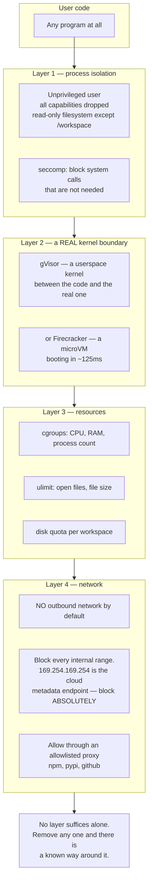
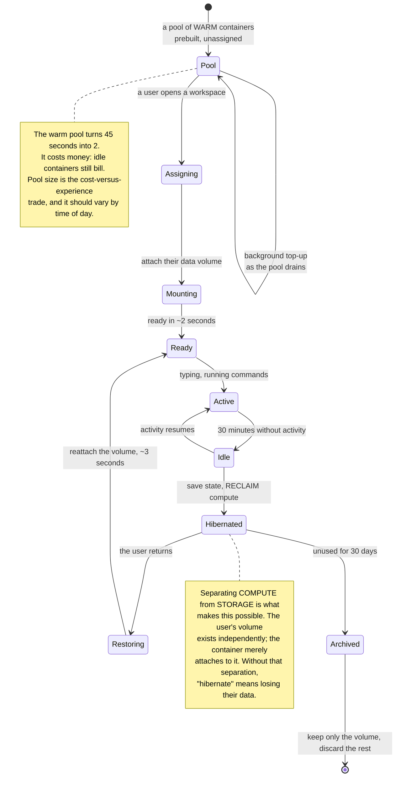
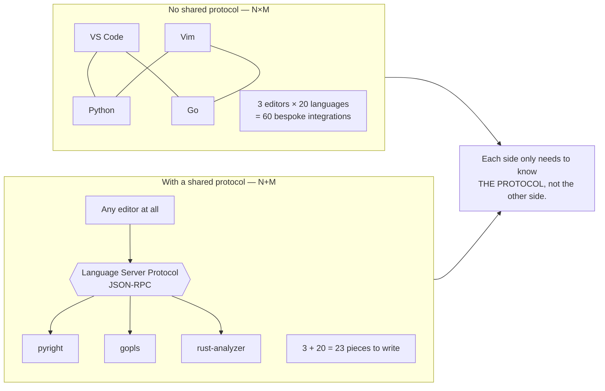
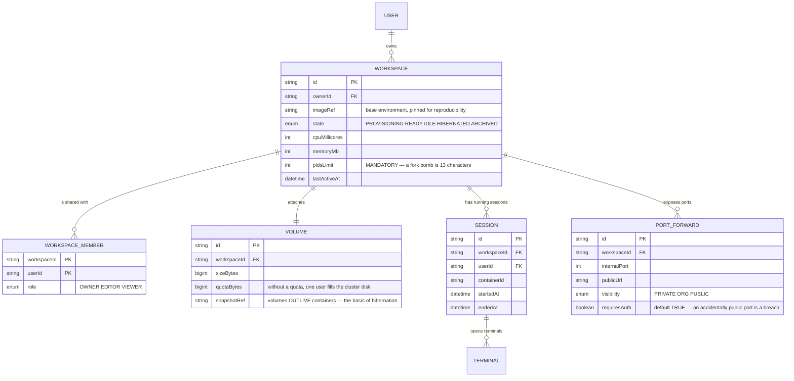

# Code Collaboration Platform (VS Code-like)

Building an editor in a browser is easy: libraries handle the hard parts of editing. Adding real-time collaboration you already know how to do — [Real-Time Collaboration Tool](/projects/realtime-collaboration-figma-like) covered the CRDT work.

What makes this project different comes down to one sentence:

**You are running strangers' code on your hardware.**

Users type `rm -rf /`, type an infinite loop, type a program scanning your internal network, type a cryptocurrency miner. None of them need to be malicious — a student learning systems programming is enough.

Every technical decision here follows from that sentence.

---

## What you will build

- Isolated per-user workspaces
- An editor with completions, go-to-definition, project-wide rename
- A real terminal running real commands
- Multiple people editing one file, seeing each other's cursors
- Running and debugging programs, previewing their web ports
- Hibernation when idle, fast wake-up

---

## Isolation: a container is **not** a security boundary

This needs saying plainly, because many people believe the opposite.

Containers share the host kernel. A privilege-escalation bug in the kernel is an escape from the container. Docker is an excellent **packaging** tool and a weak **security** boundary — it prevents accidents, not deliberate attacks.



The address `169.254.169.254` deserves its own note: on most cloud providers that is the **instance metadata endpoint**, and it commonly returns the machine's temporary credentials. A single `curl` to it from inside a user's container can hand over access to your infrastructure. This is how several real incidents happened, and it requires no sophistication whatsoever.

### The fork bomb: a test you must run yourself

```bash
:(){ :|:& };:
```

Thirteen characters. It creates a process that calls itself twice, and each child does the same. Within seconds the **host's** process table is full and every other user's workspace freezes.

Memory limits do not stop it, because each process is tiny. What stops it is a **process count** limit:

```yaml
# A process limit is mandatory, not optional.
pids_limit: 256
mem_limit: 2g
cpu_quota: 100000      # one core
```

Run that line inside your own system before letting users in. If your host dies, you have just learned the necessary lesson under safe conditions.

---

## Cold start: the experience problem that decides the product

A user clicks "open workspace" and waits 45 seconds while a container is pulled, booted and dependencies installed. They do not come back a second time.



That second note is the most important architectural decision in this section: **user data must outlive the container**. If source code lives in the container's write layer, you can never reclaim resources, and cost grows with signups rather than with active users.

---

## Code intelligence: one protocol instead of N×M integrations

Users want completions, go-to-definition, project-wide rename. Implementing that per language is years of work.

There is a way out of that problem, and it is a design lesson more memorable than the engineering: N editors × M languages is N×M integrations. Put a **standard protocol** in the middle and it becomes N+M.



In practice, two details decide whether this works:

- **Language servers run inside the user's container, not on a shared host.** They need to read that project's source and dependencies. Running them centrally gives wrong results and creates a vulnerability.
- **Language servers are memory-hungry.** `rust-analyzer` on a large project can use several gigabytes. Count it against the same memory limit as user code, and start it **on demand** rather than whenever a file opens.

---

## The terminal: not a command input box

The naive approach: an input box, send the command string up, run it, return output as a string. It breaks the moment someone runs `vim`, `top`, `git rebase -i`, or anything that prompts — because those programs do not read lines, they need a **pseudo-terminal**.

```javascript
// Correct: allocate a pseudo-terminal in the container and pipe it
// bidirectionally over WebSocket. Bytes pass straight through, unparsed.
const pty = spawn('/bin/bash', [], {
  name: 'xterm-256color',
  cols: 80, rows: 24,
  cwd: '/workspace',
  env: { ...safeEnv, TERM: 'xterm-256color' },
});

pty.onData(data => ws.send(data));           // out: raw bytes to the browser
ws.on('message', data => pty.write(data));   // in: keystrokes to the process

// Window resizes MUST be forwarded, or every terminal UI draws the wrong
// frame and users conclude the system is broken.
ws.on('resize', ({ cols, rows }) => pty.resize(cols, rows));
```

Three easily missed details, each a real bug:

- **Resizes must propagate.** Without them, `htop` and every terminal UI renders at the wrong size.
- **Rate-limit output.** `cat` on a 1GB file pushes 1GB through the WebSocket and freezes the browser. Cap at a few hundred KB per second and truncate.
- **Strip sensitive environment variables.** The user's container must **not** see your API keys, database connection strings, or any infrastructure credentials.

---

## Collaboration: one core difference from Figma

Multiple people editing one file means CRDTs — you know how from [Real-Time Collaboration Tool](/projects/realtime-collaboration-figma-like). But there is a difference in kind here:

**On a canvas, the CRDT document *is* the source of truth. Here the source of truth is the *file on disk* — because compilers read files, not your CRDT document.**

The consequence is concrete: you have two parties with write access. Users type in the editor, but `git checkout`, `npm install`, or a `sed` command in the terminal also modify those same files.

What works in practice:

1. **Open files**: the CRDT holds live state, flushed to disk about 500ms after typing stops.
2. **Watch the disk**: a file changed externally is reloaded into the CRDT document.
3. **Conflicts between the two directions**: if someone is mid-edit and `git checkout` overwrites the file, **ask the user**. Do not resolve it automatically. This is where automation causes more harm than help.
4. **Closed files**: no CRDT needed at all; disk is everything.

---

## The data model



`PORT_FORWARD.requiresAuth` defaulting to `TRUE` is a decision worth defending: a user runs a web server in their workspace to look at it themselves, and if the system defaults to public they have just put a work-in-progress application — typically holding real data and lacking authentication — onto the open internet. The default must be closed; public must be a deliberate act.

---

## Traps worth recording

| Symptom | Actual cause | Fix |
|---|---|---|
| One user freezes the whole cluster | Fork bomb, no process limit | `pids_limit`, self-tested with those 13 characters |
| A user obtains infrastructure credentials | The container reached `169.254.169.254` | Block internal ranges at the network layer, not in the app |
| Escape from container to host | Believing a container is a security boundary | gVisor or microVMs, plus seccomp |
| Cluster disk full because of one user | No per-volume quota | Hard quotas with warnings before they hit |
| Opening a workspace takes 45 seconds | Building a container from scratch each time | A pool of prebuilt warm containers |
| Cost scaling with signups | Idle resources never reclaimed | Separate compute from storage, hibernate when idle |
| Hibernation loses the user's code | Code living in the container write layer | A separate volume outliving the container |
| `vim` and `htop` render incorrectly | A command box instead of a pseudo-terminal | Allocate a real PTY and pipe bytes both ways |
| Terminal UIs draw at the wrong size | Resize events never forwarded | Call `resize` down to the process |
| `cat` on a large file freezes the browser | No output rate limiting | Throttle and truncate |
| Completions wrong or missing | Language server running outside the user container | Run it inside that container |
| Out of memory on a large project | Language servers using several gigabytes | Count them against the limit; start on demand |
| A work-in-progress app exposed publicly | Port forwarding defaulting to public | Closed by default; public must be deliberate |
| Mid-edit work destroyed by `git checkout` | Automatically choosing a winner | Ask the user when the two directions conflict |

---

## When it is genuinely done

- [ ] Run `:(){ :|:& };:` in one workspace: **only** that workspace dies, everyone else is unaffected
- [ ] `curl http://169.254.169.254/` from inside the container: **blocked**
- [ ] `curl` to any other internal infrastructure address: also blocked
- [ ] `dd if=/dev/zero of=big` until the quota fills: only that volume fills, the cluster is fine
- [ ] `while true; do :; done` on 8 threads: CPU is capped at the limit and the host stays responsive
- [ ] `env` in the terminal: **no** infrastructure keys or connection strings visible
- [ ] Open a hibernated workspace: ready in under 5 seconds with source code intact
- [ ] Run `vim` then resize the browser window: the interface redraws correctly
- [ ] `cat` a 1GB file: the browser does **not** freeze; output truncates with a notice
- [ ] Two people typing in one file: they converge, and the terminal sees correct content after save
- [ ] `git checkout` over a file being edited: the user **is asked**, never silently overwritten
- [ ] Run a web server in a workspace: the port is **not** reachable externally until deliberately opened

---

## Where to go next

1. **Environment customisation.** Let users declare their environment in a repository file so colleagues open it with exactly the right tooling. This is the boundary with infrastructure-as-code from [DevOps Kubernetes Platform](/projects/devops-kubernetes-platform).
2. **Remote debugging.** A debug protocol over WebSocket: breakpoints, variable inspection — another standard protocol with the same N+M benefit.
3. **Multiple containers per workspace.** Applications need databases, queues, supporting services. The problem becomes orchestration rather than isolating one container.
4. **A coding assistant.** Suggestions drawing on the whole repository rather than the open file — precisely the context-retrieval problem of [LLM Code Generation Platform](/projects/llm-code-generation-platform).
