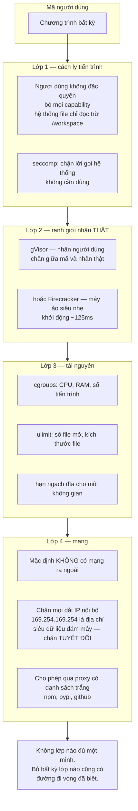
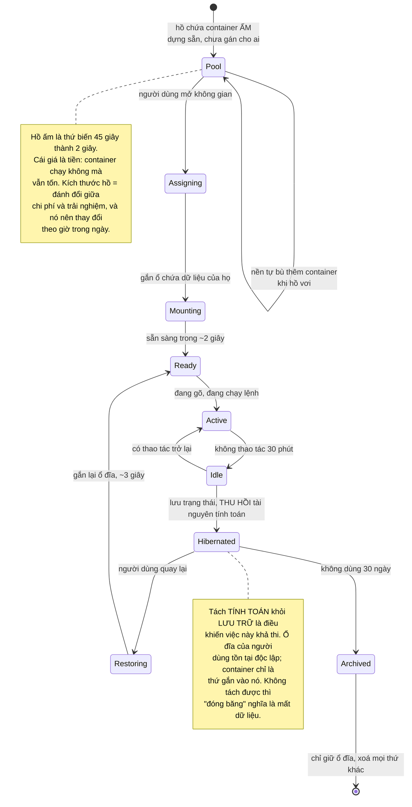
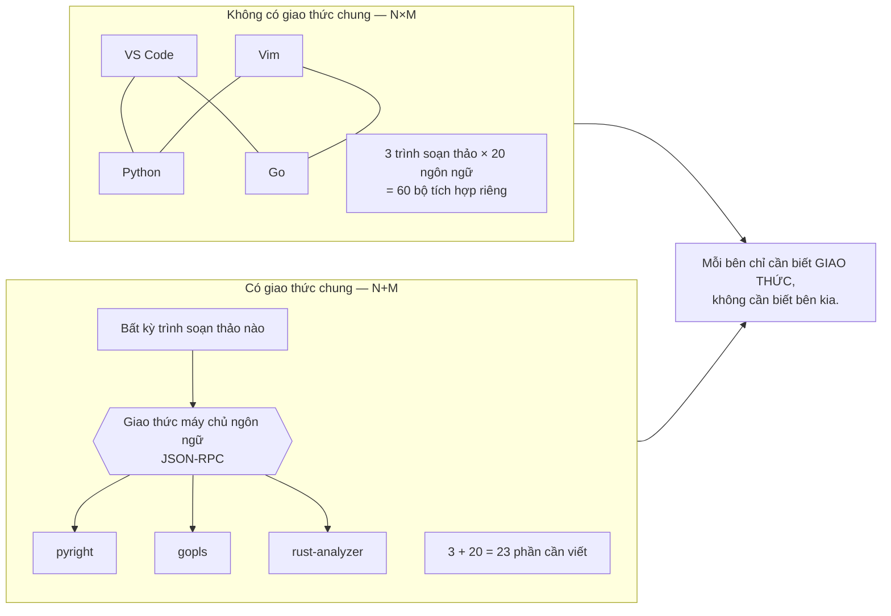
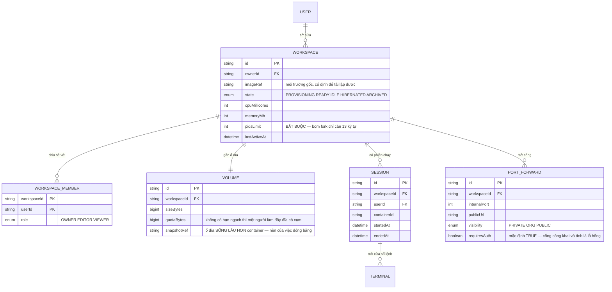

# Code Collaboration Platform (VS Code-like)

Dựng một trình soạn thảo trên trình duyệt là việc dễ: có sẵn thư viện làm hết phần khó của việc soạn thảo. Thêm cộng tác thời gian thực thì bạn đã biết cách rồi — [Real-Time Collaboration Tool](/projects/realtime-collaboration-figma-like) đã đi hết phần CRDT.

Cái làm dự án này khác hẳn nằm ở một câu duy nhất:

**Bạn đang chạy mã của người lạ trên phần cứng của mình.**

Người dùng gõ `rm -rf /`, gõ một vòng lặp vô hạn, gõ một đoạn chương trình quét mạng nội bộ của bạn, gõ một trình đào tiền mã hoá. Không ai trong số họ cần phải là kẻ xấu — chỉ cần một sinh viên học lập trình hệ thống là đủ.

Mọi quyết định kỹ thuật trong bài này đều xoay quanh câu đó.

---

## Bạn sẽ dựng ra cái gì

- Không gian làm việc chạy trong môi trường cách ly, mỗi người một cái
- Trình soạn thảo có gợi ý mã, nhảy tới định nghĩa, đổi tên biến toàn dự án
- Cửa sổ dòng lệnh thật, chạy được lệnh thật
- Nhiều người cùng sửa một file, thấy con trỏ của nhau
- Chạy và gỡ lỗi chương trình, xem cổng web của nó
- Đóng băng khi không dùng, đánh thức nhanh

---

## Cách ly: container **không phải** ranh giới an ninh

Đây là câu cần nói thẳng vì rất nhiều người tin ngược lại.

Container chia sẻ nhân hệ điều hành với máy chủ. Một lỗ hổng leo thang đặc quyền trong nhân là một lối thoát khỏi container. Docker là công cụ **đóng gói** tốt và là ranh giới an ninh **yếu** — nó ngăn tai nạn, không ngăn tấn công có chủ đích.



Địa chỉ `169.254.169.254` trong sơ đồ đáng được nói riêng: trên hầu hết nhà cung cấp đám mây, đó là điểm truy cập **siêu dữ liệu máy chủ**, và nó thường trả về thông tin xác thực tạm thời của máy. Một lệnh `curl` duy nhất tới địa chỉ đó từ trong container của người dùng có thể lấy được quyền truy cập vào hạ tầng của bạn. Đây là cách nhiều sự cố thật đã xảy ra, và nó không đòi hỏi kỹ thuật gì cao siêu.

### Bom fork: bài kiểm tra bạn phải tự làm

```bash
:(){ :|:& };:
```

Mười ba ký tự. Nó tạo tiến trình gọi chính nó hai lần, mỗi tiến trình con lại làm vậy. Trong vài giây, bảng tiến trình của **máy chủ** đầy và mọi không gian làm việc của mọi người dùng khác đóng băng.

Giới hạn bộ nhớ không chặn được nó, vì mỗi tiến trình rất nhỏ. Cái chặn được là giới hạn **số tiến trình**:

```yaml
# Giới hạn số tiến trình là bắt buộc, không phải tuỳ chọn.
pids_limit: 256
mem_limit: 2g
cpu_quota: 100000      # 1 lõi
```

Hãy tự chạy dòng lệnh đó trong hệ thống của mình trước khi cho người dùng vào. Nếu máy chủ của bạn chết, bạn vừa học được điều cần học trong điều kiện an toàn.

---

## Khởi động nguội: bài toán trải nghiệm quyết định sản phẩm

Người dùng bấm "mở không gian làm việc" và chờ 45 giây trong khi container được kéo về, khởi động, cài phụ thuộc. Họ không quay lại lần thứ hai.



Ghi chú thứ hai là quyết định kiến trúc quan trọng nhất của phần này: **dữ liệu người dùng phải sống lâu hơn container**. Nếu mã nguồn nằm trong lớp ghi của container thì bạn không bao giờ thu hồi được tài nguyên, và chi phí tăng tuyến tính theo số người đăng ký chứ không theo số người đang dùng.

---

## Trí tuệ mã nguồn: một giao thức thay vì N×M bộ tích hợp

Người dùng muốn gợi ý mã, nhảy tới định nghĩa, đổi tên biến trong cả dự án. Tự cài đặt cho mỗi ngôn ngữ là chuyện của nhiều năm.

Có một cách thoát khỏi bài toán đó, và nó là một bài học thiết kế đáng nhớ hơn cả phần kỹ thuật: N trình soạn thảo × M ngôn ngữ là N×M bộ tích hợp. Đặt một **giao thức chuẩn** ở giữa thì thành N+M.



Trong thực tế, hai chi tiết quyết định việc này chạy được hay không:

- **Máy chủ ngôn ngữ chạy trong container của người dùng, không phải trên máy chủ chung.** Nó cần đọc mã nguồn và phụ thuộc của dự án đó. Chạy chung là vừa sai kết quả vừa thành lỗ hổng.
- **Máy chủ ngôn ngữ rất ngốn RAM.** `rust-analyzer` trên một dự án lớn có thể dùng vài GB. Đưa nó vào cùng hạn mức bộ nhớ với mã người dùng, và khởi động nó **theo yêu cầu** chứ không phải mở file là chạy.

---

## Cửa sổ dòng lệnh: không phải một ô nhập lệnh

Cách ngây thơ: một ô nhập, gửi chuỗi lệnh lên, chạy, trả về chuỗi kết quả. Nó gãy ngay khi gặp `vim`, `top`, `git rebase -i`, hoặc bất cứ thứ gì hỏi lại người dùng — vì những chương trình đó không đọc từng dòng, chúng cần một **thiết bị đầu cuối giả**.

```javascript
// Đúng: cấp một thiết bị đầu cuối giả trong container, nối hai chiều
// qua WebSocket. Byte đi thẳng, không phân tích, không diễn giải.
const pty = spawn('/bin/bash', [], {
  name: 'xterm-256color',
  cols: 80, rows: 24,
  cwd: '/workspace',
  env: { ...safeEnv, TERM: 'xterm-256color' },
});

pty.onData(data => ws.send(data));           // ra: byte thô tới trình duyệt
ws.on('message', data => pty.write(data));   // vào: phím gõ tới tiến trình

// Đổi kích thước cửa sổ PHẢI báo cho tiến trình, nếu không mọi giao diện
// dòng lệnh vẽ sai khung và người dùng nghĩ hệ thống hỏng.
ws.on('resize', ({ cols, rows }) => pty.resize(cols, rows));
```

Ba chi tiết dễ bỏ, mỗi cái là một lỗi thật:

- **Đổi kích thước phải truyền xuống.** Không có nó, `htop` và mọi giao diện dòng lệnh vẽ sai khung.
- **Giới hạn tốc độ đầu ra.** `cat` một file 1GB sẽ đẩy 1GB qua WebSocket và làm treo trình duyệt. Chặn ở mức vài trăm KB mỗi giây và cắt bớt phần thừa.
- **Xoá biến môi trường nhạy cảm.** Container của người dùng **không được** thấy khoá API của bạn, chuỗi kết nối database, hay bất cứ thông tin xác thực nào của hạ tầng.

---

## Cộng tác: khác Figma ở một điểm cốt lõi

Nhiều người cùng sửa một file thì dùng CRDT — bạn đã biết cách từ [Real-Time Collaboration Tool](/projects/realtime-collaboration-figma-like). Nhưng ở đây có một khác biệt về bản chất:

**Ở bảng vẽ, tài liệu CRDT *chính là* nguồn sự thật. Ở đây, nguồn sự thật là *file trên đĩa* — vì trình biên dịch đọc file, không đọc tài liệu CRDT của bạn.**

Hệ quả rất cụ thể: bạn có hai bên cùng có quyền sửa. Người dùng gõ trong trình soạn thảo, nhưng `git checkout`, `npm install`, hay một lệnh `sed` trong cửa sổ dòng lệnh cũng sửa cùng những file đó.

Cách xử lý chạy được trong thực tế:

1. **File đang mở**: CRDT giữ trạng thái sống, ghi xuống đĩa sau khi ngừng gõ khoảng 500ms.
2. **Theo dõi thay đổi trên đĩa**: file bị sửa từ bên ngoài thì nạp lại vào tài liệu CRDT.
3. **Xung đột giữa hai chiều**: người đang gõ dở mà file bị `git checkout` đè lên thì **hỏi người dùng**, đừng tự chọn. Đây là chỗ tự động hoá gây hại nhiều hơn giúp.
4. **File không mở**: không cần CRDT gì cả, đĩa là tất cả.

---

## Cơ sở dữ liệu



`PORT_FORWARD.requiresAuth` mặc định `TRUE` là một quyết định đáng bảo vệ: người dùng chạy một máy chủ web trong không gian làm việc để tự xem thử, và nếu hệ thống mặc định công khai thì họ vừa đưa một ứng dụng đang phát triển — thường có dữ liệu thật và không có xác thực — lên internet mở. Mặc định phải là kín; công khai là hành động có chủ ý.

---

## Những cái bẫy đã được ghi lại

| Triệu chứng | Nguyên nhân thật | Cách sửa |
|---|---|---|
| Một người dùng làm cả cụm đóng băng | Bom fork, không giới hạn số tiến trình | `pids_limit`, và tự kiểm bằng chính đoạn 13 ký tự |
| Người dùng lấy được quyền hạ tầng | Container gọi được `169.254.169.254` | Chặn dải nội bộ ở tầng mạng, không ở tầng ứng dụng |
| Thoát khỏi container ra máy chủ | Tin rằng container là ranh giới an ninh | gVisor hoặc máy ảo siêu nhẹ, cộng seccomp |
| Đĩa cụm đầy vì một người dùng | Không có hạn ngạch cho mỗi ổ | Hạn ngạch cứng và cảnh báo trước khi đầy |
| Mở không gian mất 45 giây | Dựng container từ đầu mỗi lần | Hồ chứa container ấm, dựng sẵn |
| Chi phí tăng theo số người đăng ký | Không thu hồi được tài nguyên khi nhàn rỗi | Tách tính toán khỏi lưu trữ, đóng băng khi nhàn |
| Đóng băng xong mất mã nguồn | Mã nằm trong lớp ghi của container | Ổ đĩa riêng, sống lâu hơn container |
| `vim` và `htop` hiển thị lỗi | Dùng ô nhập lệnh thay vì thiết bị đầu cuối giả | Cấp PTY thật, nối byte hai chiều |
| Giao diện dòng lệnh vẽ sai khung | Không truyền sự kiện đổi kích thước | Gọi `resize` xuống tiến trình |
| `cat` file lớn làm treo trình duyệt | Không giới hạn tốc độ đầu ra | Chặn tốc độ và cắt bớt |
| Gợi ý mã sai hoặc thiếu | Máy chủ ngôn ngữ chạy ngoài container người dùng | Chạy trong chính container đó |
| Hết RAM khi mở dự án lớn | Máy chủ ngôn ngữ ngốn vài GB | Tính vào hạn mức, khởi động theo yêu cầu |
| Ứng dụng đang phát triển lộ ra internet | Cổng chuyển tiếp mặc định công khai | Mặc định kín, công khai phải chủ ý |
| Gõ dở bị `git checkout` đè mất | Tự động chọn bên thắng | Hỏi người dùng khi hai chiều xung đột |

---

## Khi nào coi như xong

- [ ] Chạy `:(){ :|:& };:` trong một không gian: **chỉ** không gian đó chết, mọi người khác không bị ảnh hưởng
- [ ] `curl http://169.254.169.254/` từ trong container: **bị chặn**
- [ ] `curl` tới một địa chỉ nội bộ khác của hạ tầng: cũng bị chặn
- [ ] `dd if=/dev/zero of=big` cho tới khi hết hạn ngạch: chỉ ổ đĩa đó đầy, cụm không sao
- [ ] `while true; do :; done` với 8 luồng: CPU bị giới hạn đúng hạn mức, máy chủ vẫn phản hồi
- [ ] `env` trong cửa sổ dòng lệnh: **không** thấy khoá hay chuỗi kết nối nào của hạ tầng
- [ ] Mở không gian đã đóng băng: sẵn sàng dưới 5 giây, mã nguồn còn nguyên
- [ ] Chạy `vim` rồi đổi kích thước cửa sổ trình duyệt: giao diện vẽ lại đúng
- [ ] `cat` một file 1GB: trình duyệt **không** treo, đầu ra bị cắt bớt có báo
- [ ] Hai người cùng gõ một file: hội tụ, và cửa sổ dòng lệnh thấy nội dung đúng sau khi lưu
- [ ] `git checkout` đè lên file đang gõ dở: người dùng **được hỏi**, không bị mất thầm lặng
- [ ] Chạy máy chủ web trong không gian: cổng **không** truy cập được từ ngoài cho tới khi chủ động mở

---

## Bước tiếp theo

1. **Tuỳ biến môi trường.** Cho người dùng khai báo môi trường bằng một file trong kho mã, để đồng nghiệp mở ra là có đúng công cụ. Đây là chỗ giao với hạ tầng dạng mã của [DevOps Kubernetes Platform](/projects/devops-kubernetes-platform).
2. **Gỡ lỗi từ xa.** Giao thức gỡ lỗi qua WebSocket, đặt điểm dừng, xem biến — thêm một giao thức chuẩn nữa với cùng lợi ích N+M.
3. **Chạy nhiều container cho một không gian.** Ứng dụng cần database, hàng đợi, dịch vụ phụ. Bài toán trở thành điều phối, không còn là cách ly một container.
4. **Trợ lý viết mã.** Gợi ý dựa trên toàn bộ kho mã chứ không chỉ file đang mở — chính là bài toán truy xuất ngữ cảnh của [LLM Code Generation Platform](/projects/llm-code-generation-platform).
