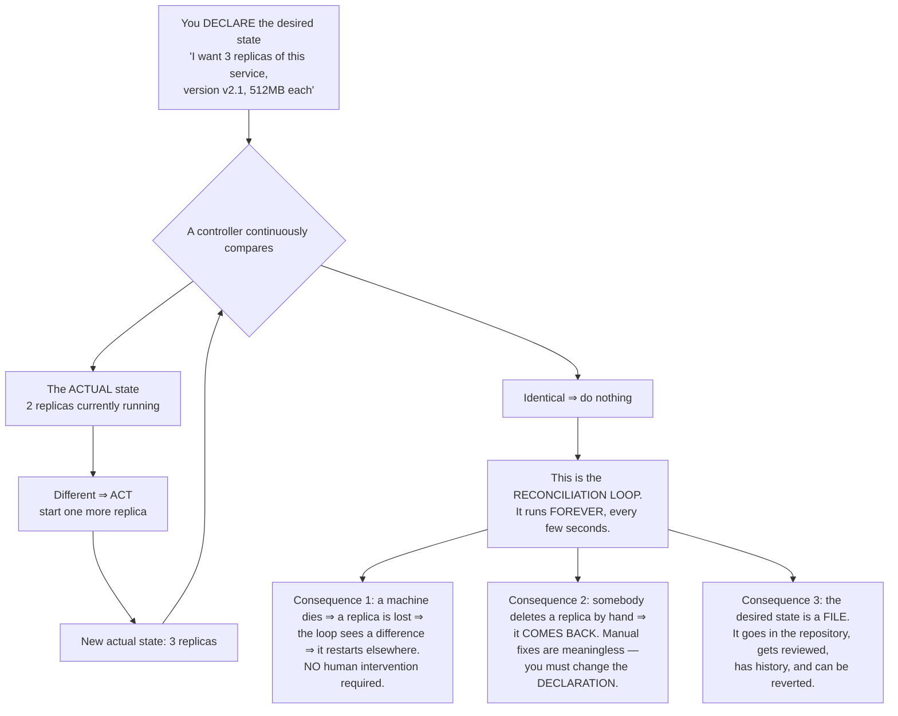
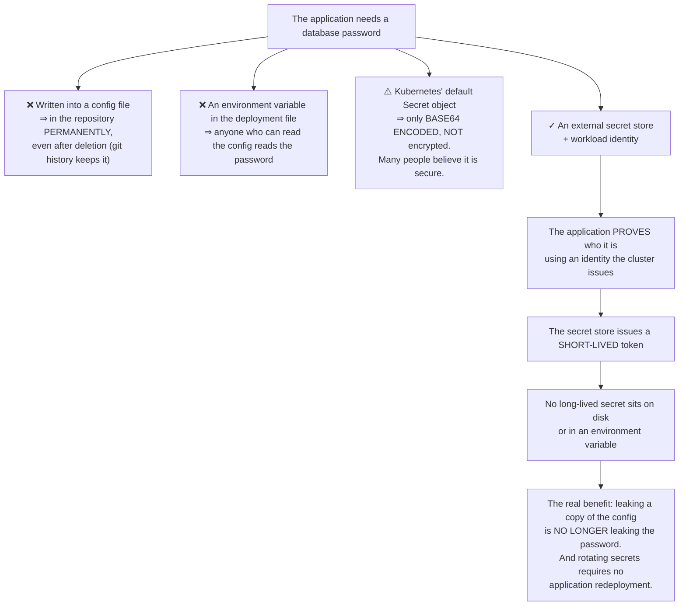
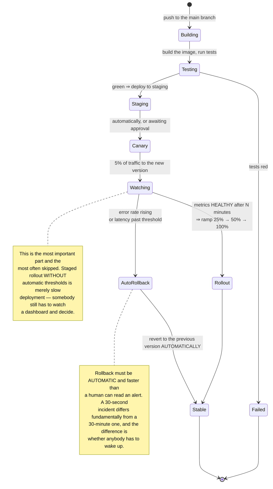
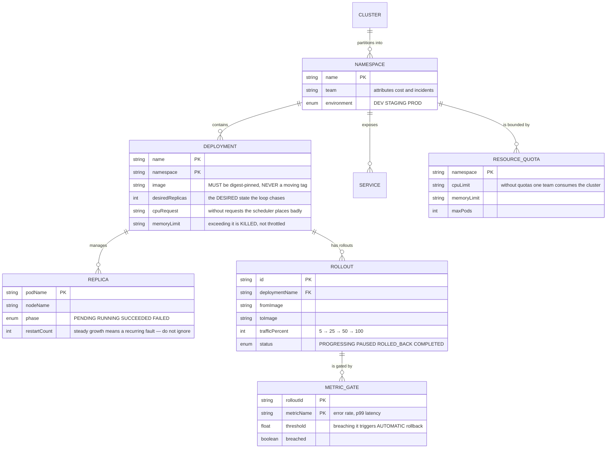

# DevOps Platform (Kubernetes + Terraform)

Throughout this roadmap you have built increasingly complex systems, and each one ended with the same question: **how do you actually run this, and keep it running?**

This project answers that. But it opens with the same warning as [Event-Driven Microservices](/projects/event-driven-microservices-uber-like):

**Most systems do not need Kubernetes.** Three services and a database on two servers with `docker compose` is a perfectly reasonable architecture, and it is cheaper, easier to debug, and has fewer things that can break.

But **do build this project**, because its central idea — **the reconciliation loop** — is one of the most elegant ideas in software engineering, and it applies well beyond infrastructure.

---

## What you will build

- Declarative infrastructure as code, rebuildable from nothing
- Automated deployment from the repository, with rollback
- Progressive delivery that halts itself when metrics degrade
- Observability: logs, metrics, traces
- Secret management that keeps secrets out of the repository
- Resilience testing by deliberately causing failures

---

## The reconciliation loop: the idea most worth learning

The familiar way of thinking is **imperative**: run this command, start that container, edit this config. The problem is that after a hundred such commands, **nobody knows what the current state is** — it is the accumulated result of everything ever typed.

Kubernetes inverts this completely:

The second consequence is the most disorienting for newcomers: **you do not fix the system, you fix the description of the system.** Editing something by hand and watching it revert after thirty seconds is everyone's shared first experience.

But it is also what makes the system trustworthy: **no manual action survives.** State always matches what the repository says.

The idea generalises far beyond Kubernetes. Whenever you have a writable "desired state" and a readable "actual state", you can write a reconciliation loop. It is a design pattern, not a feature of one tool.

---

## Infrastructure as code: and the state file problem

The same principle applied one layer down: servers, networks, databases and DNS described in files rather than clicked in a console.

The biggest trap is not syntax but the **state file** — the file the tool uses to remember what it created:

| Problem | Consequence | Handling |
|---|---|---|
| State file on someone's laptop | A colleague running it duplicates the entire infrastructure | A shared, locked remote backend |
| Two people running simultaneously | Corrupted state, orphaned resources | Locking, with the second runner waiting |
| Somebody edits by hand in the console | Drift between code and reality; the next run erases their change | Periodic drift detection with alerts |
| The state file contains database passwords | Secrets exposed somewhere nobody expects | Encrypt the state backend, restrict read access |

The last row surprises many people: **the state file contains the actual values of everything created**, including a database's initial password. It deserves the same protection as production secrets.

---

## Secrets: where every immature system leaks

The base64 point deserves emphasis because it is the most common misunderstanding in this field: the default Secret object is **only base64 encoded**, and base64 is a **character encoding, not encryption** — anyone reverses it with one command. Enable encryption at rest, and preferably use a dedicated secret store.

---

## Delivery: never switch 100% at once

Deploying a new version to all users simultaneously means one bug affects everyone, and you find out when somebody reports it.

The precondition for automatic rollback: **you need a measurable metric corresponding to "broken".** HTTP error rate, p99 latency, transaction failure rate. Without them there is nothing to compare against, and "progressive delivery" is just a name.

---

## Observability: three data types, three purposes

This is where many teams invest wrongly: collecting enormous amounts of data they cannot use.

| Type | Answers | Character | Cost |
|---|---|---|---|
| Metrics | *Is something broken?* | Numeric, aggregated, cheap, long retention | Low |
| Logs | *What happened?* | Textual, detailed, expensive at scale | High |
| Traces | *Where is it slow?* | One request across many services | Medium |

The usage order is almost always: **metrics raise the alarm → traces identify the service → logs give the detail.** Everyone starts with logs because they are familiar, but logs are the most expensive and hardest to aggregate.

Two practical points worth more than the choice of tooling:

- **Alerts must be actionable.** "CPU above 80%" is not an alert — it may be entirely normal. "Payment error rate above 1% for 5 minutes" is, because it names who is affected and what to do. Unactionable alerts get ignored, and then real alerts get ignored with them.
- **Logs must be structured.** Free-form text cannot be queried at scale. Write JSON with fields, always including a trace id — exactly as [Event-Driven Microservices](/projects/event-driven-microservices-uber-like) required.

---

## The resource model

Three fields worth naming:

`image` **pinned by digest** rather than a moving tag: a `latest` tag means two replicas started an hour apart can run **two different versions**, with no way for you to know. It also renders rollback meaningless.

`memoryLimit` — exceeding a memory limit **kills** the container rather than slowing it. This differs importantly from CPU, where exceeding causes throttling. Setting memory limits too low manufactures a restart loop.

`restartCount` **growing steadily** is the most-ignored signal: the system restarts things automatically so everything "still runs", while in reality a fault is recurring endlessly.

---

## Traps worth recording

| Symptom | Actual cause | Fix |
|---|---|---|
| Manual edits reverting themselves | The reconciliation loop doing its job | Change the declaration, not the system |
| Two replicas running different versions | A moving tag instead of a pinned digest | Pin images by digest |
| Containers restarting continuously | Memory limits set too low | Measure real usage, then set limits |
| Everything "running" while a fault recurs | Ignoring restart counts | Alert on rising restart counts |
| One team consuming the whole cluster | No per-namespace quotas | Resource quotas per namespace |
| A colleague's run duplicating infrastructure | State file on a personal machine | A shared, locked remote backend |
| Database passwords found in the state file | Not knowing state contains real values | Encrypt the backend, restrict read access |
| Secrets exposed while believed encrypted | Mistaking base64 for encryption | Enable encryption at rest, or a dedicated store |
| Secrets living forever in git history | Written into a config file | External store with short-lived tokens |
| Progressive delivery still needing a human watcher | No automatic metric thresholds | Metric gates with automatic rollback |
| So many alerts that nobody reads them | Alerting on resources rather than impact | Alert only on actionable conditions |
| Cannot locate where a request is slow | Logs only, no tracing | Distributed tracing with a propagated id |
| Rising bills with no visible cause | No per-namespace attribution | Label every resource with its team |

---

## When it is genuinely done

- [ ] Destroy the whole infrastructure and rebuild **from code alone**: the system works again
- [ ] Delete a replica by hand: it **returns** within 30 seconds with no intervention
- [ ] Kill a cluster node: its replicas are rescheduled elsewhere
- [ ] Edit a config by hand: the next reconciliation **reverts** it, and drift is reported
- [ ] Deploy a broken version: rollback happens **automatically** within 2 minutes
- [ ] Inspect any deployment file: **no** secrets in readable form
- [ ] Rotate a database password: **no** application redeployment needed
- [ ] Two people run the infrastructure tool simultaneously: the second is **blocked**, state stays intact
- [ ] A namespace exceeding its quota: **refused**, with the cluster unaffected
- [ ] Open a trace id: every hop is visible and the slow one identifiable
- [ ] Every active alert answers: who is affected, and what to do
- [ ] Container images are all digest-pinned — grepping the manifests finds no moving tags

---

## Where to go next

1. **Chaos testing.** Deliberately kill nodes, partition networks and slow disks during working hours, with a plan. If the system survives, you know rather than hope.
2. **Policy as code.** Reject non-compliant deployments — missing resource limits, running as root, moving tags — at the cluster level.
3. **Multiple clusters across regions.** And the consistency trade-offs [Distributed Database](/projects/distributed-database-postgres-like) laid out.
4. **Scheduling for specialised workloads.** Work needing gang allocation, as in [Distributed ML Training Platform](/projects/distributed-ml-training-platform), requires a scheduler that understands the constraint.
