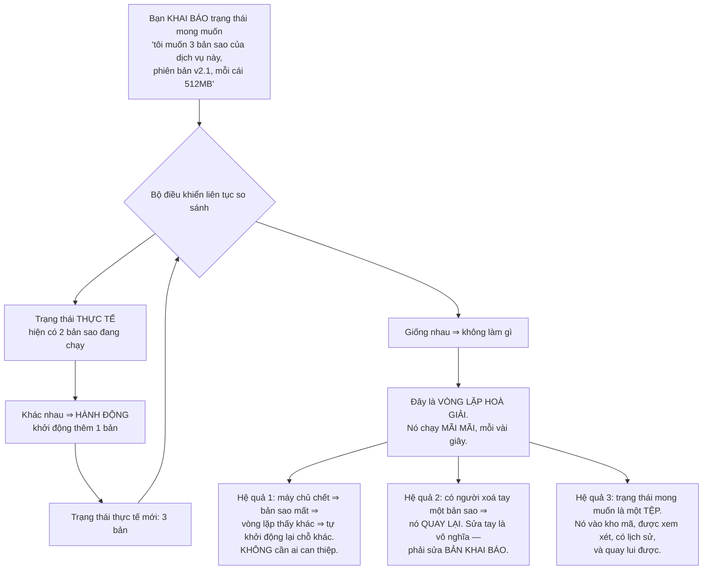
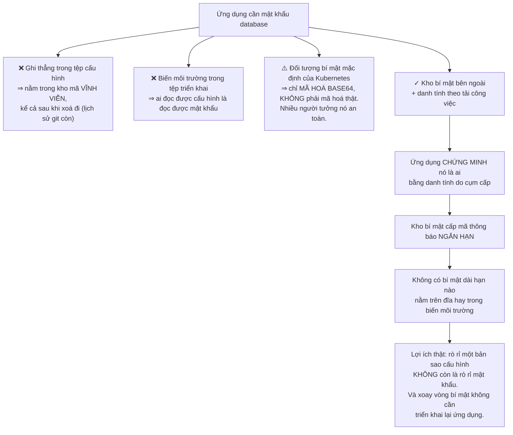
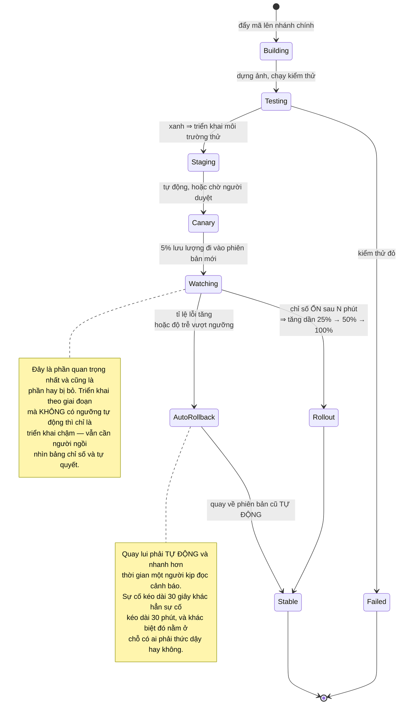
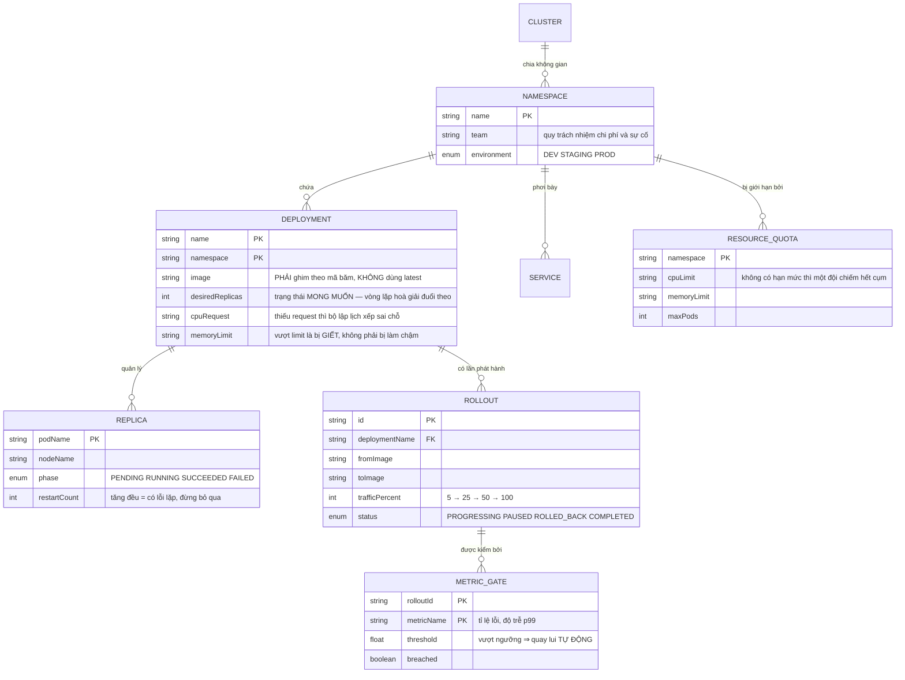

# DevOps Platform (Kubernetes + Terraform)

Suốt lộ trình này bạn đã dựng những hệ thống ngày càng phức tạp, và mỗi lần đều gặp cùng một câu hỏi ở cuối bài: **làm sao chạy nó thật, và giữ nó chạy?**

Dự án này trả lời câu đó. Nhưng nó bắt đầu bằng một lời cảnh báo giống hệt bài [Event-Driven Microservices](/projects/event-driven-microservices-uber-like):

**Phần lớn hệ thống không cần Kubernetes.** Ba dịch vụ và một database chạy trên hai máy chủ với `docker compose` là một kiến trúc hoàn toàn hợp lý, và nó rẻ hơn, dễ gỡ lỗi hơn, ít thứ hỏng hơn.

Nhưng **hãy làm dự án này**, vì ý tưởng trung tâm của nó — **vòng lặp hoà giải** — là một trong những ý tưởng đẹp nhất trong kỹ thuật phần mềm, và nó áp dụng được ở nhiều nơi ngoài hạ tầng.

---

## Bạn sẽ dựng ra cái gì

- Hạ tầng khai báo bằng mã, dựng lại được từ số không
- Triển khai tự động từ kho mã, có quay lui
- Phát hành theo giai đoạn, tự dừng khi chỉ số xấu đi
- Quan sát được: nhật ký, chỉ số, truy vết
- Quản lý bí mật không đưa vào kho mã
- Kiểm thử phục hồi bằng cách chủ động gây sự cố

---

## Vòng lặp hoà giải: ý tưởng đáng học nhất

Cách nghĩ quen thuộc là **ra lệnh**: chạy lệnh này, khởi động container kia, sửa cấu hình đó. Vấn đề là sau một trăm lệnh như vậy, **không ai biết trạng thái hiện tại là gì** — nó là kết quả tích luỹ của mọi thứ từng được gõ.

Kubernetes đảo ngược hoàn toàn:

Hệ quả thứ hai là thứ gây bối rối nhất cho người mới: **bạn không sửa hệ thống, bạn sửa mô tả về hệ thống.** Vào sửa tay một thứ rồi thấy nó tự quay lại sau ba mươi giây là trải nghiệm chung của mọi người lần đầu dùng.

Nhưng nó cũng chính là điều làm hệ thống đáng tin: **không có thao tác tay nào tồn tại lâu.** Trạng thái luôn khớp với thứ được ghi trong kho mã.

Ý tưởng này rộng hơn Kubernetes rất nhiều. Bất cứ khi nào bạn có "trạng thái mong muốn" viết được ra và "trạng thái thực tế" đọc được ra, bạn có thể viết một vòng lặp hoà giải. Nó là một mẫu hình thiết kế, không phải một tính năng của một công cụ.

---

## Hạ tầng bằng mã: và bài toán tệp trạng thái

Cùng nguyên tắc, áp cho tầng dưới: máy chủ, mạng, database, DNS đều mô tả bằng tệp thay vì bấm trên giao diện quản trị.

Cái bẫy lớn nhất không phải cú pháp mà là **tệp trạng thái** — tệp mà công cụ dùng để nhớ nó đã tạo ra những gì:

| Vấn đề | Hậu quả | Cách xử lý |
|---|---|---|
| Tệp trạng thái để trên máy cá nhân | Đồng nghiệp chạy sẽ tạo trùng toàn bộ hạ tầng | Để ở kho dùng chung có khoá |
| Hai người chạy cùng lúc | Trạng thái hỏng, tài nguyên mồ côi | Khoá khi đang chạy, ai đến sau phải chờ |
| Ai đó sửa tay trên giao diện quản trị | Lệch giữa mã và thực tế, lần chạy sau xoá mất thay đổi đó | Phát hiện lệch định kỳ và cảnh báo |
| Tệp trạng thái chứa mật khẩu database | Bí mật lộ ra ở nơi không ai ngờ | Mã hoá kho trạng thái, hạn chế quyền đọc |

Hàng cuối là điều rất nhiều người không biết: **tệp trạng thái chứa giá trị thật của mọi thứ được tạo ra**, gồm cả mật khẩu ban đầu của database. Nó phải được bảo vệ ngang với bí mật sản xuất.

---

## Bí mật: chỗ mọi hệ thống non tay đều lộ

Điểm `base64` đáng nhấn mạnh vì nó là hiểu lầm phổ biến nhất trong lĩnh vực này: đối tượng bí mật mặc định **chỉ mã hoá base64**, mà base64 là **phép mã hoá ký tự, không phải mã hoá bảo mật** — ai cũng giải ngược được trong một lệnh. Phải bật mã hoá khi lưu, và tốt hơn là dùng kho bí mật riêng.

---

## Phát hành: đừng đổi 100% cùng lúc

Triển khai phiên bản mới cho toàn bộ người dùng cùng lúc nghĩa là một lỗi ảnh hưởng tất cả, và bạn chỉ biết khi có người báo.

Điều kiện để tự động quay lui hoạt động: **phải có chỉ số đo được ứng với "hỏng".** Tỉ lệ lỗi HTTP, độ trễ ở phân vị 99, tỉ lệ giao dịch thất bại. Không có chúng thì không có gì để so, và "phát hành theo giai đoạn" chỉ còn là cái tên.

---

## Quan sát: ba loại dữ liệu, ba mục đích

Đây là chỗ nhiều đội đầu tư sai: thu thập rất nhiều dữ liệu rồi không dùng được gì.

| Loại | Trả lời câu hỏi | Đặc tính | Chi phí |
|---|---|---|---|
| Chỉ số | *Có đang hỏng không?* | Số, tổng hợp, rẻ, giữ lâu được | Thấp |
| Nhật ký | *Chuyện gì đã xảy ra?* | Văn bản, chi tiết, đắt ở quy mô lớn | Cao |
| Truy vết | *Chậm ở đâu?* | Một yêu cầu qua nhiều dịch vụ | Trung bình |

Thứ tự dùng gần như luôn là: **chỉ số báo động → truy vết chỉ ra dịch vụ nào → nhật ký cho biết chi tiết.** Ai cũng bắt đầu bằng nhật ký vì nó quen thuộc, nhưng nhật ký là thứ đắt nhất và khó tổng hợp nhất.

Hai điều thực dụng đáng giá hơn cả việc chọn công cụ:

- **Cảnh báo phải hành động được.** "CPU trên 80%" không phải cảnh báo — có thể hoàn toàn bình thường. "Tỉ lệ lỗi thanh toán vượt 1% trong 5 phút" mới là cảnh báo, vì nó nói rõ ai bị ảnh hưởng và cần làm gì. Cảnh báo không hành động được sẽ bị bỏ qua, và rồi cảnh báo thật cũng bị bỏ qua theo.
- **Nhật ký phải có cấu trúc.** Chuỗi văn bản tự do không truy vấn được ở quy mô lớn. Ghi dạng JSON có trường, luôn kèm mã truy vết — đúng như [Event-Driven Microservices](/projects/event-driven-microservices-uber-like) đã yêu cầu.

---

## Mô hình tài nguyên

Ba trường đáng nói:

`image` **ghim theo mã băm** chứ không dùng nhãn động: nhãn `latest` nghĩa là hai bản sao khởi động cách nhau một giờ có thể chạy **hai phiên bản khác nhau**, và bạn không có cách nào biết. Quay lui cũng trở nên vô nghĩa.

`memoryLimit` — vượt hạn mức bộ nhớ thì container bị **giết**, không phải bị làm chậm. Đây là khác biệt quan trọng so với CPU (vượt thì bị điều tiết). Đặt hạn mức bộ nhớ quá thấp là tự tạo ra sự cố khởi động lại liên tục.

`restartCount` **tăng đều** là dấu hiệu bị bỏ qua nhiều nhất: hệ thống tự khởi động lại nên nhìn bề ngoài mọi thứ "vẫn chạy", trong khi thực chất có một lỗi lặp lại mãi.

---

## Những cái bẫy đã được ghi lại

| Triệu chứng | Nguyên nhân thật | Cách sửa |
|---|---|---|
| Sửa tay xong nó tự quay lại | Vòng lặp hoà giải đang làm đúng việc | Sửa bản khai báo, không sửa hệ thống |
| Hai bản sao chạy hai phiên bản khác nhau | Dùng nhãn động thay vì ghim mã băm | Ghim ảnh theo mã băm |
| Container bị khởi động lại liên tục | Hạn mức bộ nhớ quá thấp | Đo mức dùng thật rồi đặt hạn mức |
| Mọi thứ "vẫn chạy" nhưng có lỗi ẩn | Bỏ qua số lần khởi động lại | Cảnh báo khi số lần khởi động lại tăng |
| Một đội chiếm hết tài nguyên cụm | Không có hạn mức theo không gian tên | Đặt hạn mức tài nguyên cho từng không gian |
| Đồng nghiệp chạy tạo trùng hạ tầng | Tệp trạng thái để trên máy cá nhân | Kho trạng thái dùng chung có khoá |
| Mật khẩu database lộ trong tệp trạng thái | Không biết tệp trạng thái chứa giá trị thật | Mã hoá kho trạng thái, hạn chế quyền đọc |
| Bí mật lộ vì tưởng đã mã hoá | Nhầm base64 là mã hoá bảo mật | Bật mã hoá khi lưu, hoặc dùng kho bí mật riêng |
| Bí mật nằm vĩnh viễn trong lịch sử git | Ghi thẳng vào tệp cấu hình | Kho bí mật ngoài, mã thông báo ngắn hạn |
| Phát hành theo giai đoạn vẫn cần người ngồi nhìn | Không có ngưỡng chỉ số tự động | Cổng chỉ số, quay lui tự động |
| Cảnh báo nhiều tới mức không ai đọc | Cảnh báo theo tài nguyên, không theo tác động | Chỉ cảnh báo thứ hành động được |
| Không truy được yêu cầu chậm ở đâu | Chỉ có nhật ký, không có truy vết | Truy vết phân tán với mã xuyên suốt |
| Hoá đơn tăng mà không rõ vì đâu | Không quy trách nhiệm theo không gian tên | Gắn nhãn đội cho mọi tài nguyên |

---

## Khi nào coi như xong

- [ ] Xoá toàn bộ hạ tầng rồi dựng lại **chỉ từ mã**: hệ thống hoạt động trở lại
- [ ] Xoá tay một bản sao: nó **quay lại** trong dưới 30 giây, không ai can thiệp
- [ ] Giết một máy chủ trong cụm: các bản sao trên đó được lập lịch lại nơi khác
- [ ] Sửa tay một cấu hình: lần hoà giải sau **hoàn nguyên** nó, và có cảnh báo lệch
- [ ] Triển khai bản có lỗi: quay lui **tự động** trong dưới 2 phút, không cần người
- [ ] Xem một tệp triển khai bất kỳ: **không** có bí mật nào ở dạng đọc được
- [ ] Xoay vòng mật khẩu database: **không** cần triển khai lại ứng dụng
- [ ] Hai người chạy công cụ hạ tầng cùng lúc: người thứ hai **bị chặn**, không làm hỏng trạng thái
- [ ] Một không gian tên cố xin quá hạn mức: **bị từ chối**, cụm không bị ảnh hưởng
- [ ] Mở một mã truy vết: thấy đủ các chặng và biết chặng nào chậm
- [ ] Mỗi cảnh báo đang bật đều trả lời được: ai bị ảnh hưởng, và phải làm gì
- [ ] Ảnh container đều ghim theo mã băm — `grep` toàn bộ tệp không thấy nhãn động

---

## Bước tiếp theo

1. **Kiểm thử hỗn loạn.** Chủ động giết máy chủ, chia mạng, làm chậm đĩa trong giờ hành chính, có kế hoạch. Nếu hệ thống chịu được thì bạn biết chắc, thay vì hy vọng.
2. **Chính sách bằng mã.** Từ chối triển khai không đạt chuẩn — thiếu hạn mức tài nguyên, chạy quyền quản trị, dùng nhãn động — ngay ở tầng cụm.
3. **Nhiều cụm ở nhiều vùng.** Và các đánh đổi nhất quán mà [Distributed Database](/projects/distributed-database-postgres-like) đã chỉ ra.
4. **Lập lịch cho tải đặc biệt.** Công việc cần cấp phát theo nhóm như ở [Distributed ML Training Platform](/projects/distributed-ml-training-platform) đòi hỏi bộ lập lịch hiểu được ràng buộc đó.
