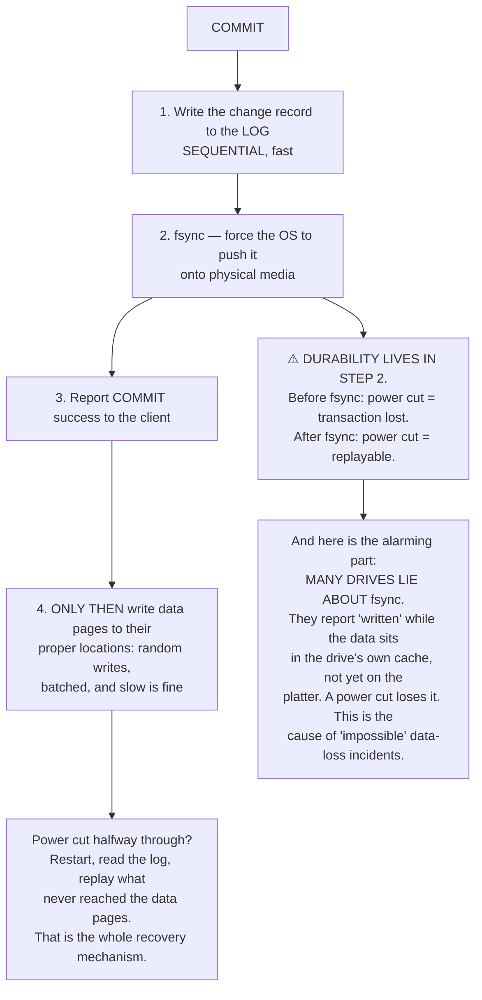
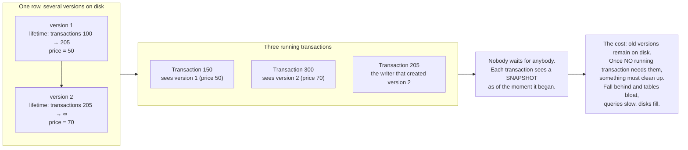
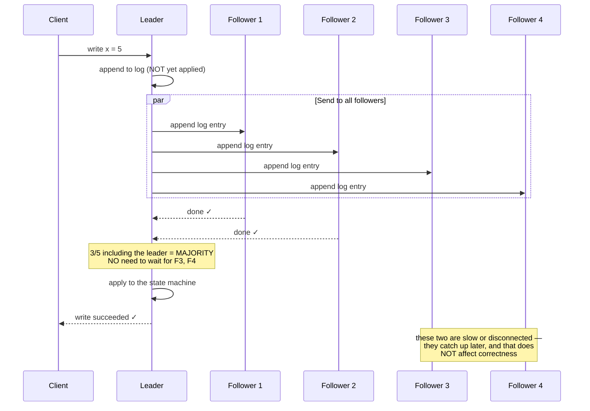
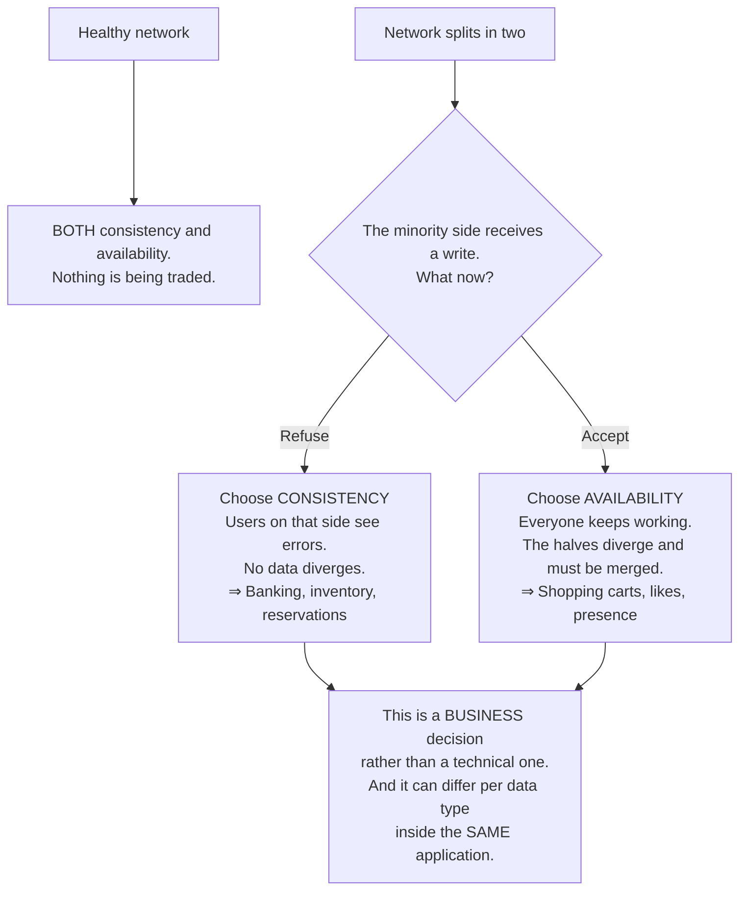
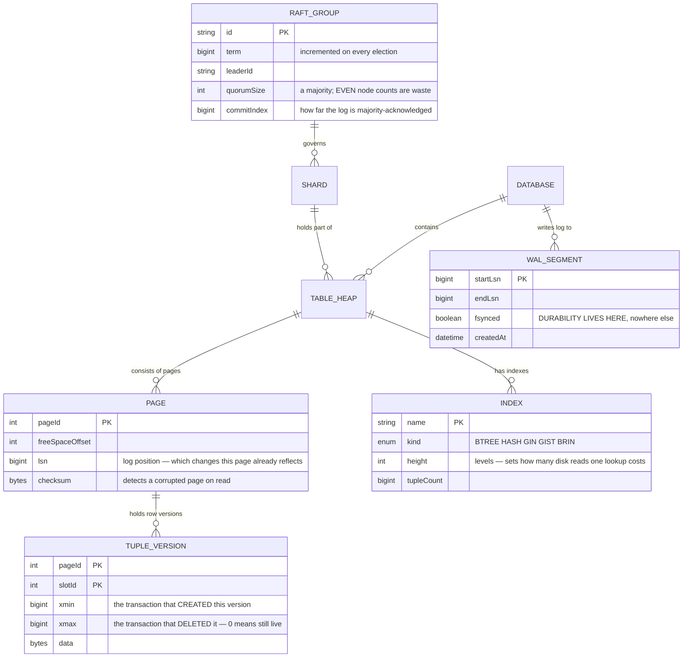

# Distributed Database (PostgreSQL-like)

Throughout this roadmap you have used a database as something that is simply correct: call `COMMIT` and the data is safe, call `SELECT` and you see consistent data, lose power and everything survives.

The final level-4 project asks: **how are those guarantees actually delivered?**

The answer is tidier than you might expect, with one surprise: **the durability of all data everywhere rests on a single system call — and many devices lie about it.**

---

## What you will build

- A storage engine with a write-ahead log and crash recovery
- Multi-version concurrency control: readers never block writers
- B-tree indexes, compared against LSM trees
- Raft consensus: leader election, log replication, quorums
- A cost-based query planner
- Sharding and distributed transactions

---

## The write-ahead log: where durability actually happens

The problem: once `COMMIT` returns, the data must survive a power cut. But writing data to its proper location on disk is a **random write** — scattered across the file, and slow.

The solution is exactly what you saw in [Distributed Message Broker](/projects/distributed-message-broker-kafka-like): **write sequentially to a log first, rearrange later.**

If you remember one thing from this project, make it the highlighted box: **`COMMIT` returns success exactly when `fsync` returns, not before.** Everything else — replication, consensus, distributed transactions — is built on that guarantee. If the hardware lies, every layer above lies too, without knowing it.

---

## MVCC: why readers do not wait for writers

The naive way to avoid reading half-written data is locking: while someone writes, nobody reads. It is correct and it makes the system unusable — a 30-second reporting query blocks every write for those 30 seconds.

What modern databases do instead: **do not modify data in place; create a new version.**

This is the **sixth** appearance of append-only in this roadmap. And its cost repeats identically: there must be a later cleanup pass, and that pass is the source of most real operational incidents.

Three situations where cleanup falls behind, all of them real:

- **Long-open transactions.** One `BEGIN` left sitting — possibly a hung connection — prevents cleanup of **every** version older than it. A single forgotten connection can bloat an entire database.
- **Heavy writes to few rows.** A view-counter table under constant update generates versions faster than cleanup removes them.
- **Replicas holding snapshots.** A long query on a replica can block cleanup on the primary, depending on configuration.

---

## B-tree versus LSM: two layouts, two performance profiles

| | B-tree | LSM tree |
|---|---|---|
| Writes | Find the right place and modify a page — **random writes** | Append to a buffer, flush sequentially |
| Reads | One path from root to leaf | May need to consult several levels |
| Write amplification | Low | High — compaction rewrites data repeatedly |
| Read amplification | Low | Higher, mitigated by Bloom filters |
| Wasted space | Partially filled pages | Old versions awaiting compaction |
| Suits | Read-heavy work, range scans | Write-heavy work |

An observation worth more than the table: **the immutable-segments-then-compact structure of LSM trees is exactly what you met in [Distributed Search Engine](/projects/distributed-search-engine)**. Search engines, message brokers and write-heavy storage engines converge on one design, because of one hardware constraint: sequential writes beat random ones by orders of magnitude.

---

## Consensus: how several machines agree on one thing

Replication raises a question a single machine never faces: **when replicas disagree, who is right?**

Raft answers with three ideas, and their virtue is being simple enough to implement correctly:

The three ideas:

1. **A majority, not everyone.** With 5 nodes, 3 suffice. That means tolerating the loss of 2 while still accepting writes. With 3 nodes you tolerate 1.
2. **Any two majorities intersect.** This is the mathematical reason it works: two leaders cannot both win a majority in the same term, because any two majority sets of one cluster share at least one node, and that node does not vote twice.
3. **The log is the source of truth.** State is the result of replaying the log. Again, the principle from [Message Broker](/projects/distributed-message-broker-kafka-like).

A practical consequence worth remembering: **an even node count is waste.** A 4-node cluster needs a majority of 3, tolerating exactly 1 loss — identical to a 3-node cluster, with an extra machine to pay for. Always use odd numbers.

---

## CAP: stated correctly, because it is usually stated wrongly

The popular framing "pick 2 of 3: consistency, availability, partition tolerance" misleads, because it implies you can decline partition tolerance. You cannot — **network partitions happen to you, they are not something you choose.**

The correct statement is much tighter:

> **When the network partitions, you must choose between consistency and availability. When it is not partitioned, you have both.**

That last box is worth carrying away: do not declare "we are a CP system" or "an AP system" for everything you build. Account balances need consistency; a recently-viewed products list does not. A mature application chooses **per data type**.

---

## The planner: why it sometimes chooses badly

One `SELECT` has many possible executions: full scan or index, nested loop or hash join, which table first. The gap between the best and worst plan can be **thousands of times**.

The planner estimates each option's cost and picks the cheapest. It relies on **statistics**: how many rows a table holds, how many distinct values a column has, how they are distributed.

Three reasons it chooses badly, all encountered in practice:

- **Stale statistics.** Load a million rows without reanalysing and the planner still believes the table is empty, so it picks a full scan.
- **Correlated columns.** It assumes predicates are independent. `WHERE city = 'Hanoi' AND area_code = '024'` is effectively one condition, but it multiplies two selectivities and underestimates by a hundredfold.
- **Custom functions.** There are no statistics for `WHERE my_function(x) = 1`, so it guesses — usually wrongly.

The general lesson: **`EXPLAIN ANALYZE` shows both the estimate and the actual.** When those two numbers differ by orders of magnitude, you have found why the query is slow — and it is almost never "the database is slow".

---

## Internal structures

The `xmin`/`xmax` pair on `TUPLE_VERSION` is the whole of MVCC in two integers: a row is "visible" to a transaction when the transaction that created it finished earlier, and the transaction that deleted it has not finished (or does not exist). There is no lock here at all — only integer comparison.

---

## Traps worth recording

| Symptom | Actual cause | Fix |
|---|---|---|
| Transactions lost despite `COMMIT` | The drive lies about `fsync` | Test with a dedicated tool; disable the drive write cache |
| Tables bloating while row counts stay flat | Old versions never cleaned | Find the long-open transaction; it is almost always the cause |
| One hung connection slowing the whole database | An unclosed `BEGIN` blocking all cleanup | Idle-transaction timeouts |
| A fast query suddenly slow after a data load | Stale statistics, wrong plan | Reanalyse after bulk loads |
| Row estimates off by a hundredfold | The planner assuming column independence | Multi-column statistics, or rewrite the query |
| A 4-node cluster no more fault tolerant than 3 | A majority of 4 is still 3 | Always use odd node counts |
| Two leaders at once, data diverging | Elections not requiring a majority | Quorum, and one vote per node per term |
| Writes very slow when one replica is slow | Waiting for **all** replicas instead of a majority | Acknowledge on majority |
| Crash recovery taking hours | A long log with sparse checkpoints | More frequent checkpoints (traded against runtime cost) |
| A distributed transaction hanging the cluster | 2PC blocking when the coordinator dies | Timeouts, and a recoverable protocol |
| Replica reads returning stale data | Asynchronous replication | Read from the leader, or accept it and say so |
| "The database is slow" | Almost always the query plan, not the database | `EXPLAIN ANALYZE`, comparing estimates to actuals |

---

## When it is genuinely done

- [ ] Cut power abruptly (not a clean shutdown) mid-write: on restart, **every** committed transaction survives
- [ ] Run an `fsync` verification tool on your hardware: confirm the drive is **not** lying
- [ ] A 60-second read query: blocks **no** writes
- [ ] Open a transaction and leave it for an hour: the system **warns** that cleanup is blocked
- [ ] Kill the leader in a 5-node cluster: re-election completes in under 2 seconds with no acknowledged data lost
- [ ] Isolate 2 nodes from a cluster of 5: the 3-node side **keeps serving**, the 2-node side **refuses writes**
- [ ] Split a 5-node cluster 2+3 then rejoin: **no** divergent data
- [ ] `EXPLAIN ANALYZE` across 10 queries: estimates within an order of magnitude of actuals
- [ ] Load 10 million rows then query immediately: the plan is still sensible (or you know to reanalyse)
- [ ] Compare write amplification between B-tree and LSM engines on identical load: the difference matches theory

---

## Where to go next

1. **Real distributed transactions.** 2PC blocks when the coordinator dies; modern approaches use timestamps or bounded-error clocks. This is the frontier of the field.
2. **Distributed query execution.** Pushing filters down to shards, joining across them — precisely the problem of [Cloud-native Data Platform](/projects/cloud-native-data-platform).
3. **Verify yourself with chaos testing.** Generate random concurrent schedules and check invariants. This is how the genuinely serious bugs get found.
4. **Storage separated from compute.** A storage layer on the object store you built in [Cloud Storage System](/projects/cloud-storage-system-s3-like), with compute scaling independently.
