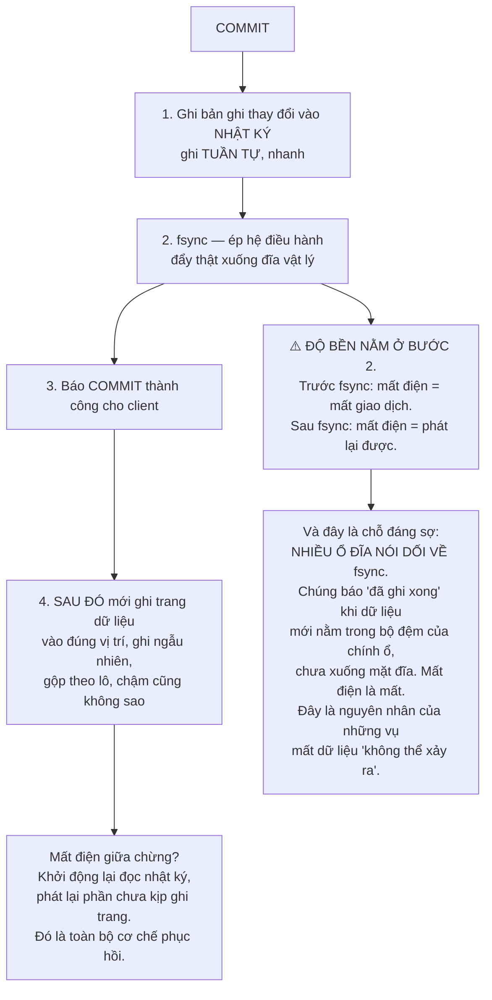
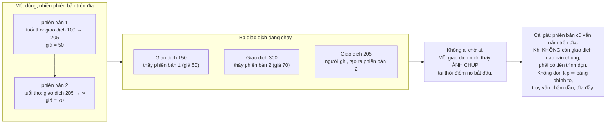
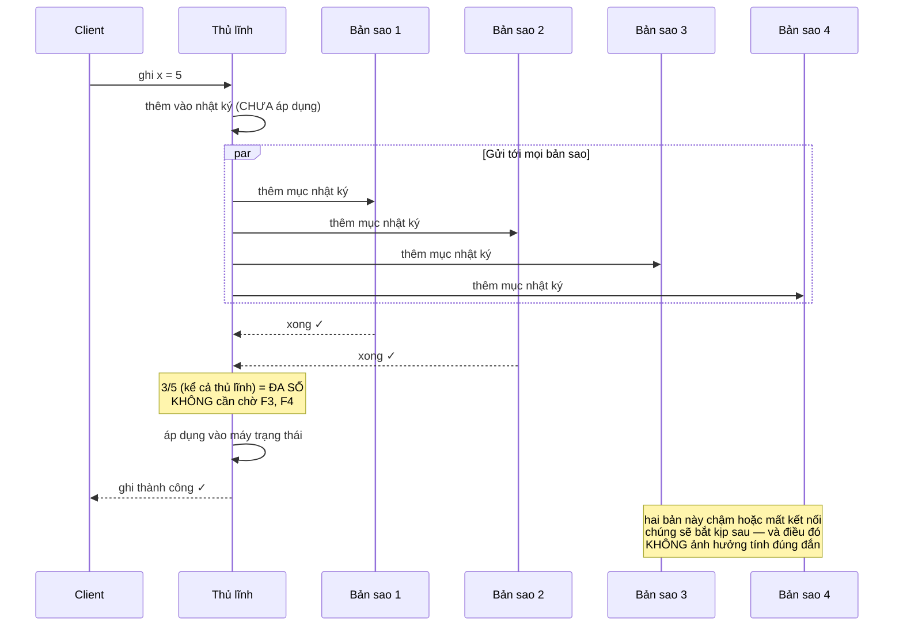
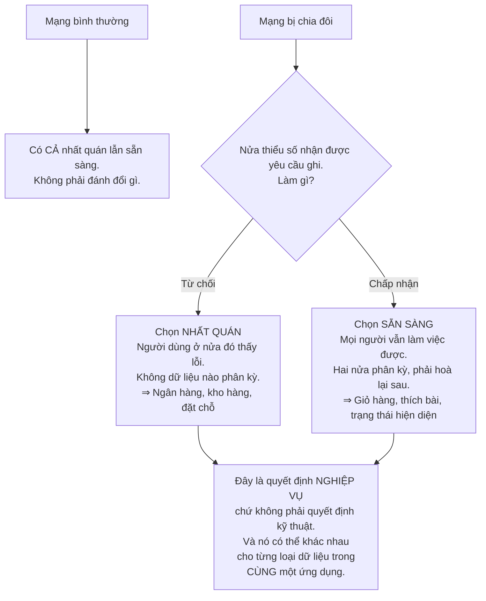
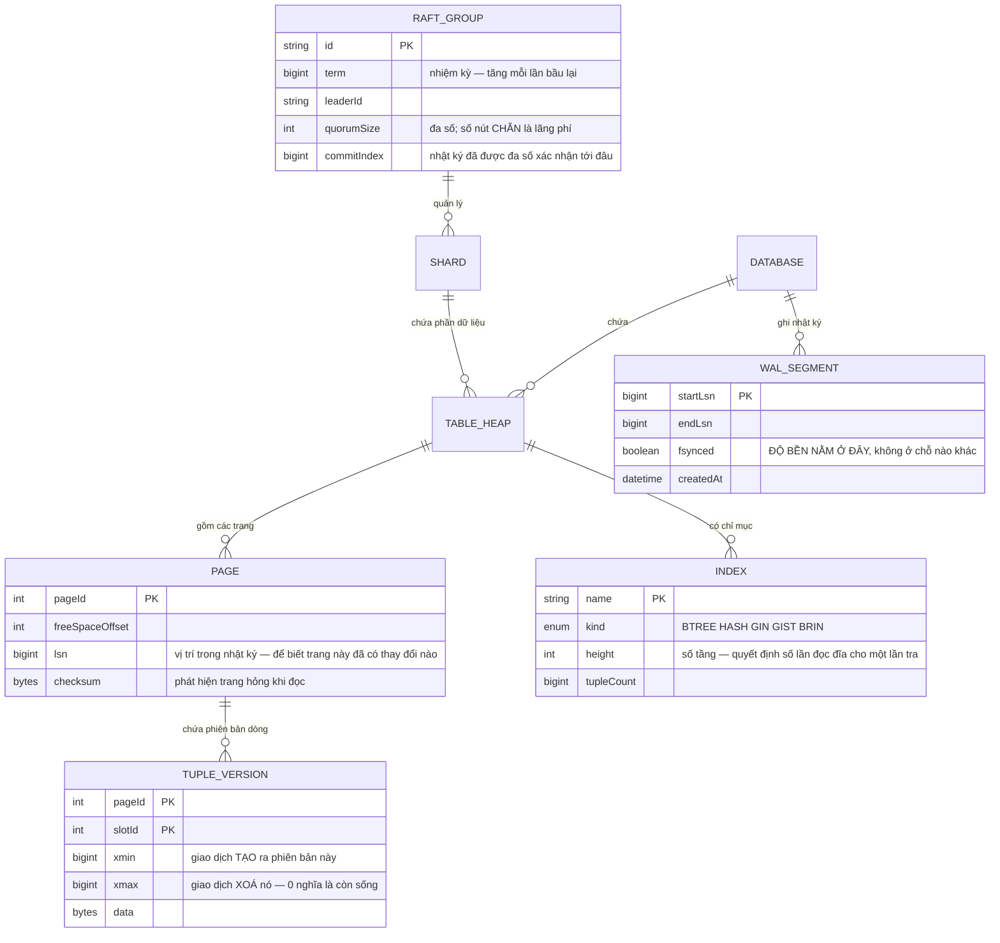

# Distributed Database (PostgreSQL-like)

Suốt lộ trình này bạn đã dùng database như một thứ luôn đúng: gọi `COMMIT` thì dữ liệu an toàn, gọi `SELECT` thì thấy dữ liệu nhất quán, mất điện thì mọi thứ vẫn còn nguyên.

Dự án cuối của cấp 4 hỏi: **những bảo đảm đó được thực hiện bằng cách nào?**

Câu trả lời gọn hơn bạn tưởng và có một điểm bất ngờ: **độ bền của toàn bộ dữ liệu trên đời phụ thuộc vào một lời gọi hệ thống duy nhất — và nhiều thiết bị nói dối về nó.**

---

## Bạn sẽ dựng ra cái gì

- Công cụ lưu trữ có nhật ký ghi trước và phục hồi sau sự cố
- Điều khiển đồng thời nhiều phiên bản: người đọc không chặn người ghi
- Chỉ mục B-tree, và so sánh với cây LSM
- Đồng thuận Raft: bầu thủ lĩnh, sao chép nhật ký, ngưỡng đa số
- Bộ lập kế hoạch truy vấn dựa trên chi phí
- Phân mảnh và giao dịch phân tán

---

## Nhật ký ghi trước: nơi độ bền thật sự xảy ra

Bài toán: `COMMIT` xong thì dữ liệu phải sống sót qua mất điện. Nhưng ghi dữ liệu vào đúng vị trí của nó trên đĩa là **ghi ngẫu nhiên** — rải rác khắp file, chậm.

Lời giải giống hệt thứ bạn đã thấy ở [Distributed Message Broker](/projects/distributed-message-broker-kafka-like): **ghi tuần tự vào một nhật ký trước, sắp xếp lại sau.**

Nếu bạn chỉ nhớ một điều từ dự án này thì hãy nhớ ô màu ở giữa: **`COMMIT` trả về thành công tại đúng thời điểm `fsync` trả về, không sớm hơn.** Mọi thứ khác — nhân bản, đồng thuận, giao dịch phân tán — đều xây trên bảo đảm đó. Nếu phần cứng nói dối, mọi tầng bên trên đều nói dối theo mà không hề biết.

---

## MVCC: vì sao người đọc không phải chờ người ghi

Cách ngây thơ để tránh đọc dữ liệu dở dang là khoá: ai ghi thì người khác không đọc được. Nó đúng và nó khiến hệ thống không dùng được — một truy vấn báo cáo chạy 30 giây sẽ chặn mọi thao tác ghi trong 30 giây đó.

Cách mà các database hiện đại dùng: **đừng sửa dữ liệu tại chỗ, hãy tạo phiên bản mới.**

Đây là **lần thứ sáu** nguyên tắc chỉ-ghi-thêm xuất hiện trong lộ trình. Và cái giá của nó cũng lặp lại y hệt: phải có bước dọn về sau, và bước dọn đó là nguồn của phần lớn sự cố vận hành thực tế.

Ba tình huống khiến việc dọn không theo kịp, đều là sự cố thật:

- **Giao dịch mở lâu.** Một phiên `BEGIN` rồi để đó — có thể là một kết nối treo — khiến **mọi** phiên bản cũ hơn nó không được dọn. Một kết nối bị quên có thể làm phình cả database.
- **Ghi rất nhiều vào ít dòng.** Bảng đếm lượt xem cập nhật liên tục sinh ra phiên bản nhanh hơn tốc độ dọn.
- **Bản sao giữ ảnh chụp.** Truy vấn dài trên bản sao có thể chặn việc dọn ở bản chính, tuỳ cấu hình.

---

## B-tree và LSM: hai cách sắp dữ liệu, hai hồ sơ hiệu năng

| | B-tree | Cây LSM |
|---|---|---|
| Ghi | Tìm đúng chỗ rồi sửa trang — **ghi ngẫu nhiên** | Ghi thêm vào bộ đệm rồi xả ra tuần tự |
| Đọc | Một đường đi từ gốc xuống lá | Có thể phải hỏi nhiều tầng |
| Khuếch đại ghi | Thấp | Cao — gộp tầng ghi lại dữ liệu nhiều lần |
| Khuếch đại đọc | Thấp | Cao hơn, giảm bằng bộ lọc Bloom |
| Không gian thừa | Trang chưa đầy | Bản cũ chờ gộp |
| Hợp với | Đọc nhiều, cần quét khoảng | Ghi rất nhiều |

Nhận xét đáng giá hơn cả bảng: **cấu trúc phân đoạn bất biến rồi gộp của LSM chính là thứ bạn đã gặp ở [Distributed Search Engine](/projects/distributed-search-engine)**. Công cụ tìm kiếm, message broker, và công cụ lưu trữ ghi-nhiều đều hội tụ về cùng một thiết kế, vì cùng một ràng buộc phần cứng: ghi tuần tự nhanh hơn ghi ngẫu nhiên rất nhiều bậc.

---

## Đồng thuận: làm sao nhiều máy đồng ý về một thứ

Nhân bản đặt ra một câu hỏi mà một máy đơn không có: **khi các bản sao bất đồng, ai đúng?**

Raft trả lời bằng ba ý tưởng, và điều đáng quý là chúng đủ đơn giản để cài đặt đúng:

Ba ý tưởng:

1. **Đa số, không phải tất cả.** Với 5 nút, 3 nút là đủ. Nghĩa là chịu được mất 2 nút mà vẫn ghi được. Với 3 nút thì chịu được mất 1.
2. **Hai đa số bất kỳ luôn giao nhau.** Đây là lý do toán học khiến nó đúng: không thể có hai thủ lĩnh cùng nhiệm kỳ được đa số bầu, vì hai tập đa số của cùng một cụm luôn có ít nhất một nút chung, và nút đó không bỏ phiếu hai lần.
3. **Nhật ký là nguồn sự thật.** Trạng thái là kết quả của việc phát lại nhật ký. Lại chính là nguyên tắc từ [Message Broker](/projects/distributed-message-broker-kafka-like).

Hệ quả thực tế cần nhớ: **số nút chẵn là lãng phí.** Cụm 4 nút cần đa số là 3, tức chỉ chịu được mất 1 — giống hệt cụm 3 nút, mà tốn thêm một máy. Luôn dùng số lẻ.

---

## CAP: phát biểu đúng, vì nó thường bị nói sai

Cách nói phổ biến "chọn 2 trong 3: nhất quán, sẵn sàng, chịu phân mảnh" gây hiểu nhầm, vì nó gợi ý rằng bạn có thể chọn bỏ chịu phân mảnh. Bạn không thể — **phân mảnh mạng là thứ xảy ra với bạn, không phải thứ bạn chọn.**

Phát biểu đúng gọn hơn nhiều:

> **Khi mạng bị phân mảnh, bạn phải chọn giữa nhất quán và sẵn sàng. Lúc không phân mảnh thì có cả hai.**

Khung cuối là điều đáng mang theo: đừng chọn "chúng tôi là hệ CP" hay "hệ AP" cho cả hệ thống. Số dư tài khoản cần nhất quán; danh sách sản phẩm đã xem thì không. Một ứng dụng chín chắn chọn **theo từng loại dữ liệu**.

---

## Bộ lập kế hoạch: vì sao đôi khi nó chọn sai

Cùng một câu `SELECT` có nhiều cách thực hiện: quét toàn bảng hay dùng chỉ mục, nối lồng nhau hay nối băm, nối bảng nào trước. Chênh lệch giữa cách tốt nhất và cách tệ nhất có thể là **hàng nghìn lần**.

Bộ lập kế hoạch ước lượng chi phí từng cách rồi chọn cái rẻ nhất. Nó dựa trên **thống kê**: bảng có bao nhiêu dòng, cột có bao nhiêu giá trị khác nhau, phân bố ra sao.

Ba lý do nó chọn sai, và cả ba đều gặp trong thực tế:

- **Thống kê cũ.** Vừa nạp một triệu dòng mà chưa phân tích lại thì bộ lập kế hoạch vẫn tưởng bảng rỗng và chọn quét toàn bảng.
- **Tương quan giữa các cột.** Nó giả định các điều kiện độc lập với nhau. `WHERE thành_phố = 'Hà Nội' AND mã_vùng = '024'` thực chất là một điều kiện, nhưng nó nhân hai độ chọn lọc và ước lượng ít hơn thực tế cả trăm lần.
- **Hàm tự viết.** Không có thống kê cho `WHERE my_function(x) = 1`, nên nó đoán — thường là đoán sai.

Bài học chung: **`EXPLAIN ANALYZE` cho bạn thấy cả ước lượng lẫn số thật.** Khi hai con số đó lệch nhau nhiều bậc, bạn đã tìm ra nguyên nhân truy vấn chậm — và nó gần như không bao giờ là "database chậm".

---

## Cấu trúc bên trong

Cặp `xmin`/`xmax` trên `TUPLE_VERSION` là toàn bộ cơ chế MVCC gói trong hai số nguyên: một dòng "hiển thị" với một giao dịch khi giao dịch tạo ra nó đã kết thúc trước, và giao dịch xoá nó chưa kết thúc (hoặc không tồn tại). Không có khoá nào ở đây cả — chỉ là so sánh số.

---

## Những cái bẫy đã được ghi lại

| Triệu chứng | Nguyên nhân thật | Cách sửa |
|---|---|---|
| Mất giao dịch dù đã `COMMIT` | Ổ đĩa nói dối về `fsync` | Kiểm bằng công cụ chuyên dụng, tắt bộ đệm ghi của ổ |
| Bảng phình to dù số dòng không tăng | Phiên bản cũ không được dọn | Tìm giao dịch mở lâu, đó gần như luôn là nguyên nhân |
| Một kết nối treo làm chậm cả database | `BEGIN` không đóng chặn mọi việc dọn | Thời hạn cho giao dịch nhàn rỗi |
| Truy vấn nhanh bỗng chậm sau khi nạp dữ liệu | Thống kê cũ, kế hoạch sai | Phân tích lại sau khi nạp lô lớn |
| Ước lượng số dòng lệch trăm lần | Bộ lập kế hoạch giả định cột độc lập | Thống kê nhiều cột, hoặc viết lại truy vấn |
| Cụm 4 nút không chịu lỗi tốt hơn cụm 3 | Đa số của 4 vẫn là 3 | Luôn dùng số nút lẻ |
| Hai thủ lĩnh cùng lúc, dữ liệu phân kỳ | Bầu chọn không đòi hỏi đa số | Ngưỡng đa số, và mỗi nút bỏ phiếu một lần mỗi nhiệm kỳ |
| Ghi rất chậm khi có bản sao chậm | Chờ **mọi** bản sao thay vì đa số | Xác nhận theo đa số |
| Phục hồi sau sự cố mất hàng giờ | Nhật ký quá dài, ít điểm kiểm tra | Điểm kiểm tra dày hơn (đổi lấy chi phí lúc chạy) |
| Giao dịch phân tán treo cả cụm | 2PC bị chặn khi điều phối viên chết | Thời hạn, và giao thức có thể phục hồi |
| Đọc trên bản sao thấy dữ liệu cũ | Nhân bản bất đồng bộ | Đọc từ thủ lĩnh, hoặc chấp nhận và nói rõ |
| "Database chậm" | Gần như luôn là kế hoạch truy vấn, không phải database | `EXPLAIN ANALYZE` và so ước lượng với số thật |

---

## Khi nào coi như xong

- [ ] Cắt điện đột ngột (không phải tắt máy êm) trong lúc ghi: khởi động lại, **mọi** giao dịch đã `COMMIT` còn nguyên
- [ ] Chạy công cụ kiểm `fsync` trên phần cứng của bạn: xác nhận ổ **không** nói dối
- [ ] Truy vấn đọc chạy 60 giây: **không** chặn thao tác ghi nào
- [ ] Mở một giao dịch rồi để đó 1 giờ: hệ thống **cảnh báo** về việc dọn bị chặn
- [ ] Giết thủ lĩnh trong cụm 5 nút: bầu lại xong dưới 2 giây, không mất dữ liệu đã xác nhận
- [ ] Cô lập 2 nút khỏi cụm 5: nhóm 3 nút **tiếp tục phục vụ**, nhóm 2 nút **từ chối ghi**
- [ ] Chia cụm 5 nút thành 2+3 rồi nối lại: **không** có dữ liệu phân kỳ
- [ ] Chạy `EXPLAIN ANALYZE` trên 10 truy vấn: ước lượng và số thật lệch dưới 10 lần
- [ ] Nạp 10 triệu dòng rồi truy vấn ngay: kế hoạch vẫn hợp lý (hoặc bạn biết phải phân tích lại)
- [ ] So khuếch đại ghi giữa công cụ B-tree và LSM trên cùng tải: chênh lệch đúng như lý thuyết dự đoán

---

## Bước tiếp theo

1. **Giao dịch phân tán thật.** 2PC bị chặn khi điều phối viên chết; các cách hiện đại dùng mốc thời gian hoặc đồng hồ có biên sai số. Đây là biên giới của lĩnh vực.
2. **Thực thi truy vấn phân tán.** Đẩy phép lọc xuống từng mảnh, nối bảng giữa các mảnh — chính là bài toán của [Cloud-native Data Platform](/projects/cloud-native-data-platform).
3. **Tự kiểm chứng bằng kiểm thử hỗn loạn.** Sinh ngẫu nhiên các lịch trình đồng thời và kiểm bất biến. Đây là cách các lỗi thật sự nghiêm trọng được tìm ra.
4. **Lưu trữ tách rời tính toán.** Tầng lưu trữ nằm trên kho đối tượng bạn đã dựng ở [Cloud Storage System](/projects/cloud-storage-system-s3-like), tầng tính toán co giãn độc lập.
