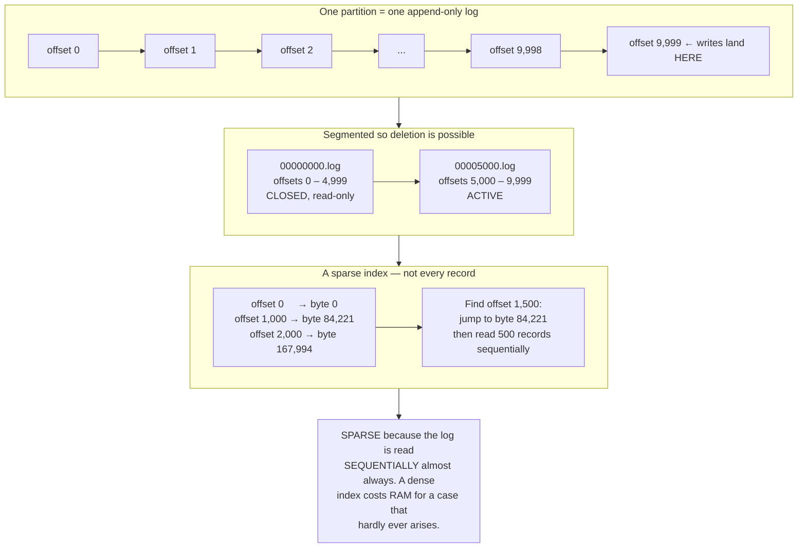
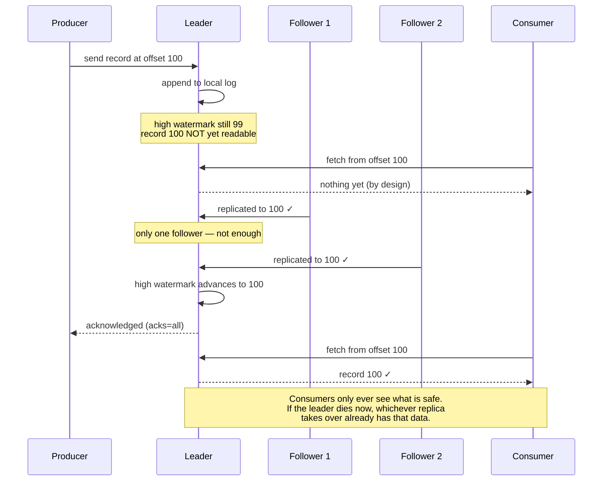
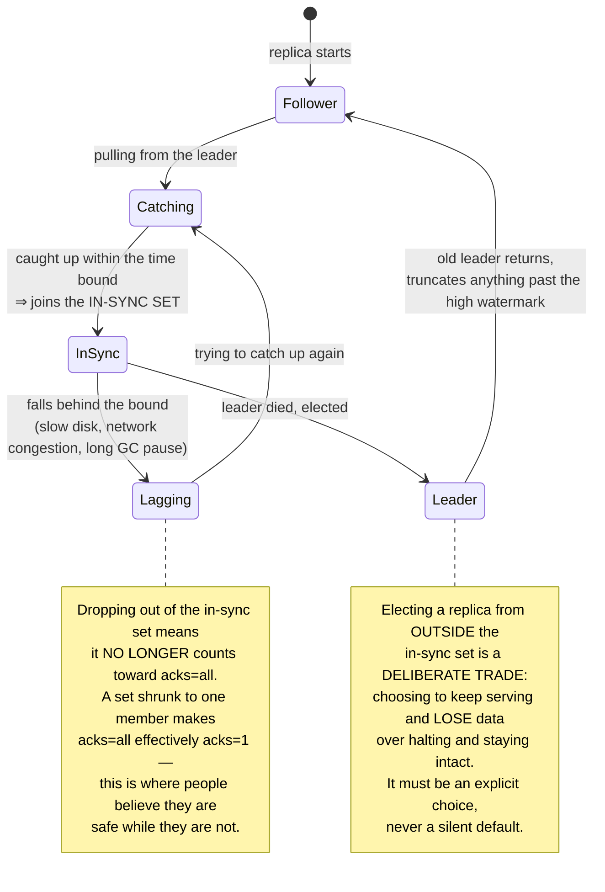
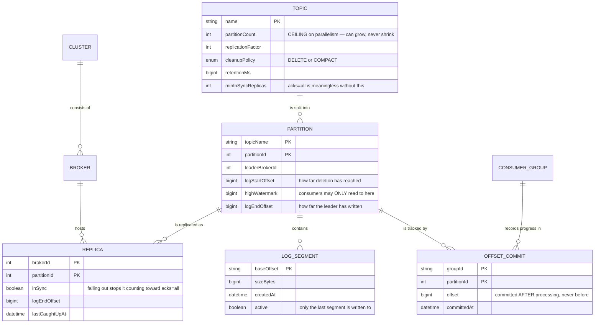
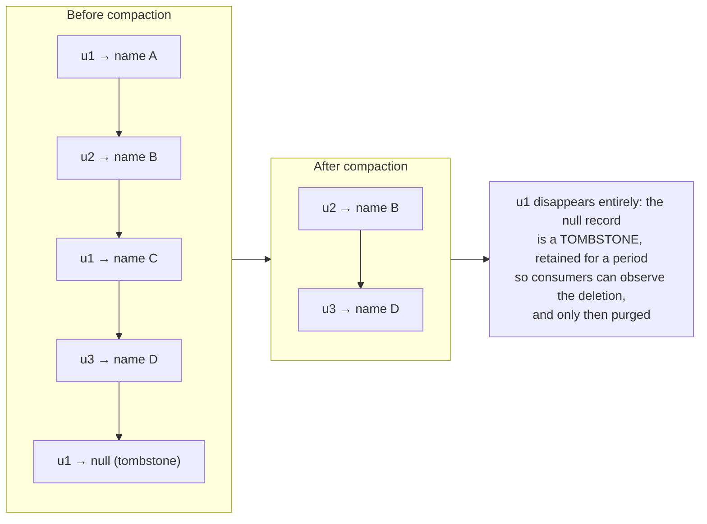

# Distributed Message Broker (Kafka-like)

In [Event-Driven Microservices](/projects/event-driven-microservices-uber-like) you used Kafka as a black box: push events in, receive them at the other end, choose a partition key to preserve ordering. It worked and you never needed to know why.

This project opens the box. And the most surprising thing on opening it is that **there is nothing complicated inside.** No balanced trees, no elaborate indexes, no clever algorithms. Just **a file that gets appended to.**

The entire value of this project is understanding why something that simple outperforms every "clever" design you might invent — and what it costs to make it trustworthy when machines die.

---

## What you will build

- An append-only log, segmented and indexed by offset
- Topics split into partitions, each partition replicated
- Leader election and an in-sync replica set
- Consumer groups that rebalance as members join and leave
- Retention by time, by size, and by key compaction
- Idempotent producers and transactions across partitions
- A binary TCP protocol with batching and compression

---

## The append-only log: why simple is fast

Intuition says disks are slow, so you need a clever structure to minimise writes. That intuition is wrong in an interesting way.

Disks are slow at **random seeks**, not at **sequential writes**. The gap is not small:

| Operation | Typical throughput |
|---|---|
| Random writes on a spinning disk | ~100 operations/second |
| Sequential writes on a spinning disk | ~100 MB/second |
| Random writes on SSD | ~50,000 operations/second |
| Sequential writes on SSD | ~500 MB/second |

Sequential writes on a **spinning disk** can beat random writes on an **SSD**. That is why a structure that only knows how to append beats every clever balanced tree.



Three decisions above, each contrary to ordinary intuition:

**Segment to enable deletion.** Removing old data from one enormous file means rewriting it. Split across files and removing old data is an `unlink` — effectively instantaneous regardless of size.

**A sparse index.** Record a marker every few thousand entries. Since the read pattern is overwhelmingly sequential, nobody frequently needs to jump to a single record. A dense index spends RAM on a rare case.

**Do not manage your own cache.** This is the most surprising one: the system does **not** build an in-process cache layer. It writes to files and lets the **operating system page cache** do the work. The reasoning: data just written is almost certainly still in the page cache when a consumer reads it milliseconds later — so "reading from disk" never touches disk. Building your own cache means the same data occupies RAM twice, and the garbage collector must manage a mountain of objects.

### Zero-copy transfer

The usual path for a byte going from file to network involves four copies and two context switches. One system call skips almost all of it:

```java
// Usual path: disk → kernel buffer → app buffer → socket buffer → network
byte[] buf = new byte[8192];
while (in.read(buf) > 0) out.write(buf);     // data DETOURS through the process

// transferTo: disk → kernel buffer → network. Data NEVER enters the process.
fileChannel.transferTo(position, count, socketChannel);
```

This is only possible because consumers read **exactly the bytes** that were stored — no format conversion step. That is why the on-disk record format and the on-the-wire format must be **identical**. A boring-sounding design decision that enables the system's single largest optimisation.

---

## Replication: the high watermark, and where data really gets lost

This is the hardest part, and what separates a toy queue from a system you would trust.

Each partition has a leader accepting writes and several followers trailing behind. The question: **when is a record safe enough for consumers to read?**

Serve it as soon as the leader has written it, and a leader dying before replication means consumers have already read a record that **no longer exists** on the new leader. That is a particularly nasty form of data loss.

The answer is the **high watermark**: consumers may only read up to the offset that **every in-sync replica** already holds.



### Three acknowledgement levels, and what each gives up

| `acks` | Producer waits for | Loses data when | Suited to |
|---|---|---|---|
| `0` | Nothing | A dropped packet is gone and nobody knows | Metrics, access logs |
| `1` | The leader's local write | The leader dies before replication | An old default, rarely right now |
| `all` | Every in-sync replica | Only when **all** replicas die together | Financial data, orders |

But `acks=all` **is not sufficient on its own**. If the in-sync replica set has shrunk to exactly one member — the leader — then "all in-sync replicas have written" means "the leader has written". You believe you are safe while actually running at `acks=1`. Set a minimum threshold as well, and when it cannot be met, **refuse the write** rather than quietly downgrading your guarantee.



That second note is one of the most expensive lessons in distributed systems: **when every in-sync replica dies, you must choose between availability and integrity.** There is no third option, and any system that appears to offer one is hiding the trade somewhere else.

---

## Consumer groups and the rebalance nightmare

Several processes read one topic, with each partition assigned to exactly **one** member. That is why **partition count is the ceiling on parallelism**: with 10 partitions, the 11th member onwards sits idle.

When a member joins or leaves, partitions must be reassigned. The naive approach — stop everyone, reassign, resume — produces what is called a **stop-the-world** rebalance: every member halts for several seconds, including ones not affected at all.

Three things make it far worse than expected:

- **Rebalance loops.** A member takes too long on a batch, misses its heartbeat deadline, is presumed dead, triggers a rebalance. The rebalance slows everyone further, more members miss deadlines, another rebalance. A group can stay stuck in this loop indefinitely, processing nothing.
- **Rolling deployments.** Restarting 10 members one at a time is 20 rebalances (each leaves and rejoins).
- **A rebalance means re-reading.** A member receiving a partition starts from the committed offset, so records already processed but not yet committed get processed **again**.

That last point leads straight back to the lesson from [Event-Driven Microservices](/projects/event-driven-microservices-uber-like): **consumers must be idempotent**. Not because the queue is deficient, but because rebalances are routine and they always bring duplicate processing.

Ways to reduce the pain, most effective first: move heartbeats to a separate thread (so slow processing is not read as death), shrink batch sizes, use incremental rebalancing (move only the partitions that must move rather than revoking everything), and assign stable member identifiers so quick restarts do not trigger a rebalance at all.

---

## Cluster metadata



Two columns worth pausing on:

`partitionCount` **can grow but never shrink**, and growing has consequences: key `k` that used to land in partition 3 may now land in partition 7, so **per-key ordering breaks** at exactly that moment. For data that needs ordering, growing partitions is a planned operation, not a button.

The `offset` in `OFFSET_COMMIT` must be committed **after** processing. Committing first and processing after means a process death in between **skips** the record permanently — trading duplication for loss, almost always the wrong trade.

---

## Retention: delete by time, or compact by key

Two entirely different policies, and choosing wrong either loses data or fills the disk:

**Delete.** Keep seven days, then drop old segments. Right for event streams: a click from last week no longer means anything.

**Compaction by key.** Keep the **last record for each key**, forever. The topic becomes a replayable table of current state. A newcomer reading from the beginning can rebuild the entire state without a separate database.



Tombstones again — the third appearance in this roadmap, after [Figma-like](/projects/realtime-collaboration-figma-like) and [Distributed Search Engine](/projects/distributed-search-engine). The same constraint produces the same answer: **delete immediately and consumers have no way to learn the deletion happened.**

---

## Traps worth recording

| Symptom | Actual cause | Fix |
|---|---|---|
| Records lost despite `acks=all` | In-sync set shrunk to one member | Set a minimum, refuse writes below it |
| Data lost after a leader dies | An out-of-sync replica was elected | Disable unclean election, or choose it deliberately |
| Consumer read a record that then vanished | Serving past the high watermark | Serve only up to the high watermark |
| Group stuck in a rebalance loop | Batch processing exceeds the heartbeat deadline | Heartbeats on a separate thread, smaller batches |
| Adding members does not raise throughput | More members than partitions | Add partitions (but see the next row) |
| Adding partitions scrambles ordering | Keys hash to different partitions | Plan it, or accept lost ordering from that point |
| Duplicate processing after a deployment | Rebalance re-reads from the committed offset | Consumers must be idempotent — unavoidable |
| Records skipped permanently | Offsets committed before processing | Commit after processing completes |
| Disk full despite a retention setting | The compaction policy keeps every key forever | Choose the right policy per topic |
| Low throughput with idle disk and network | Sending record-by-record without batching | Batch at the producer, enable compression |
| Latency spiking periodically | Long GC pauses from a self-managed cache | Rely on the OS page cache |
| Zero-copy transfer unusable | Format conversion between disk and wire | Keep the record format identical |

---

## When it is genuinely done

- [ ] One million records per second on a mid-range machine at `acks=1`, measured with a load tool
- [ ] Switch to `acks=all` with 3 replicas: throughput drops under 40%, not tenfold
- [ ] Kill the leader mid-write: the producer fails over and **no acknowledged record is lost**
- [ ] Throttle one replica badly: it leaves the in-sync set, and writes **continue** if the minimum still holds
- [ ] Lower the minimum below what is achievable: writes are **refused**, not silently downgraded
- [ ] No consumer can read any record past the high watermark (test by asking the leader directly)
- [ ] Roll-restart 10 group members: total stall stays under 5 seconds with incremental rebalancing
- [ ] A compacted topic: write 1 million records across 1,000 keys, and 1,000 remain after compaction
- [ ] Write a tombstone for a key: a consumer reading from the start **observes** the deletion, and after the retention window the key is gone entirely
- [ ] Deleting expired data is an `unlink`, not a log rewrite

---

## Where to go next

1. **Idempotent producers and transactions.** Sequence numbers per producer let the broker discard resends — and that is the foundation of what people call "exactly once", which is really "at-least-once plus deduplication" (see [Event-Driven Microservices](/projects/event-driven-microservices-uber-like) again).
2. **Tiered storage.** Push old segments to object storage while hot segments stay on local disk. Retention becomes effectively unlimited at acceptable cost — and it connects directly to [Cloud Storage System](/projects/cloud-storage-system-s3-like).
3. **Stream processing.** Time windows, stream-to-stream joins, accumulated state — [Real-Time Analytics Platform](/projects/realtime-analytics-platform) is the natural next step.
4. **Drop the external coordination service.** Implement consensus for cluster metadata yourself instead of depending on another system — which is precisely the core of [Distributed Database](/projects/distributed-database-postgres-like).
