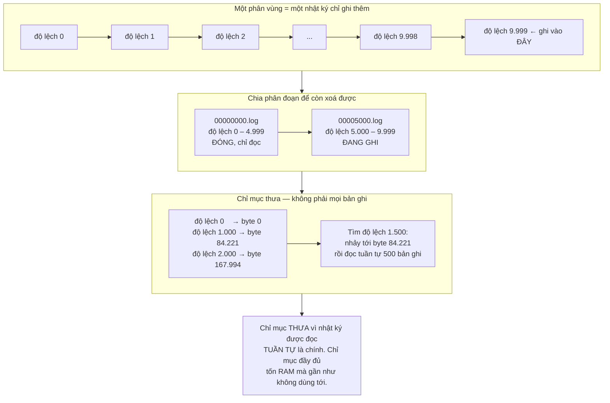
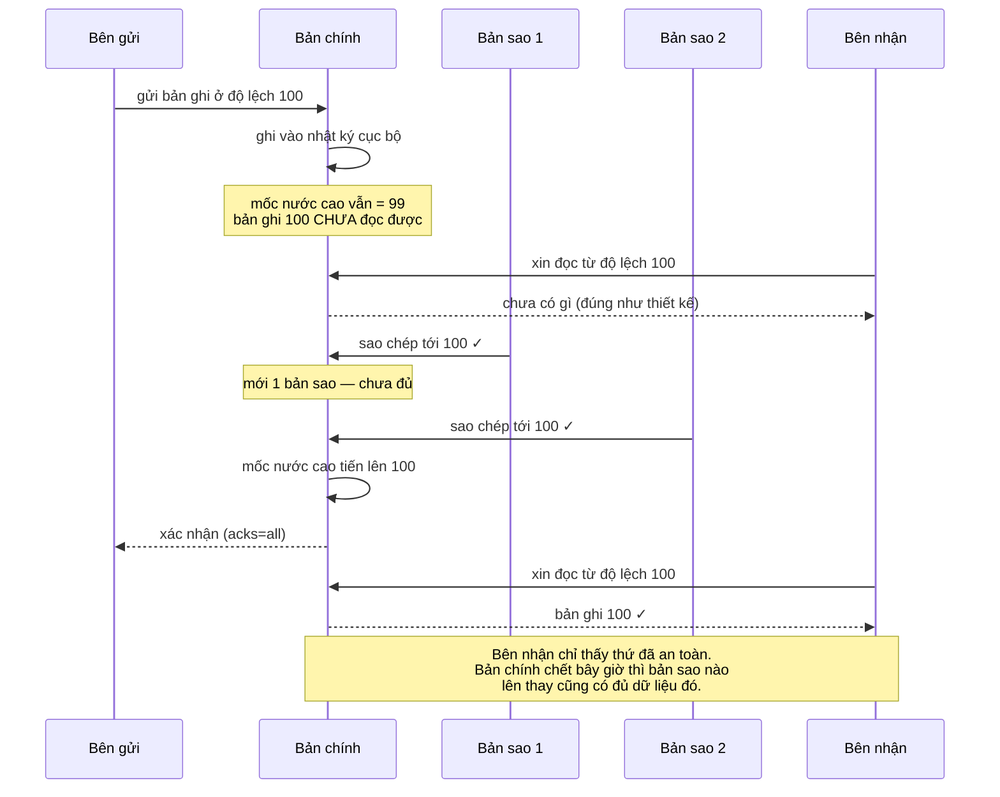
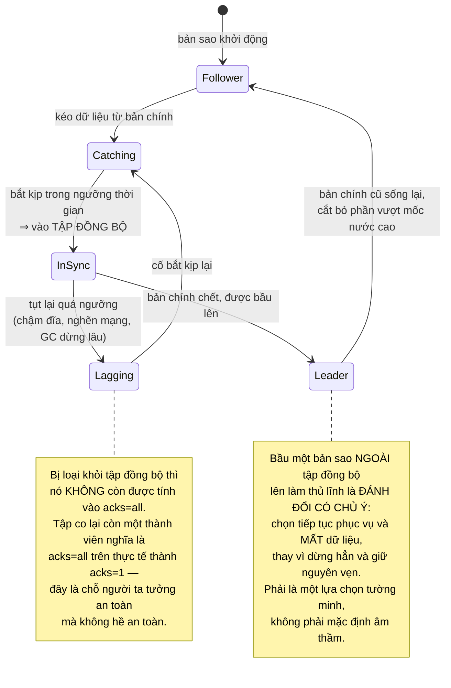
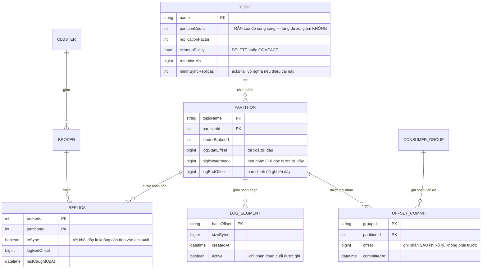
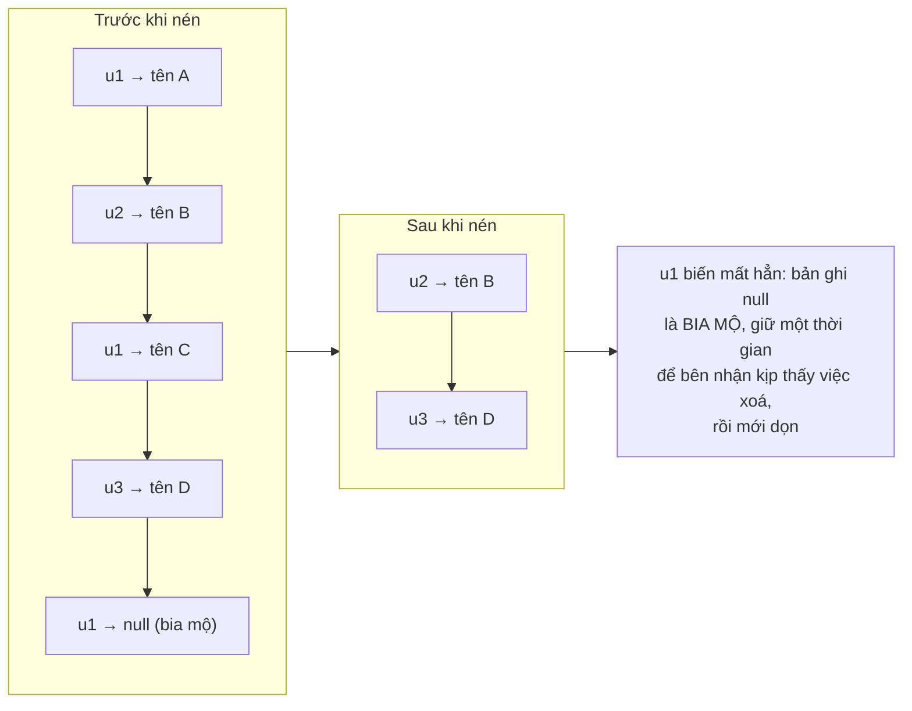

# Distributed Message Broker (Kafka-like)

Ở [Event-Driven Microservices](/projects/event-driven-microservices-uber-like) bạn đã dùng Kafka như một hộp đen: đẩy sự kiện vào, nhận ra ở đầu kia, chọn khoá phân vùng để giữ thứ tự. Nó hoạt động và bạn không cần biết vì sao.

Bài này mở hộp. Và điều đáng ngạc nhiên nhất khi mở ra là: **bên trong không có gì phức tạp cả.** Không có cây cân bằng, không có chỉ mục tinh vi, không có thuật toán thông minh. Chỉ là **một file được ghi thêm vào cuối.**

Toàn bộ giá trị của dự án này nằm ở chỗ hiểu vì sao thứ đơn giản đến vậy lại nhanh hơn mọi thiết kế "thông minh" mà bạn nghĩ ra — và cái giá phải trả để nó đáng tin cậy khi máy chết.

---

## Bạn sẽ dựng ra cái gì

- Nhật ký chỉ ghi thêm, chia phân đoạn, đánh chỉ mục theo độ lệch
- Chủ đề chia phân vùng, mỗi phân vùng có nhiều bản sao
- Bầu chọn thủ lĩnh và tập bản sao đồng bộ
- Nhóm tiêu thụ, tự chia lại phân vùng khi có thành viên vào/ra
- Lưu giữ theo thời gian, theo dung lượng, và nén theo khoá
- Bên gửi có tính lặp lại được, và giao dịch qua nhiều phân vùng
- Giao thức nhị phân qua TCP, có gộp gói và nén

---

## Nhật ký chỉ ghi thêm: vì sao đơn giản lại nhanh

Trực giác nói rằng ghi vào đĩa thì chậm, nên phải có cấu trúc thông minh để giảm số lần ghi. Trực giác đó sai một cách thú vị.

Đĩa chậm ở **tìm kiếm ngẫu nhiên**, không chậm ở **ghi tuần tự**. Chênh lệch không nhỏ:

| Thao tác | Tốc độ điển hình |
|---|---|
| Ghi ngẫu nhiên trên ổ cứng cơ | ~100 thao tác/giây |
| Ghi tuần tự trên ổ cứng cơ | ~100 MB/giây |
| Ghi ngẫu nhiên trên SSD | ~50.000 thao tác/giây |
| Ghi tuần tự trên SSD | ~500 MB/giây |

Ghi tuần tự trên **ổ cứng cơ** có thể nhanh hơn ghi ngẫu nhiên trên **SSD**. Đó là lý do một cấu trúc chỉ biết ghi thêm vào cuối đánh bại mọi cây cân bằng thông minh.



Ba quyết định trong sơ đồ trên, và mỗi cái đều ngược với trực giác thông thường:

**Chia phân đoạn để xoá.** Xoá dữ liệu cũ khỏi một file khổng lồ là viết lại cả file. Chia thành nhiều file thì xoá dữ liệu cũ chỉ là `unlink` một file — thao tác gần như tức thời bất kể file lớn cỡ nào.

**Chỉ mục thưa.** Chỉ ghi mốc mỗi vài nghìn bản ghi. Vì mô hình đọc chủ yếu là tuần tự, không ai cần nhảy tới một bản ghi đơn lẻ thường xuyên. Chỉ mục đầy đủ tốn RAM cho một khả năng hiếm dùng.

**Không tự quản lý bộ nhớ đệm.** Đây là điều gây bất ngờ nhất: hệ thống này **không** dựng một tầng đệm riêng trong tiến trình. Nó ghi thẳng vào file và để **bộ đệm trang của hệ điều hành** làm việc đó. Lý do: dữ liệu vừa ghi gần như chắc chắn còn nằm trong bộ đệm trang khi bên nhận đọc tới vài mili giây sau — nên "đọc từ đĩa" thực tế không chạm đĩa. Tự dựng đệm riêng nghĩa là cùng một dữ liệu nằm hai bản trong RAM, và bộ thu gom rác phải quản lý một đống đối tượng.

### Sao chép không qua tầng người dùng

Đường đi thông thường của một byte từ file ra mạng đi qua bốn lần sao chép và hai lần chuyển ngữ cảnh. Có một lời gọi hệ thống bỏ qua gần hết:

```java
// Đường thông thường: đĩa → đệm nhân → đệm ứng dụng → đệm socket → mạng
byte[] buf = new byte[8192];
while (in.read(buf) > 0) out.write(buf);     // dữ liệu đi VÒNG qua tiến trình

// transferTo: đĩa → đệm nhân → mạng. Dữ liệu KHÔNG BAO GIỜ vào tiến trình.
fileChannel.transferTo(position, count, socketChannel);
```

Điều này chỉ khả thi vì bên nhận đọc **đúng nguyên byte** đã lưu — không có bước biến đổi định dạng nào. Đó là lý do định dạng bản ghi trên đĩa và trên đường truyền phải **giống hệt nhau**. Một quyết định thiết kế nghe nhàm chán nhưng chính nó cho phép tối ưu lớn nhất của hệ thống.

---

## Nhân bản: mốc nước cao, và chỗ dữ liệu thật sự bị mất

Đây là phần khó nhất, và là chỗ phân biệt một hàng đợi đồ chơi với một hệ thống dám tin.

Mỗi phân vùng có một bản chính nhận ghi và vài bản sao theo sau. Câu hỏi: **khi nào một bản ghi được coi là an toàn để bên nhận đọc?**

Nếu cho đọc ngay khi bản chính ghi xong, thì bản chính chết trước khi kịp sao chép sẽ khiến bên nhận đã đọc một bản ghi mà **sau đó không còn tồn tại** ở bản chính mới. Đó là một dạng mất dữ liệu rất khó gỡ.

Lời giải là **mốc nước cao**: bên nhận chỉ được đọc tới độ lệch mà **mọi bản sao đồng bộ** đều đã có.



### Ba mức xác nhận, và mỗi mức mất gì

| `acks` | Bên gửi chờ gì | Mất dữ liệu khi | Dùng cho |
|---|---|---|---|
| `0` | Không chờ gì | Gói tin rớt trên mạng là mất, không ai biết | Đo lường, nhật ký truy cập |
| `1` | Bản chính ghi xong | Bản chính chết trước khi sao chép kịp | Mặc định cũ, nay ít dùng |
| `all` | Mọi bản sao đồng bộ ghi xong | Chỉ khi mất **toàn bộ** bản sao cùng lúc | Dữ liệu tài chính, đơn hàng |

Nhưng `acks=all` **một mình nó không đủ**. Nếu tập bản sao đồng bộ chỉ còn đúng một thành viên là chính bản chính, thì "mọi bản sao đồng bộ đã ghi" chỉ có nghĩa là "bản chính đã ghi" — bạn tưởng an toàn nhưng thực ra đang ở mức `acks=1`. Phải đặt thêm ngưỡng tối thiểu, và khi không đủ thì **từ chối ghi** thay vì âm thầm hạ mức bảo đảm.



Đoạn ghi chú thứ hai là một trong những bài học đắt nhất của lĩnh vực hệ phân tán: **khi mọi bản sao đồng bộ đều chết, bạn phải chọn giữa sẵn sàng và toàn vẹn.** Không có lựa chọn thứ ba, và hệ thống nào tỏ ra có thì đang giấu sự đánh đổi ở chỗ khác.

---

## Nhóm tiêu thụ và cơn ác mộng chia lại

Nhiều tiến trình cùng đọc một chủ đề, mỗi phân vùng chỉ giao cho **một** thành viên. Đó là lý do **số phân vùng là trần của độ song song**: 10 phân vùng thì thành viên thứ 11 trở đi ngồi không.

Khi có thành viên vào hoặc ra, phân vùng phải chia lại. Cách làm ngây thơ — dừng tất cả, chia lại, chạy tiếp — gây ra hiện tượng gọi là **dừng thế giới**: mọi thành viên ngừng xử lý trong vài giây, kể cả những thành viên không hề bị ảnh hưởng.

Ba thứ làm nó tệ hơn nhiều so với dự đoán:

- **Vòng lặp chia lại.** Thành viên xử lý một lô mất quá lâu, quá hạn nhịp tim, bị coi là chết, kích hoạt chia lại. Chia lại làm mọi người chậm thêm, thêm thành viên quá hạn, chia lại lần nữa. Hệ thống có thể kẹt vĩnh viễn trong vòng này mà không xử lý được gì.
- **Triển khai bản mới.** Khởi động lại 10 thành viên lần lượt là 20 lần chia lại (mỗi cái ra và vào một lần).
- **Chia lại xong là đọc lại.** Thành viên mới nhận phân vùng bắt đầu từ độ lệch đã ghi nhận, nên các bản ghi đã xử lý mà chưa kịp ghi nhận sẽ được xử lý **lại**.

Điều cuối cùng đó dẫn thẳng về bài học của [Event-Driven Microservices](/projects/event-driven-microservices-uber-like): **bên nhận phải xử lý lặp lại được**. Không phải vì hàng đợi kém, mà vì chia lại là chuyện bình thường và nó luôn kéo theo xử lý trùng.

Cách giảm đau, xếp theo hiệu quả: tách nhịp tim ra luồng riêng (để xử lý chậm không bị coi là chết), giảm kích thước lô, dùng chiến lược chia lại tăng dần (chỉ chuyển phân vùng cần chuyển thay vì thu hồi hết), và đặt định danh thành viên cố định để khởi động lại nhanh không kích hoạt chia lại.

---

## Siêu dữ liệu cụm



Hai cột đáng dừng lại:

`partitionCount` **tăng được nhưng không giảm được**, và tăng cũng có hậu quả: khoá `k` từng vào phân vùng 3 nay có thể vào phân vùng 7, nên **thứ tự theo khoá bị phá vỡ** ngay tại thời điểm tăng. Với dữ liệu cần thứ tự, tăng số phân vùng là một thao tác cần lên kế hoạch, không phải một nút bấm.

`offset` trong `OFFSET_COMMIT` phải ghi nhận **sau** khi xử lý xong. Ghi nhận trước rồi mới xử lý nghĩa là tiến trình chết ở giữa sẽ **bỏ qua** bản ghi vĩnh viễn — đổi trùng lặp lấy mất mát, gần như luôn là đánh đổi sai.

---

## Lưu giữ: xoá theo thời gian, hay nén theo khoá

Hai chính sách hoàn toàn khác nhau, và chọn sai thì mất dữ liệu hoặc đầy đĩa:

**Xoá.** Giữ 7 ngày rồi bỏ phân đoạn cũ. Phù hợp cho dòng sự kiện: một cú bấm chuột tuần trước không còn ý nghĩa.

**Nén theo khoá.** Giữ **bản ghi cuối cùng của mỗi khoá**, mãi mãi. Chủ đề trở thành một bảng trạng thái hiện tại có thể phát lại. Người mới tham gia đọc từ đầu là dựng lại được toàn bộ trạng thái mà không cần một database riêng.



Bia mộ lại xuất hiện — lần thứ ba trong lộ trình, sau [Figma-like](/projects/realtime-collaboration-figma-like) và [Distributed Search Engine](/projects/distributed-search-engine). Cùng một ràng buộc sinh ra cùng một lời giải: **xoá thật ngay lập tức thì bên nhận không có cách nào biết việc xoá đã xảy ra.**

---

## Những cái bẫy đã được ghi lại

| Triệu chứng | Nguyên nhân thật | Cách sửa |
|---|---|---|
| Mất bản ghi dù đã bật `acks=all` | Tập đồng bộ co lại còn một thành viên | Đặt ngưỡng tối thiểu, từ chối ghi khi thiếu |
| Mất dữ liệu sau khi bản chính chết | Bầu bản sao ngoài tập đồng bộ lên | Tắt bầu chọn không sạch, hoặc chọn nó có chủ ý |
| Bên nhận đọc được rồi bản ghi biến mất | Cho đọc vượt mốc nước cao | Chỉ phục vụ tới mốc nước cao |
| Nhóm kẹt trong vòng chia lại | Xử lý một lô lâu hơn hạn nhịp tim | Nhịp tim ở luồng riêng, giảm kích thước lô |
| Thêm thành viên mà thông lượng không tăng | Số thành viên vượt số phân vùng | Tăng số phân vùng (nhưng xem dòng dưới) |
| Tăng số phân vùng làm loạn thứ tự | Khoá được băm sang phân vùng khác | Lên kế hoạch, hoặc chấp nhận mất thứ tự từ mốc đó |
| Xử lý trùng sau khi triển khai bản mới | Chia lại làm đọc lại từ độ lệch đã ghi nhận | Bên nhận phải lặp lại được — không tránh khỏi |
| Bỏ sót bản ghi vĩnh viễn | Ghi nhận độ lệch trước khi xử lý | Ghi nhận sau khi xử lý xong |
| Đĩa đầy dù đã đặt thời hạn lưu giữ | Chính sách nén giữ mọi khoá mãi mãi | Chọn đúng chính sách cho từng chủ đề |
| Thông lượng thấp dù đĩa và mạng đều rảnh | Gửi từng bản ghi, không gộp lô | Gộp lô ở bên gửi, bật nén |
| Độ trễ tăng vọt theo chu kỳ | Bộ thu gom rác dừng lâu, tự dựng đệm riêng | Dựa vào bộ đệm trang của hệ điều hành |
| Không dùng được sao chép không qua tầng người dùng | Biến đổi định dạng giữa đĩa và mạng | Giữ định dạng bản ghi giống hệt nhau |

---

## Khi nào coi như xong

- [ ] Ghi 1 triệu bản ghi/giây trên một máy tầm trung với `acks=1`, đo bằng công cụ đo tải
- [ ] Bật `acks=all` với 3 bản sao: thông lượng giảm dưới 40%, không phải giảm mười lần
- [ ] Giết bản chính giữa lúc đang ghi: bên gửi tự chuyển sang thủ lĩnh mới, **không mất bản ghi nào đã được xác nhận**
- [ ] Làm một bản sao chậm hẳn (giới hạn băng thông): nó rời tập đồng bộ, và ghi **vẫn tiếp tục** nếu còn đủ ngưỡng
- [ ] Giảm ngưỡng tối thiểu xuống không thoả được: ghi bị **từ chối**, không âm thầm hạ mức bảo đảm
- [ ] Bên nhận không được đọc bất kỳ bản ghi nào vượt mốc nước cao (thử bằng cách hỏi thẳng bản chính)
- [ ] Khởi động lại lần lượt 10 thành viên trong nhóm: tổng thời gian dừng dưới 5 giây với chia lại tăng dần
- [ ] Chủ đề nén: ghi 1 triệu bản ghi cho 1.000 khoá, sau khi nén còn đúng 1.000 bản ghi
- [ ] Ghi bia mộ cho một khoá: bên nhận đọc từ đầu **thấy** việc xoá, rồi sau thời hạn thì khoá biến mất hẳn
- [ ] Xoá dữ liệu quá hạn: là thao tác `unlink` file, không phải viết lại nhật ký

---

## Bước tiếp theo

1. **Bên gửi có tính lặp lại được và giao dịch.** Đánh số thứ tự cho mỗi bên gửi để máy chủ tự loại bản trùng khi gửi lại — và đó là nền của thứ người ta gọi là "đúng một lần", vốn thực chất là "ít nhất một lần cộng khử trùng" (xem lại [Event-Driven Microservices](/projects/event-driven-microservices-uber-like)).
2. **Tầng lưu trữ phân cấp.** Đẩy phân đoạn cũ lên kho đối tượng, giữ phân đoạn nóng trên đĩa cục bộ. Thời hạn lưu giữ thành vô hạn với chi phí chấp nhận được — và nó liên quan trực tiếp tới [Cloud Storage System](/projects/cloud-storage-system-s3-like).
3. **Xử lý dòng dữ liệu.** Cửa sổ thời gian, phép nối giữa hai dòng, trạng thái tích luỹ — [Real-Time Analytics Platform](/projects/realtime-analytics-platform) là bước tiếp theo tự nhiên.
4. **Bỏ dịch vụ điều phối bên ngoài.** Tự cài đặt đồng thuận cho siêu dữ liệu cụm thay vì phụ thuộc một hệ thống khác — chính là phần lõi của [Distributed Database](/projects/distributed-database-postgres-like).
