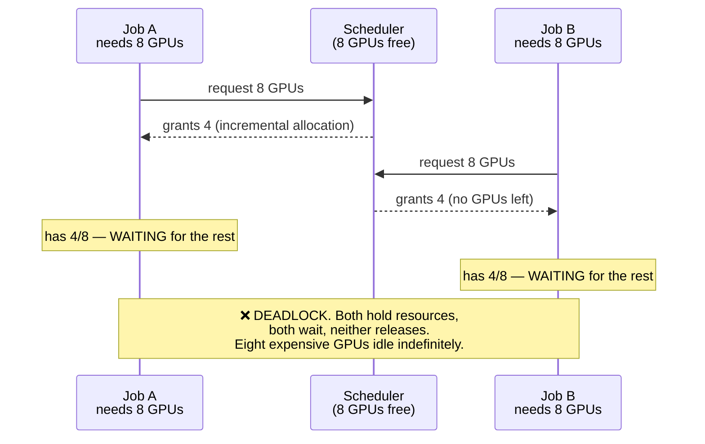
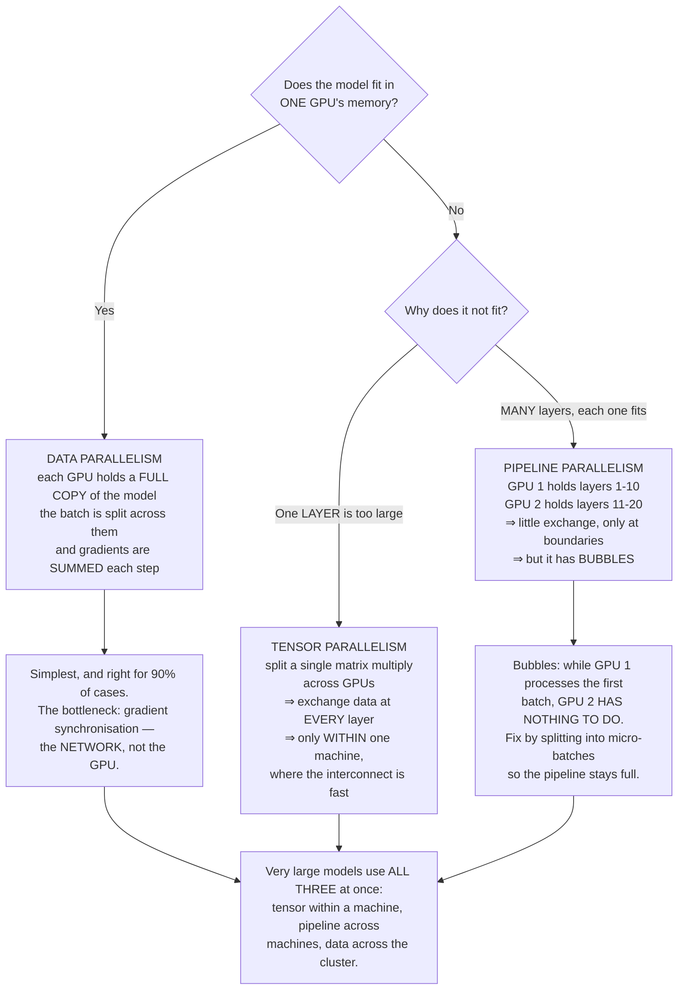
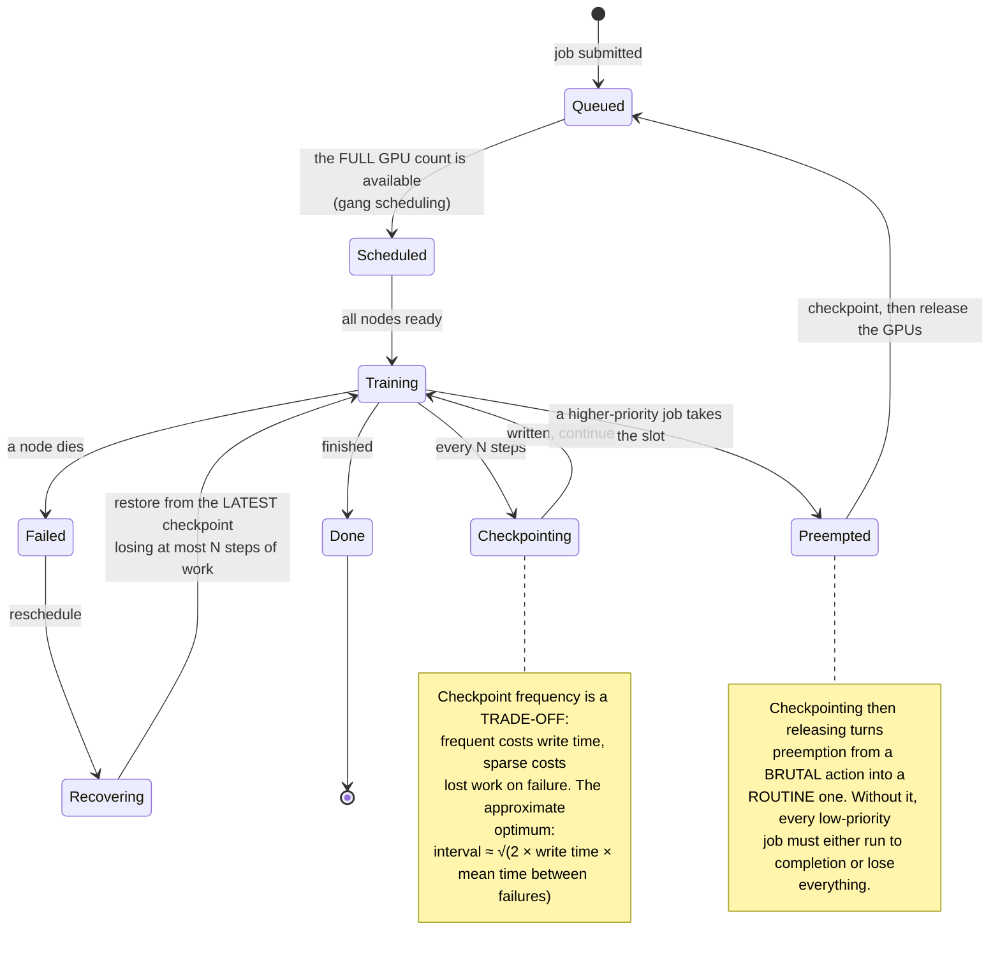
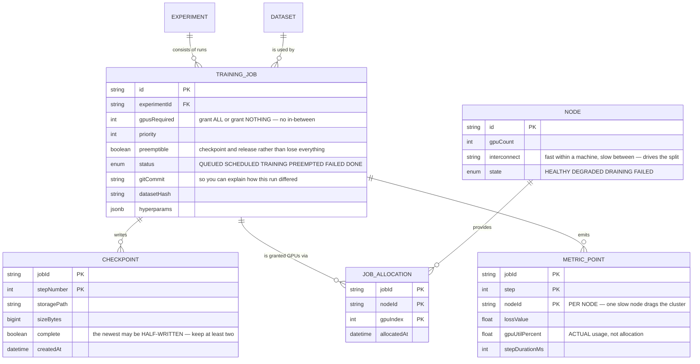

# Distributed ML Training Platform

Training a model on one GPU is a Python file. Training on 64 raises questions no machine-learning tutorial answers, because they are not machine-learning questions:

- Two jobs request GPUs, each gets half, and **both wait forever.**
- A job runs 60 hours of a planned 72 and a node dies. **Everything is lost.**
- You buy more GPUs and training **does not get faster**.
- You rerun identical code, data and random seed — and get **a different result**.

This project is about those four. It is a distributed systems and resource scheduling project that happens to contain GPUs.

---

## What you will build

- A scheduler allocating in gangs, never partially
- Data, tensor and pipeline parallelism
- Checkpointing and recovery so long jobs survive failures
- Real GPU utilisation tracking, not allocation tracking
- A priority queue with preemption
- Experiment tracking: which data, which code, which hyperparameters

---

## Gang scheduling: the deadlock problem

An ordinary scheduler grants resources as they become free. For distributed training, that creates a textbook deadlock:

The answer is **gang scheduling**: either grant the whole GPU count the job needs, or **grant nothing**. There is no state in between.

This sounds obvious but it inverts a familiar instinct: in most systems, incremental allocation is good because it keeps resources busy. Here, incremental allocation is **a reliable way to waste resources**, because distributed training cannot run on a subset of its nodes.

Two mechanisms a real queue also needs:

- **Reservation.** A job needing 64 GPUs never gets its turn if one-GPU jobs keep taking each newly freed slot. It must accumulate a held reservation.
- **Backfill.** While holding that reservation, let short jobs run if they **provably finish before** the reservation completes. Without it, the cluster idles heavily while waiting.

---

## Three kinds of parallelism, and how to choose

The selection rule collapses to one sentence: **use data parallelism until the model no longer fits, and only then add another kind.** Each additional form of parallelism adds a layer of complexity and a new source of bugs.

---

## The bottleneck is the network, not the GPU

This is the biggest surprise when first scaling beyond one machine.

In data parallelism, after **every** training step, all GPUs must exchange gradients — for a one-billion-parameter model at 16-bit precision, that is **2GB per GPU per step**. If each step's computation takes 100ms while transferring 2GB takes 200ms, your GPUs sit **idle two-thirds of the time**.

Three measures, and you need all three:

| Measure | Mechanism | Effect |
|---|---|---|
| Pick the right reduction algorithm | Ring-based rather than gather-to-one | Per-node traffic stops growing with node count |
| Overlap communication with computation | Send later layers' gradients **while** still computing earlier ones | Hides most of the transfer time |
| Gradient accumulation | Run 4 micro-batches before synchronising once | Cuts synchronisation frequency fourfold |

The reduction algorithm detail is worth remembering: the naive approach has every node send gradients to one master, which sums and broadcasts back. That master receives `N × 2GB` — adding nodes makes it slower. A ring algorithm has each node talk only to two neighbours, and **per-node traffic is independent of N**. Mathematically identical result, entirely different scaling behaviour.

---

## Checkpointing: long jobs will fail, not "might"

One node has a small chance of failing in a day. But a job using 64 nodes for 3 days makes **at least one node failing** close to certain.

So the question is not "will it fail" but "how much work does a failure cost".

Three details that matter when checkpointing:

- **Save enough to actually resume.** Model weights are not sufficient: you need optimiser state, the step count, and **the random number generator state**. Miss the last and you resume onto a different data ordering.
- **Write asynchronously.** Blocking training while writing 100GB to storage costs minutes each time. Copy to host memory and write from a background thread.
- **Keep several checkpoints.** The most recent one may be exactly the half-written file from when the node died. Always keep at least two.

---

## GPU utilisation: the real metric, and it is usually poor

A cluster allocated 100% is not a cluster working 100%. Real GPU utilisation in many organisations sits around **30–50%**, and most operators do not know because they only watch allocation.

Four causes, most common first:

1. **Data starvation.** GPUs waiting on the input pipeline. If images are decoded and transformed on CPU, the CPU becomes the bottleneck — expensive GPUs waiting on cheap CPUs.
2. **Waiting on gradient synchronisation.** Exactly the network problem above.
3. **Batches too small.** Not enough work to fill the compute units.
4. **Waiting for the slowest node.** In data parallelism every node synchronises each step, so **one slow node slows everyone**. A single thermally throttled GPU drags down a 64-node cluster.

The fourth is the most irritating failure because it raises no error — everything is simply 20% slower and nobody knows why. Detection: measure step time **per node** and alert when one deviates from the median.

---

## Reproducibility: the honest answer is "approximately"

Same code, same data, same seed — different result. Three causes, only two of them fixable:

- **Floating-point addition is not associative.** `(a+b)+c` does not equal `a+(b+c)`. Summing gradients from 64 nodes in different orders differs in the last digits, and across thousands of steps that amplifies. **Not fixable** without forcing a fixed summation order, which is considerably slower.
- **Non-deterministic kernels.** Some GPU operations go faster by not guaranteeing ordering. **Disableable**, at a speed cost.
- **Data loading order.** Multiple loader threads return in completion order. **Fixable** by seeding each worker.

What is worth doing is **recording enough to explain**: commit hash, dataset hash, library versions, hardware configuration, every hyperparameter. You may not reproduce bit for bit, but you must be able to answer "how did this run differ from the last one".

---

## The data model

Putting `nodeId` in `METRIC_POINT`'s primary key is deliberate: with only cluster-aggregate metrics you will **never** detect one slow node. Recorded per node, comparing against the median reveals it immediately.

---

## Traps worth recording

| Symptom | Actual cause | Fix |
|---|---|---|
| Two jobs both hanging, GPUs idle | Incremental allocation causing deadlock | Gang scheduling: all or nothing |
| Large jobs never getting scheduled | Small jobs continuously taking free slots | Reservation plus backfill for short jobs |
| More GPUs but no more speed | Bottleneck in the network, not compute | Ring reduction, overlap, gradient accumulation |
| A 64-node cluster 20% slower than projected | One throttled node with everyone waiting | Per-node step timing with deviation alerts |
| GPUs at 30% utilisation | The input pipeline cannot keep up | Prefetching, more workers, GPU-side transforms |
| 60 hours of training lost to one dead node | No checkpointing, or intervals too sparse | The square-root formula above |
| Resuming produces very different results | Optimiser and RNG state not saved | Save full state, not just weights |
| The newest checkpoint is corrupt | The node died mid-write | Keep at least two, with a completion flag |
| Checkpointing stalls training for minutes | Synchronous writes to storage | Copy to host memory, write in a background thread |
| Results not reproducible | Non-associative floats, non-deterministic kernels | Record full context; force determinism only if truly needed |
| No idea why this run differs from the last | Code and data hashes not recorded | Record commit, dataset hash, library versions |
| Tensor parallelism across machines very slow | Per-layer exchange over a slow link | Tensor within machines, pipeline across them |

---

## When it is genuinely done

- [ ] Submit two 8-GPU jobs when only 8 are free: exactly **one** runs, the other queues — no deadlock
- [ ] A 64-GPU job in a queue full of small jobs: **still** gets scheduled in reasonable time
- [ ] Kill a node mid-training: recovery loses **at most** the configured checkpoint interval
- [ ] Compare loss curves before and after recovery: **continuous**, with no discontinuity
- [ ] Corrupt the most recent checkpoint: the system falls back to the previous one and does **not** fail
- [ ] Measure real GPU utilisation during training: above 80%, and you can account for the rest
- [ ] Deliberately slow one node: the system **detects and alerts**, rather than quietly degrading
- [ ] Scale from 8 to 64 GPUs: throughput rises at least sixfold (not eightfold — and you know why)
- [ ] Preempt a low-priority job: it checkpoints and releases in under 60 seconds
- [ ] Two runs of the same configuration: loss curves closely track, and **every environmental difference is recorded**

---

## Where to go next

1. **Inference at scale.** Training is batch work; serving inference is request work under latency constraints — an entirely different problem.
2. **Automated hyperparameter search.** Run many experiments in parallel and stop weak branches early. It needs precisely the scheduler you just built.
3. **Petabyte-scale data pipelines.** Data loading is the most common bottleneck — [Cloud-native Data Platform](/projects/cloud-native-data-platform) covers reading large data efficiently.
4. **Serious cluster orchestration.** The scheduler you wrote is one part of the larger problem in [DevOps Kubernetes Platform](/projects/devops-kubernetes-platform).
