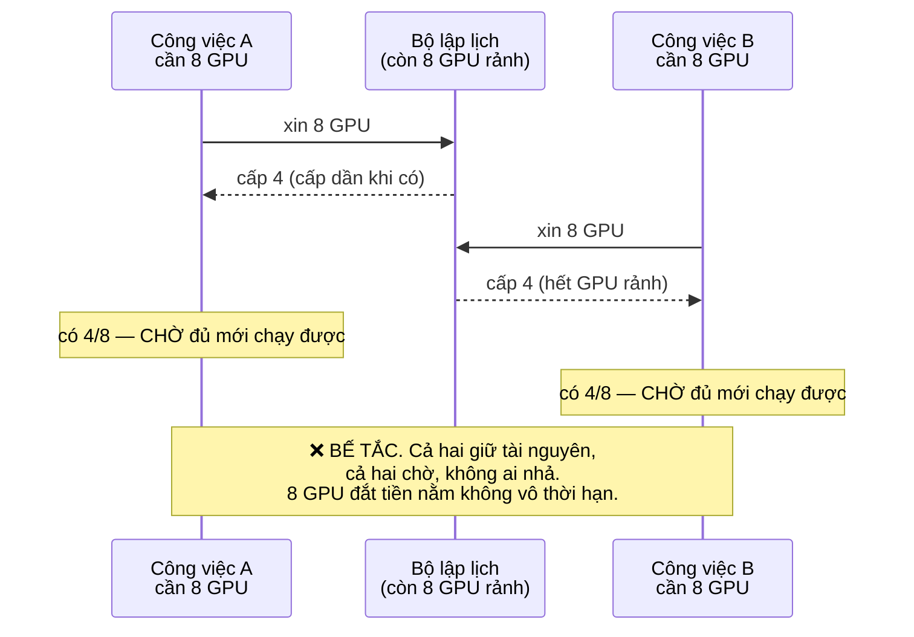
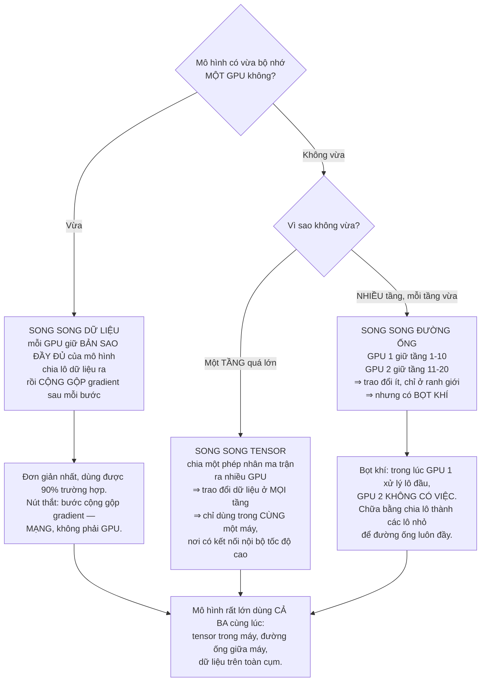
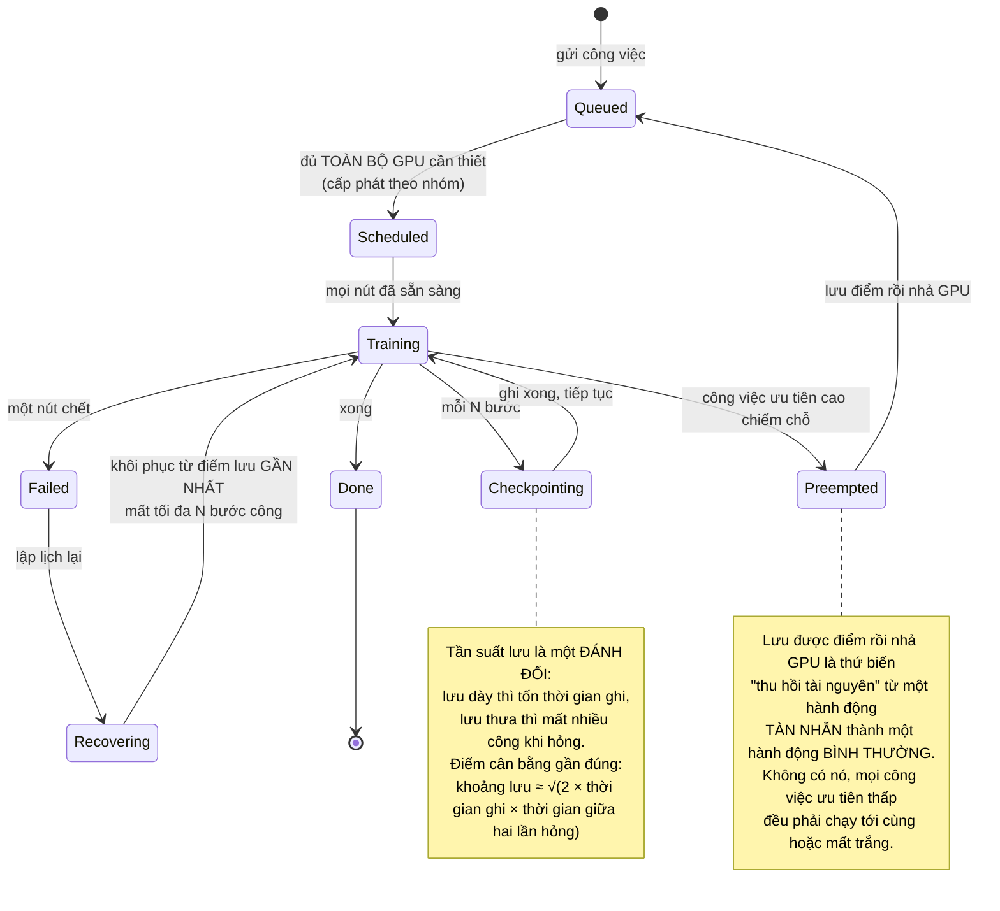
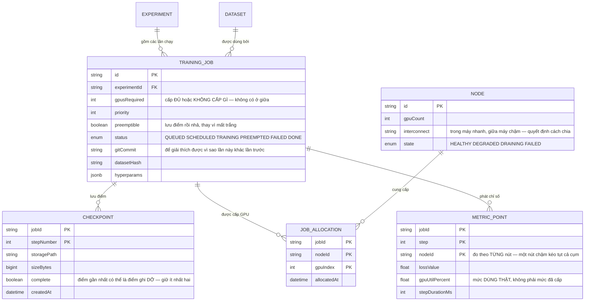

# Distributed ML Training Platform

Huấn luyện một mô hình trên một GPU là chuyện của một tệp Python. Huấn luyện trên 64 GPU đặt ra những câu hỏi mà không tài liệu học máy nào trả lời, vì chúng không phải câu hỏi về học máy:

- Hai công việc cùng xin GPU, mỗi cái lấy được một nửa, **cả hai chờ nhau vĩnh viễn.**
- Công việc chạy 60 giờ trong kế hoạch 72 giờ thì một nút chết. **Mất hết.**
- Mua thêm GPU mà tốc độ huấn luyện **không tăng**.
- Chạy lại đúng mã, đúng dữ liệu, đúng hạt giống ngẫu nhiên — ra **kết quả khác**.

Đây là bài về bốn câu đó. Nó là một dự án về hệ phân tán và điều phối tài nguyên, tình cờ có GPU bên trong.

---

## Bạn sẽ dựng ra cái gì

- Bộ lập lịch cấp phát theo nhóm, không cấp lẻ
- Song song dữ liệu, song song mô hình, song song đường ống
- Điểm lưu và khôi phục để công việc dài sống sót qua sự cố
- Theo dõi mức sử dụng GPU thật, không phải mức cấp phát
- Hàng đợi có ưu tiên và quyền thu hồi
- Theo dõi thí nghiệm: dữ liệu nào, mã nào, siêu tham số nào

---

## Cấp phát theo nhóm: bài toán bế tắc

Bộ lập lịch bình thường cấp tài nguyên khi có sẵn. Với việc huấn luyện phân tán, cách đó tạo ra bế tắc kinh điển:

Lời giải là **cấp phát theo nhóm**: hoặc cấp đủ toàn bộ số GPU công việc cần, hoặc **không cấp gì cả**. Không có trạng thái giữa.

Điều này nghe hiển nhiên nhưng nó đảo ngược một trực giác quen thuộc: ở hầu hết hệ thống, cấp dần là tốt vì tận dụng được tài nguyên. Ở đây, cấp dần là **cách chắc chắn để lãng phí tài nguyên**, vì việc huấn luyện phân tán không chạy được với một phần số nút.

Kèm theo là hai cơ chế mà một hàng đợi thật cần:

- **Đặt chỗ trước.** Công việc cần 64 GPU sẽ không bao giờ tới lượt nếu các công việc 1 GPU liên tục chen vào chỗ vừa trống. Phải giữ chỗ dần cho nó.
- **Lấp khe.** Trong lúc giữ chỗ, cho công việc ngắn chạy nếu chúng **chắc chắn kết thúc trước** thời điểm đủ chỗ. Không có cái này thì cụm nằm không rất nhiều trong lúc chờ.

---

## Ba kiểu song song, và chọn theo cái gì

Quy tắc chọn gọn lại thành một câu: **dùng song song dữ liệu cho tới khi mô hình không vừa bộ nhớ, rồi mới thêm loại khác.** Mỗi loại song song thêm vào là thêm một tầng phức tạp và một nguồn lỗi mới.

---

## Nút thắt là mạng, không phải GPU

Đây là điều gây bất ngờ nhất khi lần đầu mở rộng ra nhiều nút.

Trong song song dữ liệu, sau **mỗi bước** huấn luyện, mọi GPU phải trao đổi gradient — với mô hình 1 tỉ tham số ở độ chính xác 16 bit, đó là **2GB mỗi GPU mỗi bước**. Nếu mỗi bước tính toán mất 100ms còn truyền 2GB mất 200ms, thì GPU của bạn **nằm không hai phần ba thời gian**.

Ba biện pháp, và cả ba đều cần:

| Biện pháp | Cơ chế | Hiệu quả |
|---|---|---|
| Chọn đúng thuật toán gộp | Vòng tròn thay vì gom về một nút | Lưu lượng mỗi nút không tăng theo số nút |
| Chồng lấn truyền và tính | Gửi gradient của tầng sau **trong lúc** còn đang tính tầng trước | Che phần lớn thời gian truyền |
| Tích luỹ gradient | Chạy 4 lô nhỏ rồi mới đồng bộ một lần | Giảm số lần đồng bộ đi 4 lần |

Chi tiết đáng nhớ về thuật toán gộp: cách ngây thơ là mọi nút gửi gradient về một nút chủ, nút đó cộng lại rồi phát ngược. Nút chủ nhận `N × 2GB` — càng thêm nút càng chậm. Thuật toán vòng tròn thì mỗi nút chỉ nói chuyện với hai láng giềng, và **lưu lượng mỗi nút không phụ thuộc vào N**. Cùng một kết quả toán học, khác nhau hoàn toàn về khả năng mở rộng.

---

## Điểm lưu: công việc dài sẽ gặp sự cố, không phải "nếu"

Một nút có xác suất hỏng nhỏ trong một ngày. Nhưng công việc dùng 64 nút trong 3 ngày thì xác suất **ít nhất một nút** hỏng là chuyện gần như chắc chắn.

Nên câu hỏi không phải "có hỏng không" mà là "hỏng thì mất bao nhiêu công".

Ba chi tiết quan trọng khi lưu điểm:

- **Lưu đủ để khôi phục thật.** Trọng số mô hình là chưa đủ: phải có cả trạng thái bộ tối ưu, số bước đã chạy, và **trạng thái bộ sinh số ngẫu nhiên**. Thiếu cái cuối thì khôi phục xong chạy tiếp trên một chuỗi dữ liệu khác.
- **Lưu bất đồng bộ.** Ghi 100GB lên kho lưu trữ mà chặn việc huấn luyện là mất vài phút mỗi lần. Sao chép sang bộ nhớ chủ rồi ghi ở luồng nền.
- **Giữ nhiều điểm lưu.** Điểm gần nhất có thể chính là điểm ghi dở khi nút chết. Luôn giữ ít nhất hai.

---

## Mức sử dụng GPU: chỉ số thật, và nó thường tệ

Cụm được cấp phát 100% không có nghĩa là đang làm việc 100%. Mức sử dụng GPU thật trong nhiều tổ chức nằm quanh **30–50%**, và phần lớn người vận hành không biết vì họ chỉ nhìn số GPU đã cấp.

Bốn nguyên nhân, xếp theo mức phổ biến:

1. **Đói dữ liệu.** GPU chờ đường ống nạp dữ liệu. Nếu ảnh được giải mã và biến đổi trên CPU thì CPU thành nút thắt — GPU đắt gấp nhiều lần đang chờ CPU rẻ.
2. **Chờ đồng bộ gradient.** Đúng vấn đề mạng ở phần trên.
3. **Lô quá nhỏ.** Không đủ việc để lấp hết nhân tính toán.
4. **Chờ nút chậm nhất.** Trong song song dữ liệu, mọi nút đồng bộ ở mỗi bước, nên **một nút chậm làm chậm tất cả**. Một GPU bị giảm xung do quá nhiệt kéo tụt cả cụm 64 nút.

Nguyên nhân thứ tư là loại sự cố khó chịu nhất vì nó không gây lỗi — chỉ làm mọi thứ chậm hơn 20% mà không ai biết vì sao. Cách phát hiện: đo thời gian mỗi bước **theo từng nút** và cảnh báo khi có nút lệch khỏi trung vị.

---

## Tái lập được: câu trả lời trung thực là "gần như"

Cùng mã, cùng dữ liệu, cùng hạt giống — nhưng kết quả khác. Ba nguyên nhân, và chỉ hai cái sửa được:

- **Phép cộng số thực không kết hợp.** `(a+b)+c` không bằng `a+(b+c)` với số dấu phẩy động. Gộp gradient từ 64 nút theo thứ tự khác nhau cho ra kết quả khác nhau ở chữ số cuối, và qua hàng nghìn bước nó khuếch đại lên. **Không sửa được** trừ khi ép thứ tự cộng cố định, và điều đó làm chậm đáng kể.
- **Nhân tính toán không tất định.** Một số phép trên GPU chạy nhanh hơn bằng cách không đảm bảo thứ tự. **Tắt được**, đổi lấy tốc độ.
- **Thứ tự nạp dữ liệu.** Nhiều luồng nạp trả về theo thứ tự hoàn thành. **Sửa được** bằng cách cố định hạt giống cho từng luồng.

Điều đáng làm là **ghi lại đủ để giải thích được**: mã băm commit, mã băm dữ liệu, phiên bản thư viện, cấu hình phần cứng, mọi siêu tham số. Bạn có thể không tái lập chính xác từng bit, nhưng bạn phải trả lời được "lần chạy này khác lần trước ở chỗ nào".

---

## Dữ liệu

`METRIC_POINT` có `nodeId` trong khoá chính là một quyết định có chủ ý: nếu chỉ ghi chỉ số tổng hợp toàn cụm, bạn **không bao giờ** phát hiện được một nút chậm. Ghi theo từng nút thì chỉ cần so với trung vị là thấy ngay.

---

## Những cái bẫy đã được ghi lại

| Triệu chứng | Nguyên nhân thật | Cách sửa |
|---|---|---|
| Hai công việc cùng treo, GPU nằm không | Cấp phát dần gây bế tắc | Cấp theo nhóm: đủ hoặc không |
| Công việc lớn không bao giờ tới lượt | Việc nhỏ liên tục chen chỗ | Đặt chỗ trước, cộng lấp khe cho việc ngắn |
| Thêm GPU mà không nhanh hơn | Nút thắt ở mạng, không ở tính toán | Thuật toán gộp vòng tròn, chồng lấn, tích luỹ gradient |
| Cụm 64 nút chậm hơn dự tính 20% | Một nút bị giảm xung, mọi nút chờ nó | Đo thời gian bước theo từng nút, cảnh báo lệch |
| GPU chỉ dùng 30% công suất | Đường ống nạp dữ liệu không theo kịp | Nạp trước, nhiều luồng, biến đổi trên GPU |
| Mất 60 giờ huấn luyện vì một nút chết | Không lưu điểm hoặc lưu quá thưa | Lưu theo công thức căn bậc hai ở trên |
| Khôi phục xong kết quả khác hẳn | Không lưu trạng thái bộ tối ưu và số ngẫu nhiên | Lưu đầy đủ trạng thái, không chỉ trọng số |
| Điểm lưu gần nhất bị hỏng | Nút chết giữa lúc đang ghi | Giữ ít nhất hai điểm, có cờ hoàn tất |
| Lưu điểm làm huấn luyện dừng vài phút | Ghi đồng bộ lên kho lưu trữ | Sao chép sang bộ nhớ chủ, ghi ở luồng nền |
| Không tái lập được kết quả | Số thực không kết hợp, nhân không tất định | Ghi đủ ngữ cảnh; ép tất định nếu thật sự cần |
| Không biết vì sao lần này khác lần trước | Không ghi mã băm mã nguồn và dữ liệu | Ghi commit, mã băm dữ liệu, phiên bản thư viện |
| Song song tensor giữa các máy rất chậm | Trao đổi ở mọi tầng qua mạng chậm | Tensor trong máy, đường ống giữa máy |

---

## Khi nào coi như xong

- [ ] Gửi hai công việc mỗi cái cần 8 GPU khi chỉ còn 8: đúng **một** chạy, cái kia xếp hàng — không bế tắc
- [ ] Công việc 64 GPU trong hàng đợi đầy việc nhỏ: **vẫn** được xếp lịch trong thời gian hợp lý
- [ ] Giết một nút giữa lúc huấn luyện: khôi phục và mất **tối đa** khoảng lưu điểm đã đặt
- [ ] So đường cong mất mát trước và sau khôi phục: **liền mạch**, không nhảy bậc
- [ ] Làm hỏng điểm lưu gần nhất: hệ thống dùng điểm trước đó, **không** thất bại
- [ ] Đo mức dùng GPU thật khi huấn luyện: trên 80%, và bạn giải thích được phần còn lại
- [ ] Làm chậm một nút có chủ ý: hệ thống **phát hiện và cảnh báo**, không âm thầm chậm
- [ ] Mở rộng từ 8 lên 64 GPU: thông lượng tăng ít nhất 6 lần (không phải 8, và bạn biết vì sao)
- [ ] Thu hồi một công việc ưu tiên thấp: nó lưu điểm rồi nhả trong dưới 60 giây
- [ ] Hai lần chạy cùng cấu hình: đường cong mất mát gần giống, và **mọi khác biệt về môi trường đều được ghi lại**

---

## Bước tiếp theo

1. **Suy luận ở quy mô lớn.** Huấn luyện là việc chạy theo lô; phục vụ suy luận là việc chạy theo yêu cầu với ràng buộc độ trễ — bài toán hoàn toàn khác.
2. **Tự động tìm siêu tham số.** Chạy nhiều thí nghiệm song song, dừng sớm những nhánh kém. Cần đúng bộ lập lịch bạn vừa dựng.
3. **Đường ống dữ liệu ở quy mô petabyte.** Nạp dữ liệu là nút thắt phổ biến nhất — [Cloud-native Data Platform](/projects/cloud-native-data-platform) giải bài đọc dữ liệu lớn hiệu quả.
4. **Điều phối cụm nghiêm túc.** Bộ lập lịch bạn vừa viết là một phần của bài toán lớn hơn ở [DevOps Kubernetes Platform](/projects/devops-kubernetes-platform).
