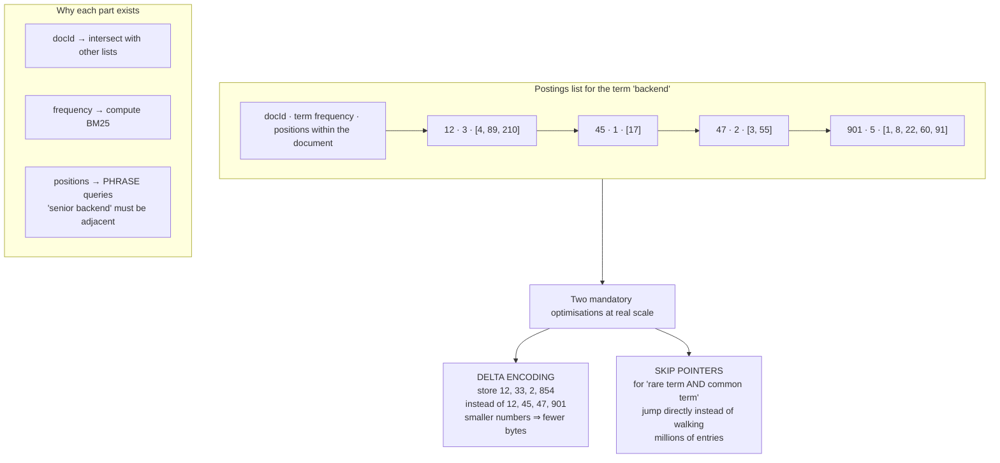
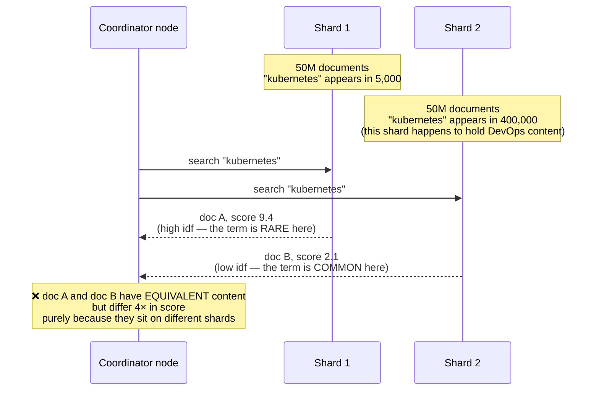
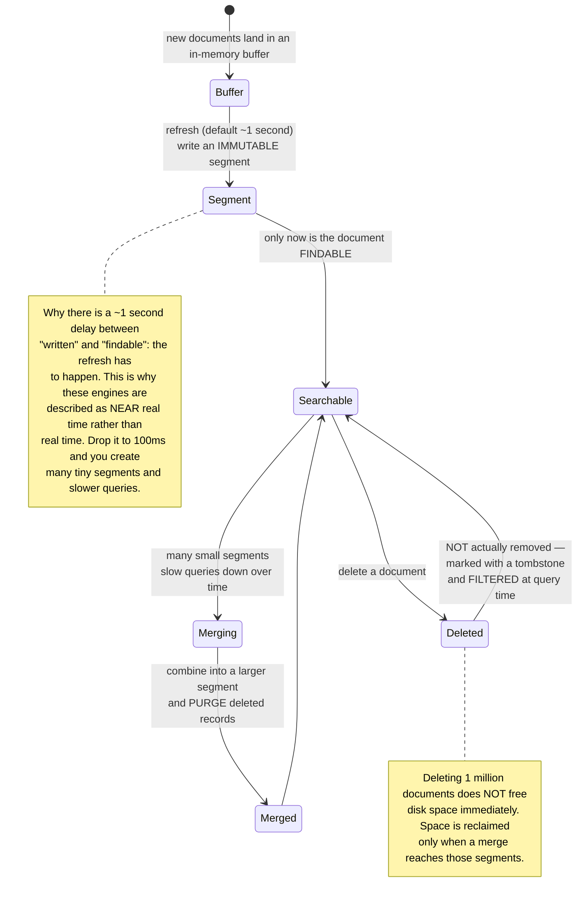
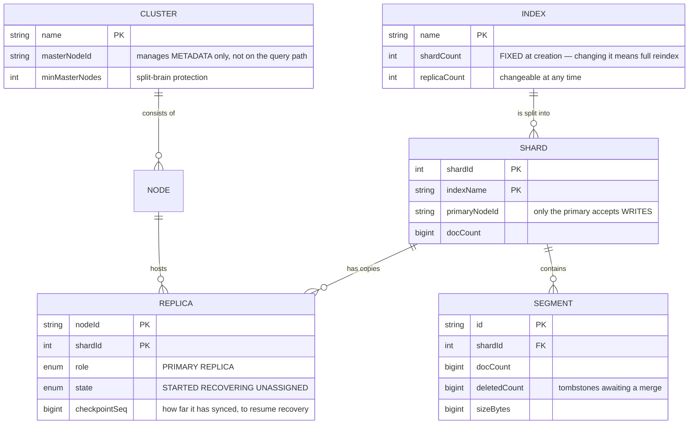
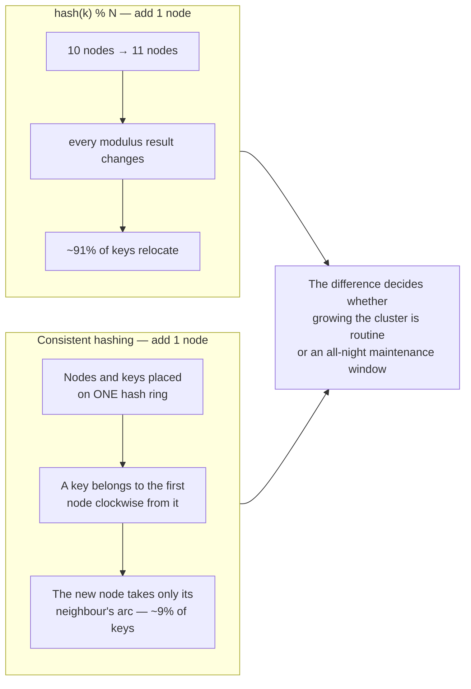

# Distributed Search Engine (Elasticsearch-like)

In [Job Board Platform](/projects/job-board-platform-linkedin-like) you **used** full-text search: call `to_tsvector`, add a GIN index, get ranked results back. It worked, and you never needed to know what was inside.

This project opens that box. And what makes it a level-4 project is not "what is an inverted index" — that takes an afternoon. The real question is:

**Once the index no longer fits on one machine, a document's score starts depending on which machine it happens to live on.**

That is a genuine failure, it is very hard to notice, and most search-engine documentation never mentions it.

---

## What you will build

- Your own inverted index with compressed postings and skip pointers
- BM25 ranking with document-length normalisation
- Sharding and replication, adding and removing nodes without data loss
- Phrase, boolean and range queries, plus typo tolerance
- Faceted aggregations for filters
- Highlighted snippets in results
- A REST API and a cluster administration UI

---

## The inverted index: the real structure, not the diagram

The diagram everyone draws is `term → [list of document ids]`. Correct but incomplete. That list — the **postings list** — must carry more, and how it is stored determines all of your performance:



Those two optimisations are not decoration. The word "the" may appear in 90% of documents — its postings list is as long as the corpus. Running `"quantum" AND "the"` by walking both lists sequentially reads millions of entries to produce a few dozen results. Skip pointers let you take the next document from the short list and **jump** into the long one at that position, ignoring everything between.

---

## BM25: why TF-IDF is not enough

TF-IDF says: the more often a term appears in a document the more relevant it is, multiplied by how rare that term is across the corpus. Reasonable, and wrong in two places.

**Wrong the first way — frequency should not be linear.** A document containing "backend" 100 times is not 100 times more relevant than one containing it once. Past roughly the tenth occurrence, each additional one says almost nothing new.

**Wrong the second way — long documents cheat.** A 10,000-word article naturally contains every word more often than a 300-word one, so it wins every query regardless of what it is actually about.

BM25 patches both with two parameters:

```java
// k1 caps frequency saturation: past roughly k1 occurrences, more adds little.
// b tunes the long-document penalty: b=0 is no penalty, b=1 is maximum.
// The values 1.2 and 0.75 are the industry defaults — they come from
// experiments on the TREC collections, not from theoretical derivation.
static final double K1 = 1.2, B = 0.75;

double score(int tf, int docLen, double avgDocLen, int docFreq, int totalDocs) {
    // Term rarity. The +0.5 terms avoid log(0) and negative values when a
    // word appears in more than half the documents.
    double idf = Math.log(1 + (totalDocs - docFreq + 0.5) / (docFreq + 0.5));

    // The denominator carries docLen/avgDocLen: documents LONGER than average
    // are divided by more, i.e. penalised.
    double norm = tf + K1 * (1 - B + B * docLen / avgDocLen);

    return idf * (tf * (K1 + 1)) / norm;
}
```

Look closely at that function's last parameter: `totalDocs`. It is about to become a problem.

---

## The real problem: scores depend on which shard you landed on

An index of 500 million documents does not fit on one machine. Split it into 10 shards of 50 million. A query goes to all 10, each returns its own top 10, the coordinator merges and takes the overall top 10.

Sounds reasonable. But `idf` is computed from `totalDocs` and `docFreq` — and **each shard only knows its own data**:



This is a hard failure to spot: the results still *look* plausible, the ordering is merely wrong in a systematic way. No exception is thrown, no warning is logged.

Three ways to handle it, each a genuine trade:

| Approach | Mechanism | Cost |
|---|---|---|
| Accept the error | Do nothing | Fine when documents are distributed **randomly** across shards, since `docFreq` then scales proportionally. Badly broken when sharding by topic or by customer |
| Global statistics | Periodically gather `docFreq` from all shards and broadcast it back | An extra sync cycle, and the numbers always lag by one round |
| Two-phase search | Phase 1 collects statistics from all shards, phase 2 scores with them | The most correct, but **doubles the network round trips** on every query |

Real systems usually pick option 1 plus a rule that sharding must be random, keeping option 3 available for queries that need precision. What matters is **knowing which one you chose** — rather than discovering it six months later when someone asks why the results look strange.

---

## Segments: the index cannot be edited in place

This is the second big design decision, and it explains nearly every surprising behaviour search engines exhibit.

A compressed, sorted postings list means **inserting one document in the middle requires rewriting the whole list**. Nobody does that. Instead the index is divided into **immutable segments**: once written, never modified.



If you read [Real-Time Collaboration Tool](/projects/realtime-collaboration-figma-like), the **tombstone** concept here is familiar: the same idea — never really delete, just mark, and reclaim in a separate later pass. Two completely different systems reaching the same answer, because of the same constraint: the data structure has no cheap in-place edit.

Three practical consequences that puzzle search-engine users constantly:

- **Written but not immediately findable.** Working as designed. Force a refresh if you truly need it, and never call it in a loop.
- **Deleting a lot without disk shrinking.** Wait for a merge, or trigger one manually.
- **Queries slowing down, then speeding up on their own.** Segment count rises, then a merge collapses it. Every query must consult **every** segment and merge the results.

---

## Sharding and replication



The most expensive detail above is `shardCount` being **fixed at creation**. The reason: documents are routed by `hash(id) % shardCount`. Changing the shard count changes the modulus result for **every** document — meaning a full reindex.

This is where **consistent hashing** earns its place. With plain hashing, adding one node to a 10-node cluster relocates nearly every key. With consistent hashing, only about `1/N` of keys move:



One more practical detail: use **virtual nodes** — each physical machine occupies many ring positions rather than one. Without them, key distribution skews badly, because random hash positions do not land evenly.

---

## Typo tolerance: do not use edit distance naively

"backedn" must find "backend". The obvious approach compares edit distance against **every** term in the dictionary — with a five-million-term dictionary that is five million comparisons per query word.

There is a data structure that solves this properly: a **Levenshtein automaton**. Rather than comparing pairs, build a recogniser for "every string within 2 edits of `backedn`" and run it in step with the dictionary structure. The result: you only traverse the part of the dictionary that could possibly match.

Two pragmatic points that matter more than the algorithm:

- **Allow no edits on short words.** A three-character word with two edits allowed matches almost anything. The common rule: ≤4 characters allows none, 5–7 allows one, longer allows two.
- **Require a correct prefix.** People mistype the ends of words far more than the beginnings. Requiring the first one or two characters to match exactly both improves quality and eliminates most of the search space.

---

## Traps worth recording

| Symptom | Actual cause | Fix |
|---|---|---|
| Equivalent content scoring wildly differently | `idf` computed per shard | Random sharding, global statistics, or two-phase search |
| Long documents win every query | TF-IDF does not normalise length | BM25 with the `b` parameter |
| Keyword-stuffed documents rank first | Frequency scales linearly | BM25 with `k1` capping saturation |
| Written but not immediately findable | The refresh has not run yet | Working as designed — force a refresh only if truly needed |
| Deleting 1M documents frees no disk | Tombstones not yet merged away | Wait for a merge or trigger one |
| Queries slowing gradually over time | Too many small segments | Tune the merge policy, lengthen the refresh interval |
| Adding a node relocates almost all data | `hash % N` | Consistent hashing with virtual nodes |
| One node hot while others idle | No virtual nodes, skewed distribution | Many ring positions per machine |
| `AND` with a common term is very slow | Walking the long list sequentially | Skip pointers; process the short list first |
| Phrase search returns wrong matches | Postings lists lack positions | Store in-document positions |
| Typo correction returns nonsense | Too many edits allowed on short words | Edits scaled by length, prefix locked |
| Data lost when the network splits | Both halves elect their own primary | Require a quorum for elections |

---

## When it is genuinely done

- [ ] 10 million documents, single-term query returns under 50ms at p95
- [ ] `"rare term" AND "common term"` runs nearly as fast as the rare term alone (skip pointers work)
- [ ] Place **the same document** on two different shards and search: scores differ by under 5% (or you can explain why you accept the gap)
- [ ] A 10,000-word and a 300-word document on the same topic: the short one is not beaten for being short
- [ ] Stuff a keyword 500 times into one document: it does **not** rank first
- [ ] Kill a node mid-query: results still return complete from replicas
- [ ] Add a node to a 5-node cluster: measure how many shards relocate — near `1/6`, not near all
- [ ] Partition the cluster in half: the minority side **refuses writes** and does not elect its own primary
- [ ] Delete 30% of documents then trigger a merge: disk usage drops accordingly
- [ ] Type "kubernets", "kubrnetes", "kuberentes": all three find "kubernetes"

---

## Where to go next

1. **Hybrid search.** Combine BM25 scores with vector similarity — two scales in different units, so blending them needs a principled method, not simple addition.
2. **Cross-region replication.** Network latency turns synchronisation into a different problem entirely, and forces a choice between consistency and availability.
3. **The storage layer underneath.** You just wrote index persistence by hand. [Distributed Database](/projects/distributed-database-postgres-like) covers LSM trees and write-ahead logs — precisely the foundation of what you built.
4. **Streaming ingestion.** Indexing from an event stream rather than in batches — [Event-Driven Microservices](/projects/event-driven-microservices-uber-like) built half the road, and [Distributed Message Broker](/projects/distributed-message-broker-kafka-like) is the other half.
