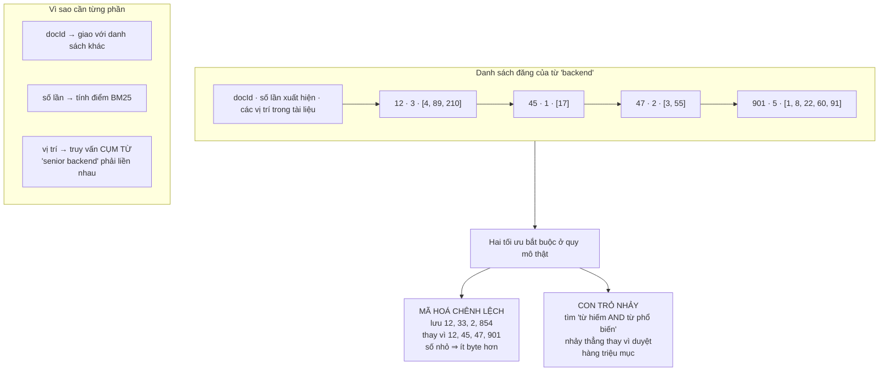
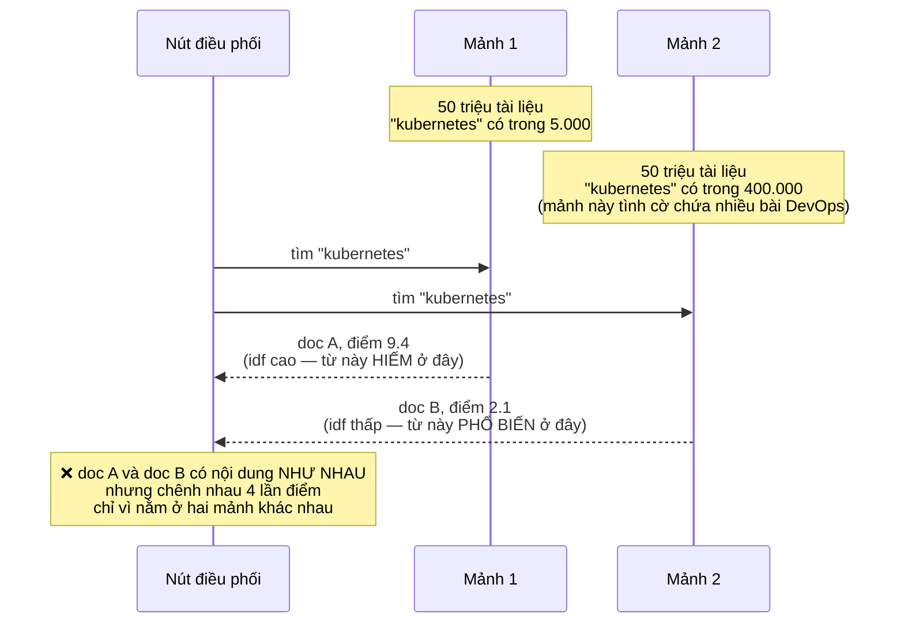
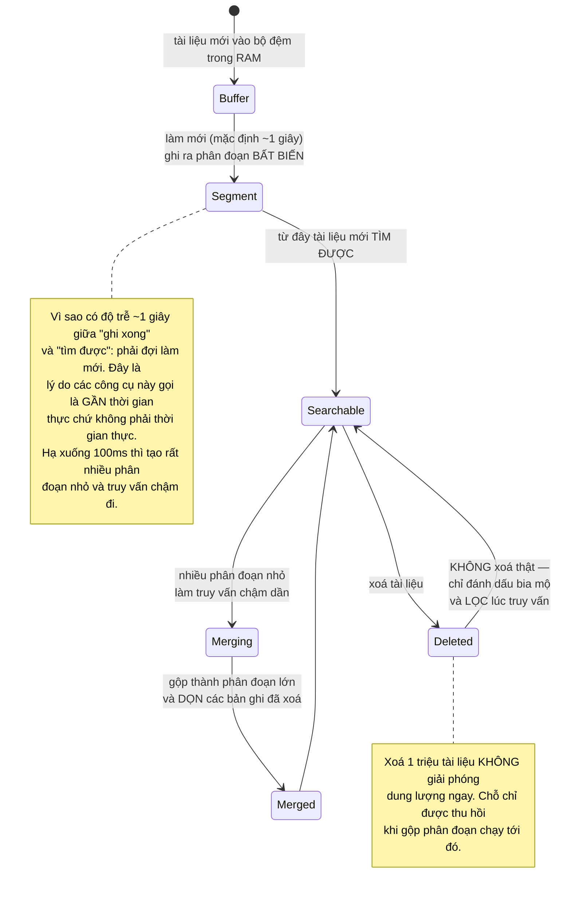
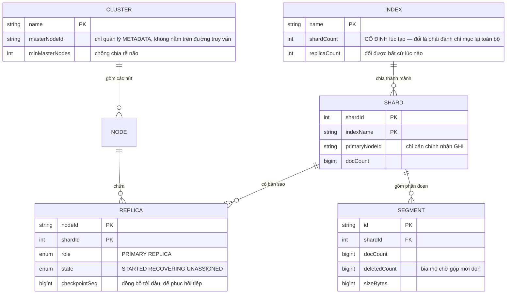
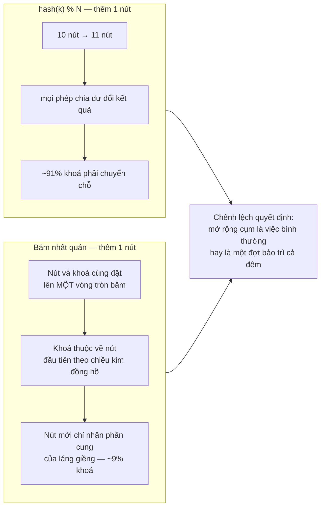

# Distributed Search Engine (Elasticsearch-like)

Ở [Job Board Platform](/projects/job-board-platform-linkedin-like) bạn đã **dùng** tìm kiếm toàn văn: gọi `to_tsvector`, đặt chỉ mục GIN, nhận về kết quả có thứ hạng. Nó hoạt động, và bạn không cần biết bên trong có gì.

Bài này mở cái hộp đó ra. Và câu hỏi khiến nó thành dự án cấp 4 không phải "chỉ mục ngược là gì" — cái đó một buổi chiều là hiểu. Câu hỏi thật là:

**Khi chỉ mục không còn vừa một máy, điểm số của một tài liệu bỗng phụ thuộc vào việc nó tình cờ nằm ở máy nào.**

Đó là một sự cố có thật, rất khó phát hiện, và phần lớn tài liệu về công cụ tìm kiếm không nhắc tới.

---

## Bạn sẽ dựng ra cái gì

- Chỉ mục ngược tự cài đặt, có nén danh sách và bỏ qua nhanh
- Xếp hạng BM25 với chuẩn hoá theo độ dài tài liệu
- Chia mảnh và nhân bản, thêm bớt nút mà không mất dữ liệu
- Truy vấn cụm từ, boolean, khoảng giá trị, và chịu lỗi gõ
- Tổng hợp theo mặt (facet) cho bộ lọc
- Đoạn nội dung có tô sáng từ khoá
- API REST và giao diện quản trị cụm

---

## Chỉ mục ngược: cấu trúc thật, không phải cái sơ đồ

Sơ đồ ai cũng vẽ là `từ → [danh sách id tài liệu]`. Đúng nhưng thiếu. Danh sách đó — gọi là **danh sách đăng** — phải mang thêm thông tin, và cách nó được lưu quyết định toàn bộ tốc độ:



Hai tối ưu ở dưới cùng không phải chuyện làm màu. Từ "the" có thể xuất hiện trong 90% tài liệu — danh sách đăng của nó dài bằng cả kho. Truy vấn `"quantum" AND "the"` mà duyệt tuần tự cả hai danh sách là đọc hàng triệu mục để tìm ra vài chục kết quả. Con trỏ nhảy cho phép: lấy tài liệu tiếp theo trong danh sách ngắn, rồi **nhảy** trong danh sách dài tới vị trí đó, bỏ qua tất cả ở giữa.

---

## BM25: vì sao TF-IDF không đủ

TF-IDF nói: từ xuất hiện càng nhiều trong tài liệu thì càng liên quan, nhân với độ hiếm của từ đó trong toàn kho. Hợp lý, và sai ở hai chỗ.

**Sai thứ nhất — tần suất không nên tuyến tính.** Tài liệu chứa "backend" 100 lần không liên quan gấp 100 lần tài liệu chứa 1 lần. Từ lần thứ 10 trở đi, mỗi lần thêm gần như không nói thêm điều gì.

**Sai thứ hai — tài liệu dài ăn gian.** Bài viết 10.000 từ tự nhiên chứa mọi từ nhiều lần hơn bài 300 từ, nên nó thắng mọi truy vấn dù không tập trung vào chủ đề nào.

BM25 vá cả hai bằng hai tham số:

```java
// k1 chặn tần suất bão hoà: từ lần thứ ~k1 trở đi, thêm nữa gần như vô ích.
// b điều chỉnh mức phạt tài liệu dài: b=0 là không phạt, b=1 là phạt hết mức.
// Giá trị 1.2 và 0.75 là mặc định của cả ngành — chúng đến từ thực nghiệm
// trên tập dữ liệu TREC, không phải từ suy luận lý thuyết.
static final double K1 = 1.2, B = 0.75;

double score(int tf, int docLen, double avgDocLen, int docFreq, int totalDocs) {
    // Độ hiếm của từ. +0.5 ở tử và mẫu để tránh log(0) và giá trị âm
    // khi một từ xuất hiện ở hơn nửa số tài liệu.
    double idf = Math.log(1 + (totalDocs - docFreq + 0.5) / (docFreq + 0.5));

    // Phần mẫu số chứa docLen/avgDocLen: tài liệu DÀI HƠN trung bình
    // bị chia nhiều hơn, tức bị phạt.
    double norm = tf + K1 * (1 - B + B * docLen / avgDocLen);

    return idf * (tf * (K1 + 1)) / norm;
}
```

Hãy nhìn kỹ tham số cuối cùng của hàm: `totalDocs`. Nó sắp trở thành vấn đề.

---

## Bài toán thật: điểm số phụ thuộc vào việc nằm ở mảnh nào

Chỉ mục 500 triệu tài liệu không vừa một máy. Chia thành 10 mảnh, mỗi mảnh 50 triệu. Truy vấn được gửi tới cả 10 mảnh, mỗi mảnh trả về 10 kết quả tốt nhất của nó, nút điều phối trộn lại và lấy 10 cái đầu.

Nghe hợp lý. Nhưng `idf` được tính từ `totalDocs` và `docFreq` — mà **mỗi mảnh chỉ biết dữ liệu của chính nó**:



Đây là một lỗi rất khó nhận ra: kết quả trả về vẫn hợp lý *trông bề ngoài*, chỉ là thứ tự sai một cách hệ thống. Không có ngoại lệ nào được ném, không có cảnh báo nào.

Ba cách xử lý, và mỗi cách là một đánh đổi thật:

| Cách | Cơ chế | Cái giá |
|---|---|---|
| Chấp nhận sai số | Không làm gì | Đủ tốt khi tài liệu phân bố **ngẫu nhiên** vào các mảnh — vì khi đó `docFreq` mỗi mảnh xấp xỉ tỉ lệ. Hỏng nặng khi chia mảnh theo chủ đề hoặc theo khách hàng |
| Thống kê toàn cục | Định kỳ gom `docFreq` của mọi mảnh về, phát ngược lại cho tất cả | Thêm một vòng đồng bộ, và số liệu luôn trễ một nhịp |
| Tìm hai pha | Pha 1 hỏi mọi mảnh lấy thống kê, pha 2 mới tính điểm | Đúng nhất, nhưng **gấp đôi số vòng mạng** cho mọi truy vấn |

Hệ thống thật thường chọn cách 1 cộng nguyên tắc "chia mảnh phải ngẫu nhiên", và mở cách 3 cho những truy vấn cần độ chính xác cao. Điều quan trọng là **biết mình đang chọn gì** — chứ không phải phát hiện ra sau sáu tháng khi có người hỏi vì sao kết quả kỳ lạ.

---

## Phân đoạn: chỉ mục không thể sửa tại chỗ

Đây là quyết định thiết kế lớn thứ hai, và nó giải thích gần hết các hành vi kỳ lạ của công cụ tìm kiếm.

Danh sách đăng đã nén và sắp xếp thì **chèn một tài liệu vào giữa là phải viết lại cả danh sách**. Không ai làm vậy. Thay vào đó, chỉ mục được chia thành các **phân đoạn bất biến**: ghi xong là không bao giờ sửa.



Nếu bạn đã đọc [Real-Time Collaboration Tool](/projects/realtime-collaboration-figma-like), khái niệm **bia mộ** ở đây quen thuộc: cùng một ý tưởng — không xoá thật, chỉ đánh dấu, và dọn ở một bước riêng về sau. Hai hệ thống hoàn toàn khác nhau, cùng một lời giải, vì cùng một ràng buộc: cấu trúc dữ liệu không cho phép sửa tại chỗ rẻ tiền.

Ba hệ quả thực tế mà người dùng công cụ tìm kiếm hay thắc mắc:

- **Ghi xong tìm ngay không thấy.** Đúng như thiết kế. Cần thấy ngay thì phải gọi làm mới thủ công, và đừng gọi nó trong vòng lặp.
- **Xoá nhiều mà đĩa không giảm.** Chờ gộp phân đoạn, hoặc kích hoạt bằng tay.
- **Truy vấn chậm dần rồi tự nhanh lại.** Số phân đoạn tăng dần rồi được gộp. Mỗi truy vấn phải hỏi **mọi** phân đoạn rồi trộn kết quả.

---

## Chia mảnh và nhân bản



Chi tiết đắt giá nhất trong sơ đồ trên là `shardCount` **cố định lúc tạo**. Lý do: tài liệu được định tuyến bằng `hash(id) % shardCount`. Đổi số mảnh là đổi kết quả phép chia dư của **mọi** tài liệu — tức phải đánh chỉ mục lại từ đầu.

Đây là lúc **băm nhất quán** đáng nhắc tới. Với băm thường, thêm một nút vào cụm 10 nút làm gần như toàn bộ khoá phải chuyển chỗ. Với băm nhất quán, chỉ khoảng `1/N` số khoá phải chuyển:



Thêm một chi tiết thực tế: dùng **nút ảo** — mỗi máy vật lý chiếm nhiều điểm trên vòng thay vì một. Không có nó, phân bố khoá lệch rất mạnh vì các điểm băm ngẫu nhiên không rơi đều.

---

## Chịu lỗi gõ: đừng dùng khoảng cách chỉnh sửa theo cách ngây thơ

"backedn" phải tìm ra "backend". Cách hiển nhiên là so khoảng cách chỉnh sửa với **mọi** từ trong từ điển — với từ điển 5 triệu từ thì đó là 5 triệu phép so cho mỗi từ khoá.

Có một cấu trúc dữ liệu giải đúng bài này: **ô-tô-mát Levenshtein**. Thay vì so từng cặp, dựng một bộ nhận dạng cho "mọi chuỗi cách `backedn` không quá 2 phép sửa", rồi cho nó chạy song song với cấu trúc từ điển. Kết quả: chỉ duyệt phần từ điển thật sự có khả năng khớp.

Hai điều thực dụng quan trọng hơn thuật toán:

- **Đừng cho phép sai với từ ngắn.** Từ 3 ký tự mà cho sai 2 thì khớp với gần như mọi thứ. Quy tắc thường dùng: ≤4 ký tự thì không cho sai, 5–7 cho sai 1, dài hơn cho sai 2.
- **Ưu tiên tiền tố đúng.** Người ta gõ sai ở cuối từ nhiều hơn ở đầu. Bắt buộc 1–2 ký tự đầu phải khớp chính xác vừa tăng chất lượng vừa cắt phần lớn không gian tìm kiếm.

---

## Những cái bẫy đã được ghi lại

| Triệu chứng | Nguyên nhân thật | Cách sửa |
|---|---|---|
| Cùng nội dung, điểm khác nhau nhiều lần | `idf` tính cục bộ trên từng mảnh | Chia mảnh ngẫu nhiên, hoặc thống kê toàn cục, hoặc tìm hai pha |
| Tài liệu dài luôn thắng mọi truy vấn | TF-IDF không chuẩn hoá độ dài | BM25 với tham số `b` |
| Tài liệu nhồi từ khoá xếp đầu | Tần suất tăng tuyến tính | BM25 với tham số `k1` chặn bão hoà |
| Ghi xong tìm ngay không thấy | Chưa tới nhịp làm mới | Đúng thiết kế — làm mới thủ công nếu thật sự cần |
| Xoá 1 triệu tài liệu mà đĩa không giảm | Bia mộ chưa được gộp | Chờ gộp phân đoạn hoặc kích hoạt bằng tay |
| Truy vấn chậm dần theo thời gian | Quá nhiều phân đoạn nhỏ | Chỉnh chính sách gộp, tăng nhịp làm mới |
| Thêm nút mà gần như mọi dữ liệu phải chuyển | `hash % N` | Băm nhất quán với nút ảo |
| Một nút nóng, các nút khác rảnh | Không dùng nút ảo, phân bố lệch | Nhiều điểm ảo cho mỗi máy |
| Truy vấn `AND` với từ phổ biến rất chậm | Duyệt tuần tự cả danh sách dài | Con trỏ nhảy, xử lý danh sách ngắn trước |
| Tìm cụm từ không chính xác | Danh sách đăng không lưu vị trí | Lưu vị trí trong tài liệu |
| Sửa lỗi gõ trả về kết quả vô lý | Cho phép sai quá nhiều với từ ngắn | Số phép sai theo độ dài, khoá tiền tố |
| Mất dữ liệu khi mạng chia đôi | Hai nửa cùng bầu nút chính | Ngưỡng đa số cho việc bầu chọn |

---

## Khi nào coi như xong

- [ ] 10 triệu tài liệu, truy vấn một từ trả về dưới 50ms ở phân vị 95
- [ ] Truy vấn `"từ hiếm" AND "từ phổ biến"`: nhanh gần bằng truy vấn từ hiếm một mình (con trỏ nhảy hoạt động)
- [ ] Đặt **cùng một tài liệu** vào hai mảnh khác nhau rồi tìm: điểm chênh dưới 5% (hoặc bạn giải thích được vì sao chấp nhận chênh)
- [ ] Tài liệu 10.000 từ và tài liệu 300 từ cùng nói về một chủ đề: cái ngắn không bị thua chỉ vì ngắn
- [ ] Nhồi một từ khoá 500 lần vào một tài liệu: nó **không** lên đầu
- [ ] Giết một nút giữa lúc đang truy vấn: kết quả vẫn trả về đầy đủ từ bản sao
- [ ] Thêm một nút vào cụm 5 nút: đo số mảnh phải chuyển, phải gần `1/6` chứ không phải gần hết
- [ ] Ngắt mạng chia cụm làm hai nửa: nửa thiểu số **từ chối ghi**, không tự bầu nút chính riêng
- [ ] Xoá 30% tài liệu rồi kích hoạt gộp: dung lượng đĩa giảm tương ứng
- [ ] Gõ "kubernets", "kubrnetes", "kuberentes": cả ba ra "kubernetes"

---

## Bước tiếp theo

1. **Tìm kiếm lai.** Kết hợp điểm BM25 với điểm tương đồng vector — hai thang điểm khác đơn vị nên cần một cách hoà trộn có cơ sở, không phải cộng thẳng.
2. **Nhân bản giữa nhiều vùng địa lý.** Độ trễ mạng biến việc đồng bộ thành bài toán khác hẳn, và bạn phải chọn giữa nhất quán và sẵn sàng.
3. **Kho lưu bên dưới.** Bạn vừa tự viết phần lưu trữ chỉ mục. [Distributed Database](/projects/distributed-database-postgres-like) đi vào cây LSM và nhật ký ghi trước — chính là nền của phần bạn vừa làm.
4. **Nhập dữ liệu qua hàng đợi.** Đánh chỉ mục theo dòng sự kiện thay vì theo lô — [Event-Driven Microservices](/projects/event-driven-microservices-uber-like) đã dựng sẵn nửa đường, và [Distributed Message Broker](/projects/distributed-message-broker-kafka-like) là nửa còn lại.
