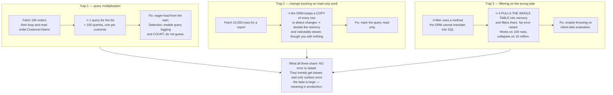
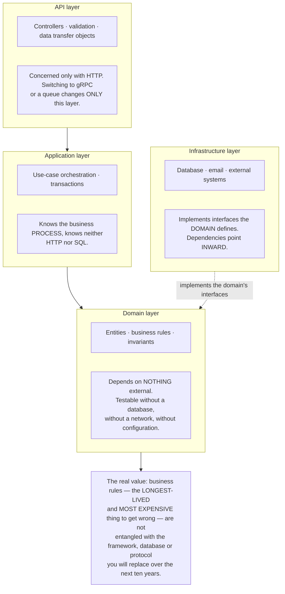
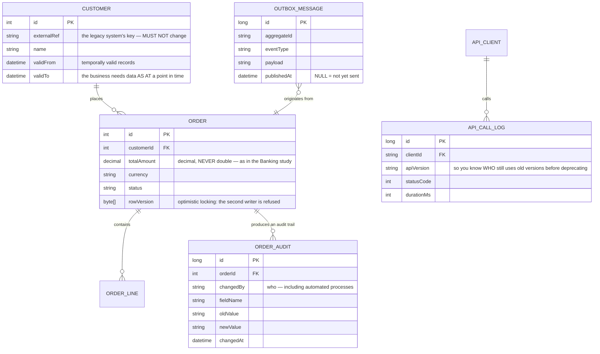

# .NET Enterprise API (ASP.NET Core)

This roadmap has passed through Node, Python, Java, Go, Rust, Kotlin, Swift and Dart. One ecosystem remains, and it dominates a domain the others rarely touch: **internal software for large organisations — banking, insurance, healthcare, government.**

That domain's characteristics differ from everything you have built:

- Systems live **ten years or more**, and whoever wrote them originally left long ago
- They must integrate with things that **cannot be changed** — legacy systems, partners, regulators
- Mistakes carry **legal consequences**, not merely technical ones
- The person who inherits the code matters more than the person who wrote it

That reorders the priorities. Through most of this roadmap, the goal was making a system work well. Here, the goal is **making a system somebody else can read in five years.**

---

## What you will build

- A layered API with real boundaries, testable layer by layer
- Data access avoiding the classic ORM traps
- Authentication and authorisation integrated with an enterprise directory
- Background jobs, email, and synchronisation with external systems
- Structured logging and metrics for operations
- API versioning that never breaks existing callers

---

## Trap one: `.Result` and deadlocks

This is .NET's classic failure, and it **does not appear on your machine**:

```csharp
// ❌ Looks harmless. Works in a console app and in tests.
// In a context with a synchronisation context, it DEADLOCKS PERMANENTLY.
public IActionResult Get(int id)
{
    var customer = _service.GetCustomerAsync(id).Result;   // or .Wait()
    return Ok(customer);
}

// ✓ Async all the way, from the entry point down to the database query.
public async Task<IActionResult> Get(int id, CancellationToken ct)
{
    var customer = await _service.GetCustomerAsync(id, ct);
    return Ok(customer);
}
```

Why it does not show up in testing: the deadlock requires a synchronisation context that forces the continuation onto the very thread being blocked. Modern ASP.NET Core **has no** such context, so the code appears to work — until somebody calls the same code from a different context (an older library, a Windows service, an Office add-in). Then it hangs with no exception.

The `CancellationToken` detail matters too: a customer closes their browser mid-way through a heavy query, and if you do not pass cancellation down, the database keeps working on a result **nobody needs any more**. Under load, that is meaningful waste.

---

## Trap two: the ORM, three ways it fails

An object-relational mapper makes work easy right up until it silently does something you did not intend.



All three share one defence: **enable query logging in development and look at it occasionally.** Without that step you write clean-looking code that emits hundreds of queries, and nobody knows until somebody complains.

On schema migrations, a significant difference from earlier projects: in enterprise systems, **auto-generated migrations are not enough**. They must be read and reviewed like code, because one generated drop-column statement can be unrecoverable data loss. This is the spirit of the migration protocol [Banking System](/projects/banking-system-core-banking) demands.

---

## Layered architecture: what the boundaries are for

Enterprise architecture is often criticised for excess layers. The criticism is fair when layers merely forward calls to each other. But boundaries have a specific purpose, and it pays off when a system lives a long time:



The test for whether boundaries are real or merely folders: **can the domain layer be tested without starting anything?** No database, no server, no config file. If something must start, dependencies have leaked backwards and the layers are decoration.

---

## Versioning: your callers do not upgrade when you do

On the web you deploy the frontend and backend together. Here, your API's callers are **another department's system or another company's**, and they have their own release calendar — sometimes quarterly.

Which means: **once published, you may not break it.**

| Change | Breaking? | Note |
|---|---|---|
| Adding an **optional** field to a response | No | Old callers ignore it |
| Adding a **required** field to a request | **Yes** | Every existing caller fails immediately |
| Renaming a field | **Yes** | Even when the meaning is unchanged |
| Narrowing a type (string → number) | **Yes** | Callers parse incorrectly |
| Widening a set of valid values | **Possibly** | Callers may have an incomplete `switch` |
| Fixing a bug that changes a returned value | **Possibly** | Somebody has built on the buggy behaviour |

The last row causes the most real-world argument: **fixing a bug can itself be a breaking change**, because somebody built on that behaviour. There is no universal answer — only a principle: **announce ahead, give a transition window, and measure who is still using the old path.**

That last part needs infrastructure: record which API version each caller uses. Without those numbers, every deprecation decision is guesswork.

---

## The data model



Three columns characteristic of enterprise systems that earlier projects lacked:

**`validFrom` / `validTo`** — businesses routinely need data **as at a past moment**: "what was this customer's address when the contract was signed?" Overwriting the record destroys the ability to answer that permanently. This is append-only in its eighth guise, and this time the reason is a **business requirement**.

**`rowVersion`** — optimistic locking. Two staff members open the same order, both edit, and the one who saves second **overwrites** the first's changes with nobody noticing. A version column makes the second save fail so the user can be asked.

**`OUTBOX_MESSAGE`** — the outbox pattern from [Event-Driven Microservices](/projects/event-driven-microservices-uber-like). It appears here because enterprise systems nearly always must inform other systems, and the dual-write problem does not change whether or not you use microservices.

---

## Traps worth recording

| Symptom | Actual cause | Fix |
|---|---|---|
| Hangs in production, fine in testing | `.Result` inside a synchronisation context | Async all the way, never block |
| The database still working after the client left | Cancellation not propagated | `CancellationToken` down to the query |
| A list page emitting hundreds of queries | Query multiplication from lazy loading | Eager loading, and COUNT queries in the log |
| A report using twice the memory it needs | Change tracking on read-only queries | Mark queries read-only |
| Fine on test data, collapses on real data | Filters evaluated client-side | Enable throwing on client-side evaluation |
| Data lost after a migration | Auto-generated migrations nobody read | Read and review migrations like code |
| Amounts off by a few cents | Using `double` for money | `decimal`, as the Banking study showed |
| Two users edit, one loses their changes | No optimistic locking | A row version column refusing the second save |
| Cannot answer "what was it at that time" | Records overwritten in place | Temporally valid records |
| An API upgrade breaking another department | A breaking change with no notice | Versioning, announcement, usage measurement |
| No idea whether an old version can be retired | Version not recorded per caller | An API call log with a version field |
| Events lost when the process dies | Writing to the database then publishing | An outbox inside the same transaction |
| Logs unqueryable during an incident | Free-form text logging | Structured logs with a correlation id |

---

## When it is genuinely done

- [ ] Grep the whole codebase: **no** remaining `.Result` or `.Wait()`
- [ ] Disconnect mid-query: the query **is cancelled** at the database
- [ ] With query counting on, open a list page: under 5 queries, not hundreds
- [ ] Enable throwing on client-side evaluation: the entire test suite **stays green**
- [ ] Run the domain layer tests: **no** database or server starts
- [ ] Two sessions editing one order: the second save **is refused** with a clear message
- [ ] Query data as at a past date: returns **the record as it was then**
- [ ] Every order change traces to **who, when, and what changed**
- [ ] Call the API with the old version contract: **it still works**
- [ ] Review usage by version: you know how many callers remain on the old one
- [ ] Kill the process right after saving an order: the event **is still published** after restart
- [ ] One million transactions with awkward amounts: totals match **exactly**

---

## Where to go next

1. **Extract one module into its own service.** When a module needs a different release cadence from the rest — and only then, per the warning in [Event-Driven Microservices](/projects/event-driven-microservices-uber-like).
2. **Event sourcing for auditable domains.** Store the event sequence rather than current state, deriving state by replay — the same idea as [Banking System](/projects/banking-system-core-banking).
3. **Separate reads from writes.** Heavy reporting runs on its own read model without contending with transactions.
4. **Serious deployment and operations.** A ten-year system needs the release process and observability of [DevOps Kubernetes Platform](/projects/devops-kubernetes-platform).
