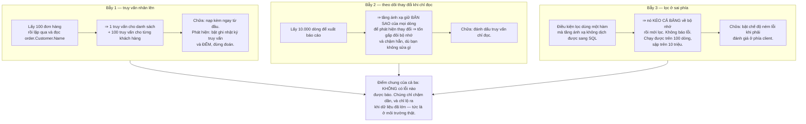
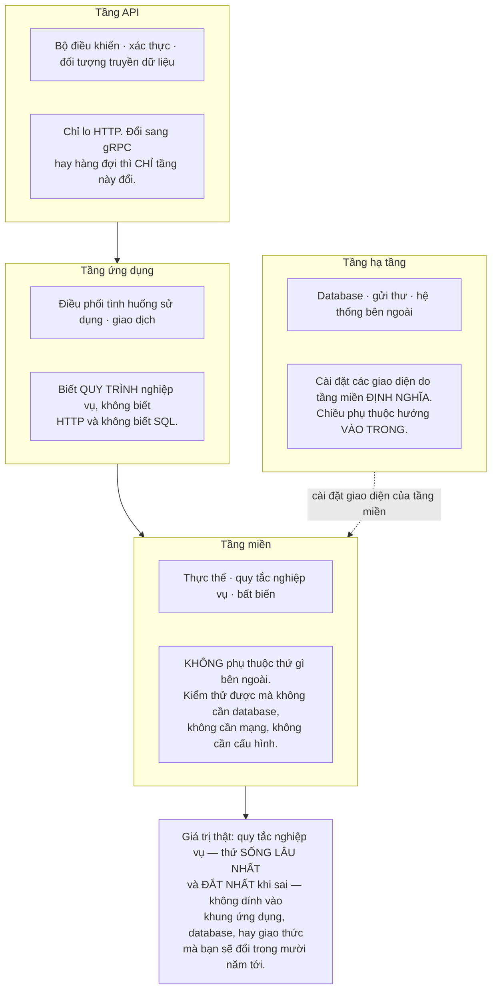
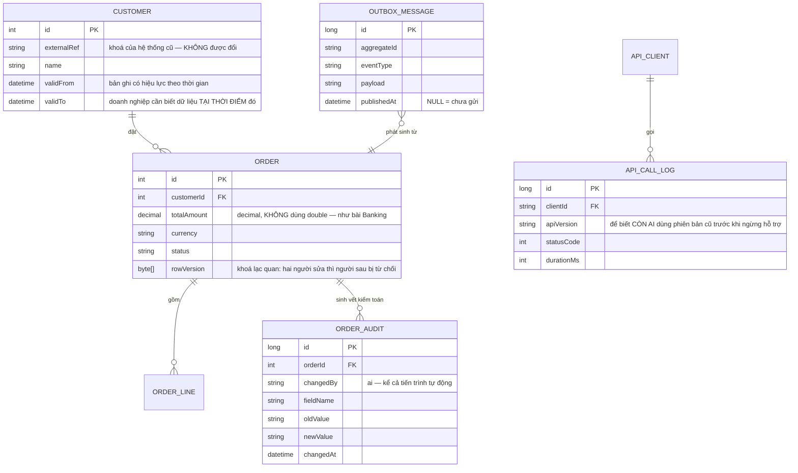

# .NET Enterprise API (ASP.NET Core)

Lộ trình này đã đi qua Node, Python, Java, Go, Rust, Kotlin, Swift, Dart. Còn một hệ sinh thái nữa, và nó thống trị một mảng mà các mảng khác ít chạm tới: **phần mềm nội bộ của doanh nghiệp lớn — ngân hàng, bảo hiểm, y tế, chính phủ.**

Đặc điểm của mảng đó khác hẳn mọi thứ bạn đã làm:

- Hệ thống sống **mười năm hoặc hơn**, và người viết nó ban đầu đã nghỉ từ lâu
- Phải tích hợp với những thứ **không thể thay đổi** — hệ thống cũ, đối tác, cơ quan quản lý
- Sai thì có **hậu quả pháp lý**, không chỉ hậu quả kỹ thuật
- Người kế nhiệm quan trọng hơn người viết đầu tiên

Điều đó đổi hẳn thứ tự ưu tiên. Trong phần lớn lộ trình này, mục tiêu là làm hệ thống chạy tốt. Ở đây, mục tiêu là **làm hệ thống mà người khác đọc được sau năm năm.**

---

## Bạn sẽ dựng ra cái gì

- API nhiều tầng có ranh giới rõ ràng, kiểm thử được từng tầng
- Truy cập dữ liệu tránh được các bẫy kinh điển của tầng ánh xạ
- Xác thực và phân quyền tích hợp với danh bạ doanh nghiệp
- Tác vụ nền, gửi thư, đồng bộ với hệ thống bên ngoài
- Nhật ký có cấu trúc và chỉ số cho vận hành
- Đánh phiên bản API để không phá vỡ bên đang dùng

---

## Bẫy thứ nhất: `.Result` và bế tắc

Đây là lỗi kinh điển của .NET, và nó **không xuất hiện trên máy của bạn**:

```csharp
// ❌ Trông vô hại. Chạy tốt ở ứng dụng dòng lệnh và trong kiểm thử.
// Trong ngữ cảnh có bộ điều phối đồng bộ, nó BẾ TẮC VĨNH VIỄN.
public IActionResult Get(int id)
{
    var customer = _service.GetCustomerAsync(id).Result;   // hoặc .Wait()
    return Ok(customer);
}

// ✓ Bất đồng bộ suốt chuỗi, từ điểm vào tới tận truy vấn database.
public async Task<IActionResult> Get(int id, CancellationToken ct)
{
    var customer = await _service.GetCustomerAsync(id, ct);
    return Ok(customer);
}
```

Vì sao nó không xuất hiện khi bạn thử: bế tắc chỉ xảy ra khi có bộ điều phối buộc phần tiếp theo phải chạy trên đúng luồng đang bị chặn. ASP.NET Core hiện đại **không có** bộ điều phối đó, nên mã trên có vẻ chạy được — cho tới khi có ai gọi cùng đoạn mã ấy từ một ngữ cảnh khác (một thư viện cũ, một dịch vụ Windows, một tiện ích Office). Và lúc đó nó treo mà không có ngoại lệ nào.

Chi tiết `CancellationToken` cũng đáng nói: khách hàng đóng trình duyệt giữa lúc một truy vấn nặng đang chạy, và nếu bạn không truyền mã huỷ xuống, database vẫn tiếp tục làm việc cho một kết quả **không ai còn cần**. Ở hệ thống có tải cao, đây là nguồn lãng phí đáng kể.

---

## Bẫy thứ hai: tầng ánh xạ dữ liệu, ba cách hỏng

Tầng ánh xạ đối tượng–quan hệ làm việc dễ dàng cho tới lúc nó im lặng làm điều bạn không muốn.



Cả ba đều có chung một cách phòng: **bật ghi nhật ký truy vấn ở môi trường phát triển và thỉnh thoảng nhìn vào đó.** Không có bước ấy, bạn viết mã trông sạch sẽ mà sinh ra hàng trăm truy vấn, và không ai biết cho tới khi có người phàn nàn.

Về di trú lược đồ, một khác biệt lớn so với các dự án trước: ở hệ thống doanh nghiệp, **di trú tự động là không đủ**. Chúng phải được đọc và duyệt như mã, vì một lệnh xoá cột sinh tự động có thể là mất dữ liệu không phục hồi được. Đây chính là tinh thần của quy trình di trú mà [Banking System](/projects/banking-system-core-banking) đòi hỏi.

---

## Kiến trúc theo tầng: ranh giới để làm gì

Kiến trúc doanh nghiệp hay bị chê là thừa tầng. Chê đúng khi các tầng chỉ chuyển tiếp lời gọi cho nhau. Nhưng ranh giới có một mục đích cụ thể, và nó đáng giá khi hệ thống sống lâu:



Phép thử để biết ranh giới có thật hay chỉ là thư mục: **tầng miền có kiểm thử được mà không khởi động gì không?** Không database, không máy chủ, không tệp cấu hình. Nếu phải khởi động thứ gì đó thì phụ thuộc đã rò ngược, và các tầng chỉ là trang trí.

---

## Đánh phiên bản: bên gọi bạn không nâng cấp theo bạn

Trên web bạn triển khai giao diện và máy chủ cùng lúc. Ở đây, bên gọi API của bạn là **hệ thống của một phòng ban khác hoặc một công ty khác**, và họ có lịch phát hành riêng — có khi mỗi quý một lần.

Nghĩa là: **một khi đã công bố, bạn không được phá vỡ.**

| Thay đổi | Có phá vỡ không | Ghi chú |
|---|---|---|
| Thêm trường **tuỳ chọn** vào phản hồi | Không | Bên gọi cũ bỏ qua nó |
| Thêm trường **bắt buộc** vào yêu cầu | **Có** | Mọi bên gọi cũ hỏng ngay |
| Đổi tên trường | **Có** | Kể cả khi nghĩa không đổi |
| Thu hẹp kiểu (chuỗi → số) | **Có** | Bên gọi phân tích sai |
| Mở rộng danh sách giá trị hợp lệ | **Có thể** | Bên gọi có thể có `switch` không đủ nhánh |
| Sửa lỗi làm đổi giá trị trả về | **Có thể** | Có bên đã viết mã dựa vào hành vi sai |

Hàng cuối là điều gây tranh cãi nhiều nhất trong thực tế: **sửa một lỗi cũng có thể là thay đổi phá vỡ**, vì có người đã xây trên hành vi sai đó. Không có câu trả lời chung — chỉ có nguyên tắc: **thông báo trước, cho thời gian chuyển đổi, và đo xem còn ai đang dùng đường cũ.**

Điều cuối cùng đó cần hạ tầng: ghi lại phiên bản API mà mỗi bên gọi đang dùng. Không có số liệu ấy thì mọi quyết định ngừng hỗ trợ đều là đoán.

---

## Dữ liệu



Ba cột đặc trưng của hệ thống doanh nghiệp mà các dự án trước không có:

**`validFrom` / `validTo`** — doanh nghiệp thường cần biết dữ liệu **tại một thời điểm trong quá khứ**: "địa chỉ của khách hàng này lúc ký hợp đồng là gì?" Ghi đè bản ghi làm mất khả năng trả lời câu đó vĩnh viễn. Đây là nguyên tắc chỉ-ghi-thêm ở hình thức thứ tám, và lần này lý do là **yêu cầu nghiệp vụ**.

**`rowVersion`** — khoá lạc quan. Hai nhân viên mở cùng một đơn hàng, cùng sửa, người lưu sau **ghi đè** thay đổi của người trước mà không ai biết. Cột phiên bản khiến lần lưu thứ hai bị từ chối và người dùng được hỏi.

**`OUTBOX_MESSAGE`** — chính là mẫu hình outbox từ [Event-Driven Microservices](/projects/event-driven-microservices-uber-like). Nó có mặt ở đây vì hệ thống doanh nghiệp gần như luôn phải báo cho hệ thống khác, và bài toán ghi hai nơi không đổi dù bạn có dùng microservices hay không.

---

## Những cái bẫy đã được ghi lại

| Triệu chứng | Nguyên nhân thật | Cách sửa |
|---|---|---|
| Treo vĩnh viễn ở môi trường thật, chạy tốt lúc thử | `.Result` trong ngữ cảnh có bộ điều phối | Bất đồng bộ suốt chuỗi, không chặn |
| Database vẫn làm việc sau khi khách đóng trình duyệt | Không truyền mã huỷ xuống | `CancellationToken` tới tận truy vấn |
| Trang danh sách sinh hàng trăm truy vấn | Truy vấn nhân lên do nạp muộn | Nạp kèm, và ĐẾM truy vấn trong nhật ký |
| Báo cáo tốn gấp đôi bộ nhớ cần thiết | Theo dõi thay đổi trên truy vấn chỉ đọc | Đánh dấu truy vấn chỉ đọc |
| Chạy tốt trên dữ liệu thử, sập trên dữ liệu thật | Lọc bị đánh giá ở phía client | Bật ném lỗi khi phải đánh giá phía client |
| Mất dữ liệu sau một lần di trú | Di trú sinh tự động không ai đọc | Đọc và duyệt di trú như mã |
| Số tiền lệch vài xu | Dùng `double` cho tiền | `decimal`, như bài Banking đã chỉ ra |
| Hai người sửa, một người mất thay đổi | Không có khoá lạc quan | Cột phiên bản dòng, từ chối lần lưu sau |
| Không trả lời được "lúc đó dữ liệu là gì" | Ghi đè bản ghi | Bản ghi có hiệu lực theo thời gian |
| Nâng cấp API làm hỏng hệ thống phòng ban khác | Thay đổi phá vỡ mà không báo trước | Đánh phiên bản, thông báo, đo ai còn dùng |
| Không biết có ngừng hỗ trợ phiên bản cũ được chưa | Không ghi phiên bản theo từng bên gọi | Nhật ký gọi API có trường phiên bản |
| Sự kiện gửi đi mất khi tiến trình chết | Ghi database rồi mới gửi | Outbox trong cùng giao dịch |
| Nhật ký không truy vấn được lúc có sự cố | Ghi chuỗi văn bản tự do | Nhật ký có cấu trúc, kèm mã tương quan |

---

## Khi nào coi như xong

- [ ] `grep` toàn bộ mã nguồn: **không** còn `.Result` hay `.Wait()` nào
- [ ] Đóng kết nối giữa lúc truy vấn nặng: truy vấn **bị huỷ** ở database
- [ ] Bật đếm truy vấn, mở trang danh sách: dưới 5 truy vấn, không phải hàng trăm
- [ ] Bật ném lỗi khi đánh giá phía client: toàn bộ kiểm thử **vẫn xanh**
- [ ] Chạy kiểm thử tầng miền: **không** khởi động database hay máy chủ nào
- [ ] Hai phiên cùng sửa một đơn hàng: người lưu sau **bị từ chối** kèm thông báo rõ
- [ ] Truy vấn dữ liệu ở một mốc thời gian trong quá khứ: trả về **đúng bản ghi lúc đó**
- [ ] Mọi thay đổi trên đơn hàng đều truy được **ai, khi nào, đổi gì**
- [ ] Gọi API bằng bản hợp đồng phiên bản cũ: **vẫn chạy**
- [ ] Xem báo cáo sử dụng theo phiên bản: biết còn bao nhiêu bên dùng phiên bản cũ
- [ ] Giết tiến trình ngay sau khi lưu đơn hàng: sự kiện **vẫn được gửi** sau khi khởi động lại
- [ ] Số tiền qua 1 triệu giao dịch có số lẻ: khớp **tuyệt đối**

---

## Bước tiếp theo

1. **Tách một phần ra dịch vụ riêng.** Khi một mô-đun cần nhịp phát hành khác phần còn lại — và chỉ khi đó, theo đúng cảnh báo của [Event-Driven Microservices](/projects/event-driven-microservices-uber-like).
2. **Nguồn sự kiện cho miền cần kiểm toán.** Lưu chuỗi sự kiện thay vì trạng thái hiện tại, và trạng thái là kết quả phát lại — cùng ý tưởng với [Banking System](/projects/banking-system-core-banking).
3. **Đọc chép tách khỏi ghi.** Báo cáo nặng chạy trên mô hình đọc riêng, không tranh chấp với giao dịch.
4. **Triển khai và vận hành nghiêm túc.** Hệ thống sống mười năm cần quy trình phát hành và quan sát của [DevOps Kubernetes Platform](/projects/devops-kubernetes-platform).
