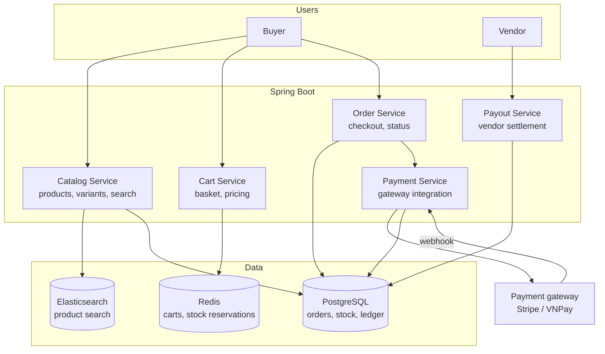
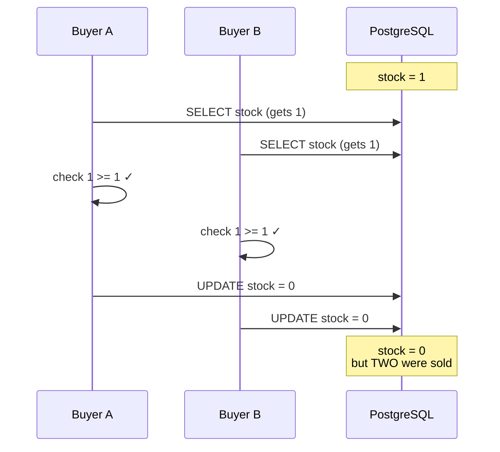
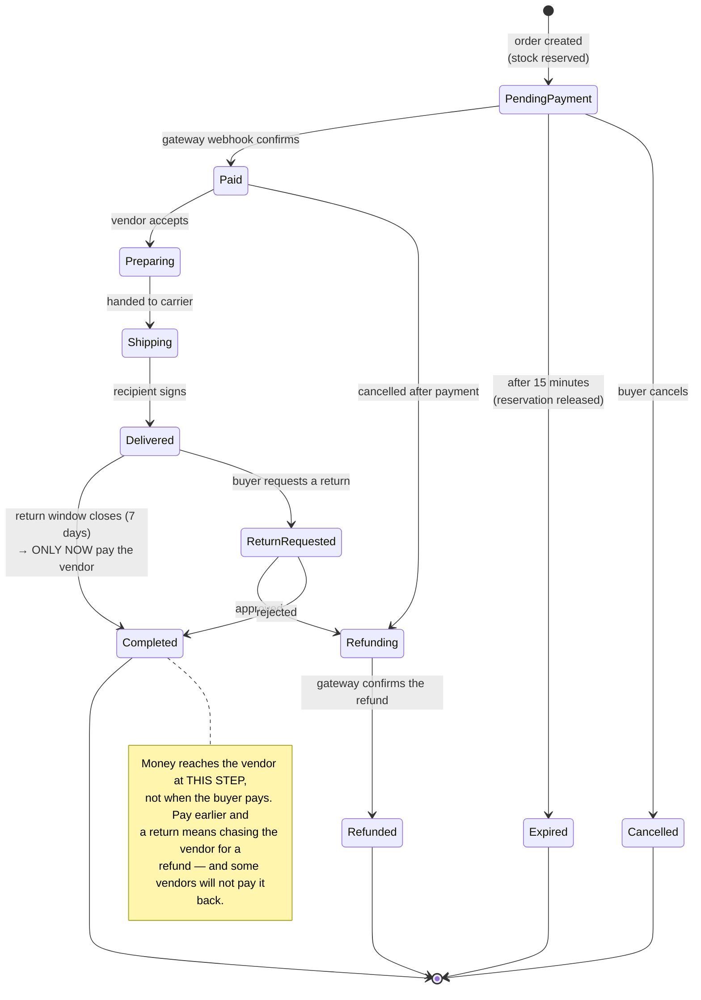
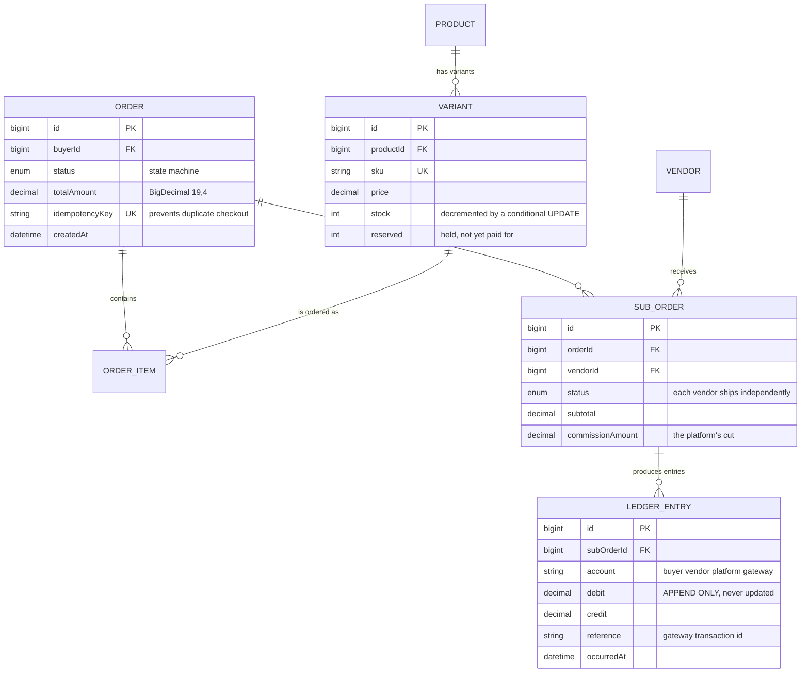

# E-Commerce Platform (Multi-vendor)

This is the first project on the roadmap where **a bug loses real money**. Not "poor experience" or "slightly wrong data" — but selling stock that no longer exists, charging a customer twice for one order, or paying out a vendor before the buyer has received anything.

So every technical decision here is governed by one question: *if the process dies right now, is the system still correct?* That question leads straight to database transactions, contention locks, idempotency, and an order state machine.

The project also switches language stack to **Java + Spring Boot** — not for variety, but because it is the dominant stack in finance and commerce at large companies, and because Spring's transaction ecosystem is worth learning properly.

---

## What you are going to build

- Multiple vendors, each with a storefront and their own dashboard
- A product catalogue with variants (colour, size) and per-variant stock
- Cart, checkout, real payment gateway integration
- One order containing items from several vendors, split into sub-orders
- Order tracking, refunds, post-purchase reviews
- A revenue dashboard for vendors, reconciliation for admins

---

## Architecture



Note immediately: **carts live in Redis, orders live in Postgres.** A cart is transient data — abandonment is normal, and writing to a relational database on every add/remove is wasteful. But the moment the buyer presses "place order", everything moves to Postgres and never leaves.

---

## Problem number one: overselling

The classic bug, and it only appears when several people buy at once.

```java
// WRONG — and it behaves perfectly every time you test it yourself.
Variant variant = variantRepository.findById(variantId).orElseThrow();
if (variant.getStock() >= quantity) {          // read: 1 left
    variant.setStock(variant.getStock() - quantity);  // compute: 1 - 1 = 0
    variantRepository.save(variant);           // write: 0
}
```

Two buyers take the last unit. Both read `stock = 1`, both see the condition pass, both write `0`. You have sold two of one item.



There are three fixes, and choosing the wrong one trades performance for something you did not need.

### Fix 1 — decrement inside the UPDATE statement

```java
@Modifying
@Query("""
    UPDATE Variant v
       SET v.stock = v.stock - :qty
     WHERE v.id = :id
       AND v.stock >= :qty
    """)
int decreaseStock(@Param("id") Long id, @Param("qty") int qty);
```

The `stock >= qty` condition lives **inside** the write, so the database locks the row while executing it. Zero rows affected means insufficient stock — no read-before-write, no window for two requests to slip through.

This is the simplest approach and enough for most cases. The general principle: **put the condition in the same statement as the write.** You met it in [Todo App](/projects/todo-list-app-full-stack) as `updateMany` with `userId`, and in [URL Shortener](/projects/url-shortener-voi-analytics) as catching a unique-constraint error. The third encounter is when it should become reflex.

### Fix 2 — pessimistic locking

```java
@Lock(LockModeType.PESSIMISTIC_WRITE)
@Query("SELECT v FROM Variant v WHERE v.id = :id")
Optional<Variant> findByIdForUpdate(@Param("id") Long id);
```

This emits `SELECT ... FOR UPDATE`: the first transaction locks the row and everyone else **waits**. Absolutely correct, but it serialises every purchase of the same product. In a flash sale, thousands of people queue behind each other on one row.

Use it when you must read several things before deciding, not merely decrement a number.

### Fix 3 — reserve in Redis

The pragmatic choice for flash sales: reserve with an atomic `DECRBY` in Redis, then commit to Postgres once payment succeeds. Redis handles tens of thousands of operations per second on one key without breaking a sweat.

The trade-off: if Redis loses data, reservations and real stock drift apart. That needs a periodic reconciliation job — and an acceptance that this is an *eventually consistent* system, not an immediately consistent one.

---

## The order state machine

An order is not a `status` column you assign freely. It is a state machine with an explicit list of legal transitions.



```java
public enum OrderStatus {
    PENDING_PAYMENT, PAID, PREPARING, SHIPPING, DELIVERED,
    RETURN_REQUESTED, REFUNDING, REFUNDED, COMPLETED, CANCELLED, EXPIRED;

    // The legal transition table. Without it, some bug somewhere moves an
    // order from REFUNDED back to PAID, and you find out during month-end
    // reconciliation — if you are lucky.
    private static final Map<OrderStatus, Set<OrderStatus>> ALLOWED = Map.of(
        PENDING_PAYMENT, EnumSet.of(PAID, CANCELLED, EXPIRED),
        PAID,            EnumSet.of(PREPARING, REFUNDING),
        PREPARING,       EnumSet.of(SHIPPING, REFUNDING),
        SHIPPING,        EnumSet.of(DELIVERED),
        DELIVERED,       EnumSet.of(RETURN_REQUESTED, COMPLETED),
        RETURN_REQUESTED, EnumSet.of(REFUNDING, COMPLETED),
        REFUNDING,       EnumSet.of(REFUNDED)
    );

    public boolean canTransitionTo(OrderStatus next) {
        return ALLOWED.getOrDefault(this, Set.of()).contains(next);
    }
}
```

Check transitions in **exactly one place**, inside the service, not scattered across controllers. This is the kind of rule that, duplicated in five places, will be missed in one of them the next time a status is added.

---

## Payment webhooks: where idempotency is mandatory

A payment gateway will call your webhook **multiple times** for one transaction. That is not their bug — it is the design: if they do not receive a `200 OK` (flaky network, your server restarting), they must retry, because sending twice beats you never learning the customer paid.

Which means your webhook handler **must** survive running twice without crediting twice.

```java
@Transactional
public void handlePaymentWebhook(PaymentWebhookPayload payload) {
    // Step 1 — Verify the signature BEFORE ANYTHING ELSE.
    // Without this, anyone who knows the webhook URL can "pay" for every
    // order in the system with one curl command.
    if (!signatureVerifier.isValid(payload.rawBody(), payload.signature())) {
        throw new SecurityException("invalid webhook signature");
    }

    // Step 2 — Deduplicate with a UNIQUE constraint in the database, not an
    // if statement. Two webhooks arriving simultaneously on two processes:
    // both check "already handled?", both see "no", and both credit the
    // money. A unique constraint cannot be raced.
    try {
        processedEventRepository.save(new ProcessedEvent(payload.eventId()));
    } catch (DataIntegrityViolationException dup) {
        log.info("Skipping duplicate webhook: {}", payload.eventId());
        return;   // return 200 so the gateway stops retrying
    }

    Order order = orderRepository.findByIdForUpdate(payload.orderId())
            .orElseThrow(() -> new OrderNotFoundException(payload.orderId()));

    if (!order.getStatus().canTransitionTo(OrderStatus.PAID)) {
        log.warn("Order {} is in {}, cannot move to PAID",
                 order.getId(), order.getStatus());
        return;
    }

    // Step 3 — Commit the stock reservation, write the ledger entries, change
    // status. All in ONE transaction: dying midway rolls everything back
    // rather than leaving a paid order whose stock was never decremented.
    inventoryService.commitReservation(order.getId());
    ledgerService.recordPayment(order, payload.amount());
    order.setStatus(OrderStatus.PAID);
}
```

Three steps, three separate principles, and skipping any one of them loses money in a different way.

---

## The ledger: never use floating point for money

```java
// WRONG. Seriously — this is a bug that loses real money.
private double amount;   // 0.1 + 0.2 = 0.30000000000000004

// RIGHT.
@Column(precision = 19, scale = 4)
private BigDecimal amount;
```

`double` and `float` are binary floating point — they cannot represent `0.1` exactly. Over one transaction, the error is a billionth. Over a million transactions accumulated across months, the error becomes numbers accounting cannot reconcile.

And money should not live in a `balance` column you add to and subtract from. It should be a **double-entry ledger** — an append-only table that is never updated:



The principle of double-entry: every movement of money produces **two** rows — one debit, one credit — and the sum across the whole table is always zero. If it is not zero, you know there is a bug, and you know exactly which entry caused it. With a `balance` column you only know the number is wrong, not why.

---

## One order, several vendors

A buyer puts three items from three vendors in a cart and pays once. But the three vendors ship independently; one may deliver while the other two have not.

The solution: `Order` (the money transaction) is separate from `SubOrder` (a shipment). The buyer sees one invoice; each vendor sees only their own order; and fulfilment status lives on the `SubOrder`, not the `Order`.

This also makes partial refunds natural: return vendor A's item and only A's `SubOrder` moves to `REFUNDING`, while the other two proceed normally.

---

## Traps, written down

| Symptom | Actual cause | Fix |
|---|---|---|
| Overselling | Read stock, then write | Put `stock >= qty` inside the UPDATE |
| Customer charged twice | Webhook processed twice | A `processed_events` table with a unique constraint |
| Anyone can "pay" for an order | Webhook signature not verified | Verify the signature before any processing |
| Balances drift by cents over months | Used `double` for money | `BigDecimal` with a fixed scale |
| Vendor paid, then the buyer returns | Payout at payment time | Pay out only after the return window closes |
| An order jumps from REFUNDED to PAID | No transition validation | The ALLOWED table, checked in one place |
| Stock stuck after cart abandonment | Reservations with no expiry | 15-minute TTL plus a release job |
| Flash sale takes the database down | Pessimistic locks serialise every purchase | Reserve in Redis, reconcile periodically |

---

## When it counts as finished

- [ ] 200 concurrent buyers for the last unit: exactly **1** succeeds and 199 get an out-of-stock response
- [ ] Replay the same webhook 10 times: the balance moves once
- [ ] Send a webhook with a forged signature: rejected and logged as a warning
- [ ] `SELECT SUM(debit) - SUM(credit) FROM ledger_entries` returns exactly 0
- [ ] Kill the app mid-payment: after restart, no order is left half-processed
- [ ] Abandon a cart, and 15 minutes later stock is back to its original number
- [ ] Refunding one `SubOrder` leaves the other two untouched

---

## Where to go next

1. **Split into real microservices.** Catalog, Order and Payment as three services — and immediately you lose distributed transactions and must learn the Saga pattern. That is [Event-Driven Microservices](/projects/event-driven-microservices-uber-like).
2. **Serious search.** Elasticsearch with suggestions, typo tolerance, and behaviour-based ranking.
3. **Fraud detection.** Risk-score every order, block stolen cards — the first machine-learning problem with direct financial consequences.
