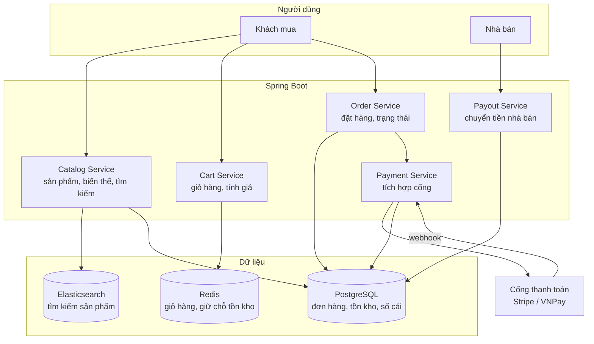
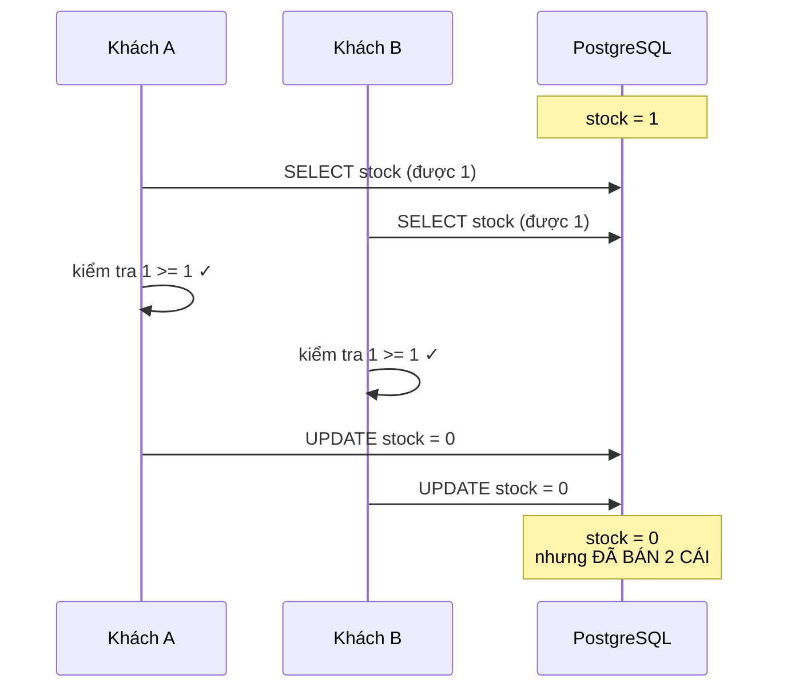
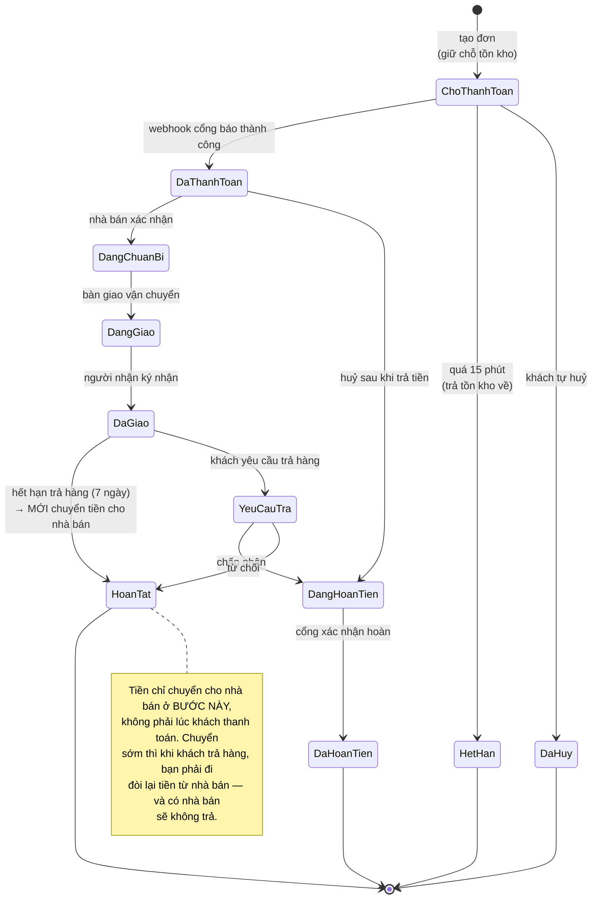
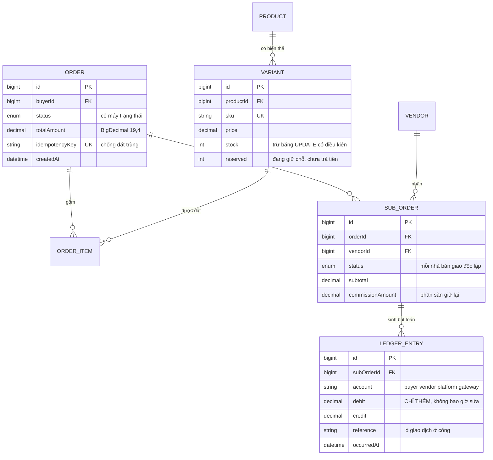

# E-Commerce Platform (Multi-vendor)

Đây là dự án đầu tiên trong lộ trình mà **một lỗi làm mất tiền thật**. Không phải "trải nghiệm kém" hay "dữ liệu hơi sai" — mà là bán một món hàng không còn trong kho, trừ tiền hai lần cho một đơn, hoặc chuyển tiền cho nhà bán trước khi khách nhận hàng.

Vì thế mọi quyết định kỹ thuật ở đây đều bị chi phối bởi một câu hỏi duy nhất: *nếu tiến trình chết đúng lúc này, hệ thống còn đúng không?* Câu hỏi đó dẫn thẳng tới giao dịch cơ sở dữ liệu, khoá tranh chấp, tính bình phương (idempotency), và cỗ máy trạng thái đơn hàng.

Dự án này cũng chuyển hệ ngôn ngữ sang **Java + Spring Boot** — không phải cho khác lạ, mà vì đây là stack thống trị mảng tài chính và thương mại điện tử ở các công ty lớn, và vì hệ sinh thái giao dịch của Spring là thứ đáng học một cách nghiêm túc.

---

## Bạn sẽ dựng ra cái gì

- Nhiều nhà bán, mỗi nhà một gian hàng và bảng điều khiển riêng
- Danh mục sản phẩm có biến thể (màu, kích cỡ) và tồn kho theo từng biến thể
- Giỏ hàng, thanh toán, tích hợp cổng thanh toán thật
- Một đơn hàng chứa hàng của nhiều nhà bán, tách thành nhiều đơn con
- Theo dõi trạng thái đơn, hoàn tiền, đánh giá sau khi mua
- Bảng điều khiển doanh thu cho nhà bán, đối soát cho quản trị viên

---

## Kiến trúc



Điểm cần chú ý ngay: **giỏ hàng nằm ở Redis, đơn hàng nằm ở Postgres.** Giỏ hàng là dữ liệu tạm — khách bỏ giỏ là chuyện thường, và ghi mỗi lần thêm/bớt món vào database quan hệ là lãng phí. Nhưng khoảnh khắc khách bấm "đặt hàng", mọi thứ chuyển sang Postgres và không bao giờ rời khỏi đó nữa.

---

## Bài toán số một: bán quá số hàng có

Đây là lỗi kinh điển, và nó chỉ xuất hiện khi có nhiều người mua cùng lúc.

```java
// SAI — và nó chạy đúng trong mọi lần bạn tự test.
Variant variant = variantRepository.findById(variantId).orElseThrow();
if (variant.getStock() >= quantity) {          // đọc: còn 1 cái
    variant.setStock(variant.getStock() - quantity);  // tính: 1 - 1 = 0
    variantRepository.save(variant);           // ghi: 0
}
```

Hai khách cùng mua món cuối cùng. Cả hai cùng đọc `stock = 1`, cả hai cùng thấy điều kiện đúng, cả hai cùng ghi `0`. Bạn vừa bán hai cái cho một món hàng duy nhất.



Có ba cách sửa, và chọn sai cách sẽ đánh đổi hiệu năng lấy thứ mình không cần.

### Cách 1 — trừ tồn kho ngay trong câu lệnh UPDATE

```java
@Modifying
@Query("""
    UPDATE Variant v
       SET v.stock = v.stock - :qty
     WHERE v.id = :id
       AND v.stock >= :qty
    """)
int decreaseStock(@Param("id") Long id, @Param("qty") int qty);
```

Điều kiện `stock >= qty` nằm **trong** câu lệnh ghi, nên cơ sở dữ liệu tự khoá dòng khi thực hiện. Nếu trả về `0` dòng bị ảnh hưởng, nghĩa là không đủ hàng — không cần đọc trước, không có khoảng trống cho hai request cùng lọt.

Đây là cách đơn giản nhất và đủ cho phần lớn trường hợp. Nguyên tắc chung: **đưa điều kiện vào cùng câu lệnh với thao tác ghi.** Bạn đã gặp nó ở [Todo App](/projects/todo-list-app-full-stack) dưới dạng `updateMany` có `userId`, và ở [URL Shortener](/projects/url-shortener-voi-analytics) dưới dạng bắt lỗi ràng buộc unique. Lần thứ ba gặp lại là lúc nên coi nó là phản xạ.

### Cách 2 — khoá bi quan

```java
@Lock(LockModeType.PESSIMISTIC_WRITE)
@Query("SELECT v FROM Variant v WHERE v.id = :id")
Optional<Variant> findByIdForUpdate(@Param("id") Long id);
```

Sinh ra `SELECT ... FOR UPDATE`: giao dịch đầu tiên khoá dòng, những giao dịch khác **chờ** cho tới khi nó xong. Đúng đắn tuyệt đối, nhưng làm tuần tự hoá mọi lượt mua cùng một sản phẩm. Với một đợt flash sale, hàng nghìn người xếp hàng chờ nhau trên một dòng dữ liệu.

Dùng nó khi bạn phải đọc nhiều thứ rồi mới quyết định, chứ không chỉ trừ một con số.

### Cách 3 — giữ chỗ tạm ở Redis

Cách thực dụng nhất cho flash sale: giữ chỗ trước bằng `DECRBY` nguyên tử ở Redis, rồi mới xác nhận xuống Postgres khi thanh toán thành công. Redis xử lý hàng chục nghìn thao tác mỗi giây trên một khoá mà không toát mồ hôi.

Đánh đổi: nếu Redis mất dữ liệu, số giữ chỗ và tồn kho thật lệch nhau. Cần một công việc nền đối soát định kỳ — và cần chấp nhận rằng đây là hệ thống *nhất quán cuối cùng*, không phải nhất quán tức thời.

---

## Cỗ máy trạng thái đơn hàng

Đơn hàng không phải một cột `status` mà bạn muốn gán gì thì gán. Nó là một cỗ máy trạng thái với các chuyển tiếp hợp lệ được liệt kê rõ ràng.



```java
public enum OrderStatus {
    PENDING_PAYMENT, PAID, PREPARING, SHIPPING, DELIVERED,
    RETURN_REQUESTED, REFUNDING, REFUNDED, COMPLETED, CANCELLED, EXPIRED;

    // Bảng chuyển tiếp hợp lệ. Không có nó, một bug ở đâu đó sẽ đưa
    // đơn từ REFUNDED ngược về PAID, và bạn phát hiện ra vào lúc đối
    // soát cuối tháng — nếu may mắn.
    private static final Map<OrderStatus, Set<OrderStatus>> ALLOWED = Map.of(
        PENDING_PAYMENT, EnumSet.of(PAID, CANCELLED, EXPIRED),
        PAID,            EnumSet.of(PREPARING, REFUNDING),
        PREPARING,       EnumSet.of(SHIPPING, REFUNDING),
        SHIPPING,        EnumSet.of(DELIVERED),
        DELIVERED,       EnumSet.of(RETURN_REQUESTED, COMPLETED),
        RETURN_REQUESTED, EnumSet.of(REFUNDING, COMPLETED),
        REFUNDING,       EnumSet.of(REFUNDED)
    );

    public boolean canTransitionTo(OrderStatus next) {
        return ALLOWED.getOrDefault(this, Set.of()).contains(next);
    }
}
```

Kiểm tra chuyển tiếp ở **một chỗ duy nhất**, trong service, chứ không rải rác ở từng controller. Đây là loại quy tắc mà nếu để lặp lại ở năm nơi, sẽ có một nơi bị bỏ sót khi thêm trạng thái mới.

---

## Webhook thanh toán: nơi tính bình phương là bắt buộc

Cổng thanh toán sẽ gọi webhook của bạn **nhiều lần** cho cùng một giao dịch. Đó không phải lỗi của họ — đó là thiết kế: nếu họ không nhận được `200 OK` (mạng chập chờn, server bạn khởi động lại), họ phải thử lại, vì thà gửi thừa còn hơn để bạn không biết khách đã trả tiền.

Nghĩa là mã xử lý webhook của bạn **phải** chịu được việc chạy hai lần mà không cộng tiền hai lần.

```java
@Transactional
public void handlePaymentWebhook(PaymentWebhookPayload payload) {
    // Bước 1 — Xác thực chữ ký TRƯỚC MỌI THỨ KHÁC.
    // Không có bước này, bất kỳ ai biết URL webhook cũng "thanh toán"
    // được mọi đơn hàng bằng một lệnh curl.
    if (!signatureVerifier.isValid(payload.rawBody(), payload.signature())) {
        throw new SecurityException("chữ ký webhook không hợp lệ");
    }

    // Bước 2 — Chống xử lý lặp bằng ràng buộc UNIQUE ở database,
    // không phải bằng câu lệnh if. Hai webhook tới cùng lúc trên hai
    // tiến trình khác nhau: cả hai cùng kiểm tra "đã xử lý chưa",
    // cả hai cùng thấy "chưa", và cả hai cùng cộng tiền.
    // Ràng buộc unique thì không thể lọt.
    try {
        processedEventRepository.save(new ProcessedEvent(payload.eventId()));
    } catch (DataIntegrityViolationException dup) {
        log.info("Bỏ qua webhook trùng: {}", payload.eventId());
        return;   // trả 200 để cổng ngừng gửi lại
    }

    Order order = orderRepository.findByIdForUpdate(payload.orderId())
            .orElseThrow(() -> new OrderNotFoundException(payload.orderId()));

    if (!order.getStatus().canTransitionTo(OrderStatus.PAID)) {
        log.warn("Đơn {} đang ở {}, không thể chuyển sang PAID",
                 order.getId(), order.getStatus());
        return;
    }

    // Bước 3 — Xác nhận tồn kho đã giữ chỗ, ghi bút toán, đổi trạng thái.
    // Tất cả trong MỘT giao dịch: chết giữa chừng thì cuộn lại toàn bộ,
    // không để lại đơn đã trả tiền mà tồn kho chưa trừ.
    inventoryService.commitReservation(order.getId());
    ledgerService.recordPayment(order, payload.amount());
    order.setStatus(OrderStatus.PAID);
}
```

Ba bước, ba nguyên tắc riêng biệt, và bỏ bước nào cũng dẫn tới mất tiền theo một cách khác nhau.

---

## Sổ cái: đừng bao giờ dùng số thực cho tiền

```java
// SAI. Nghiêm túc, đây là lỗi làm mất tiền thật.
private double amount;   // 0.1 + 0.2 = 0.30000000000000004

// ĐÚNG.
@Column(precision = 19, scale = 4)
private BigDecimal amount;
```

`double` và `float` là số dấu chấm động nhị phân — chúng không biểu diễn chính xác được `0.1`. Với một giao dịch, sai số là một phần tỉ. Với một triệu giao dịch cộng dồn qua nhiều tháng, sai số thành những con số mà kế toán không đối soát được.

Và tiền không nên lưu bằng một cột `balance` mà bạn cộng trừ vào. Nó nên là **sổ cái ghi kép** — một bảng chỉ thêm dòng, không bao giờ sửa:



Nguyên tắc của sổ cái ghi kép: mỗi đồng tiền dịch chuyển đều tạo ra **hai** dòng — một ghi nợ, một ghi có — và tổng của toàn bộ bảng luôn bằng 0. Nếu không bằng 0, bạn biết chắc có lỗi, và biết chính xác lỗi ở bút toán nào. Với một cột `balance`, bạn chỉ biết số dư sai mà không biết vì sao.

---

## Một đơn, nhiều nhà bán

Khách bỏ vào giỏ ba món của ba nhà bán khác nhau, và trả tiền một lần. Nhưng ba nhà bán giao hàng độc lập, có thể một người giao xong còn hai người chưa.

Cách giải: `Order` (giao dịch tiền) tách khỏi `SubOrder` (đơn giao hàng). Khách thấy một hoá đơn; mỗi nhà bán thấy đơn của riêng mình; và trạng thái giao hàng theo từng `SubOrder` chứ không phải theo `Order`.

Điều này cũng làm cho hoàn tiền một phần trở nên tự nhiên: khách trả lại món của nhà bán A thì chỉ `SubOrder` của A chuyển sang `REFUNDING`, hai đơn còn lại đi tiếp bình thường.

---

## Những cái bẫy đã được ghi lại

| Triệu chứng | Nguyên nhân thật | Cách sửa |
|---|---|---|
| Bán vượt số hàng có | Đọc tồn kho rồi mới ghi | Đưa điều kiện `stock >= qty` vào UPDATE |
| Khách bị trừ tiền hai lần | Webhook xử lý lặp | Bảng `processed_events` với ràng buộc unique |
| Bất kỳ ai cũng "thanh toán" được đơn | Không xác thực chữ ký webhook | Verify chữ ký trước mọi xử lý |
| Số dư lệch vài đồng sau vài tháng | Dùng `double` cho tiền | `BigDecimal` với scale cố định |
| Nhà bán nhận tiền rồi khách trả hàng | Chuyển tiền lúc thanh toán | Chỉ chuyển sau khi hết hạn trả hàng |
| Đơn nhảy từ REFUNDED về PAID | Không kiểm tra chuyển tiếp trạng thái | Bảng ALLOWED, kiểm ở một chỗ duy nhất |
| Tồn kho kẹt sau khi khách bỏ giỏ | Giữ chỗ không có hạn | TTL 15 phút, job nền trả về |
| Flash sale làm sập database | Khoá bi quan tuần tự hoá mọi lượt mua | Giữ chỗ ở Redis, đối soát định kỳ |

---

## Khi nào coi như xong

- [ ] 200 người mua đồng thời món cuối cùng: đúng **1** đơn thành công, 199 đơn nhận thông báo hết hàng
- [ ] Gửi lại cùng một webhook 10 lần: số dư chỉ tăng một lần
- [ ] Gửi webhook với chữ ký giả: bị từ chối và ghi log cảnh báo
- [ ] `SELECT SUM(debit) - SUM(credit) FROM ledger_entries` bằng đúng 0
- [ ] Tắt ứng dụng giữa lúc xử lý thanh toán: khởi động lại không có đơn nào ở trạng thái nửa vời
- [ ] Bỏ giỏ hàng, 15 phút sau tồn kho trở lại đúng số cũ
- [ ] Hoàn tiền một `SubOrder` không ảnh hưởng hai `SubOrder` còn lại

---

## Bước tiếp theo

1. **Tách microservice thật sự.** Catalog, Order, Payment thành ba dịch vụ riêng — và ngay lập tức bạn mất giao dịch phân tán, phải học mẫu hình Saga. Đó chính là [Event-Driven Microservices](/projects/event-driven-microservices-uber-like).
2. **Tìm kiếm nghiêm túc.** Elasticsearch với gợi ý, sửa lỗi chính tả, xếp hạng theo hành vi.
3. **Chống gian lận.** Chấm điểm rủi ro mỗi đơn, chặn thẻ đánh cắp — bài toán học máy đầu tiên có hậu quả tài chính trực tiếp.
