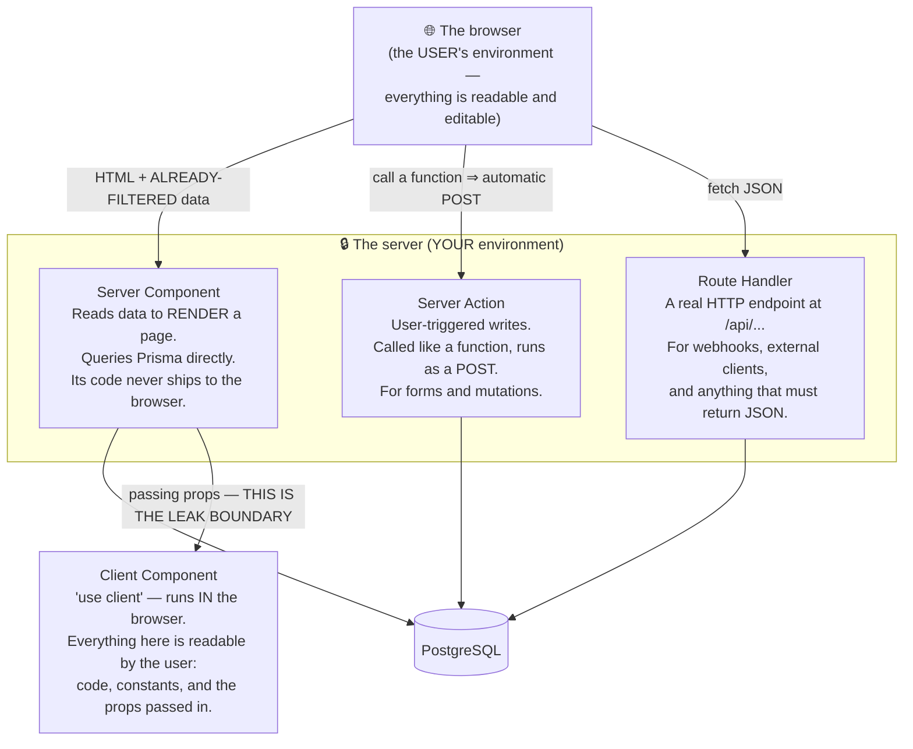
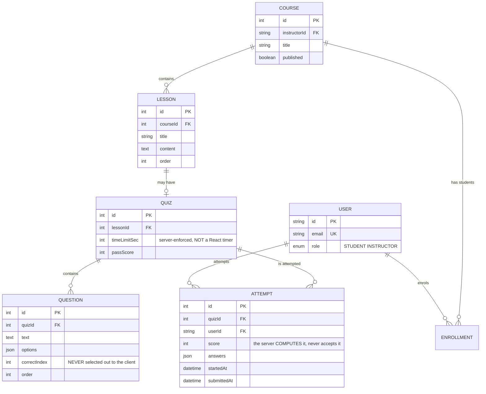

# E-learning Mini Platform

This roadmap already has an online-learning project: [Learning Management System](/projects/learning-management-system). This Semester 6 build **deliberately does not repeat it**.

The LMS is about **protecting content** — video that cannot be ripped, certificates that can be verified, progress that cannot be faked. This project is about something narrower and deeper:

> **The trust boundary.** The browser is the user's environment, not yours. So where must grading happen — where the *answer key* is a secret and the *score* is worth cheating for — and how do you prove nothing leaks?

It is also the semester's first project with **no separate backend and front end**: the whole system lives in one **Next.js 14 App Router** application. That makes the server/browser boundary blurrier in the source code and more important than ever.

---

## What you will build

- Full-stack inside **one** **Next.js 14 (App Router)** app: Route Handlers and Server Actions as the API, Server/Client Components as the UI
- **Prisma + PostgreSQL**, authentication via **Auth.js** with two roles: **Student** and **Instructor**
- Instructors create courses, chapters, lessons and **multiple-choice quizzes**
- **Server-side grading**: the correct answers **never** leave the server
- **Exactly one attempt per student**, enforced by a `UNIQUE` constraint rather than an `if`
- Progress tracking, attempt review, and a gradebook for instructors

> 📚 The step-by-step course: [**INT605 — E-learning Mini Platform**](/courses/e-learning-mini-platform) on the Academy (9 sections, 21 lessons).

---

## Three places to run code in the App Router, and what choosing wrong costs

Before talking about quizzes, you need the map. The App Router offers three homes for logic, and students routinely mix them up:



That last arrow is where every vulnerability in this project lives. Props passed from a Server Component to a Client Component are **serialised and embedded in the HTML**. The user hits "View source" and sees all of it. No exceptions, no "but I never render it".

---

## The hole: the answer key ships to the browser

The most natural way to write it, and the broken one:

```ts
// ❌ NEVER — correctIndex rides along to the browser
const quiz = await prisma.quiz.findUnique({
  where: { id },
  include: { questions: true },     // questions.correctIndex is in there!
});
return <QuizForm quiz={quiz} />;    // props ⇒ embedded in HTML ⇒ anyone can read it
```

Open the Network tab, or just press `Ctrl+U`:

```json
{"questions":[{"id":1,"text":"2+2?","options":["3","4","5"],"correctIndex":1}, ...]}
                                                             ^^^^^^^^^^^^^^^^
                                                        the answer, handed to the cheater
```

The fix is not to "hide" or "encrypt" it — it is to **not send it**:

```ts
// ✅ explicit selection, NO correctIndex
const quiz = await prisma.quiz.findUnique({
  where: { id },
  select: {
    id: true, title: true, timeLimitSec: true,
    questions: {
      select: { id: true, text: true, options: true },   // NO correctIndex
      orderBy: { order: 'asc' },
    },
  },
});
```

A rule worth carrying: **use explicit `select` instead of `include` on any table holding sensitive data.** `include` means "everything", and "everything" changes when someone adds a column six months from now — an `answerExplanation`, say. A `select` never silently widens.

---

## Grading on the server, and what the client is allowed to send

```ts
'use server';

export async function submitAttempt(quizId: number, answers: Record<number, number>) {
  const session = await auth();
  if (!session) throw new Error('Unauthorized');

  // The key is loaded HERE, on the server, and goes nowhere else
  const questions = await prisma.question.findMany({
    where: { quizId },
    select: { id: true, correctIndex: true },
  });

  let score = 0;
  for (const q of questions)
    if (answers[q.id] === q.correctIndex) score++;   // graded against the DB, not client claims

  const pct = Math.round((score / questions.length) * 100);
  await prisma.attempt.create({
    data: { quizId, userId: session.user.id, score: pct, answers },
  });
  return { score, total: questions.length, pct };
}
```

What the client may send: **the options it selected**. That is all.

What the client may **never** send and be believed: the score, the number correct, the time remaining, or a `userId`. If the client posts `{ score: 100 }`, the server ignores it and recomputes. This is the concrete form of the principle you met in [Todo List App](/projects/todo-list-app-full-stack) with `userId`, and will meet again in [E-Commerce Platform](/projects/e-commerce-platform-multi-vendor) with prices.

### The time limit belongs on the server too

A countdown timer in React is **decoration**. A user pauses JavaScript in the debugger, or calls the Server Action three hours later.

The right design: when a student starts, create the `Attempt` row with `startedAt`. On submit, the server compares `now() - startedAt` against `timeLimitSec` and **decides for itself** whether the attempt still counts.

---

## Exactly one attempt: `UNIQUE` instead of an `if`

Here the semester's concurrency lesson returns for the fifth time, disguised as a mundane business rule: *"each student may take a quiz once"*.

The naive `if` has exactly the hole of the earlier projects:

```ts
const existing = await prisma.attempt.findFirst({ where: { quizId, userId } });  // (A) READ
if (existing) throw new Error('You have already taken this quiz');
await prisma.attempt.create({ ... });                                           // (B) WRITE
```

Double-click Submit quickly — or simply have a slow network make React retry — and two `Attempt` rows appear, giving one student two different scores for one quiz.

```prisma
model Attempt {
  id        Int      @id @default(autoincrement())
  quizId    Int
  userId    String
  score     Int
  answers   Json
  startedAt DateTime @default(now())
  submittedAt DateTime?

  // THIS ONE LINE replaces the if, and no retry can get around it
  @@unique([quizId, userId], name: "uk_attempt_per_student")
}
```

```ts
try {
  await prisma.attempt.create({ data: { quizId, userId, score: pct, answers } });
} catch (e) {
  if (e.code === 'P2002')                                   // unique violation
    throw new AlreadySubmittedError('You have already submitted this quiz');
  throw e;
}
```

Note the trap recorded in [the project documentation](/projects/cuonghoang-dev-portal): once you name a `@@unique`, queries must use **that name** (`uk_attempt_per_student`), not the default compound key `quizId_userId`.

---

## The data model



Storing `ATTEMPT.answers` as JSON is deliberate: it enables **attempt review** — replaying each question, what the student picked, and what was correct — without a child table. At the scale of a few dozen questions that is the right trade. Only when you need "which question does the whole class get wrong?" does splitting the table earn its keep.

---

## Traps worth writing down

| Symptom | Actual cause | Fix |
|---|---|---|
| Answers visible in page source | `include: { questions: true }` drags `correctIndex` along | Explicit `select` without `correctIndex` |
| A student scores 100% knowing nothing | Server trusted the `score` the client posted | The server **recomputes** from the key in the DB |
| Submissions accepted after time is up | The countdown exists only in React | Compare `now() - startedAt` on the server at submit |
| Two attempts for one student | `findFirst` then `create` — the classic race | `@@unique([quizId, userId])` + catching `P2002` |
| Query says the compound key does not exist | Using the default name instead of the named `@@unique` | Use `uk_attempt_per_student` |
| `'use server'` still leaks a secret | It sits in a file whose top line is `'use client'` | Move Server Actions into their own file |
| A student can call an instructor's Server Action | A Server Action **is a public endpoint** | Check session and role **inside** every action |
| Page still shows stale data after a write | No `revalidatePath` after the mutation | `revalidatePath('/courses/[id]')` at the end of the action |
| A newly added column suddenly leaks | `include` widens automatically | `select` never widens on its own |
| An instructor edits someone else's course | Only the role was checked, not ownership | Check `instructorId` too |
| Displayed score differs from the stored one | Rounding happens in two places | Round **once**, on the server, then store |

---

## Done means

- [ ] `Ctrl+U` on the quiz page and search for `correctIndex`: **no** matches
- [ ] Intercept the Server Action response and change `score` to 100: the stored score is **still** correct
- [ ] Call the Server Action directly via `fetch` with invented `answers`: the server still grades correctly
- [ ] Double-click Submit rapidly: exactly **one** `Attempt` row, the second attempt gets a clear error
- [ ] Start an attempt, wait past `timeLimitSec`, then submit: rejected **even with the React timer disabled**
- [ ] A student calling the create-course Server Action: blocked **inside** the action, not merely by the UI
- [ ] Instructor A editing instructor B's course: blocked
- [ ] Attempt review shows both the student's picks **and** the correct answers (now they may be shown)
- [ ] Add a new column to `Question` and re-check the page source: it does **not** leak automatically
- [ ] After an instructor edits a lesson, the student page shows the new content immediately (`revalidatePath` ran)

---

## Where to go next

1. **When the content itself is what needs protecting.** [Learning Management System](/projects/learning-management-system) solves the other half: video, signed URLs, anti-cheat progress, certificates.
2. **When contention gets serious.** [Event Ticketing System](/projects/event-ticketing-system) moves the check out of Postgres, because `UNIQUE` is not fast enough for 10,000 simultaneous buyers.
3. **When the questions are machine-generated.** [AI Study Assistant](/projects/ai-study-assistant) uses the lesson content itself to produce grounded, cited questions.
4. **When you need to measure learning.** The `ATTEMPT` table is exactly the raw data for [Real-Time Analytics](/projects/realtime-analytics-platform).
