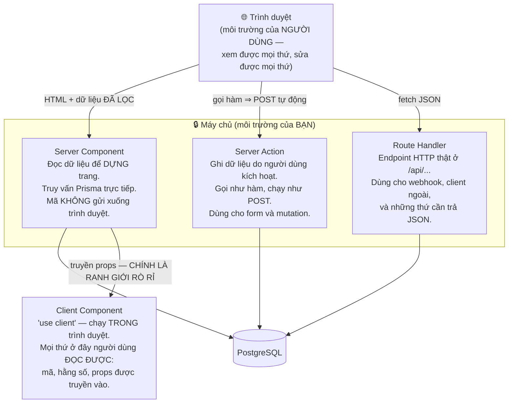
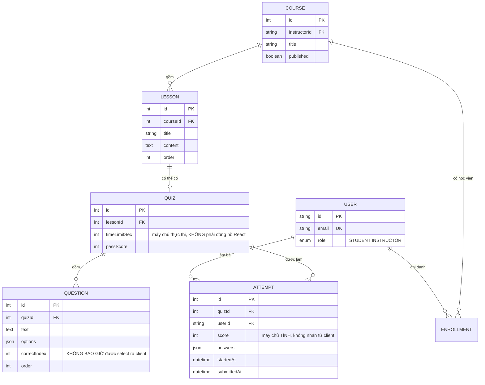

# E-learning Mini Platform

Lộ trình này đã có một dự án học trực tuyến: [Learning Management System](/projects/learning-management-system). Đồ án Kỳ 6 này **cố ý không lặp lại nó**.

LMS lo việc **bảo vệ nội dung** — video không tải lậu được, chứng chỉ xác minh được, tiến độ không gian lận được. Đồ án này lo một thứ hẹp hơn nhưng sâu hơn:

> **Ranh giới tin cậy.** Trình duyệt là môi trường của người dùng, không phải của bạn. Vậy chấm điểm một bài quiz — nơi *đáp án* là bí mật và *điểm số* là thứ đáng để gian lận — phải diễn ra ở đâu, và làm sao chứng minh nó không rò rỉ?

Đây cũng là đồ án đầu tiên trong kỳ **không tách backend và frontend**: cả hệ thống nằm trong một ứng dụng **Next.js 14 App Router**. Điều đó khiến ranh giới máy chủ/trình duyệt vừa mờ đi trong mã nguồn, vừa quan trọng hơn bao giờ hết.

---

## Bạn sẽ dựng ra cái gì

- Full-stack trong **một** app **Next.js 14 (App Router)**: Route Handlers và Server Actions làm API, Server/Client Components làm giao diện
- **Prisma + PostgreSQL**, xác thực bằng **Auth.js** với hai vai trò: **Học viên** và **Giảng viên**
- Giảng viên tạo khoá học, chương, bài giảng và **quiz nhiều lựa chọn**
- **Chấm điểm phía máy chủ**: đáp án đúng **không bao giờ** rời khỏi máy chủ
- **Đúng một lượt làm mỗi học viên**, thực thi bằng ràng buộc `UNIQUE` chứ không bằng một câu `if`
- Theo dõi tiến độ, xem lại bài đã làm, và bảng điểm cho giảng viên

> 📚 Bản dạy từng bước: [**INT605 — E-learning Mini Platform**](/courses/e-learning-mini-platform) trên Academy (9 mục, 21 bài).

---

## Ba cách chạy mã trong App Router, và chọn sai thì mất gì

Trước khi nói về quiz, phải nắm bản đồ. Trong App Router có ba nơi đặt logic, và sinh viên thường dùng lẫn lộn:



Mũi tên cuối cùng là chỗ mọi lỗ hổng của đồ án này nằm. Props truyền từ Server Component sang Client Component được **tuần tự hoá và nhúng vào HTML**. Người dùng bấm "Xem nguồn trang" là thấy hết. Không có ngoại lệ, không có "nhưng em không hiển thị nó ra".

---

## Lỗ hổng: đáp án đi kèm xuống trình duyệt

Cách viết tự nhiên nhất, và cũng là cách hỏng:

```ts
// ❌ ĐỪNG BAO GIỜ — correctIndex đi kèm xuống trình duyệt
const quiz = await prisma.quiz.findUnique({
  where: { id },
  include: { questions: true },     // questions.correctIndex nằm trong đây!
});
return <QuizForm quiz={quiz} />;    // props ⇒ nhúng vào HTML ⇒ ai cũng đọc được
```

Mở tab Network hoặc chỉ cần `Ctrl+U`:

```json
{"questions":[{"id":1,"text":"2+2?","options":["3","4","5"],"correctIndex":1}, ...]}
                                                             ^^^^^^^^^^^^^^^^
                                                       đáp án, trao tận tay người gian lận
```

Cách sửa không phải là "ẩn nó đi" hay "mã hoá nó" — mà là **không gửi nó đi**:

```ts
// ✅ chọn tường minh, KHÔNG có correctIndex
const quiz = await prisma.quiz.findUnique({
  where: { id },
  select: {
    id: true, title: true, timeLimitSec: true,
    questions: {
      select: { id: true, text: true, options: true },   // KHÔNG correctIndex
      orderBy: { order: 'asc' },
    },
  },
});
```

Quy tắc mang theo cả nghề: **dùng `select` tường minh thay vì `include` cho bất kỳ bảng nào chứa dữ liệu nhạy cảm.** `include` là "lấy tất cả", và "tất cả" sẽ thay đổi khi ai đó thêm cột mới sáu tháng sau — cột `answerExplanation` chẳng hạn. `select` thì không bao giờ tự nới rộng.

---

## Chấm điểm ở máy chủ, và điều client được phép gửi

```ts
'use server';

export async function submitAttempt(quizId: number, answers: Record<number, number>) {
  const session = await auth();
  if (!session) throw new Error('Unauthorized');

  // Đáp án được nạp Ở ĐÂY, trên máy chủ, và không đi đâu khác
  const questions = await prisma.question.findMany({
    where: { quizId },
    select: { id: true, correctIndex: true },
  });

  let score = 0;
  for (const q of questions)
    if (answers[q.id] === q.correctIndex) score++;   // so với DB, không so với lời client khai

  const pct = Math.round((score / questions.length) * 100);
  await prisma.attempt.create({
    data: { quizId, userId: session.user.id, score: pct, answers },
  });
  return { score, total: questions.length, pct };
}
```

Điều client được phép gửi: **các lựa chọn đã chọn**. Chỉ vậy.

Điều client **không bao giờ** được phép gửi và được tin: điểm số, số câu đúng, thời gian còn lại, hay `userId`. Nếu client gửi `{ score: 100 }`, máy chủ phải bỏ qua và tự tính lại. Đây là dạng cụ thể của nguyên tắc mà bạn đã gặp ở [Todo List App](/projects/todo-list-app-full-stack) với `userId`, và sẽ gặp lại ở [E-Commerce Platform](/projects/e-commerce-platform-multi-vendor) với giá tiền.

### Giới hạn thời gian cũng phải ở máy chủ

Đồng hồ đếm ngược trong React là **trang trí**. Người dùng dừng JavaScript bằng debugger, hoặc gọi thẳng Server Action sau ba tiếng.

Cách đúng: khi học viên bắt đầu, tạo hàng `Attempt` với `startedAt`. Lúc nộp, máy chủ so `now() - startedAt` với `timeLimitSec` và **tự quyết định** bài đó có còn hiệu lực không.

---

## Đúng một lượt: `UNIQUE` thay cho câu `if`

Ở đây bài học tương tranh của Kỳ 6 quay lại lần thứ năm, nhưng đội lốt một tính năng nghiệp vụ tầm thường: *"mỗi học viên chỉ được làm quiz một lần"*.

Câu `if` ngây thơ có đúng lỗ hổng của các đồ án trước:

```ts
const existing = await prisma.attempt.findFirst({ where: { quizId, userId } });  // (A) ĐỌC
if (existing) throw new Error('Bạn đã làm bài này rồi');
await prisma.attempt.create({ ... });                                           // (B) GHI
```

Bấm nút Nộp hai lần thật nhanh — hoặc chỉ cần mạng chậm khiến React gửi lại — là hai hàng `Attempt` được tạo, và học viên có hai điểm số khác nhau cho cùng một bài.

```prisma
model Attempt {
  id        Int      @id @default(autoincrement())
  quizId    Int
  userId    String
  score     Int
  answers   Json
  startedAt DateTime @default(now())
  submittedAt DateTime?

  // MỘT DÒNG NÀY thay cho câu if, và không lượt gửi lại nào lách được
  @@unique([quizId, userId], name: "uk_attempt_per_student")
}
```

```ts
try {
  await prisma.attempt.create({ data: { quizId, userId, score: pct, answers } });
} catch (e) {
  if (e.code === 'P2002')                                   // vi phạm UNIQUE
    throw new AlreadySubmittedError('Bạn đã nộp bài này rồi');
  throw e;
}
```

Lưu ý bẫy đã được ghi trong [tài liệu dự án](/projects/cuonghoang-dev-portal): khi bạn đặt tên cho `@@unique`, truy vấn phải dùng **đúng tên đó** (`uk_attempt_per_student`), không phải khoá ghép mặc định `quizId_userId`.

---

## Mô hình dữ liệu



`ATTEMPT.answers` lưu dạng JSON là quyết định có chủ ý: nó cho phép **xem lại bài đã làm** — hiện lại từng câu, học viên chọn gì, đáp án đúng là gì — mà không cần thêm bảng con. Với quy mô một quiz vài chục câu, đó là đánh đổi đúng. Nếu sau này cần thống kê "câu nào cả lớp sai nhiều nhất" thì mới tách bảng.

---

## Những cái bẫy đã được ghi lại

| Triệu chứng | Nguyên nhân thật | Cách sửa |
|---|---|---|
| Đáp án lộ trong HTML nguồn | `include: { questions: true }` kéo cả `correctIndex` | `select` tường minh, bỏ `correctIndex` |
| Học viên đạt 100% mà không biết gì | Máy chủ tin `score` client gửi lên | Máy chủ **tính lại** từ đáp án trong DB |
| Hết giờ vẫn nộp được | Đồng hồ đếm ngược chỉ có ở React | So `now() - startedAt` ở máy chủ lúc nộp |
| Hai lượt làm cho cùng một học viên | `findFirst` rồi `create` — cuộc đua kinh điển | `@@unique([quizId, userId])` + bắt `P2002` |
| Truy vấn báo không tìm thấy khoá ghép | Dùng tên mặc định thay vì tên `@@unique` đã đặt | Dùng đúng `uk_attempt_per_student` |
| `'use server'` vẫn lộ biến bí mật | Đặt trong file có `'use client'` ở đầu | Tách Server Action ra file riêng |
| Học viên gọi được Server Action của giảng viên | Server Action **là endpoint công khai** | Kiểm phiên và vai trò **bên trong** mỗi action |
| Sửa dữ liệu xong trang vẫn hiện số cũ | Không gọi `revalidatePath` sau mutation | `revalidatePath('/courses/[id]')` cuối action |
| Cột mới thêm bỗng lộ ra client | Dùng `include` nên tự động kéo theo | `select` không bao giờ tự nới rộng |
| Giảng viên sửa được khoá của người khác | Chỉ kiểm vai trò, không kiểm quyền sở hữu | Kiểm cả `instructorId` |
| Điểm hiển thị lệch với điểm trong DB | Làm tròn ở hai nơi khác nhau | Làm tròn **một lần**, ở máy chủ, rồi lưu |

---

## Khi nào coi như xong

- [ ] `Ctrl+U` trên trang làm quiz rồi tìm `correctIndex`: **không** có kết quả nào
- [ ] Chặn phản hồi Server Action rồi sửa `score` thành 100: điểm lưu vào DB **vẫn** đúng
- [ ] Gọi thẳng Server Action bằng `fetch` với `answers` bịa: máy chủ vẫn chấm đúng
- [ ] Bấm Nộp hai lần thật nhanh: đúng **một** hàng `Attempt`, lần hai nhận lỗi rõ ràng
- [ ] Bắt đầu bài, đợi quá `timeLimitSec`, rồi nộp: bị từ chối **dù đồng hồ React bị vô hiệu hoá**
- [ ] Học viên gọi Server Action tạo khoá học: bị chặn ở **trong** action, không chỉ bởi giao diện
- [ ] Giảng viên A sửa khoá của giảng viên B: bị chặn
- [ ] Xem lại bài đã làm: hiện đúng lựa chọn của học viên **và** đáp án đúng (giờ mới được hiện)
- [ ] Thêm một cột mới vào `Question` rồi kiểm lại HTML nguồn: cột đó **không** tự lộ ra
- [ ] Sau khi giảng viên sửa bài giảng, trang học viên hiện nội dung mới ngay (`revalidatePath` chạy)

---

## Bước tiếp theo

1. **Khi nội dung mới là thứ cần bảo vệ.** [Learning Management System](/projects/learning-management-system) giải bài toán còn lại: video, URL ký, chống gian lận tiến độ, chứng chỉ.
2. **Khi tranh chấp thật sự dữ dội.** [Event Ticketing System](/projects/event-ticketing-system) đưa phép kiểm ra khỏi Postgres vì `UNIQUE` không đủ nhanh cho 10.000 người cùng lúc.
3. **Khi câu hỏi do máy sinh ra.** [AI Study Assistant](/projects/ai-study-assistant) dùng chính nội dung bài giảng để tạo câu hỏi có căn cứ và có trích dẫn.
4. **Khi cần đo hiệu quả học tập.** Bảng `ATTEMPT` chính là dữ liệu thô cho [Real-Time Analytics](/projects/realtime-analytics-platform).
