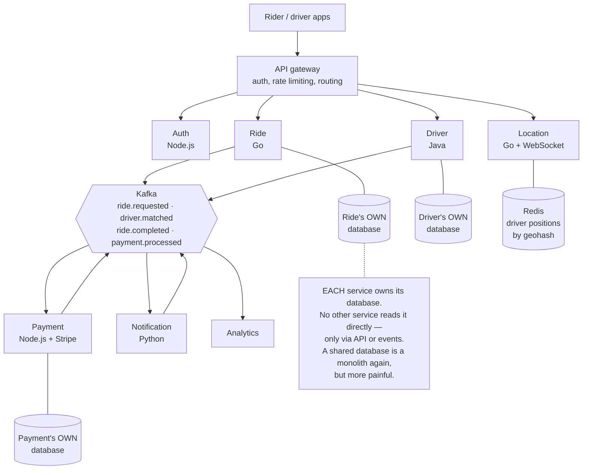
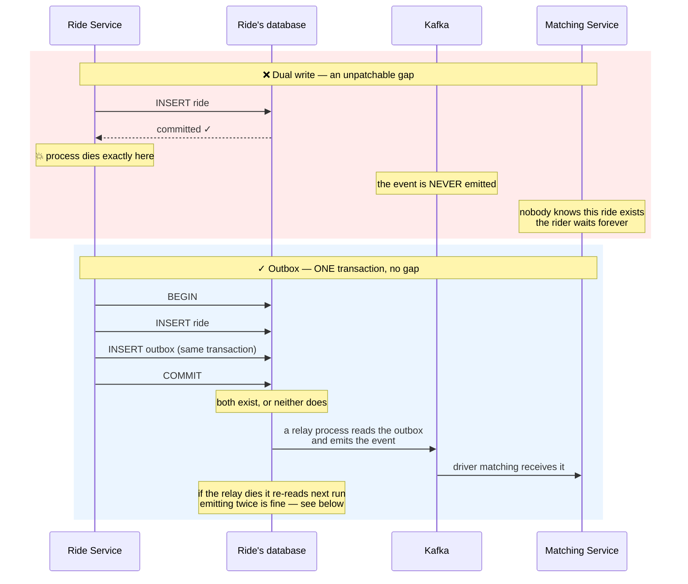
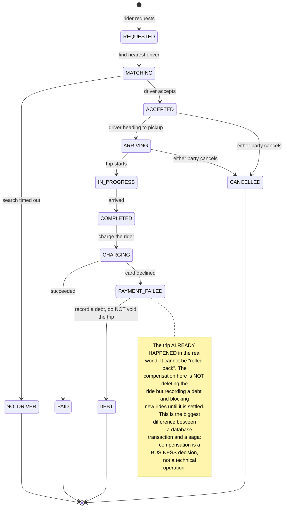
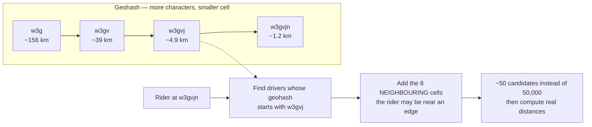

# Event-Driven Microservices (Uber-like)

Every earlier project in this roadmap shared a luxury you probably never noticed: **one database**. Because of it, "write both things or neither" was a single transaction — `BEGIN`, two statements, `COMMIT`.

This project takes that away. Six services, six separate databases, and one business flow crossing four of them. Suddenly "how do I guarantee both happen" has no answer that fits in a SQL keyword.

It is also the first project that should open with a warning rather than an introduction.

---

## Read this before writing any code

Microservices are not the next rung up from "getting better". They are a **trade**, and for most systems that trade loses money.

What you get: independent deployment per team, independent scaling, one service failing without taking everything down, and per-service language choice.

What you pay:

| Before (one process) | Now (many services) |
|---|---|
| A function call — never fails halfway | A network call — fails, stalls, or answers twice |
| `JOIN` two tables | Call two services and join in memory yourself |
| One transaction covering everything | Sagas and hand-written compensating actions |
| Read one log file | Distributed tracing, and without it you are blind |
| `docker compose up` | Container orchestration, service discovery, service mesh |

**Honest advice: do not split your real system this way without a specific reason** — usually several teams colliding on deploys, or one component needing ten times the scale of the rest.

But **do build this project**, because the three patterns below (outbox, saga, idempotent consumers) are things you will need **even inside a single process** — any time your system talks to another one: a payment gateway, an email provider, a third-party API. Network boundaries create these problems, not microservices.

---

## What you will build

- Six services: auth, ride, driver, location, payment, notification
- Real-time matching of riders to the nearest available driver
- Live location tracking on a map during a trip
- Dynamic pricing by supply and demand per area
- Payments with compensating actions when something fails midway
- Distributed tracing: one request across six services, viewable as one story

---

## The architecture



The most important rule is in that note: **a database is private property of its service**. Violating it is the most common mistake when splitting a system — you pay every cost of microservices and gain nothing, because two services still cannot change schema independently.

---

## The dual-write problem: where this gets hard

The ride service must do two things: persist the ride in its own database, and tell the other services about it. Written naturally:

```go
// WRONG — these two operations CANNOT be atomic together.
tx, _ := db.Begin(ctx)
tx.Exec(ctx, "INSERT INTO rides (...) VALUES (...)")
tx.Commit(ctx)                                 // ① database write done

kafkaWriter.WriteMessages(ctx, rideRequested)  // ② process dies HERE?
```

There is a window between ① and ②. If the process dies inside it — a host restart, a reclaimed container, a network partition — then **the ride exists in the database but nobody knows it exists**. No driver gets matched. The rider waits forever for a car that was never requested.

Reversing the order does not help either: emit the event first, fail the write, and other services react to a ride that does not exist.



### Outbox: put the event inside the same transaction as the data

The trick is simple and remarkably effective: **do not emit an event — write the intent to emit it into the same database, in the same transaction.**

```sql
CREATE TABLE outbox (
    id             BIGSERIAL   PRIMARY KEY,
    aggregate_type VARCHAR(32) NOT NULL,   -- 'ride'
    aggregate_id   TEXT        NOT NULL,   -- partition key, decides ordering
    event_type     VARCHAR(64) NOT NULL,   -- 'ride.requested'
    payload        JSONB       NOT NULL,
    published_at   TIMESTAMPTZ,            -- NULL = not yet emitted
    created_at     TIMESTAMPTZ NOT NULL DEFAULT now()
);

CREATE INDEX outbox_unpublished_idx
    ON outbox (created_at) WHERE published_at IS NULL;
```

```go
// RIGHT — the ride and the event live in the SAME transaction.
// There is no longer any window for the process to die inside.
tx, _ := db.Begin(ctx)
defer tx.Rollback(ctx)

tx.Exec(ctx, `INSERT INTO rides (id, user_id, pickup, dropoff, status)
              VALUES ($1, $2, $3, $4, 'REQUESTED')`, ...)

tx.Exec(ctx, `INSERT INTO outbox (aggregate_type, aggregate_id, event_type, payload)
              VALUES ('ride', $1, 'ride.requested', $2)`, rideID, payload)

tx.Commit(ctx)   // both succeed, or neither happens
```

A separate process reads unpublished rows and pushes them to Kafka. If it dies mid-run, the next run re-reads from the unmarked rows — possibly emitting duplicates, which the next section handles.

This is the **seventh** appearance of one principle in this roadmap: *important conditions must be enforced where atomicity lives.* In [Todo App](/projects/todo-list-app-full-stack) it was a `where` clause; in [E-Commerce](/projects/e-commerce-platform-multi-vendor) it was `UPDATE ... WHERE stock >= qty`; in [Social Media](/projects/social-media-platform-twitter-like) it was `ON CONFLICT ... RETURNING`; here it is **pulling the event inside the transaction instead of leaving it outside**.

---

## "Exactly once" does not exist

Accept this early, because people lose weeks trying to achieve it.

A queue delivers a message. The consumer processes it. The acknowledgement is lost in transit. The queue concludes it was never handled and redelivers. There is no way to distinguish "not done" from "done, but the acknowledgement vanished" — and that is a fundamental limit, not a tool defect.

So real systems run on **at-least-once delivery plus idempotent consumers**. The consumer's job is to recognise "I have already done this one":

```go
// A processed-events table keyed by event ID. The second attempt is rejected
// by the DATABASE, not guessed at by application code.
func handlePaymentCompleted(ctx context.Context, ev Event) error {
    tx, err := db.Begin(ctx)
    if err != nil { return err }
    defer tx.Rollback(ctx)

    ct, err := tx.Exec(ctx,
        `INSERT INTO processed_events (event_id) VALUES ($1)
         ON CONFLICT (event_id) DO NOTHING`, ev.ID)
    if err != nil { return err }
    if ct.RowsAffected() == 0 {
        return nil   // already handled — skip, and this is the NORMAL path
    }

    // The side effect lives in the SAME transaction as the processed marker.
    // Separating them recreates the dual-write problem from above.
    tx.Exec(ctx, `UPDATE rides SET status = 'PAID' WHERE id = $1`, ev.RideID)
    return tx.Commit(ctx)
}
```

Note the last part: the status update and the processed marker **must share one transaction**. Split them and you have rebuilt exactly the gap the outbox existed to close.

### Event ordering: the partition key decides everything

Kafka guarantees ordering **within a partition**, not across a topic. If `ride.requested` and `ride.cancelled` for the same ride land in different partitions, a consumer can see the cancellation before the creation.

The fix is to choose the partition key as the **entity identifier**, never at random:

```go
kafka.Message{
    Key:   []byte(ride.ID),   // all events for ONE ride go to the SAME partition
    Value: payload,
}
```

The trade-off to know about: an extremely busy entity concentrates load on one partition. For rides that is fine, since they distribute evenly. But choose `city_id` as the key and your largest city becomes the bottleneck — picking a partition key is also picking how load spreads.

---

## Sagas: distributed transactions do not exist, only compensation

Completing a trip must: charge the rider, credit the driver, close the ride, send a receipt. Four services, four databases. No `COMMIT` spans all four.

The practical shape is a chain of steps, each with its own **compensating action**:



Three conclusions, the third being the most important:

1. **Compensation is not rollback.** A rollback erases evidence; compensation emits a new, opposing event. Charging the wrong amount is compensated by a *refund*, and both transactions stay in history.
2. **Some steps cannot be compensated.** A sent email cannot be recalled. Push irreversible steps to the **end** of the chain.
3. **Intermediate states are real and users see them.** Nobody observes a half-finished database transaction; in a saga they do. Your interface must be able to show "processing payment" rather than pretending everything is instantaneous.

---

## Driver matching: a spatial problem

Find the nearest available driver within 3km among 50,000 moving vehicles. Scanning all of them and computing distance is 50,000 calculations per request — unusable.

The standard approach is to **divide the earth into cells** and encode each as a string such that **nearby points share a string prefix**:



The "8 neighbouring cells" detail is what most hand-rolled versions miss: a rider standing near a cell boundary may have a driver 100m away sitting in the adjacent cell with a completely different prefix. Searching only your own cell systematically misses the nearest driver.

Redis ships this data type, so there is no need to implement it:

```go
// Position updates — drivers send every 4 seconds while available.
rdb.GeoAdd(ctx, "drivers:available", &redis.GeoLocation{
    Name: driverID, Longitude: lng, Latitude: lat,
})

// Radius search, already sorted nearest-first.
res, _ := rdb.GeoSearchLocation(ctx, "drivers:available", &redis.GeoSearchLocationQuery{
    GeoSearchQuery: redis.GeoSearchQuery{
        Longitude: pickupLng, Latitude: pickupLat,
        Radius: 3, RadiusUnit: "km", Sort: "ASC", Count: 20,
    },
    WithDist: true,
}).Result()
```

Three practical points straight-line distance does not tell you:

- **Nearest by distance is not nearest by time.** A driver 500m away across a river may be 15 minutes out. Use distance to **shortlist**, estimated travel time to **rank**.
- **A driver must not take two rides.** Matching is contended — two concurrent requests can pick the same driver. The familiar answer: `UPDATE drivers SET status='ASSIGNED' WHERE id=$1 AND status='AVAILABLE'`, then check rows affected. Zero means somebody was faster — pick another driver.
- **Disconnected drivers stay in the list.** Expire position records: no update for 30 seconds means offline, or you will match riders to a car whose engine has been off for an hour.

---

## Distributed tracing: without it you are blind

In a single process, a failure is a stack trace. Here, one request touches six services and six separate log files, and "why did this ride take 8 seconds" cannot be answered by reading logs.

The only thing that works: **generate a trace id at the gateway and propagate it through every call and every event**. Every log line in every service carries it.

Do not leave this for later. Install tracing **before** writing the second service — adding it afterwards means editing every handler already written, and it usually never happens.

For the same reason, three things belong in place from the start:

- **A dead letter queue.** An event that fails five times must go somewhere — not loop forever, and not silently vanish.
- **Circuit breakers.** If the payment service is slow, the ride service must give up after a few seconds rather than queueing until it exhausts its connections. One slow service dragging down everything is the signature failure of this architecture.
- **Two distinct health checks.** "The process is alive" and "ready for traffic" are different questions. Merge them and your orchestrator kills slow-starting containers, or routes traffic to ones that have not connected to their database yet.

---

## Traps worth recording

| Symptom | Actual cause | Fix |
|---|---|---|
| Ride exists in the DB but nobody matches it | Write then emit — died in between | Outbox inside the same transaction |
| Rider charged twice | Consumer is not idempotent | Processed-events table, same transaction as the effect |
| Cancellation observed before creation | Random partition key | Key by entity id |
| One partition saturated, the rest idle | Skewed partition key distribution | Pick a key that distributes evenly |
| A schema change in one service breaks another | Two services sharing a database | Private databases, communicate via API/events |
| Slow payments make everything slow | No circuit breaker, no timeout | Short timeouts plus a circuit breaker |
| Matched a driver who closed the app | Position records never expire | 30-second TTL on positions |
| Two rides matched to the same driver | Read-then-write | `UPDATE ... WHERE status='AVAILABLE'`, check row count |
| The nearest driver is never found | Searching only your own geohash cell | Include the 8 neighbouring cells |
| Nearby driver takes forever to arrive | Ranking by straight-line distance | Shortlist by distance, rank by travel time |
| No idea why a request was slow | Disconnected per-service logs | A trace id propagated through every hop |
| A poisoned event loops forever | No dead letter queue | Route to DLQ after N attempts |
| The orchestrator keeps killing containers | Liveness and readiness merged | Separate the two health checks |

---

## When it is genuinely done

- [ ] `kill -9` the ride service **immediately after** COMMIT: after restart the event still emits and the ride still matches
- [ ] Manually replay the same payment event 10 times: the rider is charged exactly **once**
- [ ] Stop the notification service for 5 minutes, then start it: every backed-up notification is delivered, none lost
- [ ] Stop the payment service entirely: requesting a ride **still works** (only charging waits), nothing else falls over
- [ ] Emit `ride.cancelled` before `ride.requested`: the system does not land in a nonsensical state
- [ ] 100 concurrent requests in one area: no driver is matched to two rides
- [ ] A driver closes the app: after 30 seconds they no longer appear in search results
- [ ] Open any trace id: all six hops of one request are visible with per-hop timings
- [ ] Feed in a poisoned event: after 5 attempts it sits in the dead letter queue and the system keeps running
- [ ] Count unpublished outbox rows under load: it must return to zero, not climb

---

## Where to go next

1. **Dynamic pricing.** Request-to-available-driver ratio per geohash cell, updated every minute. The interesting problem: avoiding oscillation when high prices pull drivers in and the price immediately collapses.
2. **ETA prediction.** Start with historical averages by route and hour — that already beats straight-line distance by a wide margin, long before you need machine learning.
3. **Kubernetes and real deployment.** Running six services by hand is one thing; running them with self-healing and autoscaling is another — the subject of the DevOps project in this roadmap.
4. **How Kafka actually works.** You just used it as a black box. [Distributed Message Broker](/projects/distributed-message-broker-kafka-like) opens it: append-only logs, replication, leader election.
5. **Processing the location stream.** Millions of coordinate points per minute need something else entirely — [Real-Time Analytics Platform](/projects/realtime-analytics-platform) tackles exactly that.
