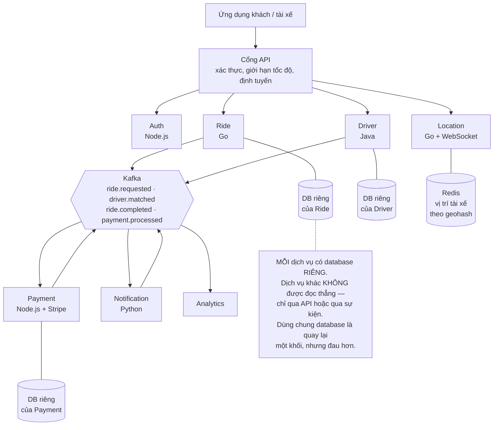
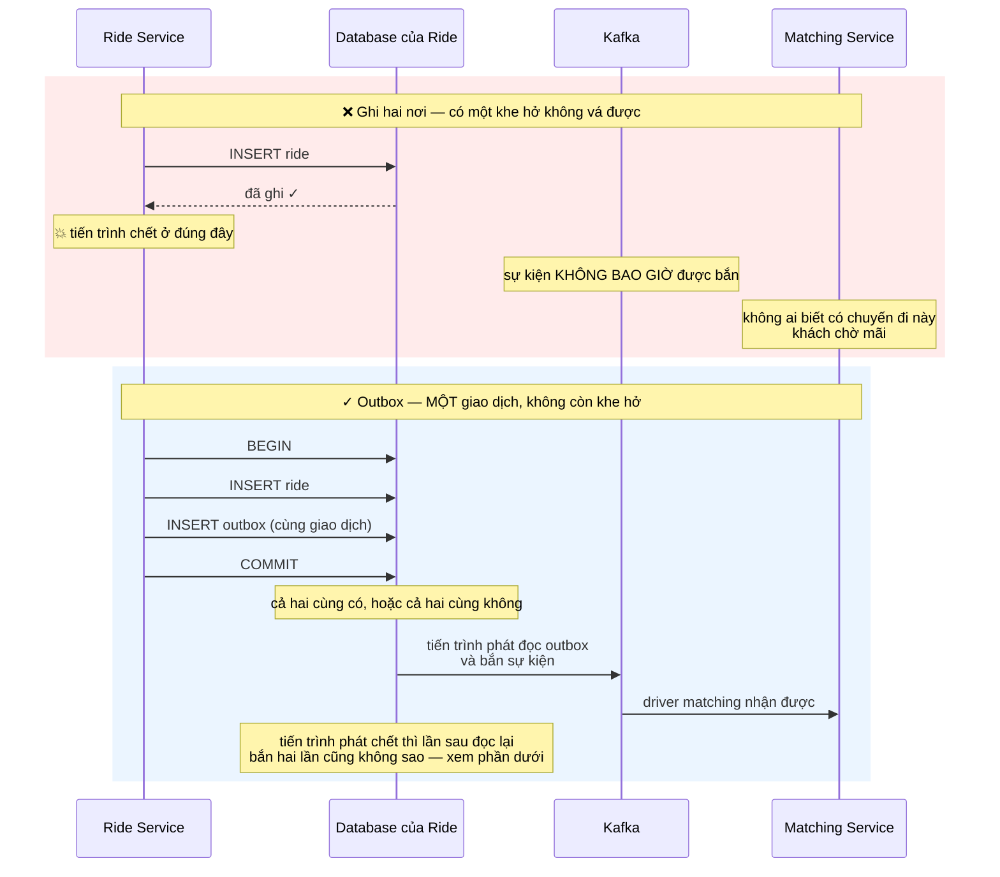
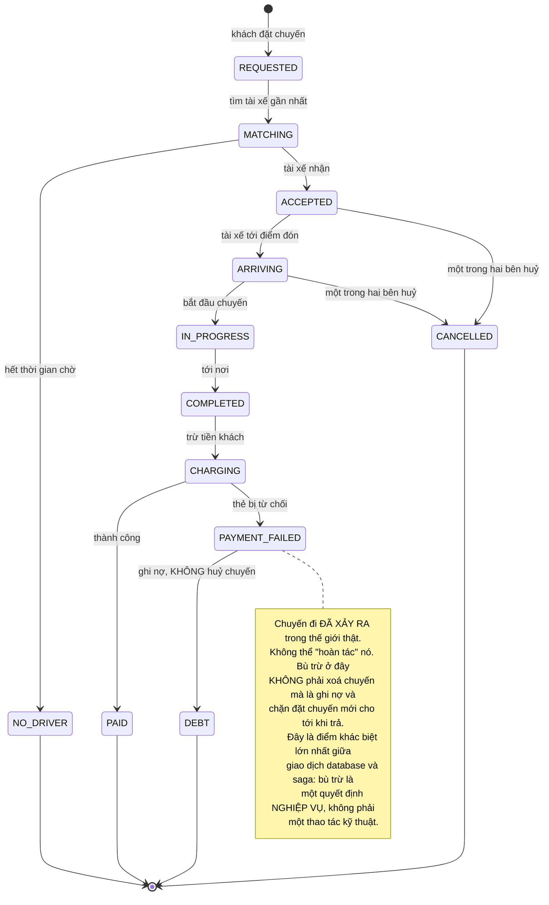
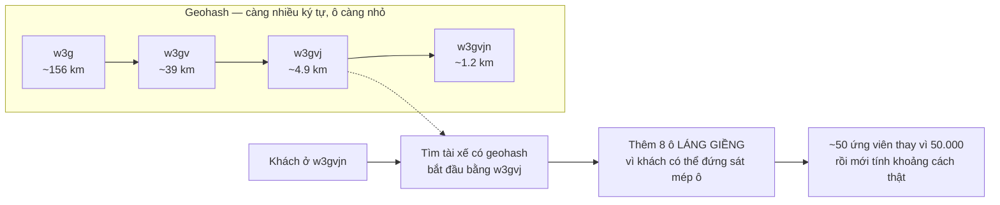

# Event-Driven Microservices (Uber-like)

Mọi dự án trước trong lộ trình có chung một thứ xa xỉ mà bạn chưa từng để ý: **một database duy nhất**. Nhờ nó, "ghi hai thứ hoặc không ghi gì cả" chỉ là một giao dịch — `BEGIN`, hai lệnh, `COMMIT`.

Bài này lấy đi thứ đó. Sáu dịch vụ, sáu database riêng, và một yêu cầu nghiệp vụ chạy qua bốn cái trong số đó. Đột nhiên câu hỏi "làm sao đảm bảo cả hai cùng xảy ra" không còn câu trả lời bằng một từ khoá SQL.

Đây cũng là dự án đầu tiên bạn nên bắt đầu bằng một lời cảnh báo thay vì một lời giới thiệu.

---

## Đọc phần này trước khi viết dòng nào

Microservices không phải bậc thang tiếp theo sau khi "giỏi hơn". Nó là một **đánh đổi**, và với phần lớn hệ thống thì đánh đổi đó lỗ.

Cái bạn nhận được: các đội triển khai độc lập, mở rộng riêng từng phần, một dịch vụ chết không kéo sập cả hệ thống, mỗi phần chọn ngôn ngữ phù hợp.

Cái bạn trả:

| Trước đây (một khối) | Bây giờ (nhiều dịch vụ) |
|---|---|
| Gọi hàm — không bao giờ thất bại giữa chừng | Gọi qua mạng — hỏng, chậm, hoặc trả lời hai lần |
| `JOIN` hai bảng | Gọi hai dịch vụ rồi tự ghép trong bộ nhớ |
| Một giao dịch bao trọn | Saga và các bước bù trừ tự viết |
| Đọc log một file | Truy vết phân tán, và không có nó thì mù hoàn toàn |
| `docker compose up` | Điều phối container, khám phá dịch vụ, lưới dịch vụ |

**Lời khuyên thật lòng: đừng chia nhỏ hệ thống thật của bạn theo cách này trừ khi có lý do cụ thể** — thường là nhiều đội giẫm chân nhau khi triển khai, hoặc một phần cần mở rộng gấp mười lần phần còn lại.

Nhưng **hãy làm dự án này**, vì ba mẫu hình bên dưới (outbox, saga, tiêu thụ lặp lại được) là những thứ bạn sẽ cần **kể cả trong một khối duy nhất** — bất cứ khi nào hệ thống của bạn nói chuyện với một hệ thống khác: cổng thanh toán, dịch vụ gửi thư, một API bên thứ ba. Ranh giới mạng mới là thứ sinh ra các bài toán này, không phải microservices.

---

## Bạn sẽ dựng ra cái gì

- Sáu dịch vụ: xác thực, chuyến đi, tài xế, vị trí, thanh toán, thông báo
- Ghép khách với tài xế gần nhất theo thời gian thực
- Theo dõi vị trí trên bản đồ khi đang di chuyển
- Giá động theo cung cầu từng khu vực
- Thanh toán có bước bù trừ khi hỏng giữa chừng
- Truy vết phân tán: một yêu cầu đi qua sáu dịch vụ vẫn xem được liền mạch

---

## Kiến trúc



Quy tắc quan trọng nhất nằm trong khung ghi chú: **database là tài sản riêng của dịch vụ**. Vi phạm điều này là sai lầm phổ biến nhất khi chia nhỏ hệ thống — bạn có mọi cái giá của microservices mà không có lợi ích nào, vì hai dịch vụ vẫn không thể đổi lược đồ độc lập.

---

## Bài toán ghi hai nơi: nơi mọi thứ bắt đầu khó

Dịch vụ chuyến đi cần làm hai việc: lưu chuyến vào database của nó, và báo cho các dịch vụ khác biết. Viết một cách tự nhiên:

```go
// SAI — hai thao tác này KHÔNG THỂ nguyên tử với nhau.
tx, _ := db.Begin(ctx)
tx.Exec(ctx, "INSERT INTO rides (...) VALUES (...)")
tx.Commit(ctx)                                 // ① ghi database xong

kafkaWriter.WriteMessages(ctx, rideRequested)  // ② tiến trình chết ở ĐÂY?
```

Giữa ① và ② có một khoảng thời gian. Tiến trình chết trong khoảng đó — máy chủ khởi động lại, container bị thu hồi, mạng đứt — thì **chuyến đi tồn tại trong database nhưng không ai biết nó tồn tại**. Không tài xế nào được ghép. Khách ngồi chờ mãi một chiếc xe không bao giờ được gọi.

Đảo thứ tự cũng không cứu được: bắn sự kiện trước rồi ghi database hỏng thì các dịch vụ khác phản ứng với một chuyến đi không tồn tại.



### Outbox: đưa sự kiện vào cùng giao dịch với dữ liệu

Mẹo rất đơn giản và cực kỳ hiệu quả: **đừng bắn sự kiện, hãy ghi ý định bắn sự kiện vào chính database đó, trong cùng một giao dịch.**

```sql
CREATE TABLE outbox (
    id             BIGSERIAL   PRIMARY KEY,
    aggregate_type VARCHAR(32) NOT NULL,   -- 'ride'
    aggregate_id   TEXT        NOT NULL,   -- khoá phân vùng, quyết định thứ tự
    event_type     VARCHAR(64) NOT NULL,   -- 'ride.requested'
    payload        JSONB       NOT NULL,
    published_at   TIMESTAMPTZ,            -- NULL = chưa bắn
    created_at     TIMESTAMPTZ NOT NULL DEFAULT now()
);

CREATE INDEX outbox_unpublished_idx
    ON outbox (created_at) WHERE published_at IS NULL;
```

```go
// ĐÚNG — chuyến đi và sự kiện nằm trong CÙNG một giao dịch.
// Không còn khoảng thời gian nào để tiến trình chết vào giữa.
tx, _ := db.Begin(ctx)
defer tx.Rollback(ctx)

tx.Exec(ctx, `INSERT INTO rides (id, user_id, pickup, dropoff, status)
              VALUES ($1, $2, $3, $4, 'REQUESTED')`, ...)

tx.Exec(ctx, `INSERT INTO outbox (aggregate_type, aggregate_id, event_type, payload)
              VALUES ('ride', $1, 'ride.requested', $2)`, rideID, payload)

tx.Commit(ctx)   // cả hai cùng thành công, hoặc cả hai cùng không xảy ra
```

Một tiến trình riêng đọc các dòng chưa bắn rồi đẩy lên Kafka. Nếu nó chết giữa chừng, lần chạy sau đọc lại từ chỗ chưa đánh dấu — có thể bắn trùng, và phần tiếp theo giải quyết chuyện đó.

Đây là **lần thứ bảy** trong lộ trình cùng một nguyên tắc xuất hiện: *điều kiện quan trọng phải được thực thi ở nơi có tính nguyên tử.* Ở [Todo App](/projects/todo-list-app-full-stack) là mệnh đề `where`, ở [E-Commerce](/projects/e-commerce-platform-multi-vendor) là `UPDATE ... WHERE stock >= qty`, ở [Social Media](/projects/social-media-platform-twitter-like) là `ON CONFLICT ... RETURNING`, ở đây là **kéo sự kiện vào trong giao dịch thay vì để nó ở ngoài**.

---

## "Đúng một lần" không tồn tại

Đây là điều cần chấp nhận sớm, vì nhiều người mất hàng tuần cố gắng đạt được nó.

Hàng đợi thông báo *đã xử lý xong*. Thông báo đó bị mất trên đường. Hàng đợi kết luận chưa xử lý và giao lại. Không có cách nào phân biệt "chưa làm" với "đã làm nhưng lời xác nhận bị mất" — và đó là một giới hạn cơ bản, không phải khiếm khuyết của công cụ.

Nên hệ thống thật chạy trên **giao ít nhất một lần cộng với bên nhận xử lý lặp lại được**. Việc bên nhận phải làm là tự nhận ra "cái này tôi làm rồi":

```go
// Bảng đã-xử-lý với khoá chính là ID sự kiện. Lần thứ hai bị DATABASE
// từ chối, không phải bị mã ứng dụng đoán ra.
func handlePaymentCompleted(ctx context.Context, ev Event) error {
    tx, err := db.Begin(ctx)
    if err != nil { return err }
    defer tx.Rollback(ctx)

    ct, err := tx.Exec(ctx,
        `INSERT INTO processed_events (event_id) VALUES ($1)
         ON CONFLICT (event_id) DO NOTHING`, ev.ID)
    if err != nil { return err }
    if ct.RowsAffected() == 0 {
        return nil   // đã xử lý rồi — bỏ qua, và đây là đường đi BÌNH THƯỜNG
    }

    // Tác dụng phụ nằm CÙNG giao dịch với dấu đã-xử-lý.
    // Tách ra là quay lại đúng bài toán ghi hai nơi ở phần trên.
    tx.Exec(ctx, `UPDATE rides SET status = 'PAID' WHERE id = $1`, ev.RideID)
    return tx.Commit(ctx)
}
```

Chú ý dòng cuối: cập nhật trạng thái và ghi dấu đã-xử-lý **phải nằm trong cùng một giao dịch**. Nếu tách ra, bạn vừa tạo lại đúng cái khe hở mà outbox sinh ra để vá.

### Thứ tự sự kiện: khoá phân vùng quyết định tất cả

Kafka chỉ đảm bảo thứ tự **trong một phân vùng**, không đảm bảo trên toàn chủ đề. Nếu `ride.requested` và `ride.cancelled` của cùng một chuyến rơi vào hai phân vùng khác nhau, bên nhận có thể thấy huỷ trước khi thấy tạo.

Cách chữa là chọn khoá phân vùng bằng **định danh của thực thể**, không phải ngẫu nhiên:

```go
kafka.Message{
    Key:   []byte(ride.ID),   // mọi sự kiện của MỘT chuyến vào CÙNG phân vùng
    Value: payload,
}
```

Đánh đổi cần biết: một chuyến đi cực kỳ bận rộn sẽ dồn tải vào một phân vùng. Với chuyến đi thì không sao vì chúng phân bố đều. Nhưng nếu bạn chọn khoá là `city_id` thì thành phố lớn nhất sẽ thành nút thắt — chọn khoá phân vùng là chọn cả cách tải được phân bố.

---

## Saga: giao dịch phân tán không tồn tại, chỉ có bù trừ

Một chuyến đi hoàn tất phải: trừ tiền khách, cộng tiền tài xế, đóng chuyến, gửi biên lai. Bốn dịch vụ, bốn database. Không có `COMMIT` nào bao trọn cả bốn.

Cách thực tế là chuỗi các bước, mỗi bước có **hành động bù trừ** cho riêng nó:



Ba điều rút ra, và điều thứ ba là quan trọng nhất:

1. **Bù trừ không phải rollback.** Rollback xoá dấu vết; bù trừ tạo ra một sự kiện mới ngược chiều. Trừ nhầm tiền thì bù trừ là *hoàn tiền*, và cả hai giao dịch đều nằm trong lịch sử.
2. **Có những bước không bù trừ được.** Email đã gửi không thu lại được. Xếp các bước không thể hoàn tác về **cuối** chuỗi.
3. **Trạng thái trung gian là thật và người dùng nhìn thấy nó.** Trong giao dịch database không ai thấy trạng thái nửa vời; trong saga thì có. Giao diện phải hiển thị được "đang xử lý thanh toán" chứ không thể giả vờ mọi thứ tức thời.

---

## Ghép tài xế: bài toán không gian

Tìm tài xế rảnh gần nhất trong bán kính 3km, giữa 50.000 tài xế đang di chuyển. Quét toàn bộ rồi tính khoảng cách là 50.000 phép tính cho mỗi yêu cầu — không dùng được.

Cách chuẩn là **chia mặt đất thành ô** và mã hoá mỗi ô thành một chuỗi, sao cho **hai điểm gần nhau có tiền tố chuỗi giống nhau**:



Chi tiết "8 ô láng giềng" là chỗ hầu hết cách viết tự phát bỏ sót: khách đứng sát mép ô thì tài xế cách 100m có thể nằm trong ô bên cạnh và có tiền tố hoàn toàn khác. Chỉ tìm trong ô của chính mình là bỏ sót tài xế gần nhất một cách hệ thống.

Redis có sẵn kiểu dữ liệu này nên không cần tự cài đặt:

```go
// Cập nhật vị trí — tài xế gửi mỗi 4 giây khi đang rảnh.
rdb.GeoAdd(ctx, "drivers:available", &redis.GeoLocation{
    Name: driverID, Longitude: lng, Latitude: lat,
})

// Tìm trong bán kính, đã sắp sẵn theo khoảng cách gần nhất.
res, _ := rdb.GeoSearchLocation(ctx, "drivers:available", &redis.GeoSearchLocationQuery{
    GeoSearchQuery: redis.GeoSearchQuery{
        Longitude: pickupLng, Latitude: pickupLat,
        Radius: 3, RadiusUnit: "km", Sort: "ASC", Count: 20,
    },
    WithDist: true,
}).Result()
```

Ba điều thực tế mà khoảng cách đường chim bay không nói:

- **Gần nhất theo đường chim bay không phải gần nhất theo thời gian.** Tài xế cách 500m nhưng bên kia sông có thể mất 15 phút. Dùng khoảng cách để **lọc ứng viên**, dùng thời gian di chuyển ước tính để **xếp hạng**.
- **Một tài xế không được nhận hai chuyến.** Ghép là thao tác tranh chấp — hai yêu cầu cùng lúc có thể chọn cùng một tài xế. Lời giải quen thuộc: `UPDATE drivers SET status='ASSIGNED' WHERE id=$1 AND status='AVAILABLE'` rồi kiểm số dòng bị ảnh hưởng. Nếu bằng 0 thì có người nhanh hơn — tìm tài xế khác.
- **Tài xế mất kết nối vẫn nằm trong danh sách.** Đặt thời hạn cho bản ghi vị trí: không cập nhật trong 30 giây thì coi như ngoại tuyến, nếu không bạn ghép khách với một chiếc xe đã tắt máy từ lâu.

---

## Truy vết phân tán: không có thì mù hoàn toàn

Trong một khối duy nhất, lỗi là một vết ngăn xếp. Ở đây, một yêu cầu chạm sáu dịch vụ, sáu file log riêng biệt, và câu hỏi "vì sao chuyến này chậm 8 giây" không trả lời được bằng cách đọc log.

Cách duy nhất hoạt động: **sinh một mã truy vết ở cổng API và truyền nó qua mọi lời gọi và mọi sự kiện**. Ghi log ở mọi dịch vụ luôn kèm mã đó.

Đừng để việc này lại làm sau. Cài truy vết **trước** khi viết dịch vụ thứ hai — thêm vào sau nghĩa là sửa mọi handler đã viết, và thường không bao giờ được làm.

Cùng lý do đó, ba thứ nên có sẵn từ đầu:

- **Hàng đợi thư chết.** Sự kiện xử lý hỏng 5 lần phải đi đâu đó, không được lặp vô hạn và cũng không được biến mất.
- **Ngắt mạch.** Dịch vụ thanh toán chậm thì dịch vụ chuyến đi phải bỏ qua nó sau vài giây, không xếp hàng chờ tới lúc cạn kết nối. Một dịch vụ chậm kéo sập cả hệ thống là kiểu sự cố đặc trưng của kiến trúc này.
- **Kiểm tra sức khoẻ tách hai loại.** "Tiến trình còn sống" và "sẵn sàng nhận việc" là hai câu hỏi khác nhau. Gộp làm một thì trình điều phối sẽ giết container đang khởi động chậm, hoặc gửi lưu lượng tới container chưa kết nối được database.

---

## Những cái bẫy đã được ghi lại

| Triệu chứng | Nguyên nhân thật | Cách sửa |
|---|---|---|
| Chuyến đi có trong DB nhưng không ai ghép | Ghi database rồi mới bắn sự kiện — chết ở giữa | Outbox trong cùng giao dịch |
| Khách bị trừ tiền hai lần | Bên nhận không lặp lại được | Bảng đã-xử-lý, cùng giao dịch với tác dụng phụ |
| Thấy sự kiện huỷ trước sự kiện tạo | Khoá phân vùng ngẫu nhiên | Khoá là định danh thực thể |
| Một phân vùng nghẽn, các phân vùng khác rảnh | Khoá phân vùng phân bố lệch | Chọn khoá có phân bố đều |
| Đổi lược đồ một dịch vụ làm hỏng dịch vụ khác | Hai dịch vụ dùng chung database | Database là tài sản riêng, giao tiếp qua API/sự kiện |
| Thanh toán chậm làm mọi thứ chậm theo | Không có ngắt mạch, không có thời hạn chờ | Thời hạn chờ ngắn cộng ngắt mạch |
| Ghép trúng tài xế đã tắt ứng dụng | Bản ghi vị trí không hết hạn | Thời hạn 30 giây cho vị trí |
| Hai chuyến cùng ghép một tài xế | Đọc rồi mới ghi | `UPDATE ... WHERE status='AVAILABLE'`, đếm dòng |
| Bỏ sót tài xế gần nhất | Chỉ tìm trong ô geohash của mình | Thêm 8 ô láng giềng |
| Tài xế gần nhưng tới rất lâu | Xếp hạng theo đường chim bay | Lọc bằng khoảng cách, xếp hạng bằng thời gian đi |
| Không biết vì sao yêu cầu chậm | Log rời rạc từng dịch vụ | Mã truy vết truyền qua mọi lời gọi |
| Sự kiện hỏng lặp vô hạn | Không có hàng đợi thư chết | Chuyển sang thư chết sau N lần thử |
| Trình điều phối giết container liên tục | Gộp kiểm tra sống và sẵn sàng | Tách hai loại kiểm tra sức khoẻ |

---

## Khi nào coi như xong

- [ ] Giết dịch vụ chuyến đi **ngay sau** lệnh COMMIT bằng `kill -9`: khởi động lại xong sự kiện vẫn được bắn, chuyến vẫn được ghép
- [ ] Bắn lại thủ công cùng một sự kiện thanh toán 10 lần: khách bị trừ tiền đúng **một** lần
- [ ] Tắt hẳn dịch vụ thông báo 5 phút rồi bật lại: mọi thông báo bị dồn đều được gửi, không mất
- [ ] Tắt dịch vụ thanh toán: đặt chuyến **vẫn hoạt động** (chỉ phần trừ tiền chờ), không sập toàn hệ thống
- [ ] Bắn `ride.cancelled` trước `ride.requested`: hệ thống không rơi vào trạng thái vô lý
- [ ] 100 yêu cầu đồng thời trong cùng một khu vực: không tài xế nào bị ghép hai chuyến
- [ ] Tài xế tắt ứng dụng: sau 30 giây không còn xuất hiện trong kết quả tìm kiếm
- [ ] Mở một mã truy vết bất kỳ: thấy đủ sáu chặng của cùng một yêu cầu, kèm thời gian từng chặng
- [ ] Đưa một sự kiện hỏng vào: sau 5 lần thử nó nằm ở hàng đợi thư chết, hệ thống vẫn chạy
- [ ] Đếm số dòng chưa bắn trong bảng outbox lúc tải cao: phải về 0, không tăng dần

---

## Bước tiếp theo

1. **Giá động.** Tỉ lệ yêu cầu trên số tài xế rảnh theo từng ô geohash, cập nhật mỗi phút. Bài toán thú vị: tránh dao động khi giá cao đẩy tài xế đổ về rồi giá tụt ngay.
2. **Dự đoán thời gian tới nơi.** Bắt đầu bằng trung bình lịch sử theo tuyến và theo giờ — nó đã tốt hơn khoảng cách đường chim bay rất nhiều trước khi cần tới học máy.
3. **Kubernetes và triển khai thật.** Sáu dịch vụ chạy tay là một chuyện, chạy có tự phục hồi và tự mở rộng là chuyện khác — chủ đề của dự án DevOps trong lộ trình.
4. **Kafka hoạt động ra sao bên trong.** Bạn vừa dùng nó như một hộp đen. [Distributed Message Broker](/projects/distributed-message-broker-kafka-like) mở hộp đó ra: nhật ký chỉ ghi thêm, bản sao, bầu chọn thủ lĩnh.
5. **Xử lý dòng dữ liệu vị trí.** Hàng triệu điểm toạ độ mỗi phút cần một hệ thống khác hẳn — [Real-Time Analytics Platform](/projects/realtime-analytics-platform) đi vào đúng bài toán đó.
