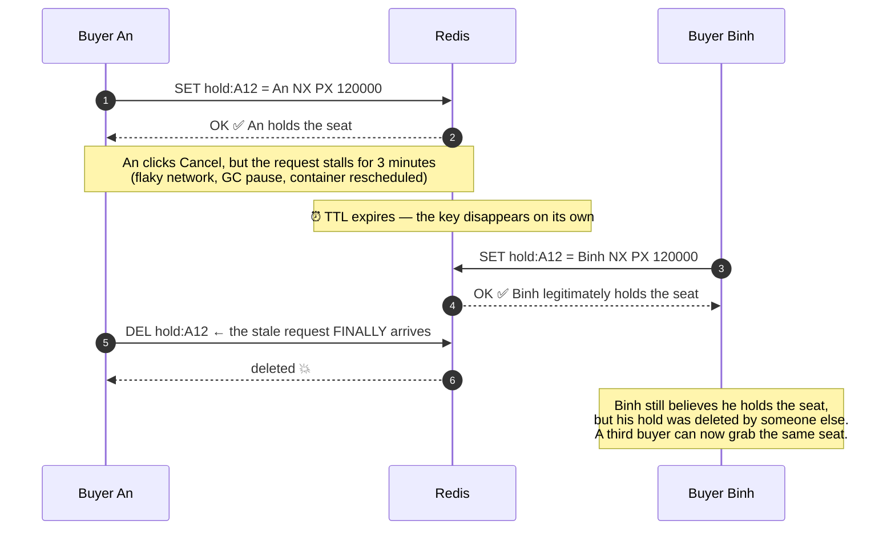
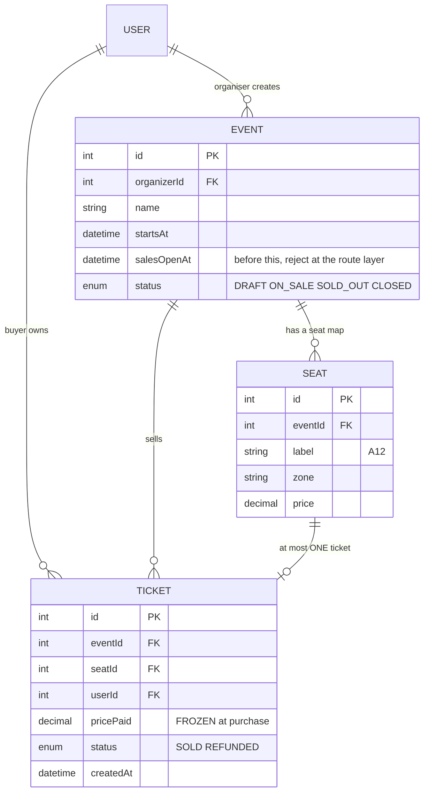

# Event Ticketing System

The five previous **Semester 6** projects were all correct, and they all used one strategy: **let Postgres arbitrate**. Constraints, partial indexes, `EXCLUDE`, `UPDATE ... WHERE` — the database decides who wins.

This project is where that strategy is **still correct but no longer sufficient**.

Tickets drop at 20:00. Ten thousand people tap "select seat A12" in the same second. If every one of them enters a write transaction on the same Postgres row, then 9,999 people make **a full round trip to the database** merely to receive a constraint error. The connection pool drains, latency spikes, and the system falls over — not because it is wrong, but because it is **correct in an unaffordable way**.

So this project adds a layer in front: **an atomic hold in Redis**, with the Postgres constraint still behind it as the durable backstop. And it teaches a concept you will meet forever after: **the distributed lock with a lease**.

---

## What you will build

- A **Node.js + Express** REST API, durable state in **PostgreSQL** (`pg`), holds in **Redis** (`node-redis`)
- Two roles: **Buyer** and **Organiser** (create events, seat maps, open sales)
- A **two-minute seat hold** via `SET NX PX`, self-expiring when a buyer walks away
- **Safe release** through a Lua compare-and-delete script
- **Purchase confirmation** in a Postgres transaction with `UNIQUE(event_id, seat_id)` as the final backstop
- A load test simulating **1,000 simultaneous buyers** and tallying the outcome

> 📚 The step-by-step course: [**INT606 — Event Ticketing System**](/courses/event-ticketing-system) on the Academy (9 sections, 21 lessons).

---

## Why Postgres alone falls short at drop scale

The first question worth asking: is `UNIQUE(event_id, seat_id)` **correct?** Yes. It prevents every double sale.

The problem is not correctness but **the cost of losing**:

```mermaid
flowchart TB
    subgraph pg["Postgres only — correct but expensive"]
        P1["10,000 requests"] --> P2["10,000 transactions<br/>fighting over ONE row"]
        P2 --> P3["Postgres serialises them:<br/>everyone waits for the one before"]
        P3 --> P4["1 succeeds<br/>9,999 get a constraint error"]
        P4 --> P5["But ALL 10,000 have already:<br/>• taken a pool connection<br/>• made a full round trip<br/>• held a row lock briefly"]
        P5 --> P6["Pool exhausted ⇒ UNRELATED requests<br/>(browse events, sign in)<br/>die with it"]
    end

    subgraph redis["Redis in front — losing is CHEAP"]
        R1["10,000 requests"] --> R2["10,000 SET NX commands<br/>on one key"]
        R2 --> R3["Redis is single-threaded:<br/>serialised in memory"]
        R3 --> R4["1 gets OK<br/>9,999 get nil in MICROSECONDS"]
        R4 --> R5["9,999 receive a 409 without<br/>ever touching Postgres"]
        R5 --> R6["Only 1 write transaction runs.<br/>The rest of the system stays alive."]
    end
```



The principle generalises to any system facing a traffic spike: **push rejection as early and as cheaply as you can.** The scarcest resource during a drop is not CPU — it is **database connections**.

---

## `SET NX PX`: one command doing three jobs

```js
// Hold seat A12 for THIS user, for 120 seconds
const key = `hold:event:42:seat:A12`;
const ok = await redis.set(key, userId, { NX: true, PX: 120_000 });
//   NX  = only set if the key does NOT exist  → atomic test-and-set
//   PX  = auto-expire after 120,000 ms        → abandoned holds free themselves
if (ok === null)
  throw new ConflictError('Someone else is holding that seat');   // → 409
```

Three properties in one line, and all three are essential:

| Piece | The problem it solves |
|---|---|
| `SET ... NX` | **Atomic** test-and-set. Redis is single-threaded, so 10,000 commands queue and exactly one finds the key absent |
| `PX 120000` | The buyer closes the tab mid-checkout. Without a TTL that seat is **stuck forever** and only a human can free it |
| The value `= userId` | Identifies the owner. Without it you cannot tell "my hold" from "someone else's" — and the next section shows how dangerous that is |

This is a **distributed lock**, which is exactly what it will be called in every multi-process system you meet later. "Hold a seat" and "acquire a lock" are **the same problem**; noticing that lets you reuse a battle-tested recipe instead of inventing one.

---

## Releasing: where `DEL` is a trap

The buyer clicks Cancel. The natural reflex:

```js
await redis.del(key);   // ❌ this is a bug, and it only shows up when things are slow
```

The failure:



The fix is **compare, then delete**, and the comparison must be atomic with the deletion — which is why it has to be a Lua script, since Redis runs an entire script as one command:

```js
// Delete the key ONLY if its value is still my userId
const RELEASE = `
  if redis.call('get', KEYS[1]) == ARGV[1] then
    return redis.call('del', KEYS[1])
  else
    return 0
  end`;
await redis.eval(RELEASE, { keys: [key], arguments: [String(userId)] });
```

This is the longest-lived lesson in the project: **releasing a lock must check ownership, just as acquiring it checks availability.** The identical trap lives in every job queue, every scheduler, and every leased lock you will ever touch.

---

## Two layers, two jobs

```mermaid
sequenceDiagram
    autonumber
    participant U as Buyer
    participant API as Express
    participant R as Redis
    participant PG as PostgreSQL

    rect rgb(20, 40, 60)
    Note over U,PG: Layer 1 — Redis decides FAST who may even try
    U->>API: POST /holds {event:42, seat:A12}
    API->>R: SET hold:42:A12 = user NX PX 120000
    R-->>API: OK (or nil ⇒ 409 within microseconds)
    API-->>U: 201 — you have 2 minutes to pay
    end

    rect rgb(20, 50, 30)
    Note over U,PG: Layer 2 — Postgres decides DURABLY who really owns it
    U->>API: POST /tickets {holdToken}
    API->>R: verify the key still exists and is still mine
    API->>PG: BEGIN → INSERT tickets(event, seat, user) → COMMIT
    Note over PG: UNIQUE(event_id, seat_id) — the final backstop,<br/>correct even if Redis loses everything
    API->>R: EVAL the release script (compare then delete)
    API-->>U: 201 — your ticket
    end
```



**Redis is fast but can lose data. Postgres is durable but slower.** This architecture uses each for what it is good at: Redis absorbs the crowd, Postgres keeps the truth. If Redis restarts and forgets every hold, the system **still never double-sells** — a few buyers simply get rejected later than they would have.

That is the point to make when someone asks "why not just Redis?": because customers' money should not depend on an in-memory store.

---

## The data model



Holds have **no Postgres table**, and that is deliberate. A hold is **ephemeral, self-expiring, write-heavy** data — exactly the shape Redis handles well and Postgres handles badly. Put it in Postgres and you sign up to sweep expired holds with a background job, and one day that job will not run. Same reasoning as "overdue is a derived state" in [Library Management System](/projects/library-management-system).

---

## Proving it with 1,000 buyers

```js
// Fire 1,000 requests at one seat and tally the status codes
const results = await Promise.all(
  Array.from({ length: 1000 }, (_, i) =>
    fetch(`${API}/holds`, {
      method: 'POST',
      headers: { Authorization: `Bearer ${tokens[i]}`, 'Content-Type': 'application/json' },
      body: JSON.stringify({ eventId: 42, seatLabel: 'A12' }),
    }).then(r => r.status),
  ),
);

const tally = results.reduce((m, s) => ({ ...m, [s]: (m[s] ?? 0) + 1 }), {});
console.log(tally);            // expected: { '201': 1, '409': 999 }

const sold = await pg.query(
  'SELECT COUNT(*) FROM tickets WHERE event_id=42 AND seat_id=$1', [seatId]);
console.assert(sold.rows[0].count === '1');   // and EXACTLY one ticket in the DB
```

Three numbers worth putting in the README, measured before and after adding the Redis layer:

- **Peak Postgres connections** during the burst — this is the number that shows what Redis is doing for you
- **p95 latency of the requests that lose**
- **Latency of an unrelated endpoint** (say `GET /events`) during the burst — if that degrades too, your pool is draining

---

## Traps worth writing down

| Symptom | Actual cause | Fix |
|---|---|---|
| Seats stuck forever, needing manual repair | `SET NX` without a TTL | Always use `PX` so holds expire themselves |
| Someone else's hold gets deleted | Blind `DEL` on release | A Lua compare-and-delete script |
| Double-sold seats despite Redis | Treating Redis as the final source of truth | `UNIQUE(event_id, seat_id)` in Postgres |
| The whole system slows during a drop | Every request reaches Postgres | Reject in Redis before opening a transaction |
| Redis restarts and seats double-sell | No durable backstop | The Postgres constraint, always |
| Buyers thrown out mid-payment | TTL shorter than real checkout time | Measure real checkout duration, then set the TTL |
| Price changes between hold and purchase | Price read at confirmation time | Freeze `pricePaid` onto the ticket at purchase |
| Purchases succeed before sales open | Only the client button was hidden | Enforce `salesOpenAt` at the route layer |
| The load test is always green | Requests ran sequentially | `Promise.all`, not a `for` loop with `await` |
| One person sweeps the whole event | No per-account seat cap | Count holds per user and cap them |
| Buyers hold seats and never pay | No conversion measurement | Log expired holds and track the ratio |

---

## Done means

- [ ] 1,000 simultaneous requests for one seat: exactly **1** `201`, **999** `409`
- [ ] Exactly **1** row in `tickets` for that seat
- [ ] Hold a seat and walk away: after the TTL, another buyer can hold it **with no human intervention**
- [ ] Simulate a release request arriving after the TTL expired: it does **not** delete the new holder's hold
- [ ] `FLUSHALL` Redis mid-burst: **no** seat is ever double-sold
- [ ] During the 1,000-request burst, `GET /events` **still** responds under 200 ms
- [ ] Peak Postgres connections during the burst: **not materially higher** than at idle
- [ ] `POST /holds` before `salesOpenAt`: returns `403`
- [ ] One account exceeding the per-user hold cap: blocked
- [ ] Price changes after a hold: the confirmed ticket still charges **the price at purchase**

---

## Where to go next

1. **When the constraint is a group's capacity.** [Gym Membership App](/projects/gym-membership-app) moves from "one seat, one person" to "a class of 20", and adds a waitlist.
2. **When many resources are equivalent.** [Restaurant Reservation App](/projects/restaurant-reservation-app) does not hold a named table but claims **any free one** — `FOR UPDATE SKIP LOCKED`.
3. **When payment is real.** [E-Commerce Platform](/projects/e-commerce-platform-multi-vendor) wires holds to a payment gateway and webhooks, where retries are routine.
4. **When an action must happen exactly once across services.** [Event-Driven Microservices](/projects/event-driven-microservices-uber-like) answers with a transactional outbox.
