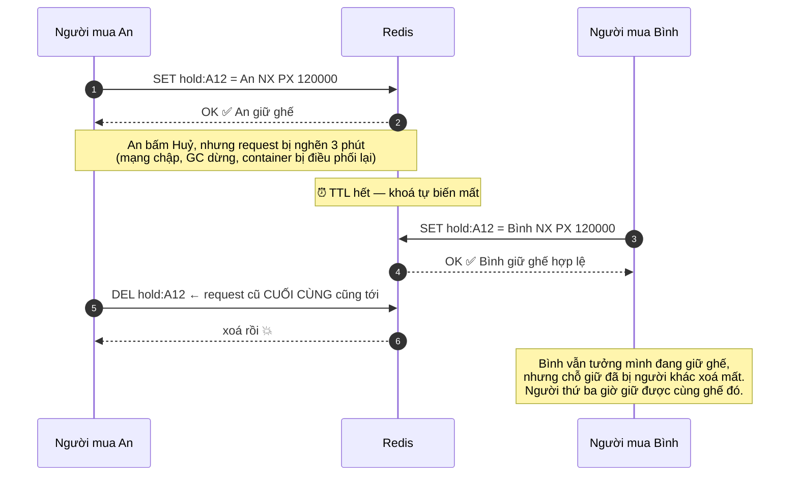
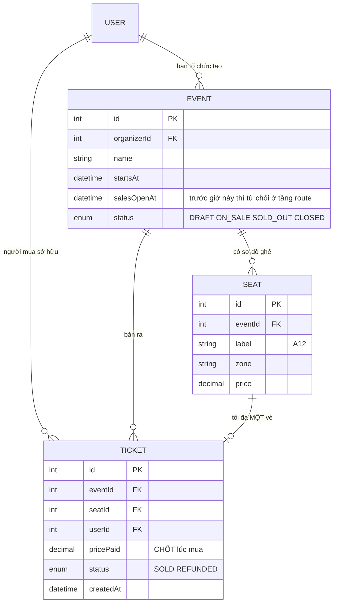

# Event Ticketing System

Năm đồ án trước của **Kỳ 6** đều đúng, và tất cả đều dùng chung một chiến lược: **để Postgres phân xử**. Ràng buộc, chỉ mục bộ phận, `EXCLUDE`, `UPDATE ... WHERE` — cơ sở dữ liệu quyết định ai thắng.

Đồ án này là nơi chiến lược đó **vẫn đúng nhưng không còn đủ**.

Vé mở bán lúc 20:00. Mười nghìn người bấm "chọn ghế A12" trong cùng một giây. Nếu tất cả cùng lao vào một transaction ghi trên cùng một hàng Postgres, thì 9.999 người phải **đi trọn một vòng khứ hồi tới cơ sở dữ liệu** chỉ để nhận về một lỗi ràng buộc. Kết nối trong pool cạn kiệt, thời gian phản hồi vọt lên, và hệ thống sập không phải vì sai mà vì **đúng một cách quá đắt**.

Bài này thêm một lớp phía trước: **giữ chỗ nguyên tử trong Redis**, với ràng buộc Postgres vẫn nằm sau làm chốt chặn bền vững. Và nó dạy một khái niệm mà từ đây trở đi bạn sẽ gặp mãi: **khoá phân tán có thời hạn**.

---

## Bạn sẽ dựng ra cái gì

- REST API **Node.js + Express**, dữ liệu bền trong **PostgreSQL** (`pg`), giữ chỗ trong **Redis** (`node-redis`)
- Hai vai trò: **Người mua** và **Ban tổ chức** (tạo sự kiện, sơ đồ ghế, mở bán)
- **Giữ ghế hai phút** bằng `SET NX PX`, tự hết hạn nếu người mua bỏ ngang
- **Giải phóng an toàn** bằng script Lua so-sánh-rồi-xoá
- **Xác nhận mua** trong transaction Postgres với `UNIQUE(event_id, seat_id)` làm chốt chặn cuối
- Bài kiểm tải mô phỏng **1.000 người mua đồng thời** và đếm kết quả

> 📚 Bản dạy từng bước: [**INT606 — Event Ticketing System**](/courses/event-ticketing-system) trên Academy (9 mục, 21 bài).

---

## Vì sao chỉ Postgres là chưa đủ ở quy mô mở bán

Câu hỏi đáng hỏi trước tiên: `UNIQUE(event_id, seat_id)` **có đúng không?** Có. Nó ngăn được mọi trường hợp bán trùng.

Vấn đề không phải tính đúng đắn mà là **cái giá của việc thua**:

```mermaid
flowchart TB
    subgraph pg["Chỉ dùng Postgres — đúng nhưng đắt"]
        P1["10.000 request"] --> P2["10.000 transaction<br/>tranh nhau cùng MỘT hàng"]
        P2 --> P3["Postgres tuần tự hoá:<br/>mỗi người chờ người trước"]
        P3 --> P4["1 người thành công<br/>9.999 nhận lỗi ràng buộc"]
        P4 --> P5["Nhưng CẢ 10.000 đều đã:<br/>• chiếm một kết nối trong pool<br/>• đi trọn vòng khứ hồi<br/>• giữ khoá hàng một lúc"]
        P5 --> P6["Pool cạn ⇒ request KHÁC<br/>(xem sự kiện, đăng nhập)<br/>cũng chết theo"]
    end

    subgraph redis["Redis phía trước — thua RẺ"]
        R1["10.000 request"] --> R2["10.000 lệnh SET NX<br/>trên cùng một khoá"]
        R2 --> R3["Redis đơn luồng:<br/>tuần tự hoá trong bộ nhớ"]
        R3 --> R4["1 nhận OK<br/>9.999 nhận nil trong VÀI MICRO GIÂY"]
        R4 --> R5["9.999 nhận 409 mà<br/>KHÔNG hề chạm tới Postgres"]
        R5 --> R6["Chỉ 1 transaction ghi chạy.<br/>Phần còn lại của hệ thống vẫn sống."]
    end
```



Nguyên tắc rút ra, dùng được cho mọi hệ thống chịu tải đột biến: **đẩy phép từ chối ra càng sớm và càng rẻ càng tốt.** Tài nguyên đắt nhất trong một đợt mở bán không phải CPU mà là **kết nối cơ sở dữ liệu**.

---

## `SET NX PX`: một lệnh làm ba việc

```js
// Giữ ghế A12 cho CHÍNH người này, trong 120 giây
const key = `hold:event:42:seat:A12`;
const ok = await redis.set(key, userId, { NX: true, PX: 120_000 });
//   NX  = chỉ đặt nếu khoá CHƯA tồn tại  → kiểm-và-đặt nguyên tử
//   PX  = tự hết hạn sau 120.000 ms      → chỗ giữ bị bỏ tự giải phóng
if (ok === null)
  throw new ConflictError('Ghế này đang có người khác giữ');   // → 409
```

Ba thuộc tính trong một dòng, và cả ba đều thiết yếu:

| Thành phần | Giải quyết vấn đề gì |
|---|---|
| `SET ... NX` | Kiểm-và-đặt **nguyên tử**. Redis đơn luồng nên 10.000 lệnh xếp hàng, đúng một lệnh thấy khoá trống |
| `PX 120000` | Người mua đóng tab giữa chừng. Không có TTL thì ghế đó **kẹt vĩnh viễn** và không ai sửa được trừ khi vào tay |
| Giá trị `= userId` | Định danh chủ sở hữu. Thiếu nó thì không phân biệt được "chỗ giữ của tôi" với "chỗ giữ của người khác" — và mục sau cho thấy điều đó nguy hiểm thế nào |

Đây chính là **khoá phân tán**, thứ bạn sẽ gặp lại dưới cái tên đó ở mọi hệ thống nhiều tiến trình. "Giữ một chiếc ghế" và "giành một khoá" là **cùng một bài toán**; nhận ra điều đó cho phép bạn dùng lại một công thức đã được kiểm chứng thay vì tự nghĩ ra.

---

## Giải phóng: chỗ mà `DEL` là một cái bẫy

Người mua bấm Huỷ. Phản xạ tự nhiên:

```js
await redis.del(key);   // ❌ đây là bug, và nó chỉ xuất hiện khi hệ thống chậm
```

Kịch bản hỏng:



Cách sửa là **so sánh rồi mới xoá**, và phép so sánh phải nguyên tử với phép xoá — nên nó phải là một script Lua, vì Redis chạy trọn một script như một lệnh:

```js
// Chỉ xoá khoá NẾU giá trị vẫn là userId của tôi
const RELEASE = `
  if redis.call('get', KEYS[1]) == ARGV[1] then
    return redis.call('del', KEYS[1])
  else
    return 0
  end`;
await redis.eval(RELEASE, { keys: [key], arguments: [String(userId)] });
```

Đây là bài học có sức sống dài nhất của đồ án: **giải phóng một khoá phải kiểm quyền sở hữu, đúng như chiếm nó phải kiểm chỗ trống.** Cùng một cái bẫy xuất hiện trong mọi hệ thống hàng đợi công việc, mọi bộ lập lịch, mọi khoá thuê có thời hạn.

---

## Hai lớp, hai vai trò

```mermaid
sequenceDiagram
    autonumber
    participant U as Người mua
    participant API as Express
    participant R as Redis
    participant PG as PostgreSQL

    rect rgb(20, 40, 60)
    Note over U,PG: Lớp 1 — Redis quyết định NHANH, ai được thử
    U->>API: POST /holds {event:42, seat:A12}
    API->>R: SET hold:42:A12 = user NX PX 120000
    R-->>API: OK (hoặc nil ⇒ 409 trong vài micro giây)
    API-->>U: 201 — bạn có 2 phút để thanh toán
    end

    rect rgb(20, 50, 30)
    Note over U,PG: Lớp 2 — Postgres quyết định BỀN, ai thật sự sở hữu
    U->>API: POST /tickets {holdToken}
    API->>R: kiểm khoá vẫn còn và vẫn là của tôi
    API->>PG: BEGIN → INSERT tickets(event, seat, user) → COMMIT
    Note over PG: UNIQUE(event_id, seat_id) — chốt chặn cuối,<br/>đúng kể cả khi Redis mất sạch dữ liệu
    API->>R: EVAL script giải phóng (so sánh rồi xoá)
    API-->>U: 201 — vé của bạn
    end
```



**Redis nhanh nhưng có thể mất dữ liệu. Postgres bền nhưng chậm hơn.** Kiến trúc này dùng đúng thế mạnh của từng cái: Redis chặn đám đông, Postgres giữ sự thật. Nếu Redis khởi động lại và mất hết chỗ giữ, hệ thống **vẫn không bán trùng vé** — chỉ là vài người có thể bị từ chối muộn hơn.

Đó là điều nên nói rõ khi ai đó hỏi "sao không dùng mỗi Redis?": vì tiền của khách hàng không nên phụ thuộc vào một kho dữ liệu trong bộ nhớ.

---

## Mô hình dữ liệu



Chỗ giữ **không** có bảng trong Postgres, và đó là quyết định có chủ ý. Chỗ giữ là dữ liệu **tạm thời, tự hết hạn, ghi rất nhiều** — đúng hình dạng mà Redis làm tốt và Postgres làm dở. Đưa nó vào Postgres là bạn tự nhận việc dọn chỗ giữ quá hạn bằng một job nền, và job đó sẽ có ngày không chạy. Cùng lý lẽ với "quá hạn là trạng thái suy ra" ở [Library Management System](/projects/library-management-system).

---

## Chứng minh bằng 1.000 người mua

```js
// Bắn 1.000 request tranh cùng một ghế, đếm mã trạng thái
const results = await Promise.all(
  Array.from({ length: 1000 }, (_, i) =>
    fetch(`${API}/holds`, {
      method: 'POST',
      headers: { Authorization: `Bearer ${tokens[i]}`, 'Content-Type': 'application/json' },
      body: JSON.stringify({ eventId: 42, seatLabel: 'A12' }),
    }).then(r => r.status),
  ),
);

const tally = results.reduce((m, s) => ({ ...m, [s]: (m[s] ?? 0) + 1 }), {});
console.log(tally);            // kỳ vọng: { '201': 1, '409': 999 }

const sold = await pg.query(
  'SELECT COUNT(*) FROM tickets WHERE event_id=42 AND seat_id=$1', [seatId]);
console.assert(sold.rows[0].count === '1');   // và ĐÚNG một vé trong DB
```

Ba con số đáng ghi vào README, đo trước và sau khi thêm lớp Redis:

- **Số kết nối Postgres cao nhất** trong đợt bắn — đây là con số cho thấy Redis đang làm gì cho bạn
- **Thời gian phản hồi phân vị 95** của những request **thua**
- **Thời gian phản hồi của một endpoint không liên quan** (ví dụ `GET /events`) trong lúc bắn — nếu nó cũng chậm đi, nghĩa là pool đang cạn

---

## Những cái bẫy đã được ghi lại

| Triệu chứng | Nguyên nhân thật | Cách sửa |
|---|---|---|
| Ghế kẹt vĩnh viễn, phải sửa tay | `SET NX` không kèm TTL | Luôn dùng `PX`, chỗ giữ tự hết hạn |
| Chỗ giữ của người khác bị xoá | Dùng `DEL` mù để giải phóng | Script Lua so-sánh-rồi-xoá |
| Bán trùng vé dù có Redis | Tin Redis là nguồn sự thật cuối | `UNIQUE(event_id, seat_id)` trong Postgres |
| Toàn hệ thống chậm lúc mở bán | Mọi request đều chạm Postgres | Từ chối ở Redis trước khi mở transaction |
| Redis khởi động lại, ghế bán trùng | Không có chốt chặn bền | Ràng buộc Postgres, luôn luôn |
| Người mua bị đá ra giữa lúc thanh toán | TTL ngắn hơn thời gian thanh toán thật | Đo thời gian thanh toán thật rồi mới đặt TTL |
| Giá vé đổi giữa lúc giữ và lúc mua | Đọc giá lúc xác nhận | Chốt `pricePaid` vào vé lúc mua |
| Mua được vé khi chưa tới giờ mở bán | Chỉ ẩn nút ở client | Chặn theo `salesOpenAt` ở tầng route |
| Bài kiểm tải luôn xanh | Các request chạy tuần tự | `Promise.all`, không phải vòng `for` có `await` |
| Một người quét sạch cả sự kiện | Không giới hạn số ghế mỗi tài khoản | Đếm chỗ giữ theo người dùng, có giới hạn |
| Người mua giữ ghế rồi không bao giờ mua | Không đo tỉ lệ chuyển đổi | Ghi log chỗ giữ hết hạn, theo dõi tỉ lệ |

---

## Khi nào coi như xong

- [ ] 1.000 request đồng thời cùng một ghế: đúng **1** `201`, **999** `409`
- [ ] Đúng **1** hàng trong bảng `tickets` cho ghế đó
- [ ] Giữ ghế rồi bỏ đi: sau TTL, người khác giữ được **mà không cần ai can thiệp**
- [ ] Mô phỏng request giải phóng đến muộn sau khi TTL hết: **không** xoá mất chỗ giữ của người mới
- [ ] `FLUSHALL` Redis giữa đợt bắn: **không** vé nào bán trùng
- [ ] Trong lúc bắn 1.000 request, `GET /events` **vẫn** phản hồi dưới 200 ms
- [ ] Số kết nối Postgres cao nhất trong đợt bắn: **không tăng đáng kể** so với lúc rảnh
- [ ] Gọi `POST /holds` trước `salesOpenAt`: nhận `403`
- [ ] Một tài khoản giữ quá số ghế cho phép: bị chặn
- [ ] Giá vé đổi sau khi giữ: vé xác nhận vẫn tính **giá lúc mua**

---

## Bước tiếp theo

1. **Khi ràng buộc là sức chứa của một nhóm.** [Gym Membership App](/projects/gym-membership-app) đổi từ "một ghế một người" sang "lớp học 20 chỗ", và thêm hàng chờ.
2. **Khi có nhiều tài nguyên tương đương.** [Restaurant Reservation App](/projects/restaurant-reservation-app) không giữ một bàn cụ thể mà lấy **bất kỳ bàn trống nào** — `FOR UPDATE SKIP LOCKED`.
3. **Khi thanh toán là thật.** [E-Commerce Platform](/projects/e-commerce-platform-multi-vendor) nối chỗ giữ với cổng thanh toán và webhook, nơi việc gửi lại là chuyện thường ngày.
4. **Khi cần đảm bảo hành động chỉ xảy ra một lần qua nhiều dịch vụ.** [Event-Driven Microservices](/projects/event-driven-microservices-uber-like) trả lời bằng outbox giao dịch.
