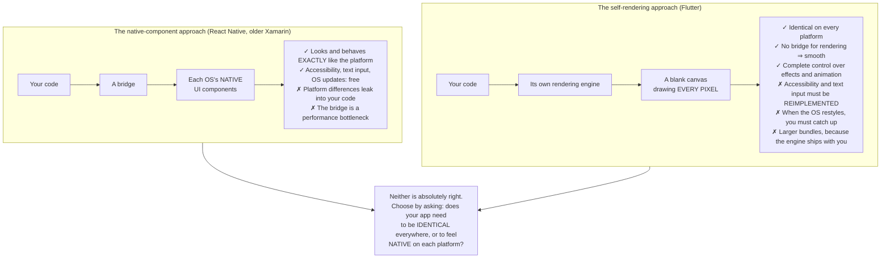
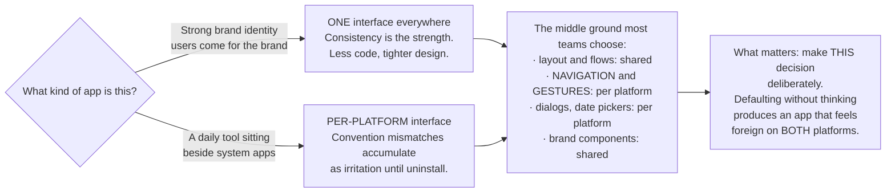
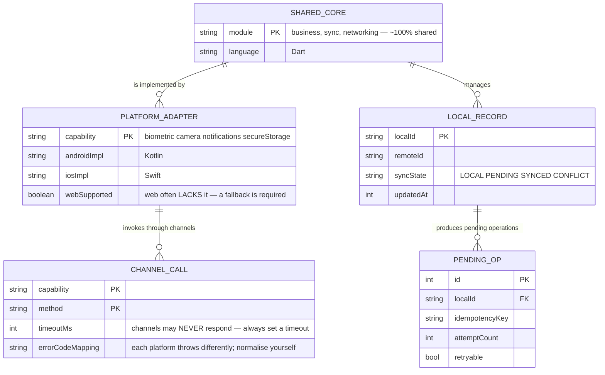

# Flutter Cross-platform App

You have just written [an Android app](/projects/android-native-app-kotlin) and [an iOS app](/projects/ios-native-app-swift) — twice, in two languages, with two UI toolkits, over the same business logic. The natural question: **is there a way to write it once?**

There is, and this project is about understanding **exactly** what you save. Because the answer is not "everything", and people who believe in "write once, run anywhere" tend to discover that in week ten.

The starting point is an unusual architectural decision: **Flutter does not use the operating system's UI components. It draws every pixel itself onto a blank canvas.**

Every advantage and every drawback flows from that sentence.

---

## What you will build

- One application running on Android, iOS and web from one codebase
- A fully shared business and synchronisation layer
- Bridges into native code for what Flutter cannot do
- A UI respecting **each** platform's conventions
- Build and release pipelines for three targets

---

## Drawing its own pixels: one decision, all the consequences



The consequence people rarely anticipate but meet earliest: **accessibility.** The OS screen reader knows how to read native buttons; it knows nothing about pixels Flutter painted. Flutter builds a parallel semantics tree to describe them to the OS. It works, but it means **you must think about accessibility deliberately** rather than receiving it for free.

---

## What you actually save: the honest numbers

Having built all three, this is the real picture:

| Area | Shareable | Notes |
|---|---|---|
| Data models, business rules | **~100%** | This is where the real value sits |
| Networking, parsing, synchronisation | **~95%** | Only secret storage differs |
| State management, navigation | **~90%** | The same patterns apply |
| Layout and UI components | **~70%** | The remainder is per-platform convention |
| Platform integration | **~20%** | Camera, biometrics, notifications, files |
| Build, signing, release | **0%** | Entirely separate, and equally laborious |

The important conclusion: **what you save is the easy part, and what remains is the hard part.** Writing a list screen twice is tedious but simple. Integrating biometrics correctly on both platforms still requires understanding both platforms — Flutter does not remove that requirement, it relocates it.

Put differently: **Flutter does not let you avoid learning the platforms. It lets you avoid writing everything twice.** Those are very different things.

---

## Platform channels: where the savings stop

When you need something Flutter does not provide, you write native code for each side and connect through a channel:

```dart
// The Dart side — shared across platforms
class BiometricAuth {
  static const _channel = MethodChannel('app/biometric');

  static Future<bool> authenticate(String reason) async {
    try {
      return await _channel.invokeMethod<bool>('authenticate', {'reason': reason})
          ?? false;
    } on PlatformException catch (e) {
      // MANDATORY handling: each platform throws different error codes, and
      // they are NOT normalised for you.
      if (e.code == 'NOT_ENROLLED') return false;
      rethrow;
    }
  }
}
```

Then comes **one implementation in Kotlin and one in Swift** — precisely the work you thought you had avoided. Three practical points:

- **Prefer existing packages, but audit them.** Flutter's package ecosystem is broad and wildly variable in quality. Before depending on one, check: last update, open issue count, and **whether it supports the platforms you need**.
- **Wrap every third-party package behind your own interface.** Abandoned packages are routine; swapping one out when it is scattered across 40 files is a week of work.
- **Channels are asynchronous and can fail.** Nothing guarantees the native side responds. Always set a timeout.

---

## The UI: identical everywhere, or native on each?

This is a product decision Flutter forces you to make explicitly — and many teams avoid it until users complain.

iOS users expect a back button at the top left and an edge swipe to go back. Android users expect the system back gesture to work. Dialogs, date pickers, scrollbars, overscroll behaviour — all differ.



---

## The shared architecture



`PLATFORM_ADAPTER.webSupported` is the column worth noticing: many native capabilities simply **do not exist** on the web, and if you target all three, each capability needs a fallback. Discovering that at design time is far cheaper than discovering it when the web build renders a blank screen.

---

## Traps worth recording

| Symptom | Actual cause | Fix |
|---|---|---|
| iOS users find the app "feels wrong" | One UI toolkit used for both | Per-platform navigation and gestures |
| Edge-swipe back does not work on iOS | Custom navigation ignoring the system gesture | Use the platform's own navigation components |
| The screen reader announces nothing | Flutter paints pixels the OS cannot interpret | Declare semantics for every component |
| A third-party package gets abandoned | Direct dependencies scattered through the code | Wrap behind your own interface |
| The web build shows a blank screen | A package supporting mobile only | Check platform support before depending |
| A channel call hangs forever | No timeout set | Always set a timeout and an error path |
| Platform-specific errors leaking into the UI | Native error codes never normalised | Map error codes in the adapter layer |
| Unexpectedly large app bundles | Shipping the engine plus unused assets | Trim assets, build per architecture |
| Jank when a screen first opens | Runtime compilation in debug mode | Measure performance in release builds, not debug |
| Long lists stuttering | Building the whole list at once | Use lazily-built list widgets |
| State lost on rotation or process death | Forgetting the platform constraints still apply | Apply the lessons from both native projects |
| Believing you avoided learning the platforms | Confusing "not writing twice" with "not needing to know" | You still need to understand both |

---

## When it is genuinely done

- [ ] One codebase runs on Android, iOS and web
- [ ] The business and sync layers contain **no** platform branching
- [ ] On iOS: left-edge swipe back **works** on every screen
- [ ] On Android: the system back gesture **works** on every screen
- [ ] Enable the screen reader on both: every control is **announced**
- [ ] Every third-party package sits behind an interface of your own
- [ ] A channel call the native side never answers: **times out** and shows an error rather than hanging
- [ ] The web build: every unsupported capability has a **fallback**, never a blank screen
- [ ] Measure performance in a **release** build: scrolling stays above 55 frames per second
- [ ] Airplane mode: behaves as the two native apps did
- [ ] Measure installed bundle size on both platforms and explain the number

---

## Where to go next

1. **Share code a different way.** Compare against Kotlin Multiplatform: share the business layer while keeping fully native interfaces. The opposite trade to Flutter.
2. **Desktop.** The same codebase on macOS, Windows and Linux — and a fresh set of conventions to respect.
3. **Automated testing across three platforms.** Build and test pipelines for three targets are their own problem — [DevOps Kubernetes Platform](/projects/devops-kubernetes-platform) touches that automation.
4. **A backend for synchronisation.** Still unsolved across all three mobile projects — [Event-Driven Microservices](/projects/event-driven-microservices-uber-like).
