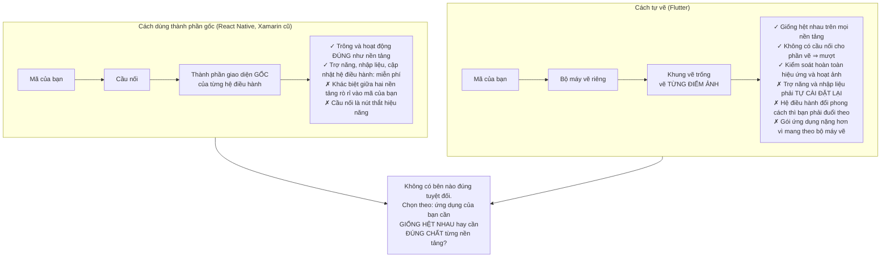
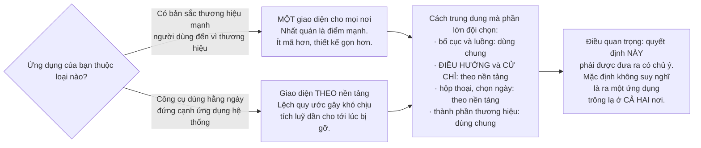
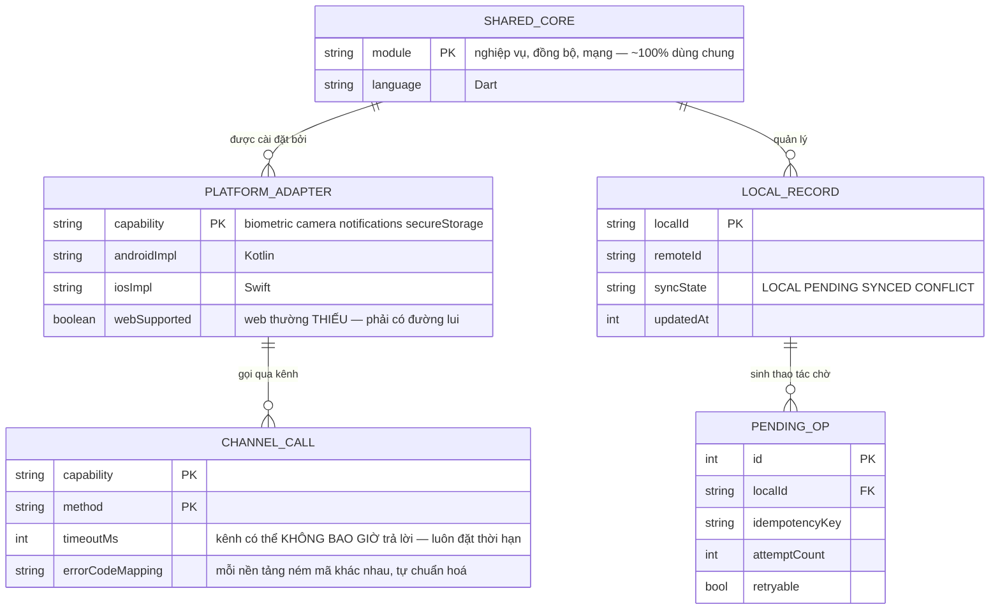

# Flutter Cross-platform App

Bạn vừa viết [ứng dụng Android](/projects/android-native-app-kotlin) và [ứng dụng iOS](/projects/ios-native-app-swift) — hai lần, hai ngôn ngữ, hai bộ giao diện, cùng một nghiệp vụ. Câu hỏi tự nhiên: **có cách nào viết một lần không?**

Có, và bài này về việc hiểu **chính xác** bạn tiết kiệm được gì. Vì câu trả lời không phải "mọi thứ", và những người tin vào "viết một lần chạy mọi nơi" thường phát hiện ra điều đó vào tuần thứ mười.

Điểm khởi đầu là một quyết định kiến trúc bất thường: **Flutter không dùng thành phần giao diện của hệ điều hành. Nó tự vẽ từng điểm ảnh lên một khung vẽ trống.**

Mọi ưu điểm và mọi nhược điểm đều chảy ra từ câu đó.

---

## Bạn sẽ dựng ra cái gì

- Một ứng dụng chạy trên Android, iOS và web từ cùng một mã nguồn
- Tầng nghiệp vụ và đồng bộ dùng chung hoàn toàn
- Cầu nối sang mã gốc cho những gì Flutter không làm được
- Giao diện tôn trọng quy ước của **từng** nền tảng
- Đường ống dựng và phát hành cho ba đích đến

---

## Tự vẽ điểm ảnh: một quyết định, mọi hệ quả



Hệ quả ít người nghĩ tới nhưng gặp sớm nhất: **trợ năng.** Trình đọc màn hình của hệ điều hành biết đọc nút bấm gốc; nó không biết gì về các điểm ảnh Flutter vẽ ra. Flutter phải xây một cây ngữ nghĩa song song để mô tả cho hệ điều hành. Nó hoạt động, nhưng nghĩa là **bạn phải nghĩ tới trợ năng một cách chủ động** thay vì được tặng miễn phí.

---

## Bạn tiết kiệm được gì: con số trung thực

Sau khi làm cả ba, đây là bức tranh thật:

| Phần | Dùng chung được | Ghi chú |
|---|---|---|
| Mô hình dữ liệu, quy tắc nghiệp vụ | **~100%** | Đây là nơi giá trị thật nằm |
| Gọi mạng, phân tích dữ liệu, đồng bộ | **~95%** | Chỉ khác ở chỗ lưu trữ bí mật |
| Quản lý trạng thái, điều hướng | **~90%** | Mẫu hình giống nhau |
| Bố cục và thành phần giao diện | **~70%** | Còn lại là quy ước riêng từng nền tảng |
| Tích hợp nền tảng | **~20%** | Camera, sinh trắc học, thông báo, tệp |
| Dựng, ký, phát hành | **0%** | Hoàn toàn tách biệt, và tốn công như nhau |

Điều quan trọng rút ra: **phần bạn tiết kiệm được là phần dễ, phần còn lại là phần khó.** Viết lại một danh sách bằng hai ngôn ngữ là công việc buồn tẻ nhưng đơn giản. Còn tích hợp sinh trắc học đúng cách trên cả hai nền tảng thì vẫn cần hiểu cả hai nền tảng — Flutter không xoá được yêu cầu đó, nó chỉ dời chỗ.

Nói cách khác: **Flutter không cho phép bạn khỏi phải học nền tảng. Nó cho phép bạn không phải viết mọi thứ hai lần.** Hai điều đó rất khác nhau.

---

## Kênh nền tảng: nơi khoản tiết kiệm dừng lại

Khi cần thứ Flutter không có sẵn, bạn viết mã gốc cho từng bên và nối bằng một kênh:

```dart
// Phía Dart — chung cho mọi nền tảng
class BiometricAuth {
  static const _channel = MethodChannel('app/biometric');

  static Future<bool> authenticate(String reason) async {
    try {
      return await _channel.invokeMethod<bool>('authenticate', {'reason': reason})
          ?? false;
    } on PlatformException catch (e) {
      // BẮT BUỘC xử lý: mỗi nền tảng ném mã lỗi khác nhau, và chúng
      // KHÔNG được chuẩn hoá giúp bạn.
      if (e.code == 'NOT_ENROLLED') return false;
      rethrow;
    }
  }
}
```

Sau đó là **một bản cài đặt cho Kotlin, một bản cho Swift** — tức chính là công việc bạn tưởng đã tránh được. Ba điều thực dụng:

- **Ưu tiên gói có sẵn, nhưng kiểm chất lượng.** Hệ sinh thái gói của Flutter rất rộng và chất lượng rất chênh. Trước khi phụ thuộc, xem: lần cập nhật gần nhất, số vấn đề đang mở, và **có hỗ trợ nền tảng bạn cần không**.
- **Bọc mọi gói bên thứ ba sau giao diện của riêng bạn.** Gói bị bỏ rơi là chuyện thường; đổi gói khi nó nằm rải rác 40 chỗ trong mã là một tuần công.
- **Kênh là bất đồng bộ và có thể thất bại.** Không có gì đảm bảo phía gốc trả lời. Luôn có thời hạn chờ.

---

## Giao diện: giống hệt nhau, hay đúng chất từng nơi?

Đây là quyết định sản phẩm mà Flutter buộc bạn phải đưa ra một cách tường minh — và nhiều đội né tránh nó cho tới khi người dùng phàn nàn.

Người dùng iOS mong nút quay lại ở góc trên trái và vuốt từ mép để lùi. Người dùng Android mong nút quay lại của hệ thống hoạt động. Hộp thoại, ngày tháng, thanh cuộn, độ nảy khi cuộn quá — tất cả đều khác.



---

## Kiến trúc dùng chung



`PLATFORM_ADAPTER.webSupported` là cột đáng để ý: rất nhiều khả năng gốc **không có** trên web, và nếu bạn nhắm cả ba đích thì mỗi khả năng cần một đường lui. Phát hiện điều này lúc thiết kế rẻ hơn nhiều so với phát hiện lúc bản web trắng màn hình.

---

## Những cái bẫy đã được ghi lại

| Triệu chứng | Nguyên nhân thật | Cách sửa |
|---|---|---|
| Người dùng iOS thấy ứng dụng "lạ" | Dùng một bộ giao diện cho cả hai | Điều hướng và cử chỉ theo nền tảng |
| Vuốt mép để lùi không hoạt động trên iOS | Điều hướng tuỳ biến bỏ qua cử chỉ hệ thống | Dùng đúng thành phần điều hướng của nền tảng |
| Trình đọc màn hình không đọc được gì | Flutter tự vẽ, hệ điều hành không hiểu | Khai báo ngữ nghĩa cho từng thành phần |
| Một gói bên thứ ba bị bỏ rơi | Phụ thuộc trực tiếp rải khắp mã | Bọc sau giao diện của riêng mình |
| Bản web trắng màn hình | Gói chỉ hỗ trợ di động | Kiểm hỗ trợ nền tảng trước khi phụ thuộc |
| Gọi kênh treo vĩnh viễn | Không đặt thời hạn chờ | Luôn có thời hạn và đường xử lý lỗi |
| Lỗi khác nhau giữa hai nền tảng lọt lên giao diện | Mã lỗi gốc không được chuẩn hoá | Ánh xạ mã lỗi ở tầng bộ chuyển đổi |
| Gói ứng dụng nặng bất thường | Mang theo bộ máy vẽ và tài nguyên thừa | Cắt bớt tài nguyên, dựng theo kiến trúc riêng |
| Giật khi mở màn hình lần đầu | Biên dịch lúc chạy ở chế độ gỡ lỗi | Đo hiệu năng ở bản dựng phát hành, không phải bản gỡ lỗi |
| Cuộn danh sách dài bị khựng | Dựng toàn bộ danh sách một lúc | Dùng danh sách dựng theo nhu cầu |
| Trạng thái mất khi xoay hoặc bị giết tiến trình | Quên rằng ràng buộc nền tảng vẫn còn nguyên | Áp dụng đúng bài học từ hai dự án gốc |
| Tưởng đã tránh được việc học nền tảng | Nhầm "không viết hai lần" với "không cần biết" | Vẫn phải hiểu cả hai nền tảng |

---

## Khi nào coi như xong

- [ ] Cùng một mã nguồn chạy được trên Android, iOS và web
- [ ] Tầng nghiệp vụ và đồng bộ: **không** có nhánh rẽ theo nền tảng
- [ ] Trên iOS: vuốt từ mép trái để lùi **hoạt động** ở mọi màn hình
- [ ] Trên Android: nút quay lại của hệ thống **hoạt động** ở mọi màn hình
- [ ] Bật trình đọc màn hình trên cả hai: mọi điều khiển đều **đọc được**
- [ ] Mọi gói bên thứ ba đều nằm sau một giao diện của riêng bạn
- [ ] Gọi kênh mà phía gốc không trả lời: **hết thời hạn** và hiện lỗi, không treo
- [ ] Bản web: mọi khả năng không hỗ trợ đều có **đường lui**, không màn hình trắng
- [ ] Đo hiệu năng ở bản dựng **phát hành**: cuộn giữ trên 55 khung hình mỗi giây
- [ ] Chế độ máy bay: hoạt động như hai ứng dụng gốc đã làm
- [ ] Đo kích thước gói cài đặt trên cả hai nền tảng và giải thích được con số

---

## Bước tiếp theo

1. **Chia sẻ mã theo cách khác.** So với Kotlin Multiplatform: dùng chung tầng nghiệp vụ nhưng giữ giao diện gốc hoàn toàn. Đánh đổi ngược lại với Flutter.
2. **Máy tính để bàn.** Cùng mã nguồn chạy trên macOS, Windows, Linux — và một loạt quy ước mới phải tôn trọng.
3. **Kiểm thử tự động ba nền tảng.** Đường ống dựng và kiểm cho ba đích là bài toán riêng — [DevOps Kubernetes Platform](/projects/devops-kubernetes-platform) chạm vào phần tự động hoá đó.
4. **Máy chủ cho đồng bộ.** Vẫn là phần chưa giải quyết ở cả ba dự án di động — [Event-Driven Microservices](/projects/event-driven-microservices-uber-like).
