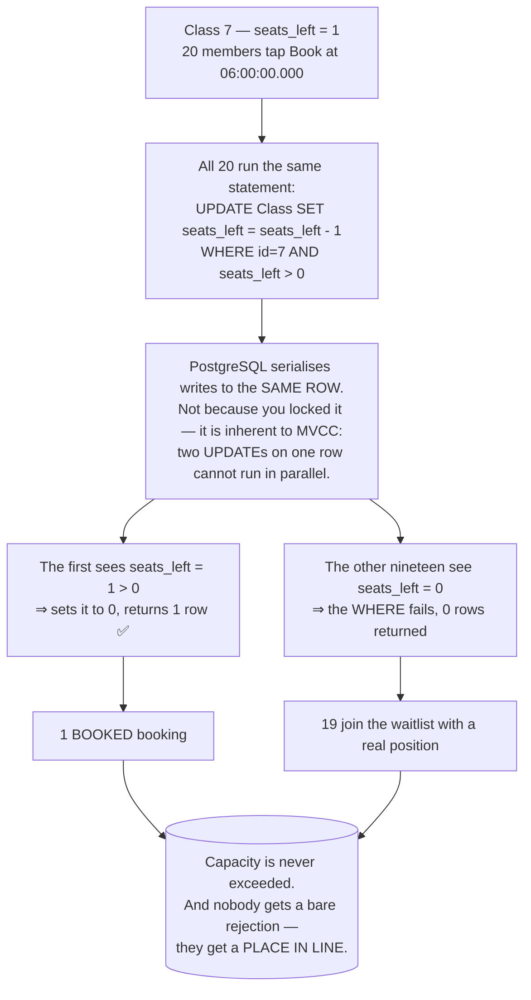
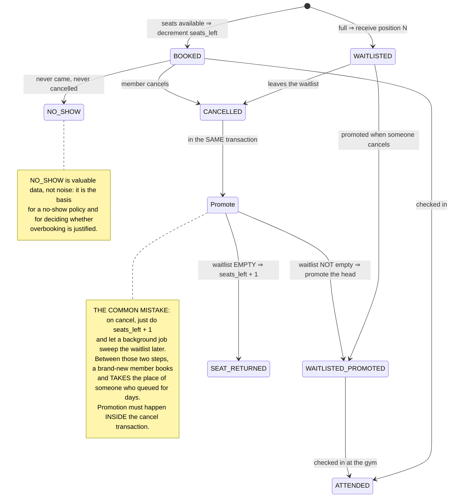

# Gym Membership & Classes App

The six previous **Semester 6** projects all asked *"who gets this resource?"* and the resource was always **one thing**: one slot, one book, one room, one ticket, one attempt, one seat.

A yoga class holds **twenty**.

That sounds like changing a number, but it changes the whole solution. With one place you ask *"is it free?"*. With twenty you ask *"how many are left?"* — and the `SELECT COUNT(*)` that answers that question **cannot be guarded atomically**. Twenty people all read "19 booked" and all twenty book.

It is also the semester's first mobile project, built in **Expo React Native** — which adds a question the web never had to answer: **where do you put the login token on a device that can be lost, borrowed, or already rooted?**

---

## What you will build

- An **Expo React Native** app (expo-router) running on both iOS and Android
- A **Node.js + Express + PostgreSQL** REST API with **JWT** authentication
- Tokens stored in **`expo-secure-store`** (iOS Keychain / Android Keystore), **not** `AsyncStorage`
- Memberships, a class timetable, booking, cancelling, and a **waitlist that auto-promotes** on cancellation
- A booking core that **never exceeds capacity**, proven by a concurrency test
- The API deployed with **Docker**, the app built with **EAS**

> 📚 The step-by-step course: [**INT607 — Gym Membership & Classes App**](/courses/gym-membership-app) on the Academy (9 sections, 22 lessons).

---

## `COUNT(*)` is the right answer to the wrong question

```js
// (A) READ: how many are booked into this class?
const count = await prisma.booking.count({ where: { classId, status: 'BOOKED' } });
if (count >= gymClass.capacity)
  throw new ConflictError('Class is full');
// (B) WRITE — but 20 requests all read count=19 before any of them inserts!
await prisma.booking.create({ data: { classId, memberId, status: 'BOOKED' } });
```

The 6am class opens, one place is left, twenty members tap at once:

```
t1..t20    (A) all 20 read booked = 19  (< 20)  ✅ all pass the check
t21..t40   (B) all 20 INSERT
Result: 39 people in a 20-person class ✗
```

What differs from the earlier projects: here there is **nothing to put a constraint on**. `UNIQUE(classId, memberId)` stops one person booking twice, but it does **nothing** about the 21st person. Capacity is an invariant about **quantity**, and `UNIQUE` can only speak about **duplication**.

---

## An atomic counter decrement

The fix is to keep a `seats_left` column on the class and **decrement it with one conditional `UPDATE`**:

```js
// Raw SQL — atomic: the database evaluates the WHERE and the subtraction as ONE step
const updated = await prisma.$executeRaw`
  UPDATE "Class" SET seats_left = seats_left - 1
  WHERE id = ${classId} AND seats_left > 0`;   // returns rows affected

if (updated === 1) {
  await prisma.booking.create({ data: { classId, memberId, status: 'BOOKED' } });
  return { status: 'BOOKED' };
}
// seats_left was already 0 ⇒ 0 rows updated ⇒ offer the waitlist
return joinWaitlist(classId, memberId);        // → 202 Accepted, position N
```



**This is the third appearance of one idea this semester**, with only the predicate changing:

| Project | Predicate in the `WHERE` | Invariant protected |
|---|---|---|
| [Clinic Appointment](/projects/clinic-appointment-booking-system) | `AND version = 0` | Nobody overwrites a stale read |
| [Helpdesk Ticketing](/projects/helpdesk-ticketing-api) | `AND status = 'OPEN'` | Only legal state transitions |
| **Gym (this one)** | `AND seats_left > 0` | Capacity is never exceeded |
| [E-Commerce](/projects/e-commerce-platform-multi-vendor) | `AND stock >= qty` | Never oversell inventory |

Once you see those four rows as **one pattern**, you have learned the hardest part of Semester 6.

### The price: a little denormalisation

`seats_left` is **derivable** data (`capacity - COUNT(bookings)`) that we choose to store. That violates the "do not store what you can compute" rule [Library Management System](/projects/library-management-system) itself taught.

The violation is **deliberate**, and the justification is strong:

- `COUNT(*)` scans rows, and **there is no way to guard it atomically** together with the write that follows
- `seats_left` decrements in `O(1)` with **one** conditional statement
- The invariant matters more than the elegance

But once you denormalise you owe the system a **drift detector**: a reconciliation query that periodically compares `seats_left` against `capacity - COUNT(*)` and alerts on a mismatch. Without it, one bug in the cancellation path quietly corrupts your numbers and nobody notices.

---

## The waitlist: the part most people get wrong

Booking is the easy half. Cancelling is where the design shows, because **a cancellation has to do three things at once**:



Written out, all three inside one transaction:

```js
await prisma.$transaction(async (tx) => {
  // 1. Close the canceller's booking
  await tx.booking.update({ where: { id: bookingId }, data: { status: 'CANCELLED' } });

  // 2. Promote the head of the waitlist — atomically, with nobody cutting in.
  //    FOR UPDATE SKIP LOCKED: if two cancellations happen at once, each
  //    promotes a DIFFERENT person instead of both picking the same one.
  const [next] = await tx.$queryRaw`
    SELECT id FROM "Booking"
     WHERE class_id = ${classId} AND status = 'WAITLISTED'
     ORDER BY created_at
     FOR UPDATE SKIP LOCKED
     LIMIT 1`;

  if (next) {
    await tx.booking.update({ where: { id: next.id }, data: { status: 'BOOKED' } });
    await notify(next.id);            // the seat changes hands, seats_left does NOT move
  } else {
    // 3. Nobody waiting ⇒ only now does the seat go back to the pool
    await tx.$executeRaw`UPDATE "Class" SET seats_left = seats_left + 1 WHERE id = ${classId}`;
  }
});
```

The easiest detail to miss is in that `if`: **when you promote from the waitlist, `seats_left` does not change.** The seat merely changes owner. Increment it as well and you have invented a place that does not exist, and the 20-person class becomes 21.

---

## On a phone: where does the token live?

The web keeps tokens in an `httpOnly` cookie and lets the browser handle the hard part. Mobile has no `httpOnly` cookie, so you must choose:

| Storage | Who can read it | Use it for |
|---|---|---|
| An in-memory variable | Nobody, but it dies with the app | Short-lived access tokens |
| `AsyncStorage` | **Other apps on a rooted device, and every backup** | ❌ Never for tokens |
| `expo-secure-store` | Only this app, protected by the OS Keychain/Keystore | ✅ Refresh tokens |

```js
import * as SecureStore from 'expo-secure-store';

// Keychain (iOS) / EncryptedSharedPreferences (Android)
await SecureStore.setItemAsync('refresh_token', token, {
  keychainAccessible: SecureStore.WHEN_UNLOCKED_THIS_DEVICE_ONLY,
  // ...THIS_DEVICE_ONLY = never rides an iCloud backup onto another phone
});
```

Two more things a mobile app must handle that the web does not:

- **The network is a state, not an incident.** Members stand in a gym basement. The timetable must render from cache; the **Book button must not** be tappable while offline — this is a contended action and cannot be queued for later sync the way a note can. That is the important difference from the offline-first pattern in [Android Native App](/projects/android-native-app-kotlin).
- **Buttons must disable on the first tap.** On the web a double click is rare. On a phone, tapping twice because it felt laggy is **routine** — and each tap is another booking request.

---

## Traps worth writing down

| Symptom | Actual cause | Fix |
|---|---|---|
| 39 people in a 20-person class | `COUNT(*)` then `INSERT` — all 20 read the stale count | `UPDATE ... WHERE seats_left > 0` |
| `UNIQUE` does not help | `UNIQUE` speaks about duplication, not quantity | A conditional counter decrement |
| A new member cuts ahead of a three-day queue | Cancel adds a seat and a job promotes later | Promote **inside** the cancel transaction |
| A 20-person class holds 21 | Promoting from the waitlist and also incrementing `seats_left` | Promotion **transfers** the seat, it does not add one |
| Two simultaneous cancellations promote one person twice | `SELECT ... LIMIT 1` without a lock | `FOR UPDATE SKIP LOCKED` |
| `seats_left` drifts over time | Denormalised with no reconciliation | A periodic reconciliation query with alerting |
| Tokens readable on a rooted device | Stored in `AsyncStorage` | `expo-secure-store` |
| Still signed in after restoring an old backup | The token rode an iCloud backup | `WHEN_UNLOCKED_THIS_DEVICE_ONLY` |
| One tap creates two bookings | The button was not disabled while in flight | Disable on tap + an idempotency key |
| Booking offline then failing at sync | Contended actions were allowed to queue | Block contended actions while offline |
| Empty spots because members do not show | `NO_SHOW` never recorded | Check-in, no-show stats, consider overbooking |
| An expired membership can still book | Only the UI checked it | Validate membership in the service layer |

---

## Done means

- [ ] 50 simultaneous requests for a class with **1** place: exactly **1** `BOOKED`, **49** `WAITLISTED` with positions
- [ ] `SELECT COUNT(*) WHERE status='BOOKED'` **never** exceeds `capacity`, on every run
- [ ] Cancel with a non-empty waitlist: the **first** person is promoted and `seats_left` does **not** move
- [ ] Cancel with an empty waitlist: `seats_left` increases by exactly **1**
- [ ] Two simultaneous cancellations: **two different people** are promoted, never the same one twice
- [ ] Reconciliation after 1,000 random operations: `seats_left` **matches** `capacity - COUNT(*)`
- [ ] Double-tap Book quickly on a real device: exactly **one** booking
- [ ] Turn on airplane mode: the timetable still renders, the Book button is **disabled with an explanation**
- [ ] Inspect `AsyncStorage` with a debugging tool: **no** token anywhere
- [ ] With an expired membership: `POST /bookings` returns `403` regardless of what the UI allows
- [ ] The EAS build runs on a real iOS **and** a real Android device

---

## Where to go next

1. **When there are many equivalent resources instead of a counter.** [Restaurant Reservation App](/projects/restaurant-reservation-app) must pick **some** free table out of many — `FOR UPDATE SKIP LOCKED` moves to the leading role.
2. **When contention outgrows Postgres.** [Event Ticketing System](/projects/event-ticketing-system) moves the check into Redis.
3. **When the app must work fully offline.** [Android Native App (Kotlin)](/projects/android-native-app-kotlin) goes deep on two-way sync and process death.
4. **When you want to compare cross-platform approaches.** [Flutter Cross-platform App](/projects/flutter-cross-platform-app) solves the same problem with an entirely different toolkit.
