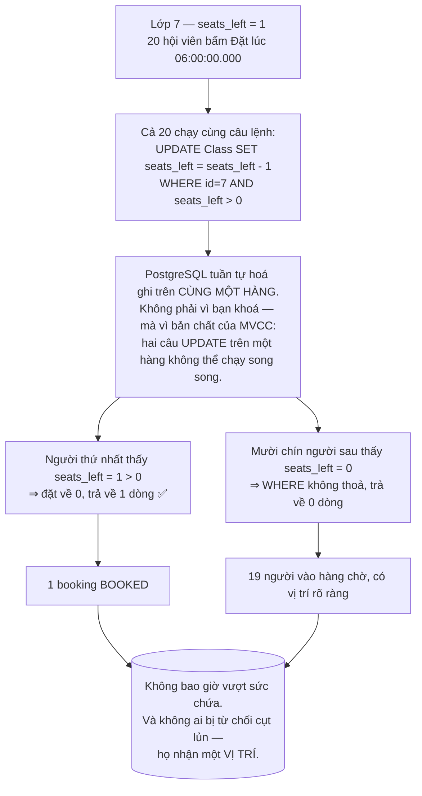
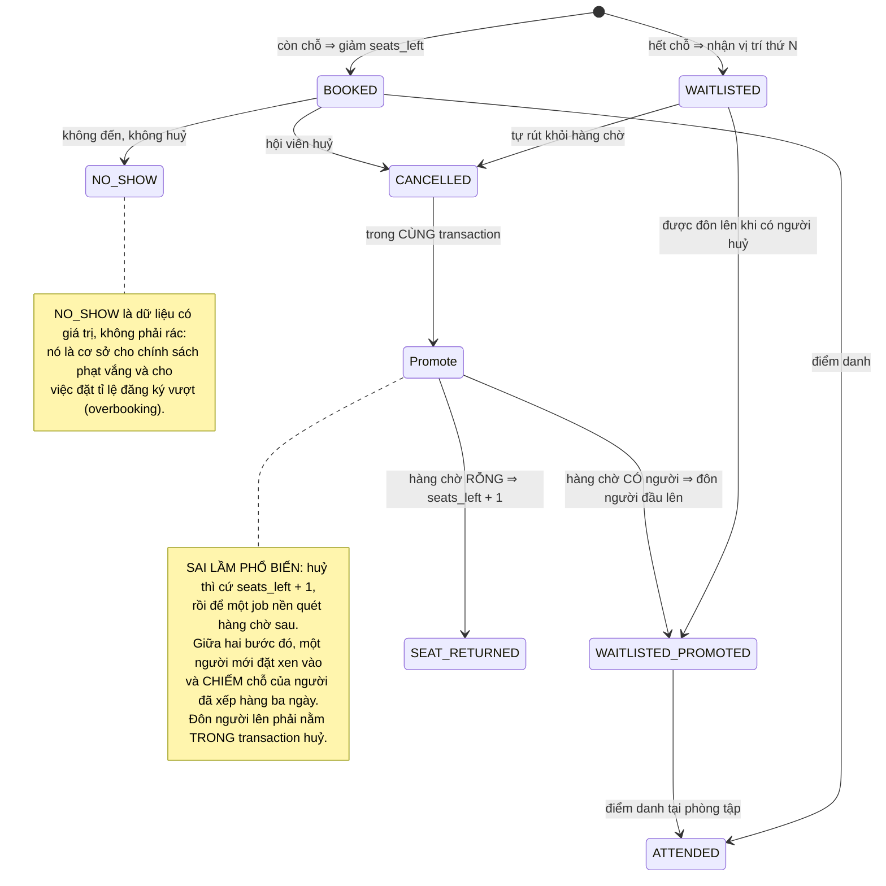

# Gym Membership & Classes App

Sáu đồ án trước của **Kỳ 6** đều hỏi *"ai được lấy tài nguyên này?"* và tài nguyên luôn là **một cái**: một khung giờ, một cuốn sách, một căn phòng, một ticket, một lượt làm bài, một chiếc ghế.

Lớp yoga có **hai mươi chỗ**.

Nghe như chỉ là đổi con số, nhưng nó đổi cả lời giải. Với một chỗ, bạn hỏi *"còn trống không?"*. Với hai mươi chỗ, bạn hỏi *"còn bao nhiêu?"* — và câu `SELECT COUNT(*)` trả lời câu hỏi đó **không thể được bảo vệ nguyên tử**. Hai mươi người cùng đọc thấy "đã có 19 người" rồi cả hai mươi cùng đặt chỗ.

Đây cũng là đồ án di động đầu tiên của kỳ, viết bằng **Expo React Native** — nên nó thêm một câu hỏi mà web không phải trả lời: **token đăng nhập cất ở đâu trên một thiết bị có thể bị mất, bị mượn, hoặc đã bị root?**

---

## Bạn sẽ dựng ra cái gì

- Ứng dụng di động **Expo React Native** (expo-router), chạy trên cả iOS và Android
- REST API **Node.js + Express + PostgreSQL**, xác thực **JWT**
- Token lưu trong **`expo-secure-store`** (Keychain của iOS / Keystore của Android), **không** phải `AsyncStorage`
- Gói tập, lịch lớp, đặt lớp, huỷ lớp, và **hàng chờ tự đôn lên** khi có người huỷ
- Lõi đặt lớp **không bao giờ vượt sức chứa**, chứng minh bằng test đồng thời
- Triển khai API bằng **Docker**, build ứng dụng bằng **EAS**

> 📚 Bản dạy từng bước: [**INT607 — Gym Membership & Classes App**](/courses/gym-membership-app) trên Academy (9 mục, 22 bài).

---

## `COUNT(*)` là câu trả lời đúng cho một câu hỏi sai

```js
// (A) ĐỌC: lớp này đã có bao nhiêu người?
const count = await prisma.booking.count({ where: { classId, status: 'BOOKED' } });
if (count >= gymClass.capacity)
  throw new ConflictError('Lớp đã đầy');
// (B) GHI — nhưng 20 request đều đọc được count=19 trước khi ai kịp ghi!
await prisma.booking.create({ data: { classId, memberId, status: 'BOOKED' } });
```

Lớp 6 giờ sáng mở đăng ký, còn đúng một chỗ, hai mươi hội viên bấm cùng lúc:

```
t1..t20    (A) cả 20 đọc được booked = 19  (< 20)  ✅ đều qua phép kiểm
t21..t40   (B) cả 20 cùng INSERT
Kết quả: 39 người trong một lớp 20 chỗ ✗
```

Điểm khác biệt so với các đồ án trước: ở đây **không có gì để đặt ràng buộc lên**. `UNIQUE(classId, memberId)` ngăn được một người đặt hai lần, nhưng nó **không** ngăn được người thứ 21. Sức chứa là một bất biến về **số lượng**, và `UNIQUE` chỉ nói được về **sự trùng lặp**.

---

## Bộ đếm giảm nguyên tử

Lời giải là thêm một cột `seats_left` vào bảng lớp và **giảm nó bằng một câu `UPDATE` có điều kiện**:

```js
// SQL thô — nguyên tử: cơ sở dữ liệu đánh giá WHERE và phép trừ như MỘT bước
const updated = await prisma.$executeRaw`
  UPDATE "Class" SET seats_left = seats_left - 1
  WHERE id = ${classId} AND seats_left > 0`;   // trả về số dòng bị sửa

if (updated === 1) {
  await prisma.booking.create({ data: { classId, memberId, status: 'BOOKED' } });
  return { status: 'BOOKED' };
}
// seats_left đã là 0 ⇒ 0 dòng bị sửa ⇒ mời vào hàng chờ
return joinWaitlist(classId, memberId);        // → 202 Accepted, vị trí thứ N
```



**Đây là lần thứ ba cùng một ý tưởng xuất hiện trong kỳ**, chỉ đổi vị từ:

| Đồ án | Vị từ trong `WHERE` | Bất biến được bảo vệ |
|---|---|---|
| [Clinic Appointment](/projects/clinic-appointment-booking-system) | `AND version = 0` | Không ai ghi đè lên bản đọc cũ |
| [Helpdesk Ticketing](/projects/helpdesk-ticketing-api) | `AND status = 'OPEN'` | Bước chuyển trạng thái hợp lệ |
| **Gym (bài này)** | `AND seats_left > 0` | Không vượt sức chứa |
| [E-Commerce](/projects/e-commerce-platform-multi-vendor) | `AND stock >= qty` | Không bán quá tồn kho |

Khi bạn nhận ra bốn dòng này là **một mẫu hình**, bạn đã học xong phần khó nhất của Kỳ 6.

### Cái giá phải trả: một chút phi chuẩn hoá

`seats_left` là dữ liệu **suy ra được** (`capacity - COUNT(bookings)`) mà ta lại đem lưu. Điều đó vi phạm nguyên tắc "đừng lưu thứ tính được" mà chính [Library Management System](/projects/library-management-system) đã dạy.

Vi phạm **có chủ ý**, và đây là lý do đủ mạnh:

- `COUNT(*)` phải quét hàng, và **không có cách nào bảo vệ nó nguyên tử** cùng với lệnh ghi theo sau
- `seats_left` giảm được trong `O(1)` bằng **một** câu lệnh có điều kiện
- Bất biến quan trọng hơn sự thanh lịch

Nhưng đã phi chuẩn hoá thì phải có **cách phát hiện lệch**: một truy vấn đối soát chạy định kỳ, so `seats_left` với `capacity - COUNT(*)` và cảnh báo nếu khác. Không có nó, một bug trong luồng huỷ lớp sẽ âm thầm làm hỏng số liệu và không ai biết.

---

## Hàng chờ: phần mà đa số làm hỏng

Đặt chỗ là phần dễ. Huỷ mới là phần lộ ra thiết kế, vì **huỷ phải làm ba việc cùng lúc**:



Viết ra thành mã, cả ba việc trong một transaction:

```js
await prisma.$transaction(async (tx) => {
  // 1. Đóng chỗ của người huỷ
  await tx.booking.update({ where: { id: bookingId }, data: { status: 'CANCELLED' } });

  // 2. Đôn người đầu hàng chờ lên — nguyên tử, không để ai chen ngang.
  //    FOR UPDATE SKIP LOCKED: nếu có hai lượt huỷ đồng thời, mỗi lượt
  //    đôn một người KHÁC NHAU thay vì cùng chọn một người.
  const [next] = await tx.$queryRaw`
    SELECT id FROM "Booking"
     WHERE class_id = ${classId} AND status = 'WAITLISTED'
     ORDER BY created_at
     FOR UPDATE SKIP LOCKED
     LIMIT 1`;

  if (next) {
    await tx.booking.update({ where: { id: next.id }, data: { status: 'BOOKED' } });
    await notify(next.id);            // ghế đổi chủ, seats_left KHÔNG đổi
  } else {
    // 3. Không ai chờ ⇒ mới trả ghế về kho
    await tx.$executeRaw`UPDATE "Class" SET seats_left = seats_left + 1 WHERE id = ${classId}`;
  }
});
```

Chi tiết dễ bỏ nhất nằm ở nhánh `if`: **khi đôn người từ hàng chờ lên, `seats_left` không đổi.** Ghế chỉ đổi chủ. Cộng thêm một là bạn vừa tạo ra một chỗ trống không có thật, và lớp 20 người sẽ thành 21.

---

## Trên điện thoại: token cất ở đâu

Web cất token trong cookie `httpOnly` — trình duyệt lo phần khó. Trên di động không có cookie `httpOnly`, và bạn phải tự chọn:

| Nơi lưu | Ai đọc được | Dùng cho |
|---|---|---|
| Biến trong bộ nhớ | Không ai, nhưng mất khi tắt app | Token truy cập ngắn hạn |
| `AsyncStorage` | **Ứng dụng khác trên máy đã root, và mọi bản sao lưu** | ❌ Không bao giờ dùng cho token |
| `expo-secure-store` | Chỉ ứng dụng này, được Keychain/Keystore của hệ điều hành bảo vệ | ✅ Refresh token |

```js
import * as SecureStore from 'expo-secure-store';

// Keychain (iOS) / EncryptedSharedPreferences (Android)
await SecureStore.setItemAsync('refresh_token', token, {
  keychainAccessible: SecureStore.WHEN_UNLOCKED_THIS_DEVICE_ONLY,
  // ...THIS_DEVICE_ONLY = không đi theo bản sao lưu iCloud sang máy khác
});
```

Hai điều khác mà một app di động phải làm còn web thì không:

- **Mạng là trạng thái, không phải sự cố.** Người dùng ở tầng hầm phòng tập. Lịch lớp phải đọc được từ bộ nhớ đệm; **nút Đặt lớp** thì không được cho bấm khi ngoại tuyến — vì đây là thao tác tranh chấp, không thể xếp hàng chờ đồng bộ như một ghi chú. Đây là chỗ khác biệt quan trọng so với mẫu ưu tiên ngoại tuyến ở [Android Native App](/projects/android-native-app-kotlin).
- **Nút bấm phải khoá ngay khi bấm.** Trên web, người dùng bấm hai lần là hiếm. Trên di động, chạm hai lần vì tưởng máy lag là **chuyện thường ngày** — và mỗi lần chạm là một request đặt lớp.

---

## Những cái bẫy đã được ghi lại

| Triệu chứng | Nguyên nhân thật | Cách sửa |
|---|---|---|
| 39 người trong lớp 20 chỗ | `COUNT(*)` rồi `INSERT` — cả 20 đọc số cũ | `UPDATE ... WHERE seats_left > 0` |
| `UNIQUE` không cứu được | `UNIQUE` nói về trùng lặp, không nói về số lượng | Bộ đếm giảm có điều kiện |
| Người mới chen trước người xếp hàng ba ngày | Huỷ thì cộng ghế, job nền đôn hàng chờ sau | Đôn người lên **trong** transaction huỷ |
| Lớp 20 chỗ thành 21 người | Đôn người từ hàng chờ mà vẫn cộng `seats_left` | Đôn lên thì ghế **đổi chủ**, không cộng |
| Hai lượt huỷ đồng thời đôn cùng một người | `SELECT ... LIMIT 1` không khoá | `FOR UPDATE SKIP LOCKED` |
| `seats_left` lệch dần theo thời gian | Phi chuẩn hoá mà không đối soát | Truy vấn đối soát định kỳ, có cảnh báo |
| Token bị đọc trên máy đã root | Lưu trong `AsyncStorage` | `expo-secure-store` |
| Đăng nhập lại sau khi khôi phục máy cũ | Token đi theo bản sao lưu iCloud | `WHEN_UNLOCKED_THIS_DEVICE_ONLY` |
| Một cú chạm tạo hai booking | Không khoá nút lúc đang gửi | Vô hiệu hoá nút ngay khi bấm + khoá lặp lại |
| Đặt lớp khi mất mạng rồi lỗi lúc đồng bộ | Cho xếp hàng thao tác tranh chấp | Chặn thao tác tranh chấp khi ngoại tuyến |
| Nhiều người vắng, lớp lãng phí | Không ghi nhận `NO_SHOW` | Điểm danh, thống kê vắng, cân nhắc đăng ký vượt |
| Gói tập hết hạn vẫn đặt được lớp | Chỉ kiểm ở giao diện | Kiểm hiệu lực gói ở tầng service |

---

## Khi nào coi như xong

- [ ] 50 request đồng thời vào lớp còn **1** chỗ: đúng **1** `BOOKED`, **49** `WAITLISTED` có vị trí
- [ ] `SELECT COUNT(*) WHERE status='BOOKED'` **không bao giờ** vượt `capacity`, ở mọi lần chạy
- [ ] Huỷ một chỗ khi hàng chờ có người: người **đầu tiên** được đôn lên, `seats_left` **không đổi**
- [ ] Huỷ một chỗ khi hàng chờ rỗng: `seats_left` tăng đúng **1**
- [ ] Hai lượt huỷ đồng thời: đôn lên **hai người khác nhau**, không phải cùng một người
- [ ] Truy vấn đối soát sau 1.000 thao tác ngẫu nhiên: `seats_left` **khớp** `capacity - COUNT(*)`
- [ ] Chạm nút Đặt hai lần thật nhanh trên máy thật: đúng **một** booking
- [ ] Bật chế độ máy bay: xem được lịch lớp, nút Đặt **bị vô hiệu hoá có giải thích**
- [ ] Đọc `AsyncStorage` bằng công cụ gỡ lỗi: **không** thấy token nào
- [ ] Gói tập hết hạn: `POST /bookings` trả `403` dù giao diện có cho bấm hay không
- [ ] Build EAS chạy được trên máy thật iOS **và** Android

---

## Bước tiếp theo

1. **Khi có nhiều tài nguyên tương đương thay vì một bộ đếm.** [Restaurant Reservation App](/projects/restaurant-reservation-app) phải chọn **một bàn nào đó** trong nhiều bàn trống — `FOR UPDATE SKIP LOCKED` ở vai trò chính.
2. **Khi tranh chấp vượt quá sức Postgres.** [Event Ticketing System](/projects/event-ticketing-system) chuyển phép kiểm sang Redis.
3. **Khi ứng dụng phải dùng được hoàn toàn khi ngoại tuyến.** [Android Native App (Kotlin)](/projects/android-native-app-kotlin) đi sâu vào đồng bộ hai chiều và cái chết của tiến trình.
4. **Khi cần so sánh cách tiếp cận đa nền tảng.** [Flutter Cross-platform App](/projects/flutter-cross-platform-app) giải cùng bài toán bằng một bộ công cụ khác hẳn.
