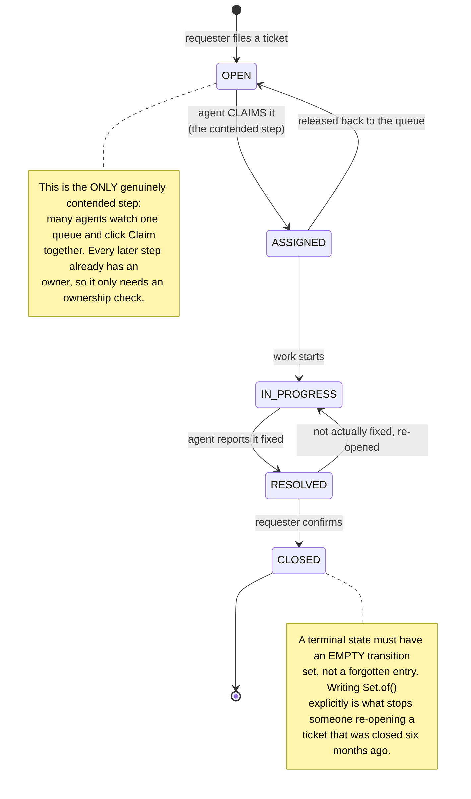
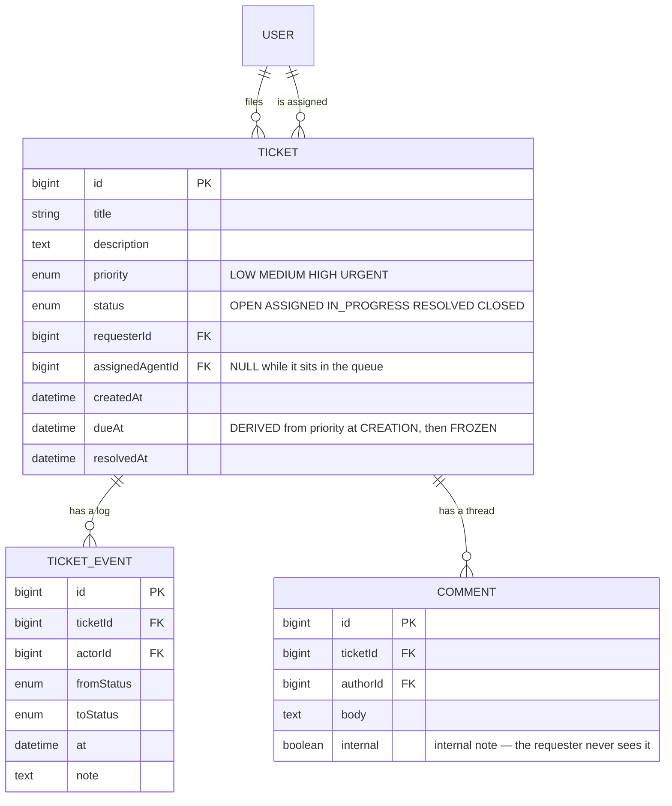

# Helpdesk Ticketing API

The three previous **Semester 6** projects all put the invariant in the **schema**: `UNIQUE`, a partial index, `EXCLUDE`. That is powerful precisely because no write path can get around it.

This project meets an invariant the schema **cannot express**:

> *A ticket that is `OPEN` may move to `ASSIGNED`. A `CLOSED` ticket may not move anywhere.*

No constraint can state that "the legal new value **depends on the old value**". A `CHECK` sees only the row after the write, never the row before it. So this time the invariant lives somewhere else: **inside the `WHERE` clause of the `UPDATE` itself**.

And that turns out to be the most powerful tool of the semester, because it is the SQL form of something you already met in computer architecture: **compare-and-set**.

---

## What you will build

- A **Spring Boot 3 + Java 17 + PostgreSQL** REST API, no front end
- Three roles: **Requester**, **Support agent**, **Manager**
- A genuinely enforced **ticket state machine** — not a string column anyone can overwrite
- **Atomic claiming**: two agents clicking "Claim" at once means exactly one wins
- **Priority-driven SLA due dates** and reporting endpoints built on `GROUP BY`
- A complete transition log — who changed what, when, from which state to which

> 📚 The step-by-step course: [**INT604 — Helpdesk Ticketing API**](/courses/helpdesk-ticketing-api) on the Academy (9 sections, 21 lessons).

---

## The state machine: written once, in one place

The common mistake is scattering `if` statements:

```java
if (ticket.getStatus().equals("OPEN") && newStatus.equals("ASSIGNED")) { ... }
else if (ticket.getStatus().equals("ASSIGNED") && newStatus.equals("IN_PROGRESS")) { ... }
// ...and three months later nobody knows what the full rule set is
```

The right move is to treat **the set of legal transitions as data**:

```java
// The SINGLE source of truth for legal transitions.
static final Map<TicketStatus, Set<TicketStatus>> NEXT = Map.of(
  OPEN,        Set.of(ASSIGNED),
  ASSIGNED,    Set.of(IN_PROGRESS, OPEN),      // can be released back to the queue
  IN_PROGRESS, Set.of(RESOLVED),
  RESOLVED,    Set.of(CLOSED, IN_PROGRESS),    // re-open if it was not really fixed
  CLOSED,      Set.of()                        // terminal
);

void check(TicketStatus from, TicketStatus to) {
  if (!NEXT.get(from).contains(to))
    throw new IllegalTransitionException(from + " → " + to);
}
```



Three benefits of holding the rules as data, in order of importance:

1. **The whole rule set is readable in ten lines.** A new joiner understands the support process without reading the service.
2. **The rules are testable alone**, with no database: walk every `(from, to)` pair and assert that exactly the pairs in the table are legal.
3. **Docs and UI can be generated from it.** A `GET /tickets/{id}/transitions` endpoint returning `NEXT.get(current)` tells the client which buttons to show — instead of copying the rules a second time.

---

## Claiming: the only genuinely contended step

```java
// WRONG — read then write, and both agents win
@Transactional
public Ticket assign(Long ticketId, Long agentId) {
  Ticket t = tickets.findById(ticketId).orElseThrow();
  if (t.getStatus() != OPEN)                       // (A) READ
    throw new ConflictException("Ticket already taken");
  t.setAssignedAgent(users.getReference(agentId)); // (B) WRITE
  t.setStatus(ASSIGNED);
  return t;
}
```

The familiar race: Lan and Minh both read `OPEN`, both write, and **the later write silently overwrites the earlier one**. Unlike the previous three projects there is no second row to hang a `UNIQUE` on — both are simply updating the same `tickets` row.

The fix: **move the check inside the `UPDATE`**, so the database evaluates the condition and applies the change as **one uninterruptible step**.

```java
@Modifying
@Query("update Ticket t set t.assignedAgent.id = :agentId, t.status = 'ASSIGNED' " +
       "where t.id = :id and t.status = 'OPEN'")
int claimIfOpen(@Param("id") Long id, @Param("agentId") Long agentId);

@Transactional
public Ticket assign(Long id, Long agentId) {
  int rows = tickets.claimIfOpen(id, agentId);     // atomic test-and-set
  if (rows == 0)
    throw new ConflictException("Ticket already taken");   // → 409
  return tickets.findById(id).orElseThrow();
}
```



```mermaid
sequenceDiagram
    autonumber
    participant Lan as Agent Lan
    participant DB as PostgreSQL
    participant Minh as Agent Minh

    rect rgb(20, 50, 30)
    Note over Lan,Minh: Atomic test-and-set — the check lives INSIDE the UPDATE
    Lan->>DB: UPDATE tickets SET agent=Lan, status='ASSIGNED'<br/>WHERE id=88 AND status='OPEN'
    DB-->>Lan: 1 row ✅ (status is now ASSIGNED)
    Minh->>DB: UPDATE tickets SET agent=Minh, status='ASSIGNED'<br/>WHERE id=88 AND status='OPEN'
    DB-->>Minh: 0 rows ✗ (status is no longer OPEN)
    Note over Minh: rows == 0 ⇒ ConflictException ⇒ 409
    Note over DB: Ticket 88 belongs to EXACTLY ONE agent
    end
```

**The row count returned by an `UPDATE` is a business result.** That is the idea worth carrying for a career: whenever you find yourself writing "read, check, then write", ask whether the check can move into the `WHERE`. If it can, the concurrency problem disappears.

You have already seen this shape in [Clinic Appointment Booking](/projects/clinic-appointment-booking-system) as `WHERE version = 0`, and you will meet it again in [Gym Membership App](/projects/gym-membership-app) as `WHERE seats_left > 0` and in [E-Commerce Platform](/projects/e-commerce-platform-multi-vendor) as `WHERE stock >= qty`. **Three spellings, one idea.**

---

## The data model and the transition log



`TICKET_EVENT` is **append-only**: never updated, never deleted. Every status change is a new row. It buys you three things the `status` column alone cannot:

- **Accountability** — who closed this ticket, and when.
- **Real metrics** — the gap from `OPEN` to `ASSIGNED` is *first response time*, the single most important number for a support team. Without the log you cannot compute it.
- **Process debugging** — a ticket re-opened three times signals an entirely different problem.

This is the same *append-only* pattern [Banking System](/projects/banking-system-core-banking) takes to its limit with a ledger; only the motive differs — there it is money, here it is accountability.

### `dueAt` is frozen at creation, not computed at read time

```java
// The SLA table is data, not a chain of ifs
static final Map<Priority, Duration> SLA = Map.of(
  URGENT, Duration.ofHours(4),
  HIGH,   Duration.ofHours(24),
  MEDIUM, Duration.ofDays(3),
  LOW,    Duration.ofDays(7)
);

ticket.setDueAt(Instant.now().plus(SLA.get(ticket.getPriority())));
```

Compute `dueAt` on every read as `createdAt + SLA[priority]` and a manager changing an old ticket's priority **rewrites history**: a ticket that was late becomes on time. A due date is **a commitment made at a point in time** — freeze it, exactly like `totalPrice` in [Homestay Booking API](/projects/homestay-booking-api).

---

## Reporting: where `GROUP BY` replaces a Java loop

Reporting endpoints are where students load every ticket and count in Java. With 200 tickets nobody notices; with 200,000 the API falls over.

```sql
-- Per-agent performance: volume, on-time rate, median resolution time
SELECT u.full_name,
       COUNT(*)                                              AS total,
       COUNT(*) FILTER (WHERE t.resolved_at <= t.due_at)     AS on_time,
       ROUND(100.0 * COUNT(*) FILTER (WHERE t.resolved_at <= t.due_at)
             / NULLIF(COUNT(*), 0), 1)                       AS on_time_pct,
       PERCENTILE_CONT(0.5) WITHIN GROUP (
         ORDER BY EXTRACT(EPOCH FROM (t.resolved_at - t.created_at)) / 3600
       )                                                     AS median_hours
  FROM tickets t
  JOIN users u ON u.id = t.assigned_agent_id
 WHERE t.resolved_at IS NOT NULL
   AND t.created_at >= :from
 GROUP BY u.id, u.full_name
 ORDER BY total DESC;
```

Two details worth memorising:

- **`COUNT(*) FILTER (WHERE ...)`** counts conditionally within a single scan, instead of running two queries and stitching them.
- **Median, not mean.** One ticket forgotten for three months drags the average up and makes the whole report meaningless. `PERCENTILE_CONT(0.5)` is immune. For service-time metrics, **the median and the 95th percentile always tell more truth than the mean.**

---

## Traps worth writing down

| Symptom | Actual cause | Fix |
|---|---|---|
| Two agents own one ticket | Read-then-write, even inside `@Transactional` | Move the check into the `UPDATE`'s `WHERE` |
| A `CLOSED` ticket gets re-opened | No transition table | `NEXT` as data, with `CLOSED → Set.of()` |
| Process rules differ per code path | `if` statements scattered across service and controller | One `Map`, one `check` function |
| Client shows illegal buttons | Rules copied into the front end | `GET /tickets/{id}/transitions` serves them from the server |
| The overdue report changes when priority changes | `dueAt` computed at read time | Freeze `dueAt` at creation |
| API collapses as data grows | Loading everything and counting in Java | `GROUP BY` + `COUNT(*) FILTER` |
| Average resolution time looks absurd | One forgotten ticket skews the mean | Use the median and the 95th percentile |
| Nobody knows who closed a ticket | Only a `status` column, no log | An append-only `TICKET_EVENT` table |
| Requesters can read internal notes | Forgot to filter `internal = true` | Filter in the query, not in the view |
| Agents edit each other's tickets | Only the role is checked, not ownership | Check both: role **and** `assignedAgentId` |
| `NEXT.get(status)` throws `NullPointerException` | A new status was added but not to the `Map` | A test walking every enum value asserting full coverage |

---

## Done means

- [ ] 20 threads claiming one ticket: exactly **1** success, **19** `409`s
- [ ] A test walking **every** `(from, to)` pair in the enum: exactly the pairs in `NEXT` are legal
- [ ] A test asserting `NEXT` covers **every** enum value — adding a status without updating it turns the test red
- [ ] `CLOSED → IN_PROGRESS`: rejected with `409` and a message naming the illegal step
- [ ] A manager changing an old ticket's priority: `dueAt` does **not** move, the overdue report does **not** change
- [ ] Every status change writes exactly **one** `TICKET_EVENT` row
- [ ] A requester calling `GET /tickets/{id}/comments`: sees **no** `internal` comments
- [ ] The report over 100,000 seeded tickets: returns in under a second, and `EXPLAIN` shows no `Seq Scan` on `tickets`
- [ ] `GET /tickets/{id}/transitions` returns exactly the legal next steps for the current status
- [ ] Agent A changing the status of a ticket assigned to B: blocked

---

## Where to go next

1. **When the constraint is capacity rather than state.** [Gym Membership App](/projects/gym-membership-app) turns `WHERE status='OPEN'` into `WHERE seats_left > 0` and adds a waitlist.
2. **When many equivalent resources exist.** [Restaurant Reservation App](/projects/restaurant-reservation-app) uses `FOR UPDATE SKIP LOCKED` so each request claims a different table.
3. **When test-and-set inside Postgres is not fast enough.** [Event Ticketing System](/projects/event-ticketing-system) moves the check into Redis.
4. **When the log becomes the source of truth.** [Banking System](/projects/banking-system-core-banking) does not store a balance — it sums the ledger.
