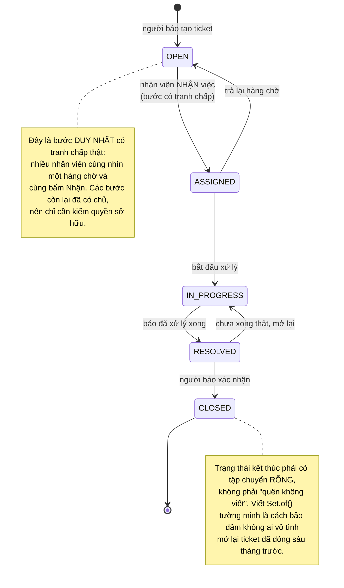
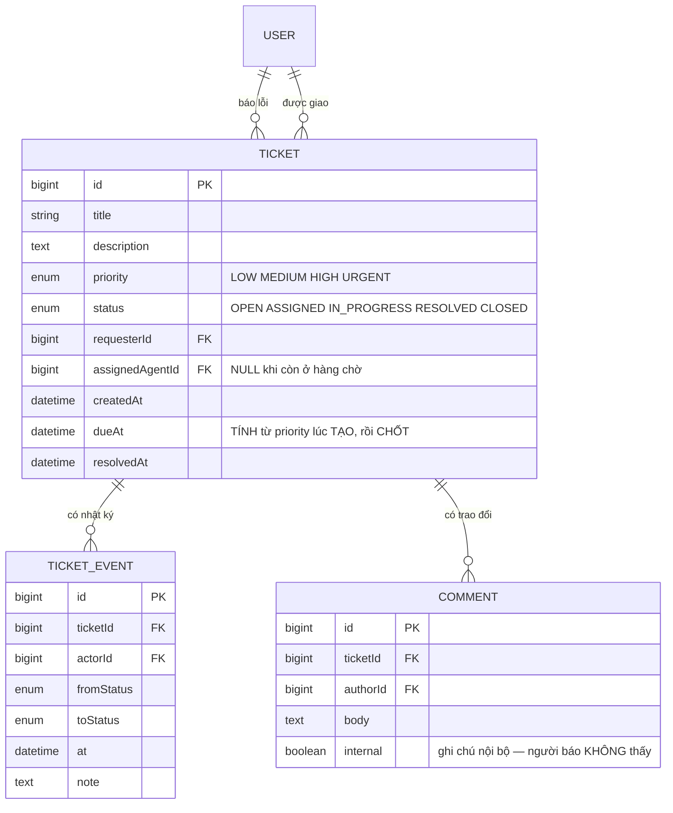

# Helpdesk Ticketing API

Ba đồ án trước của **Kỳ 6** đều đặt bất biến vào **schema**: `UNIQUE`, chỉ mục bộ phận, `EXCLUDE`. Cách đó mạnh vì không đường ghi nào lách được.

Đồ án này gặp một bất biến mà schema **không nói được**:

> *Một ticket đang `OPEN` được chuyển sang `ASSIGNED`. Một ticket `CLOSED` thì không được chuyển đi đâu nữa.*

Không có ràng buộc nào phát biểu được "giá trị mới hợp lệ **phụ thuộc vào giá trị cũ**". `CHECK` chỉ nhìn thấy trạng thái sau khi ghi, không nhìn thấy trạng thái trước đó. Vậy nên lần này bất biến phải nằm ở nơi khác: **bên trong mệnh đề `WHERE` của chính câu `UPDATE`**.

Và đó hoá ra lại là công cụ mạnh nhất trong cả kỳ, vì nó là bản SQL của một thứ bạn đã gặp ở môn Kiến trúc máy tính: **so-sánh-rồi-hoán-đổi**.

---

## Bạn sẽ dựng ra cái gì

- REST API **Spring Boot 3 + Java 17 + PostgreSQL**, không frontend
- Ba vai trò: **Người báo lỗi**, **Nhân viên hỗ trợ**, **Quản lý**
- **Máy trạng thái ticket** được thực thi thật, không phải một cột chuỗi ai ghi gì cũng được
- **Nhận việc nguyên tử**: hai nhân viên bấm "Nhận" cùng lúc thì đúng một người được
- **Hạn xử lý theo mức ưu tiên (SLA)** và các endpoint báo cáo bằng `GROUP BY`
- Nhật ký chuyển trạng thái đầy đủ — ai đổi gì, lúc nào, từ đâu sang đâu

> 📚 Bản dạy từng bước: [**INT604 — Helpdesk Ticketing API**](/courses/helpdesk-ticketing-api) trên Academy (9 mục, 21 bài).

---

## Máy trạng thái: viết ra một lần, ở một chỗ

Cách làm sai phổ biến là rải các câu `if` khắp nơi:

```java
if (ticket.getStatus().equals("OPEN") && newStatus.equals("ASSIGNED")) { ... }
else if (ticket.getStatus().equals("ASSIGNED") && newStatus.equals("IN_PROGRESS")) { ... }
// ...và ba tháng sau không ai còn biết luật đầy đủ là gì
```

Cách đúng là coi **tập chuyển hợp lệ là dữ liệu**:

```java
// Nguồn sự thật DUY NHẤT về các bước chuyển hợp lệ.
static final Map<TicketStatus, Set<TicketStatus>> NEXT = Map.of(
  OPEN,        Set.of(ASSIGNED),
  ASSIGNED,    Set.of(IN_PROGRESS, OPEN),      // trả lại hàng chờ được
  IN_PROGRESS, Set.of(RESOLVED),
  RESOLVED,    Set.of(CLOSED, IN_PROGRESS),    // mở lại nếu chưa thật sự xong
  CLOSED,      Set.of()                        // trạng thái kết thúc
);

void check(TicketStatus from, TicketStatus to) {
  if (!NEXT.get(from).contains(to))
    throw new IllegalTransitionException(from + " → " + to);
}
```



Ba lợi ích của việc để luật thành dữ liệu, theo thứ tự quan trọng:

1. **Đọc được toàn bộ luật trong mười dòng.** Người mới vào dự án hiểu quy trình hỗ trợ mà không cần đọc service.
2. **Test được luật một mình**, không cần dựng database: duyệt mọi cặp `(from, to)` và khẳng định đúng những cặp trong bảng mới hợp lệ.
3. **Sinh được tài liệu và giao diện.** Endpoint `GET /tickets/{id}/transitions` trả về `NEXT.get(current)` là client biết hiện nút nào — không phải chép luật lần thứ hai.

---

## Nhận việc: chỗ duy nhất có tranh chấp thật

```java
// SAI — đọc rồi ghi, hai nhân viên cùng thắng
@Transactional
public Ticket assign(Long ticketId, Long agentId) {
  Ticket t = tickets.findById(ticketId).orElseThrow();
  if (t.getStatus() != OPEN)                       // (A) ĐỌC
    throw new ConflictException("Ticket đã có người nhận");
  t.setAssignedAgent(users.getReference(agentId)); // (B) GHI
  t.setStatus(ASSIGNED);
  return t;
}
```

Cuộc đua quen thuộc: Lan và Minh cùng đọc thấy `OPEN`, cùng ghi, và **người ghi sau đè lên người ghi trước**. Khác với ba đồ án trước, ở đây không có hàng thứ hai để đặt `UNIQUE` lên — cả hai chỉ đang sửa cùng một hàng `tickets`.

Lời giải: **đưa phép kiểm vào bên trong câu `UPDATE`**, để cơ sở dữ liệu đánh giá điều kiện và thực hiện thay đổi như **một bước không chen ngang được**.

```java
@Modifying
@Query("update Ticket t set t.assignedAgent.id = :agentId, t.status = 'ASSIGNED' " +
       "where t.id = :id and t.status = 'OPEN'")
int claimIfOpen(@Param("id") Long id, @Param("agentId") Long agentId);

@Transactional
public Ticket assign(Long id, Long agentId) {
  int rows = tickets.claimIfOpen(id, agentId);     // kiểm-và-đặt nguyên tử
  if (rows == 0)
    throw new ConflictException("Ticket đã có người nhận");   // → 409
  return tickets.findById(id).orElseThrow();
}
```



```mermaid
sequenceDiagram
    autonumber
    participant Lan as Nhân viên Lan
    participant DB as PostgreSQL
    participant Minh as Nhân viên Minh

    rect rgb(20, 50, 30)
    Note over Lan,Minh: Kiểm-và-đặt nguyên tử — phép kiểm nằm TRONG câu UPDATE
    Lan->>DB: UPDATE tickets SET agent=Lan, status='ASSIGNED'<br/>WHERE id=88 AND status='OPEN'
    DB-->>Lan: 1 dòng ✅ (status giờ là ASSIGNED)
    Minh->>DB: UPDATE tickets SET agent=Minh, status='ASSIGNED'<br/>WHERE id=88 AND status='OPEN'
    DB-->>Minh: 0 dòng ✗ (status không còn OPEN)
    Note over Minh: rows == 0 ⇒ ConflictException ⇒ 409
    Note over DB: Ticket 88 thuộc về ĐÚNG MỘT người
    end
```

**Con số trả về của `UPDATE` là kết quả nghiệp vụ.** Đó là ý tưởng đáng mang theo cả nghề: khi bạn thấy mình viết "đọc, kiểm, rồi ghi", hãy hỏi liệu phép kiểm có nhét được vào `WHERE` không. Nếu có, bài toán tương tranh biến mất.

Cùng khuôn này bạn đã gặp ở [Clinic Appointment Booking](/projects/clinic-appointment-booking-system) dưới dạng `WHERE version = 0`, và sẽ gặp lại ở [Gym Membership App](/projects/gym-membership-app) dưới dạng `WHERE seats_left > 0`, ở [E-Commerce Platform](/projects/e-commerce-platform-multi-vendor) dưới dạng `WHERE stock >= qty`. **Ba cách viết, một ý tưởng.**

---

## Mô hình dữ liệu và nhật ký chuyển trạng thái



`TICKET_EVENT` là bảng **chỉ ghi thêm**: không sửa, không xoá. Mỗi lần trạng thái đổi là một hàng mới. Nó cho bạn ba thứ mà cột `status` một mình không cho:

- **Trách nhiệm giải trình** — ai đóng ticket này, lúc mấy giờ.
- **Số đo thật** — thời gian từ `OPEN` đến `ASSIGNED` là *thời gian phản hồi đầu tiên*, chỉ số quan trọng nhất của một đội hỗ trợ. Không có nhật ký thì không tính được.
- **Gỡ lỗi quy trình** — ticket bị mở lại ba lần là dấu hiệu của một vấn đề khác hẳn.

Đây chính là mô hình *chỉ ghi thêm* mà [Banking System](/projects/banking-system-core-banking) đẩy tới cực hạn với sổ cái, chỉ khác động cơ: ở đó là tiền, ở đây là trách nhiệm.

### `dueAt` chốt lúc tạo, không tính lúc đọc

```java
// Bảng SLA là dữ liệu, không phải chuỗi if
static final Map<Priority, Duration> SLA = Map.of(
  URGENT, Duration.ofHours(4),
  HIGH,   Duration.ofHours(24),
  MEDIUM, Duration.ofDays(3),
  LOW,    Duration.ofDays(7)
);

ticket.setDueAt(Instant.now().plus(SLA.get(ticket.getPriority())));
```

Nếu bạn tính `dueAt` mỗi lần đọc từ `createdAt + SLA[priority]`, thì việc quản lý đổi mức ưu tiên của ticket cũ sẽ **viết lại lịch sử**: một ticket từng trễ hạn bỗng thành đúng hạn. Hạn xử lý là **cam kết đưa ra tại một thời điểm** — chốt nó, đúng như `totalPrice` ở [Homestay Booking API](/projects/homestay-booking-api).

---

## Báo cáo: nơi `GROUP BY` thay cho một vòng lặp trong Java

Endpoint báo cáo là chỗ sinh viên hay tải hết ticket về rồi đếm bằng Java. Với 200 ticket thì không ai thấy gì; với 200.000 thì API sập.

```sql
-- Hiệu suất theo nhân viên: khối lượng, đúng hạn, thời gian xử lý trung vị
SELECT u.full_name,
       COUNT(*)                                              AS total,
       COUNT(*) FILTER (WHERE t.resolved_at <= t.due_at)     AS on_time,
       ROUND(100.0 * COUNT(*) FILTER (WHERE t.resolved_at <= t.due_at)
             / NULLIF(COUNT(*), 0), 1)                       AS on_time_pct,
       PERCENTILE_CONT(0.5) WITHIN GROUP (
         ORDER BY EXTRACT(EPOCH FROM (t.resolved_at - t.created_at)) / 3600
       )                                                     AS median_hours
  FROM tickets t
  JOIN users u ON u.id = t.assigned_agent_id
 WHERE t.resolved_at IS NOT NULL
   AND t.created_at >= :from
 GROUP BY u.id, u.full_name
 ORDER BY total DESC;
```

Hai chi tiết đáng học thuộc:

- **`COUNT(*) FILTER (WHERE ...)`** đếm có điều kiện trong cùng một lần quét, thay vì chạy hai truy vấn rồi ghép.
- **Trung vị, không phải trung bình.** Một ticket bị bỏ quên ba tháng kéo trung bình lên và làm cả báo cáo vô nghĩa. `PERCENTILE_CONT(0.5)` miễn nhiễm với điều đó. Với số đo về thời gian phục vụ, **trung vị và phân vị 95 luôn nói thật hơn trung bình.**

---

## Những cái bẫy đã được ghi lại

| Triệu chứng | Nguyên nhân thật | Cách sửa |
|---|---|---|
| Hai nhân viên cùng nhận một ticket | Đọc-rồi-ghi, dù có `@Transactional` | Đưa phép kiểm vào `WHERE` của `UPDATE` |
| Ticket đã `CLOSED` bị mở lại | Không có bảng chuyển trạng thái | `NEXT` là dữ liệu, `CLOSED → Set.of()` |
| Luật quy trình mỗi nơi một kiểu | Rải `if` khắp service và controller | Một `Map` duy nhất, một hàm `check` |
| Client hiện nút không hợp lệ | Chép lại luật ở frontend | `GET /tickets/{id}/transitions` trả luật từ server |
| Báo cáo trễ hạn đổi khi đổi mức ưu tiên | Tính `dueAt` lúc đọc | Chốt `dueAt` lúc tạo ticket |
| API sập khi dữ liệu lớn dần | Tải hết về rồi đếm bằng Java | `GROUP BY` + `COUNT(*) FILTER` |
| Thời gian xử lý trung bình nhìn vô lý | Một ticket bỏ quên kéo lệch trung bình | Dùng trung vị và phân vị 95 |
| Không biết ai đóng ticket | Chỉ có cột `status`, không có nhật ký | Bảng `TICKET_EVENT` chỉ ghi thêm |
| Người báo đọc được ghi chú nội bộ | Quên lọc `internal = true` | Lọc ở tầng truy vấn, không ở tầng hiển thị |
| Nhân viên sửa ticket của người khác | Chỉ kiểm vai trò, không kiểm quyền sở hữu | Kiểm cả hai: vai trò **và** `assignedAgentId` |
| `NEXT.get(status)` ném `NullPointerException` | Thêm trạng thái mới mà quên thêm vào `Map` | Test duyệt mọi giá trị enum, khẳng định `Map` phủ hết |

---

## Khi nào coi như xong

- [ ] 20 luồng cùng nhận một ticket: đúng **1** thành công, **19** nhận `409`
- [ ] Test duyệt **mọi cặp** `(from, to)` trong enum: đúng những cặp trong `NEXT` mới hợp lệ
- [ ] Test khẳng định `NEXT` phủ **hết** giá trị enum — thêm trạng thái mới mà quên là test đỏ
- [ ] Chuyển `CLOSED → IN_PROGRESS`: bị từ chối với `409` và thông điệp nêu rõ bước không hợp lệ
- [ ] Quản lý đổi mức ưu tiên của ticket cũ: `dueAt` **không** đổi, báo cáo trễ hạn **không** đổi
- [ ] Mọi lần đổi trạng thái đều sinh đúng **một** hàng `TICKET_EVENT`
- [ ] Người báo gọi `GET /tickets/{id}/comments`: **không** thấy bình luận `internal`
- [ ] Báo cáo trên 100.000 ticket giả lập: trả về dưới 1 giây, `EXPLAIN` không có `Seq Scan` trên `tickets`
- [ ] `GET /tickets/{id}/transitions` trả về đúng tập bước hợp lệ theo trạng thái hiện tại
- [ ] Nhân viên A đổi trạng thái ticket đang giao cho B: bị chặn

---

## Bước tiếp theo

1. **Khi ràng buộc là sức chứa chứ không phải trạng thái.** [Gym Membership App](/projects/gym-membership-app) đổi `WHERE status='OPEN'` thành `WHERE seats_left > 0` và thêm hàng chờ.
2. **Khi có nhiều tài nguyên tương đương.** [Restaurant Reservation App](/projects/restaurant-reservation-app) dùng `FOR UPDATE SKIP LOCKED` để mỗi request nhận một bàn khác nhau.
3. **Khi kiểm-và-đặt trong Postgres là chưa đủ nhanh.** [Event Ticketing System](/projects/event-ticketing-system) chuyển phép kiểm sang Redis.
4. **Khi nhật ký trở thành nguồn sự thật.** [Banking System](/projects/banking-system-core-banking) không lưu số dư — nó cộng sổ cái.
