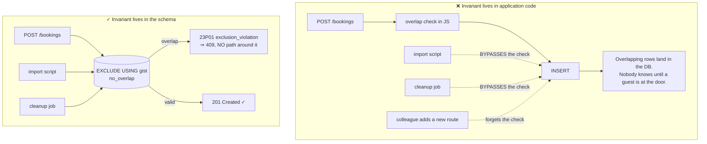
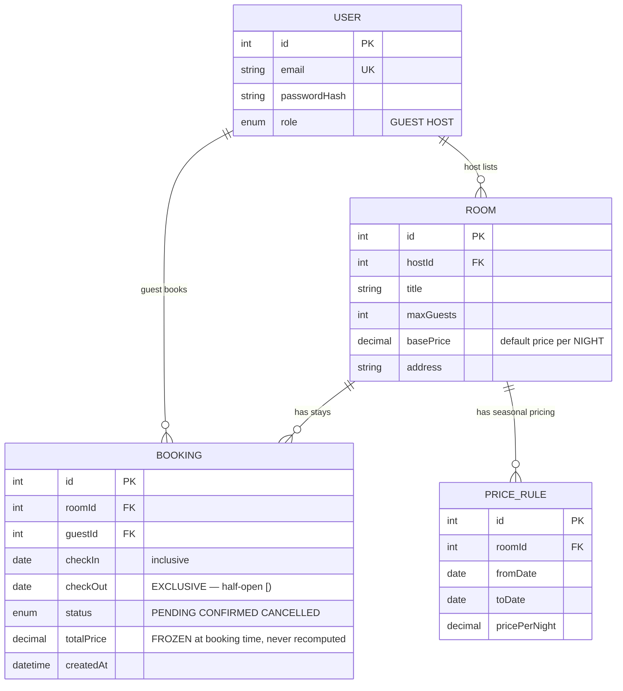

# Homestay Booking API

The first two **Semester 6** projects each reserve **a point**: one appointment slot, one physical book. A `UNIQUE` constraint (or its partial variant) is enough to state the invariant.

This project reserves **an interval**.

A guest books room 7 from the 10th to the 13th. Another guest books room 7 from the 11th to the 14th. No two values are equal — no column matches — so **no `UNIQUE` constraint in existence can catch this**. And yet those two stays collide on the night of the 11th, and you have just sold one room twice.

This project solves that with two things an undergraduate syllabus rarely reaches: **half-open intervals** and **Postgres exclusion constraints**.

It is also the semester's first **API-only** project — meaning you have to learn how to prove your software works with nothing to point at.

---

## What you will build

- A REST API in **Node.js + Express + Prisma + PostgreSQL**, no front end
- Input validation with **zod**, authentication with **JWT** (`jsonwebtoken`) and **bcrypt**
- Two roles: **Guest** (find free rooms, book, cancel) and **Host** (list rooms, see the occupancy calendar)
- A booking core where overlapping stays are **impossible**, enforced by the database itself
- A complete request collection and **OpenAPI** docs — what replaces a UI when you demo
- A two-service **Docker Compose**: `api` and `db`

> 📚 The step-by-step course: [**INT603 — Homestay Booking API**](/courses/homestay-booking-api) on the Academy (9 sections, 22 lessons).

---

## Half-open intervals: the convention that prevents a dozen off-by-one bugs

Before writing any SQL, commit to one convention and hold it **everywhere**: a stay is the **half-open** range `[check_in, check_out)` — check-in day included, check-out day **excluded**.

The reason is entirely practical: one guest checks out on the morning of the 13th, another checks in that afternoon. Those are **two valid bookings** that do not overlap. Use closed ranges `[]` with `<=`/`>=` comparisons and the system rejects the second booking, costing you one night of revenue every time stays are back to back.

Two ranges `A = [in_A, out_A)` and `B = [in_B, out_B)` overlap **if and only if**:

```
in_A < out_B  AND  out_A > in_B
```

Check it against room 7 with an existing booking of **Aug 10 → Aug 13** (occupying nights 10, 11 and 12):

| New request | The test | Result |
|---|---|---|
| Aug 13 → Aug 15 | `13 < 13`? **No** | ✅ Valid — checkout and check-in on the same day is normal |
| Aug 12 → Aug 14 | `12 < 13` ✓ and `14 > 10` ✓ | ❌ Collides on night 12 |
| Aug 09 → Aug 11 | `09 < 13` ✓ and `11 > 10` ✓ | ❌ Collides on night 10 |
| Aug 05 → Aug 10 | `05 < 13` ✓ but `10 > 10`? **No** | ✅ Valid — ends exactly where the other begins |

The phrase to memorise: **you are modelling NIGHTS, not DAYS.** A 10→13 stay is three nights, and a night cannot be split in half.

---

## Why `UNIQUE` is powerless, and the race is still there

The naive read-then-write, in Prisma:

```js
// (A) READ: does this room have any booking overlapping these dates?
const clash = await prisma.booking.findFirst({
  where: {
    roomId, status: 'CONFIRMED',
    checkIn:  { lt: out },   // in_A < out_B
    checkOut: { gt: in_ },   // out_A > in_B
  },
});
if (clash) throw new ConflictError('Room not available for those dates');

// (B) WRITE — but another request may have inserted between (A) and (B)!
await prisma.booking.create({ data: { roomId, checkIn: in_, checkOut: out, guestId, status: 'CONFIRMED' } });
```

The interval logic above is **correct**. The race is completely intact:

```mermaid
sequenceDiagram
    autonumber
    participant An as Guest An
    participant API as Express API
    participant DB as PostgreSQL
    participant Binh as Guest Binh

    rect rgb(60, 20, 20)
    Note over An,Binh: Checking only in application code
    An->>API: POST /bookings {room:7, Aug10 → Aug13}
    API->>DB: SELECT ... WHERE checkIn < 'Aug13' AND checkOut > 'Aug10'
    DB-->>API: 0 rows ✅ free
    Binh->>API: POST /bookings {room:7, Aug11 → Aug14}
    API->>DB: SELECT ... WHERE checkIn < 'Aug14' AND checkOut > 'Aug11'
    DB-->>API: 0 rows ✅ free (An has not committed)
    API->>DB: INSERT booking (Aug10 → Aug13)
    API->>DB: INSERT booking (Aug11 → Aug14)
    Note over DB: Room 7 sold twice for the night of the 11th ✗
    end
```



And here is what makes this different from the first two projects: you **cannot** patch it with `UNIQUE(room_id, check_in)`. Those two rows have different `check_in` values — they satisfy every equality-based constraint you can invent.

---

## Exclusion constraints: stating the invariant in exactly one sentence

Postgres has a constraint type of which `UNIQUE` is merely a special case. `UNIQUE` says *"no two rows are **equal** on these columns"*. `EXCLUDE` says *"no two rows **satisfy this operator** on these columns"* — and that operator can be **overlaps**.

```sql
-- btree_gist lets a plain-equality column (=) share a GiST index
-- with a range-overlap column (&&).
CREATE EXTENSION IF NOT EXISTS btree_gist;

ALTER TABLE "Booking"
  ADD CONSTRAINT no_overlap
  EXCLUDE USING gist (
    "roomId" WITH =,                                  -- the SAME room
    daterange("checkIn", "checkOut", '[)') WITH &&    -- and OVERLAPPING ranges
  )
  WHERE (status = 'CONFIRMED');                       -- cancelled stays block nobody
```

Read it aloud: *"there must not exist two `CONFIRMED` rows with the same `roomId` **and** overlapping date ranges."* That is the business rule verbatim, written once, at the storage layer.



Catch it in the application so the client gets a `409` rather than a `500`:

```js
try {
  return await prisma.booking.create({
    data: { roomId, checkIn: in_, checkOut: out, guestId, status: 'CONFIRMED' },
  });
} catch (e) {
  // 23P01 = Postgres exclusion_violation
  if (e.code === 'P2010' || e.meta?.code === '23P01')
    throw new ConflictError('Room not available for those dates');  // → 409
  throw e;
}
```

Keep the `findFirst` check too: it gives a friendly message in 99.9% of cases and avoids a pointless write round-trip. But **the constraint is the source of truth**, not the check.

### Why not `SERIALIZABLE` plus retry?

That is also a correct solution. But it moves the burden onto **every caller**: each write site must catch serialization failures and retry, and throughput drops because Postgres has to track dependencies between transactions. An exclusion constraint states the invariant **once, declaratively**, and the database enforces it for all writers, forever.

It is the same philosophy as the partial index in [Library Management System](/projects/library-management-system): **push the rule down to the lowest layer that can enforce it**.

---

## The data model



Two details worth pausing on:

- **`totalPrice` is frozen at booking time.** Recompute it on every render and a host editing their price list rewrites old invoices. A price is **the agreement made at that moment**, so it must be stored, not derived.
- **`status = 'CANCELLED'` rows are ignored by the constraint**, thanks to its `WHERE` clause. Cancel and the room must free up immediately — exactly like the partial index in project #2.

---

## Demoing without a UI

This is where students freeze on an API-only project, and it is also the most transferable skill in the semester.

- **OpenAPI is your interface.** Generate the spec from the zod schemas themselves (`zod-to-openapi`) and serve Swagger UI at `/docs`. A grader opens one URL and can exercise every endpoint — no Postman, no you sitting next to them.
- **A runnable request collection** with environment variables, committed to the repo. Register → sign in → save token → book → book overlapping → see `409`. That is your demo script, written down.
- **A race script in shell** is the most convincing artefact and costs five lines:

```bash
# 30 bookings for the same room and dates, fired simultaneously
for i in $(seq 1 30); do
  curl -s -o /dev/null -w "%{http_code}\n" \
    -X POST localhost:3000/bookings \
    -H "Authorization: Bearer $TOKEN" \
    -H 'Content-Type: application/json' \
    -d '{"roomId":7,"checkIn":"2026-08-10","checkOut":"2026-08-13"}' &
done | sort | uniq -c

# The output must be:   1 201
#                      29 409
```

That `uniq -c` line is **the evidence** — it says what three paragraphs cannot.

---

## Traps worth writing down

| Symptom | Actual cause | Fix |
|---|---|---|
| Valid back-to-back stays rejected (out morning, in afternoon) | Closed ranges with `<=`/`>=` | Half-open `[)`, compare with `<` and `>` |
| Overlapping rows reach the database | Checking only in application code | `EXCLUDE USING gist` + `btree_gist` |
| `ALTER TABLE ... EXCLUDE` errors on the operator | `btree_gist` not enabled | `CREATE EXTENSION IF NOT EXISTS btree_gist;` |
| Cancelled stay still blocks the room | `EXCLUDE` missing `WHERE status = 'CONFIRMED'` | Add the predicate, making it a partial constraint |
| `500` returned on a clash | The `23P01` error code is not caught | Catch it and map to `409` |
| Prisma migrate drops the constraint | `EXCLUDE` has no schema.prisma syntax | Write it in a hand-authored SQL migration and never use `db push` |
| Dates off by one between API and DB | Using `DateTime` for a date, dragging in time zones | Use a plain `date` type for `checkIn`/`checkOut` |
| Old invoices change when the host edits prices | `totalPrice` computed at render time | Freeze the price into the `BOOKING` row |
| A host books their own room / a guest lists rooms | No role-relationship check | Enforce in the service, with its own test |
| `guestId` can be forged from the body | Trusting client data | Take it from the signed JWT |
| Concurrency test green, production still overlaps | The test ran sequentially | `Promise.all`, or a `curl` loop with `&` |

---

## Done means

- [ ] The four-row table above: **all four** cases behave exactly as predicted
- [ ] 30 simultaneous requests for the same room and dates: exactly **1** `201`, **29** `409`
- [ ] Temporarily delete the `findFirst` check: **still** 1/29 (proving the constraint really carries weight)
- [ ] Insert an overlapping row directly via `psql`: Postgres **rejects** it with `23P01`
- [ ] Cancel a stay and rebook exactly those dates: **succeeds**
- [ ] Book 13→15 when 10→13 exists: **succeeds** (not a `409`)
- [ ] Edit the host's price list: existing bookings' totals do **not** change
- [ ] `/docs` opens and every endpoint is executable without Postman
- [ ] `docker compose up` on a clean machine: migrations run and `btree_gist` is enabled automatically
- [ ] Guest A requests `GET /bookings/{id}` belonging to guest B: gets `404`

---

## Where to go next

1. **When a record has a multi-step lifecycle.** [Helpdesk Ticketing API](/projects/helpdesk-ticketing-api) replaces the constraint with a genuinely enforced state machine.
2. **When contention becomes brutal.** [Event Ticketing System](/projects/event-ticketing-system) cannot afford a Postgres round-trip — the seat hold has to live in Redis.
3. **When many equivalent resources are available.** [Restaurant Reservation App](/projects/restaurant-reservation-app) uses `FOR UPDATE SKIP LOCKED` so each request gets a different table instead of queueing.
4. **The same "declare the invariant at the lowest layer" principle.** [Banking System](/projects/banking-system-core-banking) pushes it all the way to an append-only ledger.
