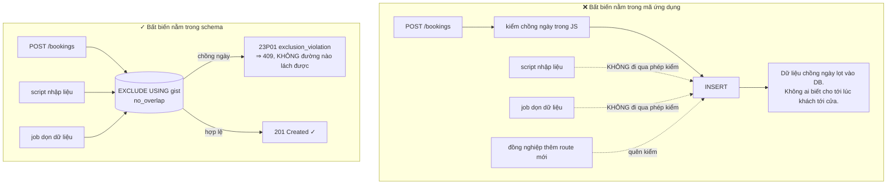
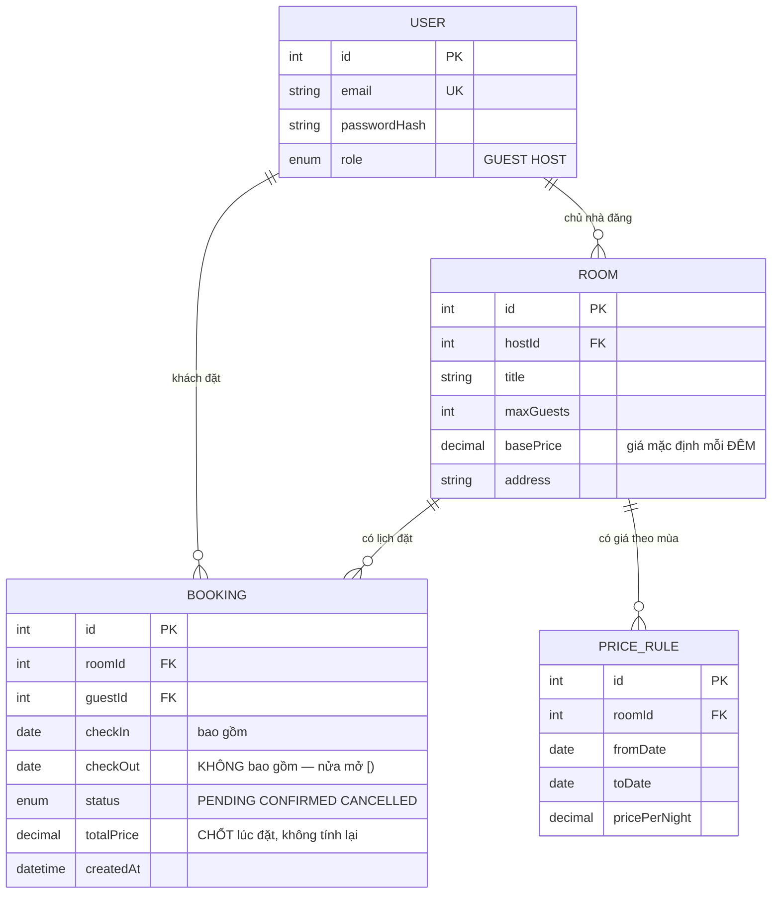

# Homestay Booking API

Hai đồ án đầu của **Kỳ 6** đều đặt **một điểm**: một khung giờ khám, một cuốn sách. Ràng buộc `UNIQUE` (hoặc bản bộ phận của nó) đủ để phát biểu bất biến.

Đồ án này đặt **một khoảng**.

Khách đặt phòng 7 từ ngày 10 đến ngày 13. Người khác đặt phòng 7 từ ngày 11 đến ngày 14. Không có giá trị nào trùng nhau — không cột nào bằng nhau — nên **không ràng buộc `UNIQUE` nào trên đời bắt được lỗi này**. Vậy mà hai lượt đặt đó chồng nhau ở đêm 11 rạng 12, và bạn vừa bán một căn phòng hai lần.

Bài này giải bài toán đó bằng hai thứ mà giáo trình đại học hiếm khi chạm tới: **khoảng nửa mở** và **ràng buộc loại trừ của Postgres**.

Nó cũng là đồ án **chỉ có API, không có giao diện** đầu tiên trong kỳ — nghĩa là bạn phải học cách chứng minh phần mềm của mình chạy đúng mà không có gì để chỉ tay vào.

---

## Bạn sẽ dựng ra cái gì

- REST API bằng **Node.js + Express + Prisma + PostgreSQL**, không frontend
- Kiểm dữ liệu vào bằng **zod**, xác thực **JWT** (`jsonwebtoken`) và **bcrypt**
- Hai vai trò: **Khách** (tìm phòng trống, đặt, huỷ) và **Chủ nhà** (đăng phòng, xem lịch kín)
- Lõi đặt phòng **không thể chồng ngày**, do chính cơ sở dữ liệu thực thi
- Bộ sưu tập request đầy đủ + tài liệu **OpenAPI** — thứ thay thế cho giao diện khi đi demo
- **Docker Compose** hai service: `api` và `db`

> 📚 Bản dạy từng bước: [**INT603 — Homestay Booking API**](/courses/homestay-booking-api) trên Academy (9 mục, 22 bài).

---

## Khoảng nửa mở: quy ước cứu bạn khỏi hàng chục lỗi lệch một đơn vị

Trước khi viết dòng SQL nào, phải chốt một quy ước và giữ nó ở **mọi nơi**: khoảng đặt phòng là **nửa mở** `[check_in, check_out)` — bao gồm ngày nhận, **không** bao gồm ngày trả.

Lý do rất thực tế: khách trả phòng sáng ngày 13, khách mới nhận phòng chiều ngày 13. Đó là **hai lượt đặt hợp lệ**, không chồng nhau. Nếu bạn dùng khoảng đóng `[]` và so sánh bằng `<=`/`>=`, hệ thống sẽ từ chối lượt đặt thứ hai và bạn mất một đêm doanh thu mỗi lần có khách nối tiếp.

Hai khoảng `A = [in_A, out_A)` và `B = [in_B, out_B)` chồng nhau **khi và chỉ khi**:

```
in_A < out_B  AND  out_A > in_B
```

Kiểm lại bằng phòng 7 đã có lượt đặt **10/8 → 13/8** (chiếm các đêm 10, 11, 12):

| Yêu cầu mới | Phép kiểm | Kết quả |
|---|---|---|
| 13/8 → 15/8 | `13 < 13`? **Không** | ✅ Hợp lệ — trả phòng và nhận phòng cùng ngày là bình thường |
| 12/8 → 14/8 | `12 < 13` ✓ và `14 > 10` ✓ | ❌ Chồng đêm 12 |
| 09/8 → 11/8 | `09 < 13` ✓ và `11 > 10` ✓ | ❌ Chồng đêm 10 |
| 05/8 → 10/8 | `05 < 13` ✓ nhưng `10 > 10`? **Không** | ✅ Hợp lệ — kết thúc đúng lúc lượt kia bắt đầu |

Câu thần chú để nhớ: **bạn đang mô hình hoá ĐÊM, không phải NGÀY.** Một lượt đặt 10→13 là ba đêm, và đêm là thứ không thể chia đôi.

---

## Vì sao `UNIQUE` bó tay, và cuộc đua vẫn còn đó

Phiên bản ngây thơ đọc rồi ghi, viết bằng Prisma:

```js
// (A) ĐỌC: phòng này có lượt đặt nào chồng khoảng ngày không?
const clash = await prisma.booking.findFirst({
  where: {
    roomId, status: 'CONFIRMED',
    checkIn:  { lt: out },   // in_A < out_B
    checkOut: { gt: in_ },   // out_A > in_B
  },
});
if (clash) throw new ConflictError('Phòng không còn trống trong khoảng ngày này');

// (B) GHI — nhưng một request khác có thể đã chèn vào giữa (A) và (B)!
await prisma.booking.create({ data: { roomId, checkIn: in_, checkOut: out, guestId, status: 'CONFIRMED' } });
```

Logic khoảng thời gian ở trên **đúng**. Cuộc đua thì vẫn nguyên vẹn:

```mermaid
sequenceDiagram
    autonumber
    participant An as Khách An
    participant API as Express API
    participant DB as PostgreSQL
    participant Binh as Khách Bình

    rect rgb(60, 20, 20)
    Note over An,Binh: Chỉ kiểm trong mã ứng dụng
    An->>API: POST /bookings {room:7, 10/8 → 13/8}
    API->>DB: SELECT ... WHERE checkIn < '13/8' AND checkOut > '10/8'
    DB-->>API: 0 dòng ✅ trống
    Binh->>API: POST /bookings {room:7, 11/8 → 14/8}
    API->>DB: SELECT ... WHERE checkIn < '14/8' AND checkOut > '11/8'
    DB-->>API: 0 dòng ✅ trống (An chưa commit)
    API->>DB: INSERT booking (10/8 → 13/8)
    API->>DB: INSERT booking (11/8 → 14/8)
    Note over DB: Phòng 7 bán hai lần cho đêm 11 rạng 12 ✗
    end
```



Và đây là điểm khác biệt so với hai đồ án trước: bạn **không thể** vá bằng `UNIQUE(room_id, check_in)`. Hai hàng trên có `check_in` khác nhau — chúng hợp lệ theo mọi ràng buộc bằng-nhau mà bạn nghĩ ra được.

---

## Ràng buộc loại trừ: nói bất biến bằng đúng một câu

Postgres có một loại ràng buộc mà `UNIQUE` chỉ là trường hợp đặc biệt. `UNIQUE` nói *"không hai hàng nào **bằng nhau** ở cột này"*. `EXCLUDE` nói *"không hai hàng nào **thoả toán tử này** ở cột này"* — và toán tử đó có thể là **chồng nhau**.

```sql
-- btree_gist cho phép dùng toán tử = (cột thường) chung với && (khoảng)
-- trong cùng một chỉ mục GiST.
CREATE EXTENSION IF NOT EXISTS btree_gist;

ALTER TABLE "Booking"
  ADD CONSTRAINT no_overlap
  EXCLUDE USING gist (
    "roomId" WITH =,                                  -- cùng MỘT phòng
    daterange("checkIn", "checkOut", '[)') WITH &&    -- và khoảng CHỒNG nhau
  )
  WHERE (status = 'CONFIRMED');                       -- lượt đã huỷ không chặn ai
```

Đọc câu này thành lời: *"không được tồn tại hai hàng `CONFIRMED` mà cùng `roomId` **và** có khoảng ngày chồng nhau."* Đó chính xác là quy tắc nghiệp vụ, viết một lần, tại tầng lưu trữ.



Bắt lỗi ở tầng ứng dụng để trả `409` thay vì `500`:

```js
try {
  return await prisma.booking.create({
    data: { roomId, checkIn: in_, checkOut: out, guestId, status: 'CONFIRMED' },
  });
} catch (e) {
  // 23P01 = exclusion_violation của Postgres
  if (e.code === 'P2010' || e.meta?.code === '23P01')
    throw new ConflictError('Phòng không còn trống trong khoảng ngày này');  // → 409
  throw e;
}
```

Vẫn giữ phép kiểm `findFirst` ở trên: nó cho thông báo lỗi thân thiện trong 99,9% trường hợp và tránh một vòng ghi vô ích. Nhưng **nguồn sự thật là ràng buộc**, không phải phép kiểm.

### Vì sao không dùng `SERIALIZABLE` rồi thử lại?

Đó cũng là lời giải đúng. Nhưng nó đẩy gánh nặng sang **mọi người gọi**: mỗi nơi ghi dữ liệu phải biết bắt lỗi tuần tự hoá và thử lại, và thông lượng giảm vì Postgres phải theo dõi phụ thuộc giữa các transaction. Ràng buộc loại trừ phát biểu bất biến **một lần, khai báo**, và cơ sở dữ liệu tự thực thi cho mọi người ghi, mãi mãi.

Đây là cùng một triết lý với chỉ mục bộ phận ở [Library Management System](/projects/library-management-system): **đưa quy tắc xuống chỗ thấp nhất có thể thực thi nó**.

---

## Mô hình dữ liệu



Hai chi tiết đáng dừng lại:

- **`totalPrice` được chốt lúc đặt.** Nếu bạn tính lại giá mỗi lần hiển thị, chủ nhà đổi bảng giá là hoá đơn cũ đổi theo. Giá là **thoả thuận tại thời điểm đặt**, nên nó phải được lưu, không phải suy ra.
- **`status = 'CANCELLED'` không bị ràng buộc chặn**, nhờ mệnh đề `WHERE` trong `EXCLUDE`. Huỷ rồi thì phòng phải trống lại ngay — đúng như chỉ mục bộ phận ở đồ án #2.

---

## Không có giao diện thì demo bằng gì

Đây là phần khiến sinh viên lúng túng nhất ở đồ án API-only, và cũng là kỹ năng đáng giá nhất mang sang chỗ làm.

- **OpenAPI là giao diện của bạn.** Sinh tài liệu từ chính schema zod (`zod-to-openapi`) rồi phục vụ bằng Swagger UI ở `/docs`. Người chấm mở một URL là bấm thử được mọi endpoint — không cần Postman, không cần bạn ngồi cạnh.
- **Một bộ sưu tập request chạy được**, kèm biến môi trường, đi theo repo. Đăng ký → đăng nhập → lưu token → đặt phòng → đặt chồng ngày → thấy `409`. Đó là kịch bản demo, viết sẵn.
- **Kịch bản đua bằng shell** là thứ gây ấn tượng nhất và tốn năm dòng:

```bash
# 30 request đặt cùng phòng, cùng khoảng ngày, bung ra cùng lúc
for i in $(seq 1 30); do
  curl -s -o /dev/null -w "%{http_code}\n" \
    -X POST localhost:3000/bookings \
    -H "Authorization: Bearer $TOKEN" \
    -H 'Content-Type: application/json' \
    -d '{"roomId":7,"checkIn":"2026-08-10","checkOut":"2026-08-13"}' &
done | sort | uniq -c

# Kết quả phải là:   1 201
#                   29 409
```

Dòng `uniq -c` đó là **bằng chứng** — nó nói được điều mà ba đoạn văn không nói nổi.

---

## Những cái bẫy đã được ghi lại

| Triệu chứng | Nguyên nhân thật | Cách sửa |
|---|---|---|
| Từ chối lượt đặt nối tiếp hợp lệ (trả sáng, nhận chiều) | Dùng khoảng đóng và so sánh `<=`/`>=` | Khoảng nửa mở `[)`, so sánh `<` và `>` |
| Hai lượt đặt chồng ngày lọt vào DB | Chỉ kiểm trong mã ứng dụng | `EXCLUDE USING gist` + `btree_gist` |
| `ALTER TABLE ... EXCLUDE` báo lỗi toán tử | Chưa bật `btree_gist` | `CREATE EXTENSION IF NOT EXISTS btree_gist;` |
| Huỷ phòng rồi vẫn không đặt lại được | `EXCLUDE` thiếu mệnh đề `WHERE status = 'CONFIRMED'` | Thêm điều kiện, biến nó thành ràng buộc bộ phận |
| Trả `500` khi trùng lịch | Không bắt mã lỗi `23P01` | Bắt và ánh xạ sang `409` |
| Prisma migrate xoá mất ràng buộc | `EXCLUDE` không có cú pháp trong schema.prisma | Viết vào migration SQL thủ công và **không** dùng `db push` |
| Lệch một ngày giữa API và DB | Dùng `DateTime` cho ngày, dính múi giờ | Dùng kiểu `date` thuần cho `checkIn`/`checkOut` |
| Hoá đơn cũ đổi giá khi chủ nhà sửa bảng giá | Tính `totalPrice` lúc hiển thị | Chốt giá vào hàng `BOOKING` lúc đặt |
| Khách đặt được phòng của chính mình / chủ nhà tự đặt | Không kiểm quan hệ vai trò | Chặn ở service, có test riêng |
| `guestId` sửa được từ body | Tin dữ liệu client | Lấy từ JWT đã ký |
| Test đồng thời xanh nhưng prod vẫn chồng | Test chạy tuần tự | `Promise.all` hoặc vòng lặp `curl` có `&` |

---

## Khi nào coi như xong

- [ ] Bảng bốn dòng ở trên: **cả bốn** trường hợp cho kết quả đúng như dự kiến
- [ ] 30 request đồng thời cùng phòng cùng ngày: đúng **1** `201`, **29** `409`
- [ ] Xoá tạm phép kiểm `findFirst` trong mã: kết quả **vẫn** 1/29 (chứng minh ràng buộc thật sự đang gánh)
- [ ] Chèn thẳng bằng `psql` một hàng chồng ngày: Postgres **từ chối** với `23P01`
- [ ] Huỷ một lượt đặt rồi đặt lại đúng khoảng ngày đó: **thành công**
- [ ] Đặt 13→15 khi đã có 10→13: **thành công** (không phải `409`)
- [ ] Đổi bảng giá của chủ nhà: hoá đơn đã đặt **không** đổi
- [ ] `/docs` mở được và bấm thử được mọi endpoint mà không cần Postman
- [ ] `docker compose up` từ máy trắng: migration chạy, `btree_gist` được bật tự động
- [ ] Khách A gọi `GET /bookings/{id}` của khách B: nhận `404`

---

## Bước tiếp theo

1. **Khi bản ghi có vòng đời nhiều bước.** [Helpdesk Ticketing API](/projects/helpdesk-ticketing-api) thay ràng buộc bằng một máy trạng thái được thực thi thật.
2. **Khi tranh chấp trở nên dữ dội.** [Event Ticketing System](/projects/event-ticketing-system) không thể chờ vòng khứ hồi tới Postgres — hold ghế phải nằm trong Redis.
3. **Khi có nhiều tài nguyên tương đương để chọn.** [Restaurant Reservation App](/projects/restaurant-reservation-app) dùng `FOR UPDATE SKIP LOCKED` để mỗi request nhận một bàn khác nhau thay vì xếp hàng.
4. **Cùng nguyên tắc "khai báo bất biến ở tầng thấp nhất".** [Banking System](/projects/banking-system-core-banking) đẩy nó tới tận sổ cái chỉ-ghi-thêm.
