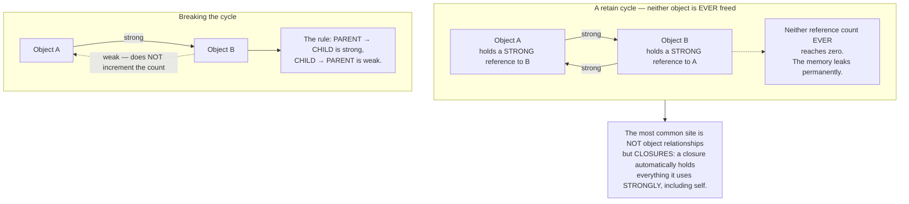
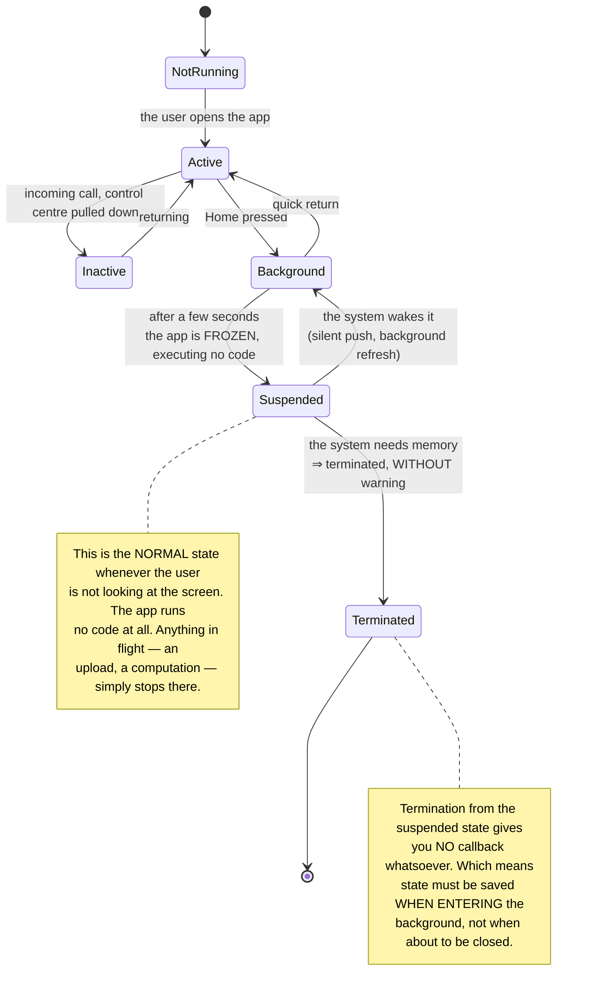
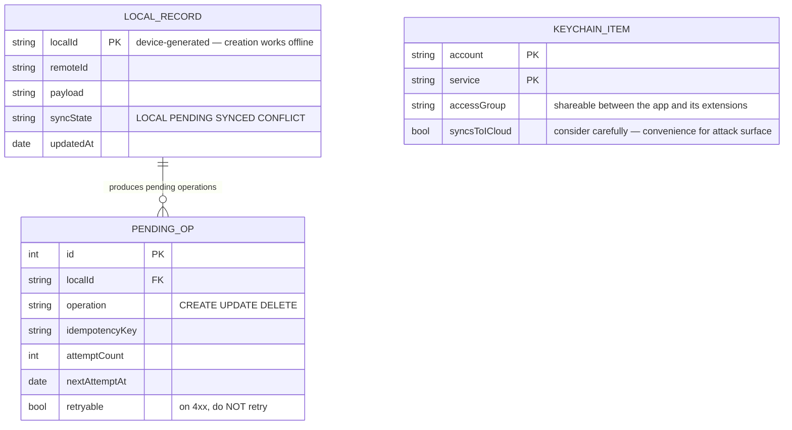

# iOS Native App (Swift)

If you have read [Android Native App](/projects/android-native-app-kotlin), most of the problems here will sound familiar: offline behaviour, lifecycle, battery, permissions. But iOS has **two** things Android does not, and both change how you make technical decisions.

**First: memory is managed by reference counting, not by a garbage collector.** That means there is a class of memory leak that Java, C#, Go and JavaScript developers **have never encountered** — and the compiler does not warn you about it.

**Second: there is a gatekeeper.** Your app must pass Apple's review to reach users. That turns certain technical decisions into commercially risky ones, and you cannot argue your way out with a technical case.

---

## What you will build

- An offline-first SwiftUI app that synchronises with a server
- Concurrency made safe by the type system rather than by discipline
- Background refresh and push notifications within platform limits
- Privacy compliance to the standard Apple actually enforces
- Full preparation for App Store review

---

## Reference counting: the leak garbage-collected languages do not have

Swift frees an object when its reference count reaches zero. Simple, efficient, no collection pauses. But it has one lethal blind spot:



The most common real case:

```swift
class FeedViewModel {
    var posts: [Post] = []

    func load() {
        // ❌ LEAK: the closure holds self STRONGLY, and self holds the closure
        // through the task.
        api.fetchPosts { result in
            self.posts = result        // "self" here is a strong reference
        }

        // ✓ CORRECT: [weak self] breaks the cycle. And you must handle
        // self being nil, because the screen may have closed before the
        // network responded.
        api.fetchPosts { [weak self] result in
            guard let self else { return }
            self.posts = result
        }
    }
}
```

What makes this bug unpleasant: **the app still works correctly.** No exception, no error screen. It simply leaks a little more each time the user opens that screen, and after half an hour of use the system terminates the app for exceeding its memory limit. The user reports "the app quits by itself" with no stack trace anywhere.

How to catch it: Xcode's memory tooling includes a **memory graph** that points directly at cycles. Run it **routinely**, not only during incidents.

---

## Concurrency: the compiler catches it for you

This is where modern Swift does something most languages do not: **data races become compile errors rather than runtime failures.**

```swift
// actor: only ONE task may touch the internal state at a time.
// Not because you remembered to lock — because the compiler WILL NOT
// let you write it wrongly.
actor SyncEngine {
    private var pendingOperations: [Operation] = []

    func enqueue(_ op: Operation) {
        pendingOperations.append(op)   // safe: reachable only through the actor
    }
}

// All UI updates must happen on the main thread. Mark it in the type, and
// the compiler refuses to build if you call it from a background thread.
@MainActor
final class FeedViewModel: ObservableObject {
    @Published var posts: [Post] = []
}
```

The real value is not shorter code. It is that **concurrency bugs — the hardest class to reproduce, appearing once in a thousand runs, only on a user's device — are caught at compile time.** That is one of the few cases where a type system changes the character of an entire bug category.

---

## Background execution: stricter than Android

Android gives you constrained periodic work. iOS gives you very nearly **nothing**:

| Need | The permitted approach | The real constraint |
|---|---|---|
| Periodic sync | System-scheduled background refresh | The system decides based on **that person's** usage habits. Infrequent users see it almost never |
| React to new data | Silent push notifications | May be dropped if sent too often or the battery is low |
| Long work (uploads, processing) | System-managed background sessions | The system runs it; your app may be terminated |
| Heavy idle-time work | Background processing tasks | Only while charging and the user is asleep |

The design consequence is clear: **do not build features assuming your app can run in the background.** If the user needs to know now, that is a push notification. If data must be fresh, refresh on launch and show that it is loading.

---

## The gatekeeper: technical decisions with commercial risk

This does not exist on the web and exists far more weakly on Android.

Your app must be reviewed. Several perfectly ordinary-sounding technical decisions are rejection reasons:

- **Requesting permissions without a clear explanation.** The purpose string must say specifically what it is for. "This app needs your location" gets rejected; "To show shops near you" does not.
- **Undeclared data collection.** You must declare precisely what is collected and why. A third-party library quietly sending a device identifier is still your responsibility.
- **Tracking users across other apps** requires its own consent prompt, which most users decline. If your business model depends on it, know that in advance.
- **Payment mechanisms.** Selling digital content while routing around the platform's payment system is the most common rejection reason.

The general lesson, which applies well beyond iOS: **when you build on someone else's platform, their constraints are your architectural constraints.** Read the rules **before** designing, not after the first rejection.

---

## Lifecycle and synchronisation



That second note is the most important practical difference from Android: **save state on backgrounding, do not wait for a termination event.** No event tells you it is coming.

---

## The on-device data model



The separate `KEYCHAIN_ITEM` table is deliberate: **authentication tokens must never sit in ordinary storage.** They belong in the system's secure keychain, hardware-encrypted and excluded from device backups. This is the most common mistake in self-taught applications.

---

## Traps worth recording

| Symptom | Actual cause | Fix |
|---|---|---|
| The app quits after half an hour with no crash log | A retain cycle leaking memory | `[weak self]` in closures; inspect the memory graph |
| Memory rising each time a screen opens | The screen is never deallocated | Check with the profiler and fix the cycle |
| The interface freezes while scrolling | UI updates from a background thread | `@MainActor` so the compiler catches it |
| A strange failure once in a thousand runs | A data race | An `actor` for shared state |
| Background refresh never runs | The system decides from usage habits | Do not depend on it; use push for what matters |
| Uploads stopping when the user switches apps | The app was suspended | Use system-managed background sessions |
| State lost when the system terminates the app | Waiting for a will-terminate event that never comes | Save on entering the background |
| Rejected in review over a permission string | The purpose string was too generic | State specifically what it is used for |
| Rejected over an incorrect data declaration | A third-party library sending identifiers | Audit every library and declare fully |
| Tokens exposed in device backups | Stored in ordinary storage | The system's secure keychain |
| Rejected over payments | Routing around the platform payment system | Read the rules before designing |
| Only performs well on new devices | Only tested on recent hardware | Test on the oldest supported device |

---

## When it is genuinely done

- [ ] Open and close one screen 50 times: memory **returns to its baseline**
- [ ] Xcode's memory graph: **no** retain cycles present
- [ ] Build with strict concurrency checking: **no** warnings
- [ ] Enable airplane mode: every read and create feature works
- [ ] Create data offline, force-quit the app, reopen: the data **is intact**
- [ ] Switch apps mid-upload: the upload **still completes** (background session)
- [ ] Authentication tokens: **absent** from device backups
- [ ] Reread every permission purpose string: each states **what it is used for**
- [ ] Reconcile the privacy declaration against what libraries actually send: they match
- [ ] Run on the oldest supported device: usable and not janky
- [ ] Enable VoiceOver and traverse the whole app: every control is announced

---

## Where to go next

1. **Extensions and widgets.** They run in separate processes with tight memory limits — which forces a clean separation between your data layer and your UI layer.
2. **iCloud synchronisation.** Sync between one user's devices without running a server, trading away control of the data model.
3. **Sharing code with Android.** Compare business-layer sharing against the approach in [Flutter Cross-platform App](/projects/flutter-cross-platform-app).
4. **A backend for synchronisation.** The sync layer here needs a server designed for it — [Event-Driven Microservices](/projects/event-driven-microservices-uber-like).
