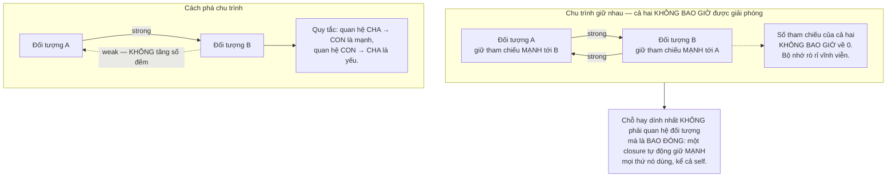
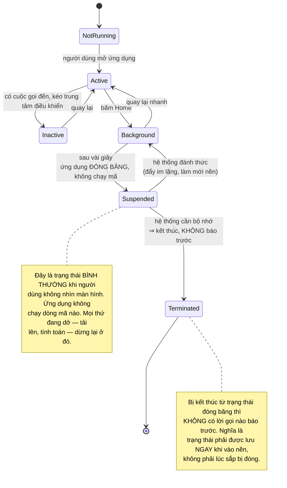
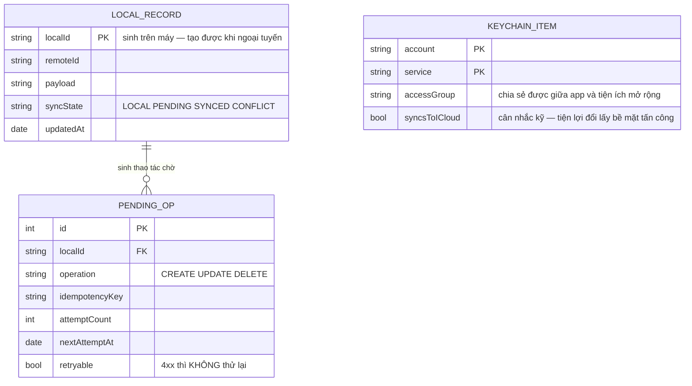

# iOS Native App (Swift)

Nếu bạn đã đọc [Android Native App](/projects/android-native-app-kotlin), phần lớn bài toán ở đây nghe quen: ngoại tuyến, vòng đời, pin, quyền truy cập. Nhưng iOS có **hai** thứ Android không có, và cả hai đều làm thay đổi cách bạn ra quyết định kỹ thuật.

**Thứ nhất: bộ nhớ được quản lý bằng đếm tham chiếu, không phải bằng bộ thu gom rác.** Nghĩa là có một loại rò rỉ bộ nhớ mà lập trình viên Java, C#, Go hay JavaScript **chưa từng gặp** — và trình biên dịch không cảnh báo bạn.

**Thứ hai: có một người gác cổng.** Ứng dụng của bạn phải qua vòng duyệt của Apple để tới được người dùng. Điều đó biến một số quyết định kỹ thuật thành quyết định có rủi ro thương mại, và bạn không thể tranh luận bằng lý lẽ kỹ thuật.

---

## Bạn sẽ dựng ra cái gì

- Ứng dụng SwiftUI ưu tiên ngoại tuyến, đồng bộ với máy chủ
- Xử lý đồng thời an toàn nhờ hệ thống kiểu, không nhờ kỷ luật
- Làm mới nền và thông báo đẩy trong giới hạn của nền tảng
- Tuân thủ quyền riêng tư đúng chuẩn Apple yêu cầu
- Chuẩn bị đầy đủ cho vòng duyệt App Store

---

## Đếm tham chiếu: loại rò rỉ mà ngôn ngữ có thu gom rác không có

Swift giải phóng một đối tượng khi số tham chiếu tới nó về 0. Đơn giản, hiệu quả, không có khoảng dừng thu gom rác. Nhưng nó có một điểm mù chết người:



Trường hợp thực tế phổ biến nhất:

```swift
class FeedViewModel {
    var posts: [Post] = []

    func load() {
        // ❌ RÒ RỈ: closure giữ MẠNH self, và self giữ closure qua tác vụ.
        api.fetchPosts { result in
            self.posts = result        // "self" ở đây là tham chiếu mạnh
        }

        // ✓ ĐÚNG: [weak self] phá chu trình. Và phải xử lý self = nil,
        // vì màn hình có thể đã bị đóng trước khi mạng trả về.
        api.fetchPosts { [weak self] result in
            guard let self else { return }
            self.posts = result
        }
    }
}
```

Điều làm lỗi này khó chịu: **ứng dụng vẫn chạy đúng.** Không có ngoại lệ, không có màn hình lỗi. Chỉ là mỗi lần người dùng mở màn hình đó lại rò thêm một ít, và sau nửa giờ dùng thì ứng dụng bị hệ thống kết thúc vì vượt hạn mức bộ nhớ. Người dùng báo "ứng dụng tự thoát" mà không có vết ngăn xếp nào.

Cách phát hiện: công cụ đo bộ nhớ của Xcode có phần **đồ thị bộ nhớ** chỉ thẳng ra các chu trình. Chạy nó **định kỳ**, không phải chỉ khi có sự cố.

---

## Đồng thời: trình biên dịch bắt lỗi thay cho bạn

Đây là chỗ Swift hiện đại làm được điều mà phần lớn ngôn ngữ không làm: **tranh chấp dữ liệu trở thành lỗi biên dịch, không phải lỗi lúc chạy.**

```swift
// actor: chỉ MỘT tác vụ được chạm vào trạng thái bên trong tại một thời điểm.
// Không phải do bạn nhớ khoá — mà do trình biên dịch KHÔNG CHO viết sai.
actor SyncEngine {
    private var pendingOperations: [Operation] = []

    func enqueue(_ op: Operation) {
        pendingOperations.append(op)   // an toàn: chỉ truy cập được qua actor
    }
}

// Mọi cập nhật giao diện phải ở luồng chính. Đánh dấu bằng kiểu, và
// trình biên dịch từ chối biên dịch nếu bạn gọi nó từ luồng nền.
@MainActor
final class FeedViewModel: ObservableObject {
    @Published var posts: [Post] = []
}
```

Giá trị thật của cách này không phải là viết ngắn hơn. Nó là: **lỗi đồng thời — loại lỗi khó tái hiện nhất, xuất hiện một lần trong nghìn lần chạy, chỉ trên máy của người dùng — bị bắt ở thời điểm biên dịch.** Đó là một trong số ít trường hợp hệ thống kiểu đổi hẳn tính chất của một nhóm lỗi.

---

## Chạy nền: chặt hơn Android

Android cho bạn tác vụ định kỳ có điều kiện. iOS thì gần như **không cho gì cả**:

| Nhu cầu | Cách được phép | Ràng buộc thật |
|---|---|---|
| Đồng bộ định kỳ | Làm mới nền theo lịch hệ thống | Hệ thống quyết định thời điểm dựa trên thói quen dùng của **người đó**. Người ít mở app thì gần như không bao giờ chạy |
| Xử lý khi có dữ liệu mới | Thông báo đẩy im lặng | Có thể bị bỏ qua nếu gửi quá dày hoặc pin thấp |
| Việc dài (tải, xử lý) | Phiên tải nền có hệ thống quản lý | Hệ thống chạy hộ, ứng dụng có thể bị đóng |
| Việc nặng lúc rảnh | Tác vụ xử lý nền | Chỉ chạy khi máy đang sạc và người dùng ngủ |

Hệ quả thiết kế rất rõ: **đừng thiết kế tính năng dựa trên giả định ứng dụng chạy nền được.** Nếu người dùng cần biết ngay, đó là thông báo đẩy. Nếu dữ liệu cần mới, làm mới khi họ mở ứng dụng và hiện rõ đang tải.

---

## Người gác cổng: quyết định kỹ thuật có rủi ro thương mại

Đây là điều không tồn tại trên web và tồn tại yếu hơn nhiều trên Android.

Ứng dụng của bạn phải được duyệt. Vài quyết định kỹ thuật nghe hoàn toàn bình thường lại là lý do bị từ chối:

- **Xin quyền mà không giải thích rõ.** Chuỗi mô tả lý do phải nói cụ thể sẽ dùng để làm gì. "Ứng dụng cần vị trí của bạn" là bị từ chối; "Để hiện các cửa hàng gần bạn" thì được.
- **Thu thập dữ liệu không khai báo.** Phải khai báo chính xác thu thập gì và dùng để làm gì. Một thư viện bên thứ ba âm thầm gửi định danh thiết bị cũng là trách nhiệm của bạn.
- **Theo dõi người dùng qua các ứng dụng khác** cần xin phép riêng, và phần lớn người dùng từ chối. Nếu mô hình kinh doanh dựa vào đó, hãy biết trước.
- **Cơ chế thanh toán.** Bán nội dung số mà đi vòng qua hệ thống thanh toán của nền tảng là lý do từ chối phổ biến nhất.

Bài học chung, và nó áp dụng rộng hơn iOS: **khi bạn xây trên nền tảng của người khác, các ràng buộc của họ là ràng buộc kiến trúc của bạn.** Đọc luật chơi **trước** khi thiết kế, không phải sau khi bị từ chối lần đầu.

---

## Vòng đời và đồng bộ



Ghi chú thứ hai là điểm khác biệt thực tế quan trọng nhất so với Android: **lưu trạng thái lúc chuyển sang nền, đừng chờ tới lúc bị đóng.** Không có sự kiện nào báo cho bạn biết sắp bị kết thúc.

---

## Dữ liệu trên máy



Bảng `KEYCHAIN_ITEM` tách riêng là có chủ ý: **mã thông báo đăng nhập không bao giờ được nằm trong kho lưu trữ thông thường.** Nó phải ở kho khoá bảo mật của hệ thống, được mã hoá bằng phần cứng và không lộ ra khi máy bị sao lưu. Đây là lỗi phổ biến nhất trong các ứng dụng tự học.

---

## Những cái bẫy đã được ghi lại

| Triệu chứng | Nguyên nhân thật | Cách sửa |
|---|---|---|
| Ứng dụng tự thoát sau nửa giờ dùng, không vết lỗi | Chu trình giữ nhau, rò rỉ bộ nhớ | `[weak self]` trong closure, xem đồ thị bộ nhớ |
| Bộ nhớ tăng mỗi lần mở một màn hình | Màn hình không được giải phóng | Kiểm bằng công cụ đo, sửa chu trình |
| Giao diện đứng hình lúc cuộn | Cập nhật giao diện từ luồng nền | `@MainActor` để trình biên dịch bắt lỗi |
| Lỗi lạ một lần trong nghìn lần chạy | Tranh chấp dữ liệu | `actor` cho trạng thái dùng chung |
| Làm mới nền không bao giờ chạy | Hệ thống quyết định theo thói quen người dùng | Đừng phụ thuộc vào nó; dùng đẩy cho việc cần |
| Tải lên dừng khi người dùng chuyển app | Ứng dụng bị đóng băng | Dùng phiên tải nền do hệ thống quản lý |
| Mất trạng thái khi hệ thống kết thúc app | Chờ sự kiện sắp-đóng, mà không có | Lưu ngay khi vào nền |
| Bị từ chối duyệt vì mô tả quyền | Chuỗi lý do quá chung chung | Nói cụ thể dùng để làm gì |
| Bị từ chối vì khai báo dữ liệu sai | Thư viện bên thứ ba gửi định danh | Kiểm mọi thư viện, khai báo đầy đủ |
| Mã thông báo lộ trong bản sao lưu | Lưu ở kho thông thường | Kho khoá bảo mật của hệ thống |
| Ứng dụng bị từ chối vì thanh toán | Đi vòng hệ thống thanh toán nền tảng | Đọc quy định trước khi thiết kế |
| Chỉ chạy tốt trên máy mới | Chỉ thử trên máy đời cao | Thử trên thiết bị cũ nhất còn hỗ trợ |

---

## Khi nào coi như xong

- [ ] Mở và đóng một màn hình 50 lần: bộ nhớ **quay về mức ban đầu**
- [ ] Đồ thị bộ nhớ trong Xcode: **không** có chu trình giữ nhau nào
- [ ] Biên dịch với kiểm tra đồng thời bật ở mức chặt: **không** cảnh báo nào
- [ ] Bật chế độ máy bay: mọi tính năng đọc và tạo đều dùng được
- [ ] Tạo dữ liệu ngoại tuyến, đóng hẳn app, mở lại: dữ liệu **còn nguyên**
- [ ] Chuyển app giữa lúc đang tải lên: tải lên **vẫn hoàn tất** (phiên nền)
- [ ] Mã thông báo đăng nhập: **không** xuất hiện trong bản sao lưu thiết bị
- [ ] Đọc lại mọi chuỗi mô tả quyền: mỗi cái nói rõ **dùng để làm gì**
- [ ] Đối chiếu khai báo quyền riêng tư với thực tế thư viện gửi đi: khớp
- [ ] Chạy trên thiết bị cũ nhất còn hỗ trợ: dùng được, không giật
- [ ] Bật VoiceOver và duyệt hết ứng dụng: mọi điều khiển đều đọc được

---

## Bước tiếp theo

1. **Tiện ích và widget.** Chạy trong tiến trình riêng với hạn mức bộ nhớ rất chặt — buộc bạn tách tầng dữ liệu ra khỏi tầng giao diện cho gọn.
2. **Đồng bộ qua iCloud.** Cho phép đồng bộ giữa thiết bị của cùng người dùng mà không cần máy chủ riêng, đổi lại là mất quyền kiểm soát mô hình dữ liệu.
3. **Chia sẻ mã với Android.** So sánh cách chia sẻ tầng nghiệp vụ với cách của [Flutter Cross-platform App](/projects/flutter-cross-platform-app).
4. **Máy chủ cho đồng bộ.** Phần đồng bộ ở đây cần một máy chủ hiểu được nó — [Event-Driven Microservices](/projects/event-driven-microservices-uber-like).
