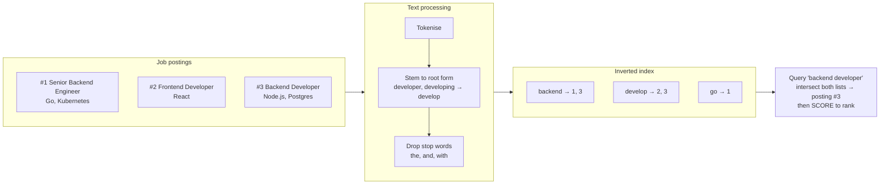
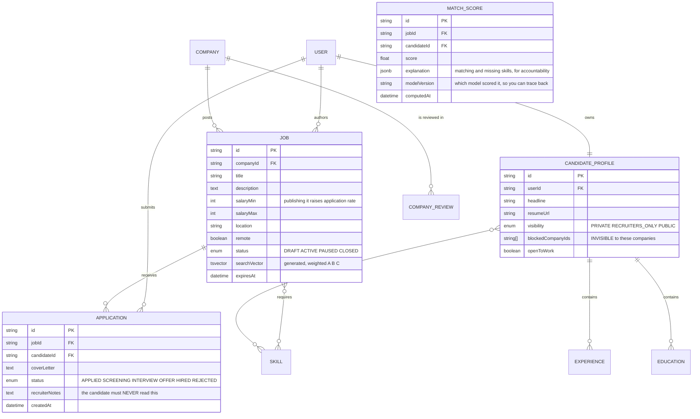
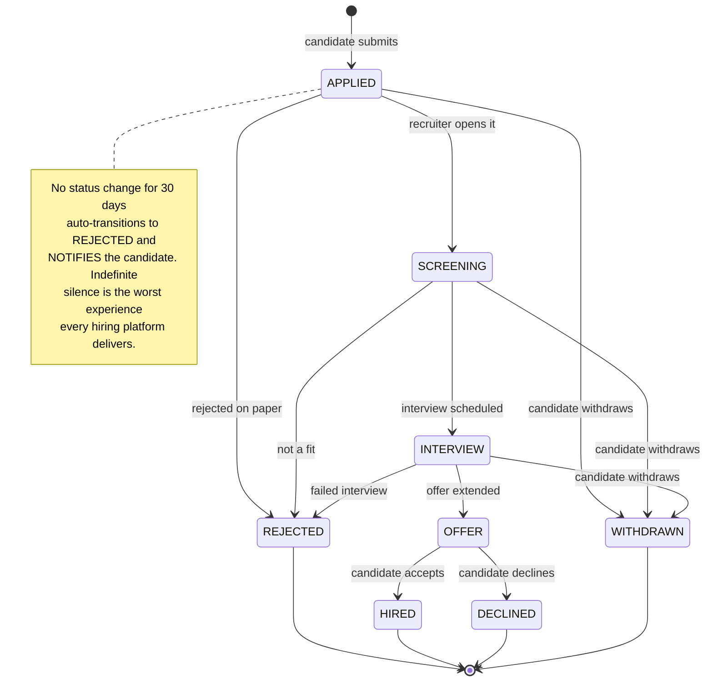
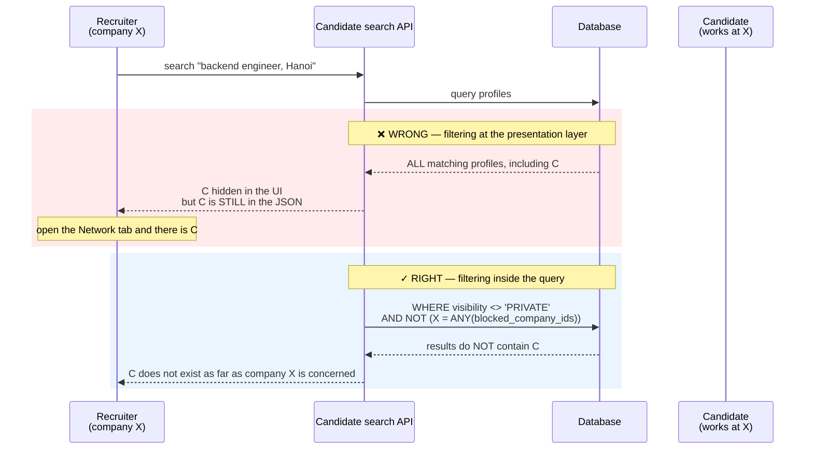
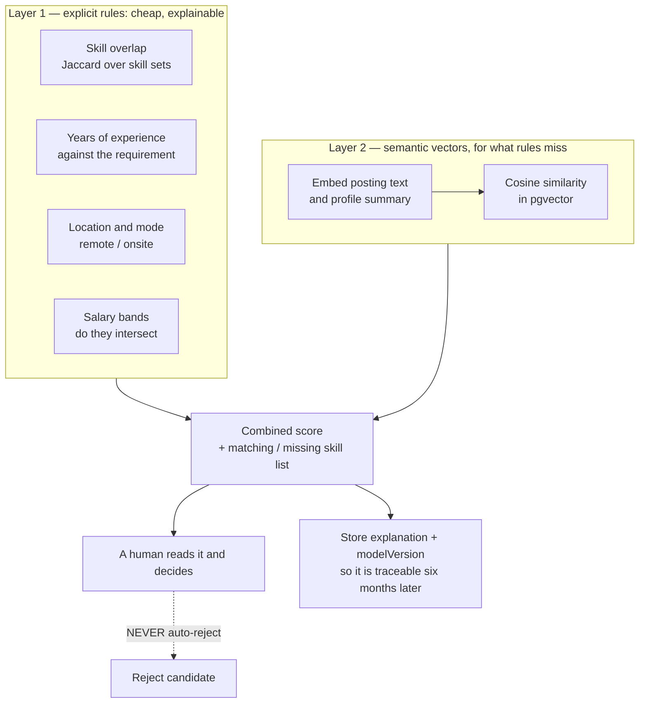

# Job Board Platform (LinkedIn-like)

In [Social Media Platform](/projects/social-media-platform-twitter-like), ordering was chronological: newest first, nobody argues. Here, ordering is **relevance** — and suddenly you owe an answer to a question with no absolutely correct solution: *of the 4,000 postings matching "backend", which one belongs at the top?*

That is the first problem. The second is harder and less often considered: **an employed candidate does not want their current employer to know they are looking.** A carelessly built "suggest candidates to recruiters" feature can cost a real person their job.

And the third, which most learning projects skip entirely: the moment you let a model score résumés, **you are automating a decision with legal consequences.**

---

## What you will build

- Three roles: candidate, recruiter, administrator
- Candidate profiles: experience, education, skills, a PDF résumé
- Job posting, filtered search, applications with cover letters
- Application tracking through each stage
- Search ordered by relevance, not by posting date
- Candidate ↔ job matching that can explain its own suggestions
- Email job alerts that never send the same job twice
- Company pages, company reviews, salary insights

---

## Search: why `LIKE '%backend%'` is not search

The first thing everyone writes:

```sql
SELECT * FROM jobs WHERE title ILIKE '%backend%' OR description ILIKE '%backend%';
```

It fails in four ways simultaneously, and no amount of additional `OR` clauses helps:

| Problem | Concrete example |
|---|---|
| Cannot use an index | A leading `%` makes B-tree useless — full table scan every time |
| No understanding of word forms | Searching "developing" misses a posting that says "developer" |
| No ranking | A posting with "backend" in the title ties with one that mentions it in the benefits paragraph |
| No typo tolerance | "backedn" returns zero results and the user assumes the site is broken |

### The right shape: an inverted index and a scoring formula

A search engine does not store text and then scan it. It turns the structure inside out: for each **term**, keep the list of documents containing it.



Postgres ships all of this, so there is no need to stand up a second system on day one:

```sql
-- A generated search column with WEIGHTS by where the term appears.
-- setweight 'A' for the title, 'B' for skills, 'C' for the description:
-- the same word in a title is worth more than one buried in perks.
ALTER TABLE jobs ADD COLUMN search_vector tsvector
  GENERATED ALWAYS AS (
      setweight(to_tsvector('english', coalesce(title, '')), 'A') ||
      setweight(to_tsvector('english', array_to_string(skills, ' ')), 'B') ||
      setweight(to_tsvector('english', coalesce(description, '')), 'C')
  ) STORED;

-- GIN is the index type for tsvector. Without it, none of the above matters.
CREATE INDEX jobs_search_idx ON jobs USING GIN (search_vector);
```

And the query returns a **rank**, not merely a matching set:

```sql
SELECT j.*,
       ts_rank(j.search_vector, q) AS text_score
  FROM jobs j, websearch_to_tsquery('english', $1) q
 WHERE j.search_vector @@ q
   AND j.status = 'ACTIVE'
   AND ($2::text IS NULL OR j.location = $2)
 ORDER BY text_score DESC
 LIMIT 20;
```

`websearch_to_tsquery` is the detail worth remembering: it accepts the syntax users already know from Google (`"golang backend" -junior`) instead of teaching them a bespoke one, and it **does not throw** on strange input — `to_tsquery` does, and that is one of the most common ways a search page goes down.

### Relevance is more than text score

A posting that matches the keywords perfectly but was published eight months ago, is closed, and lists no salary does not belong at the top. The final score is a combination:

```ts
// These weights are HYPOTHESES, not truths. Write them as named constants
// so they can be changed, instead of scattering 0.3 through the query.
const WEIGHTS = {
  text: 1.0,          // keyword match strength
  freshness: 0.4,     // newer postings rank higher
  completeness: 0.2,  // salary present, description substantive
  skillOverlap: 0.6,  // overlap with the searching candidate's profile
};

// Freshness decays exponentially: 7 days ≈ 0.5, 30 days ≈ 0.06.
const freshness = Math.exp(-daysSincePosted / 10);
```

What matters is not that these numbers are right — they are almost certainly wrong on the first attempt. What matters is that they live **in one place, with names, and can be measured**. You only learn which weighting is better by comparing click-through between two sets on real users.

### When to move to a dedicated search engine

Postgres full-text holds up well to a few million documents. Move when you need something it lacks: edit-distance typo tolerance, type-ahead suggestions, multilingual analysis, or when search traffic starts competing with transactional load on the primary database.

But move for one of those reasons, measured — not because Elasticsearch sounds more professional. What lives inside those engines is exactly the subject of [Distributed Search Engine](/projects/distributed-search-engine) at level 4.

---

## The data model



Three columns above are absent from the naive design, and each one prevents a real incident:

- `blockedCompanyIds` — a candidate blocks their current employer by name
- `recruiterNotes` — internal notes, which **must** stay out of every API response served to the candidate
- `modelVersion` — six months later someone asks "why was I rejected", and you need to know which model scored them

---

## The application lifecycle: where silence is a bug



The `WITHDRAWN` state comes from a simple observation: every platform is designed for recruiters, because recruiters pay. Letting candidates withdraw is one of the few places you hand control back to the less powerful side — and it costs almost nothing to build.

---

## Privacy: the feature that can cost someone their job

This part deserves more thought than the engineering around it.

Recruiters want to find candidates. Employed candidates want to look for work **without their manager finding out**. These needs conflict directly, and you pick a side through your defaults.



The principle, and it holds for every system handling sensitive data: **authorisation belongs in the `WHERE` clause, not in the rendering step.** Data that has left the database has leaked, whether or not the interface chose to display it.

The same reasoning applies to `recruiterNotes`: do not rely on a React component declining to render it. Select columns explicitly at the query layer:

```ts
// A candidate viewing their own application — SELECT columns rather than
// taking the default. Adding a sensitive column later will not silently leak.
const application = await prisma.application.findFirst({
  where: { id, candidateId: req.user.id },
  select: {
    id: true, status: true, createdAt: true,
    job: { select: { title: true, company: { select: { name: true } } } },
    // recruiterNotes is absent here, deliberately.
  },
});
```

The system default should be closed: a new profile starts `PRIVATE` and the user opts out of it. Defaulting to open and letting people hunt for the off switch pushes the consequences onto whoever has the least power.

---

## Scoring candidates: the easiest place in this project to get badly wrong

The temptation is strong: throw the résumé and the posting at a language model, ask for "a score from 0 to 100", take the number, sort by it. Working by the end of an afternoon.

It is wrong in four ways, in increasing order of seriousness:

**1. Not reproducible.** The same résumé scored twice yields two different numbers. A candidate asks why their score changed and you have no answer.

**2. Expensive and slow.** 10,000 candidates × 500 postings is 5 million model calls. Nobody can afford that, and it certainly is not real time.

**3. Not explainable.** The number 73 says nothing. The candidate does not learn what to improve; the recruiter does not learn why to trust it.

**4. It relearns the bias in the data.** This is the serious one. A model trained on historical hiring data reproduces the discriminatory patterns already present in that data — by gender, age, university, employment gaps. Amazon scrapped exactly such a system in 2018 after finding it downgraded résumés containing the word "women's". In many jurisdictions this carries concrete legal exposure.

### A version you can stand behind

Split it in two layers, and keep the deciding layer on the explainable side:



Layer 1 does most of the work and it **explains itself in plain language**: "matches 7 of 10 skills, missing Kubernetes and Terraform, 4 years of experience against a 5-year requirement". A candidate reads that and knows what to do next. A bare 73 never gives them that.

Layer 2 uses semantic vectors to catch what layer 1 misses — "Golang" versus "Go", "K8s" versus "Kubernetes", or an experience description that never lists skills as keywords:

```sql
-- pgvector: embed once when the profile or posting changes, NOT on every
-- search. The <=> operator is cosine distance.
CREATE INDEX ON candidate_profiles
    USING hnsw (embedding vector_cosine_ops);

SELECT c.id, 1 - (c.embedding <=> $1::vector) AS semantic_score
  FROM candidate_profiles c
 WHERE c.visibility <> 'PRIVATE'
   AND NOT ($2 = ANY(c.blocked_company_ids))   -- privacy FIRST, ranking SECOND
 ORDER BY c.embedding <=> $1::vector
 LIMIT 50;
```

The ordering in that query is deliberate: the privacy filter sits in `WHERE` and runs before ranking. Ranking first and filtering afterwards walks straight back into the earlier trap.

And the final point, more important than any of the engineering above: **the score orders a list for a human to read; it does not reject anyone.** An automatic rejection threshold is where a software defect turns into a consequence for a real person.

---

## Parsing résumés from PDF: do not trust the format

PDF is not a structured text format — it describes where glyphs sit on a page. Extracting text from a two-column CV routinely produces lines interleaved between the columns.

What actually survives contact with reality:

1. **Extract raw text** with a PDF library, keeping coordinates where available.
2. **If there is no text layer** (the CV is a scan), fall back to OCR — do not silently return an empty string.
3. **Extract fields with a model** constrained to a JSON schema, not free prose.
4. **Always let the user correct it.** This step is the most important and the most often skipped. Autofill is a convenience, not a source of truth. Present extracted fields as a draft for the candidate to confirm.

The metric to watch is not "model accuracy" but **how often users have to fix the result** — that measures what people actually experience.

---

## Job alerts: the do-not-send-twice problem

A cron runs each morning, finds new postings matching saved filters, sends email. Three failure modes:

- The cron runs twice because a worker restarted → the candidate gets two identical emails
- A posting's title is edited → it looks new → it is sent again
- The filter is too broad → 200 postings in one email → nobody reads it

The fix is a table recording **what was sent to whom**, and letting the unique constraint do the work:

```sql
CREATE TABLE alert_deliveries (
    alert_id   TEXT NOT NULL,
    job_id     TEXT NOT NULL,
    sent_at    TIMESTAMPTZ NOT NULL DEFAULT now(),
    PRIMARY KEY (alert_id, job_id)      -- a second send is rejected by the DB
);

-- Postings never yet sent for this alert, capped at the 10 best per email.
SELECT j.* FROM jobs j
 WHERE j.status = 'ACTIVE'
   AND j.created_at > now() - interval '1 day'
   AND NOT EXISTS (
       SELECT 1 FROM alert_deliveries d
        WHERE d.alert_id = $1 AND d.job_id = j.id
   )
 ORDER BY relevance_score DESC
 LIMIT 10;
```

That is the familiar pattern in its sixth disguise: **let the database enforce the condition instead of trusting that application code ran exactly once.**

---

## Traps worth recording

| Symptom | Actual cause | Fix |
|---|---|---|
| Search slows as postings accumulate | `ILIKE '%...%'` cannot use an index | `tsvector` plus a GIN index |
| "developing" misses "developer" | Raw string matching, no stemming | `to_tsvector` with the right language config |
| Results match but the order is meaningless | No ranking score | `ts_rank` with positional `setweight` |
| Search page 500s on odd characters | `to_tsquery` throws on syntax errors | `websearch_to_tsquery` |
| Candidate visible to their current employer | Authorisation applied in the UI layer | Move the condition into `WHERE` |
| Candidate can read internal notes | Default `select` returns every column | Explicit column selection per role |
| Scores change between runs | A generative model used directly as the score | Explicit rule layer plus stored vectors |
| Model bill overruns the budget | Re-embedding on every search | Embed on change, store in pgvector |
| Cannot explain a rejection | Only the number was stored | Persist `explanation` and `modelVersion` |
| Duplicate alert emails | Cron reran with no delivery record | `alert_deliveries` with a composite key |
| Applications hang forever | No deadline on any state | Auto-transition after 30 days and notify |
| Two-column CVs parse into gibberish | Believing PDF is structured text | Keep coordinates, add OCR, allow editing |

---

## When it is genuinely done

- [ ] 100,000 postings in the database, filtered search returns under 150ms at p95
- [ ] Searching "developing" finds a posting saying "developer" — stemming works
- [ ] Typing `"a & b | ) !` into the search box returns empty results and does **not** crash
- [ ] A posting with the keyword in its title ranks above one that mentions it only in perks
- [ ] Candidate blocks company X; log in as an X recruiter and call the API with `curl`: that profile is **not in the JSON**
- [ ] Fetch an application as the candidate: the response contains no `recruiterNotes`
- [ ] Run the alert cron twice in a row: the second run sends zero emails
- [ ] Edit the title of an already-alerted posting: no new email is generated
- [ ] Open any suggested match: the matching and missing skills are both readable
- [ ] Upload a two-column CV and a scanned image CV: both produce editable data, not an empty string

---

## Where to go next

1. **Measure search quality numerically.** Log the rank of the result users click, compute MRR or NDCG. Without numbers, every weight change is guesswork.
2. **Audit for bias.** Run the same résumés with names, universities and birth years swapped — does the score move? If it does, you have found a real problem.
3. **Recruiter ↔ candidate messaging.** The socket infrastructure from [Real-Time Chat App](/projects/real-time-chat-app-1-1) carries over; add rules about who may message whom first.
4. **Split search into its own service.** When search load starts affecting the primary database, that is the entry point to the event-driven architecture of [Event-Driven Microservices](/projects/event-driven-microservices-uber-like) and the internals of [Distributed Search Engine](/projects/distributed-search-engine).
