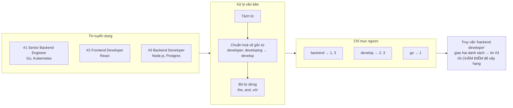
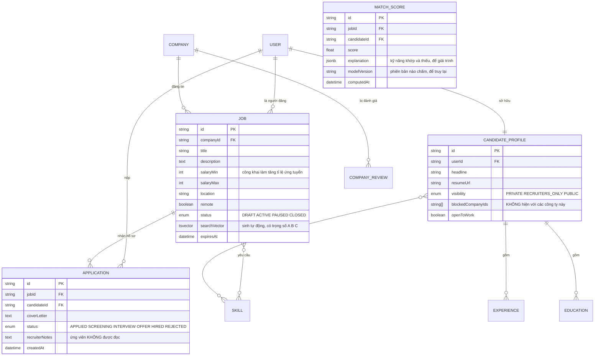
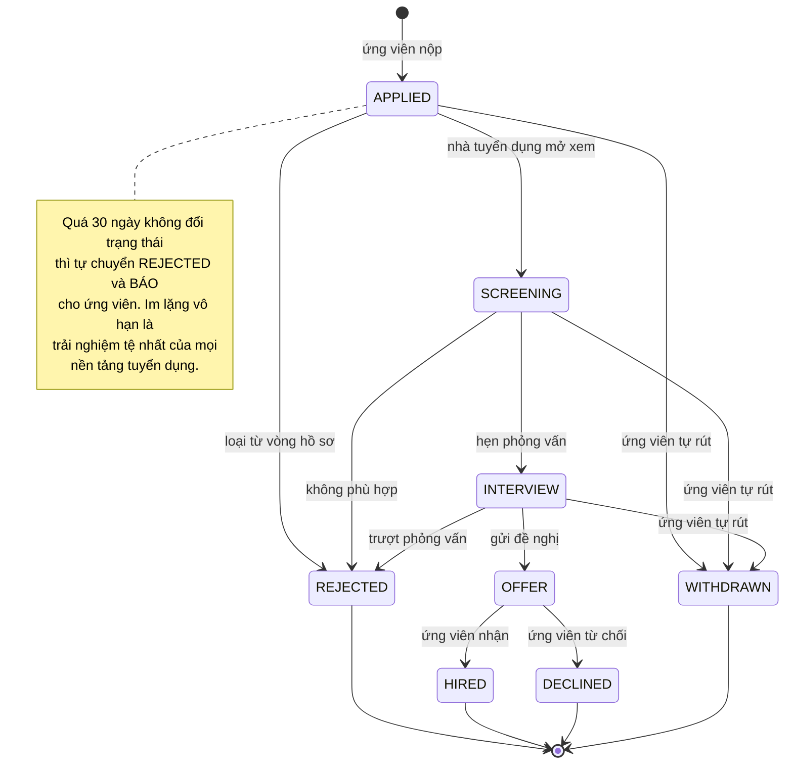
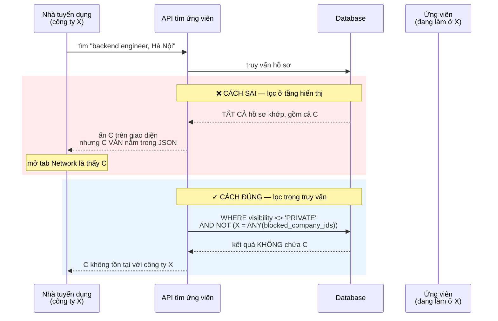
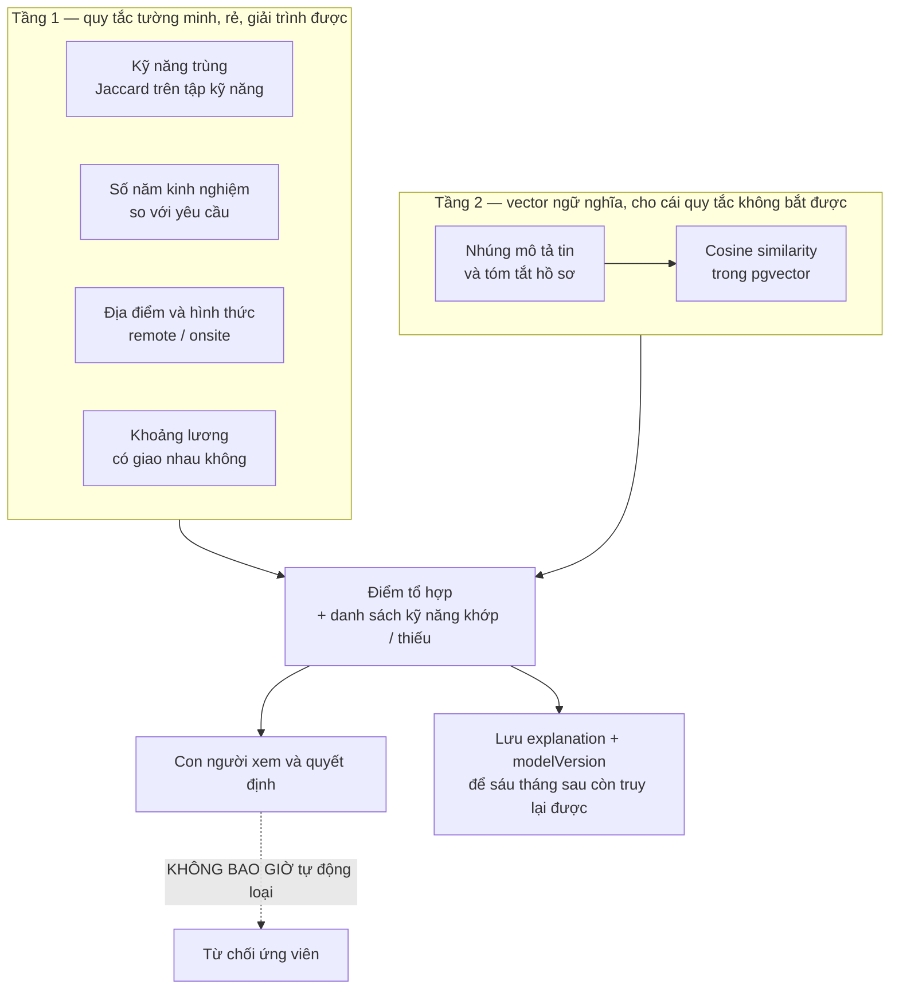

# Job Board Platform (LinkedIn-like)

Ở [Social Media Platform](/projects/social-media-platform-twitter-like), thứ tự hiển thị là thời gian: mới nhất lên trước, không ai tranh cãi. Ở đây, thứ tự hiển thị là **mức độ liên quan** — và đột nhiên bạn phải trả lời một câu hỏi không có đáp án đúng tuyệt đối: *trong 4.000 tin tuyển dụng khớp từ khoá "backend", tin nào nên đứng đầu?*

Đó là bài toán thứ nhất. Bài toán thứ hai khó hơn và ít người nghĩ tới: **ứng viên đang đi làm không muốn công ty hiện tại biết họ đang tìm việc.** Một tính năng "gợi ý ứng viên cho nhà tuyển dụng" viết cẩu thả có thể khiến ai đó mất việc thật.

Và bài toán thứ ba, cái mà phần lớn dự án học tập bỏ qua hoàn toàn: khi bạn để một mô hình chấm điểm hồ sơ, **bạn đang tự động hoá một quyết định có hậu quả pháp lý.**

---

## Bạn sẽ dựng ra cái gì

- Ba vai: ứng viên, nhà tuyển dụng, quản trị viên
- Hồ sơ ứng viên: kinh nghiệm, học vấn, kỹ năng, CV dạng PDF
- Đăng tin, tìm tin có bộ lọc, ứng tuyển kèm thư giới thiệu
- Theo dõi trạng thái hồ sơ ứng tuyển qua từng vòng
- Tìm kiếm xếp theo mức độ liên quan, không phải theo ngày đăng
- Gợi ý ứng viên ↔ việc làm, có giải thích được vì sao gợi ý
- Cảnh báo việc làm gửi qua email, không gửi trùng
- Trang công ty, đánh giá công ty, thông tin lương

---

## Tìm kiếm: vì sao `LIKE '%backend%'` không phải tìm kiếm

Cách đầu tiên ai cũng viết:

```sql
SELECT * FROM jobs WHERE title ILIKE '%backend%' OR description ILIKE '%backend%';
```

Nó hỏng theo bốn cách cùng lúc, và không cách nào chữa được bằng cách viết thêm `OR`:

| Vấn đề | Ví dụ cụ thể |
|---|---|
| Không dùng được chỉ mục | `%` ở đầu chuỗi khiến B-tree vô dụng — quét toàn bảng mọi lần |
| Không hiểu biến thể của từ | Tìm "developing" không ra tin viết "developer" |
| Không có thứ hạng | Tin có "backend" trong tiêu đề và tin lỡ nhắc trong đoạn phúc lợi bằng điểm nhau |
| Không chịu được lỗi gõ | "backedn" ra 0 kết quả, người dùng nghĩ website hỏng |

### Cách đúng: chỉ mục ngược và một công thức tính điểm

Công cụ tìm kiếm không lưu văn bản rồi đi quét. Nó lật ngược cấu trúc lại: với mỗi **từ**, lưu danh sách tài liệu chứa từ đó.



Postgres có sẵn toàn bộ cơ chế này, không cần dựng thêm hệ thống ngay từ đầu:

```sql
-- Cột tìm kiếm được sinh tự động, có TRỌNG SỐ theo vị trí xuất hiện.
-- setweight 'A' cho tiêu đề, 'B' cho kỹ năng, 'C' cho mô tả: cùng một từ
-- nằm ở tiêu đề đáng giá hơn nằm lẫn trong đoạn phúc lợi.
ALTER TABLE jobs ADD COLUMN search_vector tsvector
  GENERATED ALWAYS AS (
      setweight(to_tsvector('english', coalesce(title, '')), 'A') ||
      setweight(to_tsvector('english', array_to_string(skills, ' ')), 'B') ||
      setweight(to_tsvector('english', coalesce(description, '')), 'C')
  ) STORED;

-- GIN là loại chỉ mục cho tsvector. Không có nó thì mọi thứ trên vô nghĩa.
CREATE INDEX jobs_search_idx ON jobs USING GIN (search_vector);
```

Và truy vấn thật sự trả về **thứ hạng**, không chỉ trả về tập khớp:

```sql
SELECT j.*,
       ts_rank(j.search_vector, q) AS text_score
  FROM jobs j, websearch_to_tsquery('english', $1) q
 WHERE j.search_vector @@ q
   AND j.status = 'ACTIVE'
   AND ($2::text IS NULL OR j.location = $2)
 ORDER BY text_score DESC
 LIMIT 20;
```

`websearch_to_tsquery` là chi tiết đáng nhớ: nó nhận cú pháp mà người dùng vốn đã quen từ Google (`"golang backend" -junior`) thay vì bắt họ học cú pháp riêng, và nó **không ném lỗi** khi gặp chuỗi kỳ quặc — `to_tsquery` thì có, và đó là một trong những cách sập trang tìm kiếm phổ biến nhất.

### Điểm liên quan không chỉ là điểm văn bản

Một tin khớp từ khoá hoàn hảo nhưng đăng từ tám tháng trước, đã đóng, và mức lương không ghi — nó không nên đứng đầu. Điểm cuối cùng là tổ hợp:

```ts
// Trọng số là GIẢ THIẾT, không phải chân lý. Viết chúng ra thành hằng số
// có tên để còn sửa được, thay vì rải số 0.3 khắp câu truy vấn.
const WEIGHTS = {
  text: 1.0,          // độ khớp từ khoá
  freshness: 0.4,     // tin mới hơn được ưu tiên
  completeness: 0.2,  // có lương, có mô tả rõ ràng
  skillOverlap: 0.6,  // kỹ năng trùng với hồ sơ người đang tìm
};

// Độ mới suy giảm theo hàm mũ: tin 7 ngày còn ~0.5, tin 30 ngày còn ~0.06.
const freshness = Math.exp(-daysSincePosted / 10);
```

Cái quan trọng không phải là các con số này đúng — chúng gần như chắc chắn sai ở lần đầu. Cái quan trọng là chúng **nằm ở một chỗ, có tên, và đo được**. Bạn chỉ biết trọng số nào tốt hơn khi so tỉ lệ bấm vào kết quả giữa hai bộ trọng số trên người dùng thật.

### Khi nào cần chuyển sang công cụ tìm kiếm riêng

Postgres full-text đủ tốt tới khoảng vài triệu tài liệu. Chuyển đi khi bạn cần thứ nó không có: chịu lỗi gõ theo khoảng cách chỉnh sửa, gợi ý lúc gõ, tìm theo mặt chữ đa ngôn ngữ, hoặc khi tải tìm kiếm bắt đầu tranh giành tài nguyên với tải giao dịch của database chính.

Nhưng hãy chuyển vì một trong những lý do đó, đo được, chứ không phải vì Elasticsearch nghe có vẻ chuyên nghiệp hơn. Cơ chế bên trong của những công cụ đó chính là nội dung [Distributed Search Engine](/projects/distributed-search-engine) ở cấp 4.

---

## Cơ sở dữ liệu



Ba cột trong sơ đồ trên không có trong thiết kế ngây thơ, và mỗi cột chống một sự cố thật:

- `blockedCompanyIds` — ứng viên chặn đích danh công ty hiện tại của mình
- `recruiterNotes` — ghi chú nội bộ, và nó **phải** nằm ngoài mọi phản hồi API trả cho ứng viên
- `modelVersion` — sáu tháng sau có người hỏi "vì sao hồ sơ tôi bị loại", bạn cần biết mô hình nào đã chấm

---

## Vòng đời hồ sơ ứng tuyển: nơi im lặng là một lỗi



Chi tiết `WITHDRAWN` xuất phát từ một suy nghĩ đơn giản: mọi nền tảng đều thiết kế cho nhà tuyển dụng vì họ là người trả tiền. Cho ứng viên quyền rút hồ sơ là một trong số ít chỗ bạn trả lại quyền kiểm soát cho phía yếu thế hơn — và nó gần như không tốn gì để làm.

---

## Quyền riêng tư: tính năng có thể khiến ai đó mất việc

Đây là phần cần suy nghĩ kỹ hơn phần kỹ thuật.

Nhà tuyển dụng muốn tìm ứng viên. Ứng viên đang đi làm muốn tìm việc mới **mà sếp hiện tại không biết**. Hai nhu cầu này mâu thuẫn trực tiếp, và bạn phải chọn phe bằng thiết kế mặc định.



Nguyên tắc rút ra và nó đúng cho mọi hệ thống có dữ liệu nhạy cảm: **lọc quyền phải nằm trong mệnh đề `WHERE`, không nằm trong bước dựng giao diện.** Dữ liệu đã rời khỏi database là dữ liệu đã rò rỉ, bất kể giao diện có hiển thị nó hay không.

Hệ quả tương tự với `recruiterNotes`: đừng dựa vào việc component React không hiển thị nó. Chọn cột tường minh ở tầng truy vấn:

```ts
// Ứng viên xem hồ sơ ứng tuyển của chính mình — CHỌN cột, không dùng
// select mặc định. Thêm cột nhạy cảm sau này sẽ không tự động rò ra.
const application = await prisma.application.findFirst({
  where: { id, candidateId: req.user.id },
  select: {
    id: true, status: true, createdAt: true,
    job: { select: { title: true, company: { select: { name: true } } } },
    // recruiterNotes KHÔNG có ở đây, và đó là chủ ý.
  },
});
```

Mặc định của hệ thống nên là kín: hồ sơ mới tạo là `PRIVATE`, người dùng chủ động mở ra. Mặc định mở rồi để người dùng tự đi tìm nút tắt là cách thiết kế đẩy hậu quả về phía người ít quyền lực nhất.

---

## Chấm điểm hồ sơ: chỗ dễ làm sai nhất trong toàn bộ dự án

Cám dỗ rất lớn: ném hồ sơ và tin tuyển dụng vào một mô hình ngôn ngữ, hỏi "chấm 0–100", lấy số về, xếp hạng. Chạy được ngay trong buổi chiều.

Và nó sai ở bốn điểm, theo thứ tự nghiêm trọng tăng dần:

**1. Không tái lập được.** Cùng một hồ sơ chấm hai lần ra hai số khác nhau. Ứng viên hỏi vì sao điểm đổi, bạn không có câu trả lời.

**2. Đắt và chậm.** 10.000 ứng viên × 500 tin = 5 triệu lượt gọi mô hình. Không ai trả nổi khoản đó, và không kịp trong thời gian thực.

**3. Không giải trình được.** Một con số 73 không nói lên điều gì. Ứng viên không biết cần bổ sung gì, nhà tuyển dụng không biết vì sao nên tin.

**4. Nó học lại thiên kiến trong dữ liệu.** Đây là vấn đề nghiêm trọng nhất. Mô hình học từ dữ liệu tuyển dụng quá khứ sẽ tái tạo các mẫu hình phân biệt có sẵn trong dữ liệu đó — theo giới tính, tuổi, trường học, khoảng trống trong quá trình làm việc. Amazon đã phải huỷ một hệ thống như vậy năm 2018 sau khi phát hiện nó hạ điểm hồ sơ có chứa từ "women's". Ở nhiều nơi, việc này còn có hệ quả pháp lý cụ thể.

### Cách làm chịu trách nhiệm được

Chia thành hai tầng, và giữ tầng quyết định ở phía có thể giải thích:



Tầng 1 làm được phần lớn công việc và nó **giải thích được bằng tiếng Việt**: "khớp 7/10 kỹ năng, thiếu Kubernetes và Terraform, kinh nghiệm 4 năm so với yêu cầu 5 năm". Ứng viên đọc xong biết cần làm gì. Đó là thứ một con số 73 không bao giờ cho được.

Tầng 2 dùng vector ngữ nghĩa để bắt cái tầng 1 bỏ sót — "Golang" và "Go", "K8s" và "Kubernetes", hoặc một mô tả kinh nghiệm không liệt kê kỹ năng theo từ khoá:

```sql
-- pgvector: nhúng một lần khi hồ sơ hoặc tin thay đổi, KHÔNG nhúng
-- lại mỗi lần tìm kiếm. Toán tử <=> là khoảng cách cosine.
CREATE INDEX ON candidate_profiles
    USING hnsw (embedding vector_cosine_ops);

SELECT c.id, 1 - (c.embedding <=> $1::vector) AS semantic_score
  FROM candidate_profiles c
 WHERE c.visibility <> 'PRIVATE'
   AND NOT ($2 = ANY(c.blocked_company_ids))   -- quyền riêng tư TRƯỚC, xếp hạng SAU
 ORDER BY c.embedding <=> $1::vector
 LIMIT 50;
```

Thứ tự trong câu truy vấn trên là có chủ ý: lọc quyền riêng tư nằm trong `WHERE`, chạy trước khi xếp hạng. Xếp hạng xong rồi mới lọc là quay lại đúng cái bẫy ở phần trước.

Và điều cuối, quan trọng hơn mọi thứ kỹ thuật ở trên: **điểm số dùng để sắp xếp thứ tự cho con người xem, không dùng để tự động loại ai.** Ngưỡng tự động từ chối là chỗ một lỗi phần mềm biến thành hậu quả cho một người thật.

---

## Đọc CV từ PDF: đừng tin định dạng

PDF không phải định dạng văn bản có cấu trúc — nó là định dạng mô tả vị trí ký tự trên trang. Trích xuất văn bản từ CV hai cột thường cho ra dòng chữ trộn lẫn giữa hai cột.

Cách chống chịu được thực tế:

1. **Trích văn bản thô** bằng thư viện đọc PDF, giữ nguyên toạ độ nếu có.
2. **Nếu không có lớp văn bản** (CV là ảnh scan), chuyển sang OCR — đừng để im lặng trả về chuỗi rỗng.
3. **Bóc trường bằng mô hình** với đầu ra JSON có ràng buộc schema, không phải văn xuôi tự do.
4. **Luôn cho người dùng sửa lại.** Đây là bước quan trọng nhất và hay bị bỏ. Tự động điền là tiện ích, không phải sự thật. Hiển thị kết quả bóc tách như bản nháp để ứng viên xác nhận.

Chỉ số cần theo dõi không phải "độ chính xác của mô hình" mà là **tỉ lệ người dùng phải sửa tay** — nó đo đúng cái người dùng thật sự trải nghiệm.

---

## Cảnh báo việc làm: bài toán không gửi trùng

Cron chạy mỗi sáng, tìm tin mới khớp bộ lọc đã lưu, gửi email. Ba cách hỏng:

- Cron chạy hai lần vì worker được khởi động lại → ứng viên nhận hai email giống hệt
- Một tin được sửa tiêu đề → bị coi là tin mới → gửi lại lần nữa
- Bộ lọc quá rộng → 200 tin trong một email → không ai đọc

Cách chữa là một bảng ghi nhận **đã gửi cái gì cho ai**, và để ràng buộc unique làm việc:

```sql
CREATE TABLE alert_deliveries (
    alert_id   TEXT NOT NULL,
    job_id     TEXT NOT NULL,
    sent_at    TIMESTAMPTZ NOT NULL DEFAULT now(),
    PRIMARY KEY (alert_id, job_id)      -- gửi lần hai bị database từ chối
);

-- Tin chưa từng gửi cho cảnh báo này, giới hạn 10 tin tốt nhất mỗi email.
SELECT j.* FROM jobs j
 WHERE j.status = 'ACTIVE'
   AND j.created_at > now() - interval '1 day'
   AND NOT EXISTS (
       SELECT 1 FROM alert_deliveries d
        WHERE d.alert_id = $1 AND d.job_id = j.id
   )
 ORDER BY relevance_score DESC
 LIMIT 10;
```

Đây lại là mẫu hình cũ ở hình thức thứ sáu: **để database thực thi điều kiện thay vì tin vào việc mã ứng dụng chạy đúng một lần.**

---

## Những cái bẫy đã được ghi lại

| Triệu chứng | Nguyên nhân thật | Cách sửa |
|---|---|---|
| Tìm kiếm chậm dần theo số tin | `ILIKE '%...%'` không dùng được chỉ mục | `tsvector` + chỉ mục GIN |
| Tìm "developing" không ra "developer" | So khớp chuỗi thô, không chuẩn hoá gốc từ | `to_tsvector` với đúng cấu hình ngôn ngữ |
| Kết quả khớp nhưng thứ tự vô nghĩa | Không có điểm xếp hạng | `ts_rank` với `setweight` theo vị trí |
| Trang tìm kiếm sập với ký tự lạ | `to_tsquery` ném lỗi cú pháp | `websearch_to_tsquery` |
| Ứng viên bị công ty hiện tại nhìn thấy | Lọc quyền ở tầng giao diện | Đưa điều kiện vào `WHERE` |
| Ứng viên đọc được ghi chú nội bộ | `select` mặc định trả mọi cột | Chọn cột tường minh cho từng vai |
| Chấm điểm mỗi lần mỗi khác | Gọi mô hình sinh trực tiếp làm điểm | Tầng quy tắc tường minh + vector đã lưu |
| Hoá đơn mô hình vượt ngân sách | Nhúng lại mỗi lần tìm kiếm | Nhúng khi dữ liệu đổi, lưu vào pgvector |
| Không giải thích được vì sao bị loại | Chỉ lưu một con số | Lưu `explanation` + `modelVersion` |
| Ứng viên nhận email trùng | Cron chạy lại, không ghi nhận đã gửi | Bảng `alert_deliveries` khoá chính kép |
| Hồ sơ ứng tuyển treo vô hạn | Không có thời hạn cho trạng thái | Tự chuyển sau 30 ngày và báo cho ứng viên |
| CV hai cột bóc ra chữ lộn xộn | Tin rằng PDF là văn bản có cấu trúc | Giữ toạ độ, có nhánh OCR, và cho sửa tay |

---

## Khi nào coi như xong

- [ ] 100.000 tin trong database, tìm kiếm có bộ lọc trả về dưới 150ms ở phân vị 95
- [ ] Tìm "developing" ra được tin ghi "developer" — chuẩn hoá gốc từ hoạt động
- [ ] Gõ chuỗi `"a & b | ) !` vào ô tìm kiếm: trả về kết quả rỗng, **không** sập
- [ ] Tin có từ khoá ở tiêu đề xếp trên tin chỉ nhắc từ đó ở phần phúc lợi
- [ ] Ứng viên chặn công ty X, đăng nhập tài khoản nhà tuyển dụng của X, gọi thẳng API bằng `curl`: hồ sơ đó **không có trong JSON**
- [ ] Gọi API xem hồ sơ ứng tuyển bằng tài khoản ứng viên: phản hồi không chứa `recruiterNotes`
- [ ] Chạy cron cảnh báo hai lần liên tiếp: lần thứ hai gửi 0 email
- [ ] Sửa tiêu đề một tin đã gửi cảnh báo: không phát sinh email mới
- [ ] Mở một kết quả gợi ý bất kỳ: đọc được danh sách kỹ năng khớp và kỹ năng thiếu
- [ ] Nộp CV hai cột và CV dạng ảnh scan: cả hai đều ra dữ liệu sửa được, không phải chuỗi rỗng

---

## Bước tiếp theo

1. **Đo chất lượng tìm kiếm bằng số.** Ghi lại vị trí kết quả người dùng bấm vào, tính chỉ số như MRR hoặc NDCG. Không có số thì mọi thay đổi trọng số chỉ là đoán.
2. **Kiểm tra thiên kiến.** Chạy cùng một bộ hồ sơ đã đổi tên, đổi trường học, đổi năm sinh — điểm có đổi không? Nếu có, bạn vừa tìm ra một vấn đề thật.
3. **Nhắn tin giữa nhà tuyển dụng và ứng viên.** Hạ tầng socket từ [Real-Time Chat App](/projects/real-time-chat-app-1-1) dùng lại được, thêm luật ai được nhắn trước cho ai.
4. **Tách tìm kiếm thành dịch vụ riêng.** Khi tải tìm kiếm bắt đầu ảnh hưởng database chính, đây là bước vào kiến trúc hướng sự kiện của [Event-Driven Microservices](/projects/event-driven-microservices-uber-like) và cơ chế bên trong của [Distributed Search Engine](/projects/distributed-search-engine).
